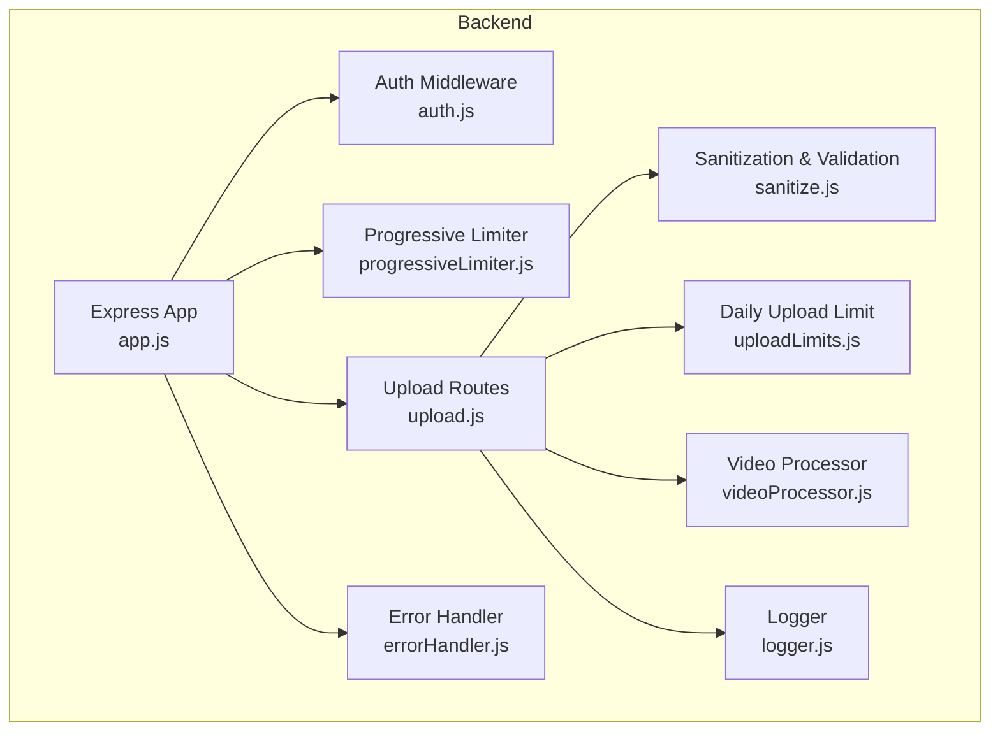
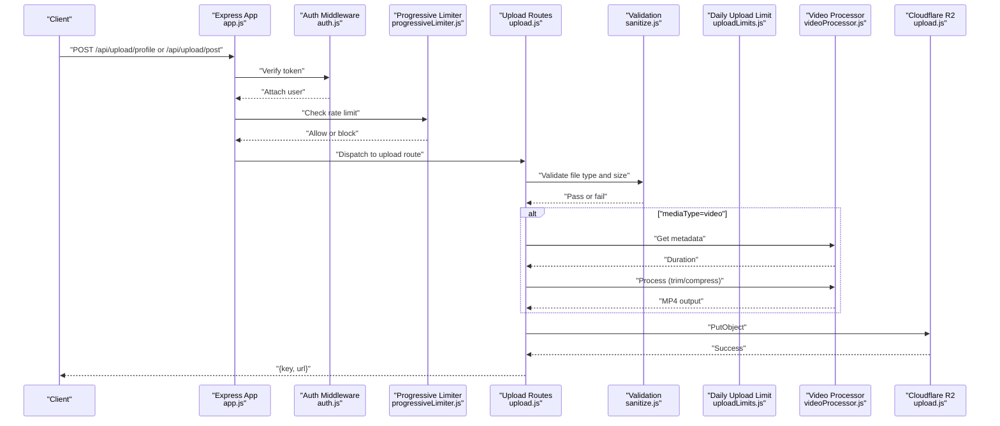
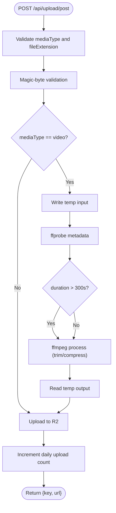
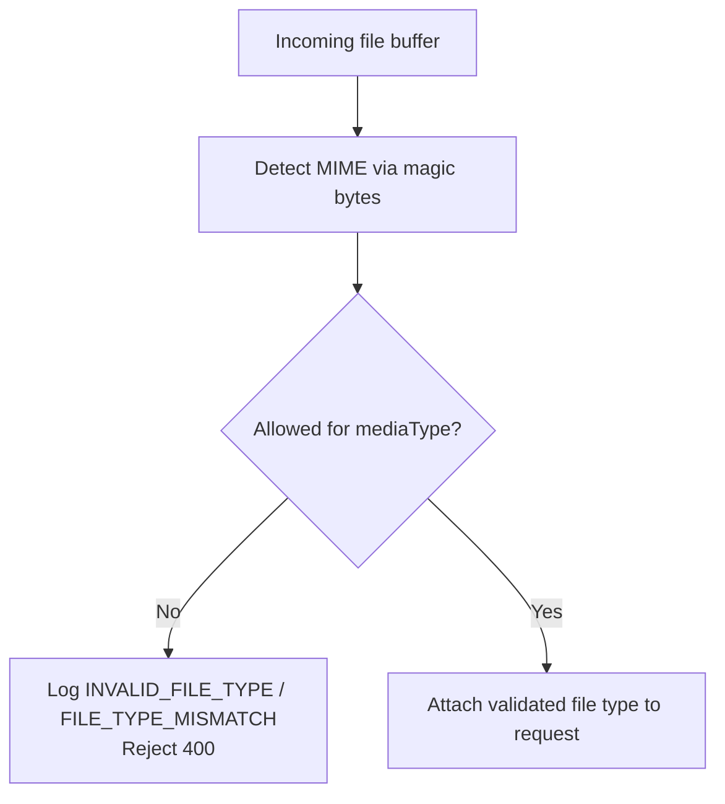
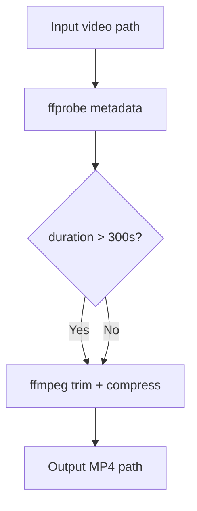
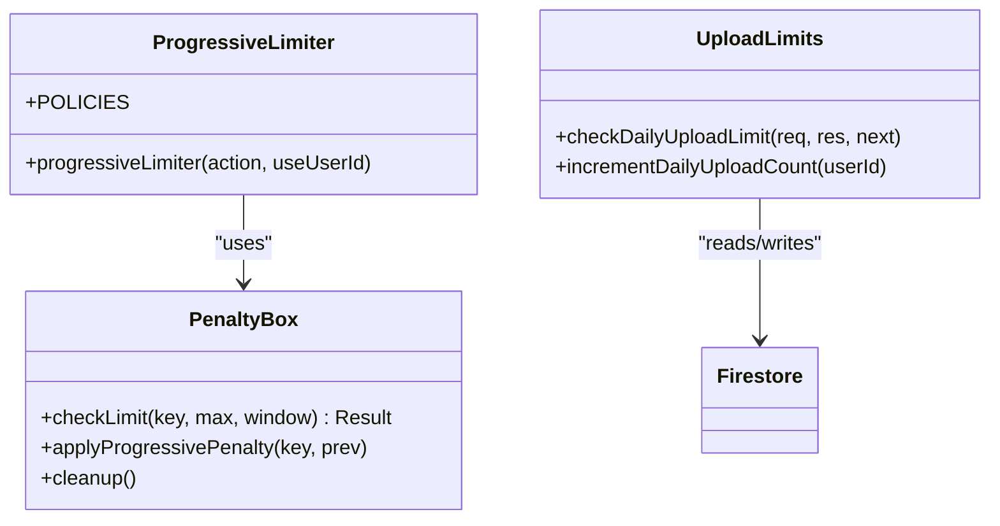
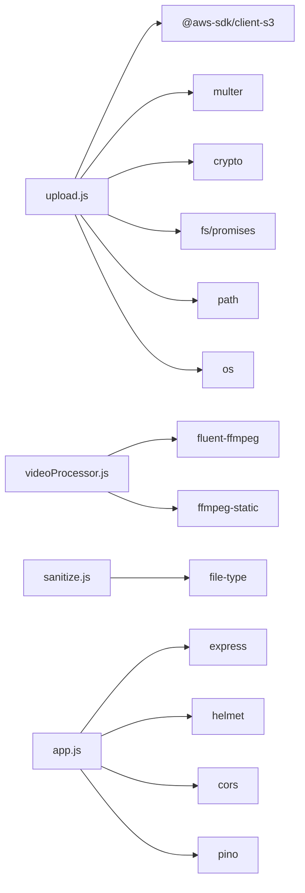

# Media Upload and Processing

<cite>
**Referenced Files in This Document**
- [upload.js](file://backend/src/routes/upload.js)
- [videoProcessor.js](file://backend/src/utils/videoProcessor.js)
- [sanitize.js](file://backend/src/middleware/sanitize.js)
- [uploadLimits.js](file://backend/src/middleware/uploadLimits.js)
- [progressiveLimiter.js](file://backend/src/middleware/progressiveLimiter.js)
- [auth.js](file://backend/src/middleware/auth.js)
- [errorHandler.js](file://backend/src/middleware/errorHandler.js)
- [logger.js](file://backend/src/utils/logger.js)
- [app.js](file://backend/src/app.js)
- [.env.example](file://backend/.env.example)
- [README.md](file://backend/README.md)
- [package.json](file://backend/package.json)
- [PenaltyBox.js](file://backend/src/services/PenaltyBox.js)
</cite>

## Table of Contents
1. [Introduction](#introduction)
2. [Project Structure](#project-structure)
3. [Core Components](#core-components)
4. [Architecture Overview](#architecture-overview)
5. [Detailed Component Analysis](#detailed-component-analysis)
6. [Dependency Analysis](#dependency-analysis)
7. [Performance Considerations](#performance-considerations)
8. [Troubleshooting Guide](#troubleshooting-guide)
9. [Conclusion](#conclusion)
10. [Appendices](#appendices)

## Introduction
This document explains the media upload service and processing pipeline, focusing on the upload architecture, file validation, compression and optimization, video processing workflow, and Cloudflare R2 integration. It also covers media URL generation, content delivery optimization, supported formats and size limits, processing callbacks, metadata extraction, spatial audio handling, cross-platform compatibility, error handling, retries, and cleanup procedures for failed uploads.

## Project Structure
The media upload service is implemented in the backend Node.js application. Key areas include:
- Routes for upload endpoints
- Middleware for authentication, validation, rate limiting, and upload limits
- Utility for video metadata extraction and processing
- Logging and error handling infrastructure

**Diagram sources**
- [app.js](file://backend/src/app.js#L1-L78)
- [auth.js](file://backend/src/middleware/auth.js#L1-L164)
- [progressiveLimiter.js](file://backend/src/middleware/progressiveLimiter.js#L1-L61)
- [sanitize.js](file://backend/src/middleware/sanitize.js#L1-L154)
- [uploadLimits.js](file://backend/src/middleware/uploadLimits.js#L1-L55)
- [upload.js](file://backend/src/routes/upload.js#L1-L225)
- [videoProcessor.js](file://backend/src/utils/videoProcessor.js#L1-L61)
- [logger.js](file://backend/src/utils/logger.js#L1-L29)
- [errorHandler.js](file://backend/src/middleware/errorHandler.js#L1-L35)

**Section sources**
- [app.js](file://backend/src/app.js#L1-L78)
- [README.md](file://backend/README.md#L1-L338)

## Core Components
- Upload routes: handle profile images and post media uploads, enforce validation, process videos, and upload to Cloudflare R2.
- Video processor: extract metadata and transcode videos to MP4 with compression and trimming.
- Validation and sanitization: MIME type and magic-byte checks, request size limits, and token expiration checks.
- Rate limiting and upload caps: progressive rate limiter and daily upload limit enforcement.
- Storage and URLs: R2 client configuration and public URL generation.
- Logging and error handling: structured logging and centralized error handling.

**Section sources**
- [upload.js](file://backend/src/routes/upload.js#L1-L225)
- [videoProcessor.js](file://backend/src/utils/videoProcessor.js#L1-L61)
- [sanitize.js](file://backend/src/middleware/sanitize.js#L1-L154)
- [uploadLimits.js](file://backend/src/middleware/uploadLimits.js#L1-L55)
- [progressiveLimiter.js](file://backend/src/middleware/progressiveLimiter.js#L1-L61)
- [.env.example](file://backend/.env.example#L15-L25)

## Architecture Overview
The upload pipeline integrates authentication, validation, optional video processing, and R2 storage. The flow below maps to actual code paths.

**Diagram sources**
- [app.js](file://backend/src/app.js#L44-L60)
- [auth.js](file://backend/src/middleware/auth.js#L20-L161)
- [progressiveLimiter.js](file://backend/src/middleware/progressiveLimiter.js#L22-L59)
- [upload.js](file://backend/src/routes/upload.js#L80-L222)
- [sanitize.js](file://backend/src/middleware/sanitize.js#L42-L99)
- [uploadLimits.js](file://backend/src/middleware/uploadLimits.js#L10-L36)
- [videoProcessor.js](file://backend/src/utils/videoProcessor.js#L12-L60)

## Detailed Component Analysis

### Upload Routes and Endpoints
- Profile image upload: validates file type via magic bytes, stores under a user-specific path, and returns key and public URL.
- Post media upload: supports images and videos; enforces daily upload limit; optionally processes videos to MP4 with compression and trimming; writes temporary files for processing; cleans up on completion.

Key behaviors:
- File size limit enforced by Multer memory storage.
- Supported image formats: JPEG, PNG, WEBP, GIF.
- Supported video formats: MP4, WebM, MOV.
- Daily upload cap enforced via Firestore document increments.
- On success, the daily upload counter is incremented.

**Diagram sources**
- [upload.js](file://backend/src/routes/upload.js#L124-L222)
- [videoProcessor.js](file://backend/src/utils/videoProcessor.js#L12-L60)
- [uploadLimits.js](file://backend/src/middleware/uploadLimits.js#L42-L54)

**Section sources**
- [upload.js](file://backend/src/routes/upload.js#L80-L222)
- [uploadLimits.js](file://backend/src/middleware/uploadLimits.js#L1-L55)

### File Validation and Magic Bytes
- Validates mediaType and fileExtension against allowed lists.
- Uses magic bytes to detect actual MIME type and ensure it matches the declared media type.
- Logs security events for invalid or mismatched files.

Supported extensions and types:
- Images: jpg, jpeg, png, webp, gif
- Videos: mp4, webm, mov

**Diagram sources**
- [sanitize.js](file://backend/src/middleware/sanitize.js#L32-L99)

**Section sources**
- [sanitize.js](file://backend/src/middleware/sanitize.js#L32-L99)

### Video Processing Workflow
- Extracts metadata (duration) using ffprobe.
- Trims and compresses videos to MP4 with:
  - Video codec: H.264
  - Audio codec: AAC
  - Container: MP4
  - Options: constant rate factor, preset, faststart for progressive download
- Duration threshold: 300 seconds (5 minutes) triggers trimming and compression.

**Diagram sources**
- [videoProcessor.js](file://backend/src/utils/videoProcessor.js#L12-L60)

**Section sources**
- [videoProcessor.js](file://backend/src/utils/videoProcessor.js#L1-L61)

### Cloudflare R2 Integration and URL Generation
- R2 client configured with account ID, access keys, and bucket name from environment variables.
- Uploads use PutObject with appropriate content type and cache-control headers.
- Public URLs are constructed using the configured public base URL and the stored key.

Environment variables:
- R2_ACCOUNT_ID, R2_ACCESS_KEY_ID, R2_SECRET_ACCESS_KEY, R2_BUCKET_NAME, R2_PUBLIC_BASE_URL

**Section sources**
- [upload.js](file://backend/src/routes/upload.js#L36-L75)
- [.env.example](file://backend/.env.example#L15-L25)

### Rate Limiting and Daily Upload Caps
- Progressive rate limiter applies per-user or per-IP depending on context.
- Upload action policy allows 20 requests per 15 minutes.
- Daily upload limit enforced via Firestore document keyed by user and date; increments after successful R2 upload.

**Diagram sources**
- [progressiveLimiter.js](file://backend/src/middleware/progressiveLimiter.js#L1-L61)
- [PenaltyBox.js](file://backend/src/services/PenaltyBox.js#L1-L108)
- [uploadLimits.js](file://backend/src/middleware/uploadLimits.js#L1-L55)

**Section sources**
- [progressiveLimiter.js](file://backend/src/middleware/progressiveLimiter.js#L1-L61)
- [PenaltyBox.js](file://backend/src/services/PenaltyBox.js#L1-L108)
- [uploadLimits.js](file://backend/src/middleware/uploadLimits.js#L1-L55)

### Authentication and Token Expiration
- Supports custom short-lived JWT and Firebase ID tokens.
- Enforces token expiration checks and user status validation.
- Attaches sanitized user object to the request.

**Section sources**
- [auth.js](file://backend/src/middleware/auth.js#L20-L161)

### Logging and Error Handling
- Structured logging with security event logging adapter.
- Centralized error handler returns user-friendly messages in production and includes stack traces in development.

**Section sources**
- [logger.js](file://backend/src/utils/logger.js#L1-L29)
- [errorHandler.js](file://backend/src/middleware/errorHandler.js#L1-L35)

## Dependency Analysis
External dependencies relevant to media upload and processing:
- @aws-sdk/client-s3 for R2 operations
- fluent-ffmpeg and ffmpeg-static for video processing
- file-type for magic-byte validation
- express, express-validator, helmet, cors, pino for the server stack

**Diagram sources**
- [upload.js](file://backend/src/routes/upload.js#L1-L20)
- [videoProcessor.js](file://backend/src/utils/videoProcessor.js#L1-L5)
- [sanitize.js](file://backend/src/middleware/sanitize.js#L49-L50)
- [app.js](file://backend/src/app.js#L1-L6)

**Section sources**
- [package.json](file://backend/package.json#L24-L55)

## Performance Considerations
- Video processing uses ffmpeg with a preset optimized for speed and a CRF tuned for balanced quality and size.
- Faststart flag enables progressive download for MP4.
- Temporary files are written to the OS temp directory and cleaned up after upload.
- Rate limiting prevents overload and reduces CPU spikes during bursts.
- Authentication and validation occur early to fail fast and reduce unnecessary processing.

[No sources needed since this section provides general guidance]

## Troubleshooting Guide
Common issues and resolutions:
- Missing environment variables: ensure all variables from the example are set, especially R2 credentials and Firebase configuration.
- R2 upload failures: verify credentials, bucket name, and public base URL; confirm permissions and network connectivity.
- Rate limit exceeded: wait for the cooldown period or adjust policies; ensure correct IP detection behind proxies.
- Video processing errors: check ffmpeg availability and disk space; ensure input files are readable and not corrupted.
- Cleanup failures: temporary files are removed in a finally block; errors are logged but do not block the response.

**Section sources**
- [upload.js](file://backend/src/routes/upload.js#L201-L220)
- [logger.js](file://backend/src/utils/logger.js#L15-L26)
- [README.md](file://backend/README.md#L311-L330)

## Conclusion
The media upload service provides a secure, validated, and optimized pipeline for images and videos. It leverages magic-byte validation, progressive rate limiting, daily upload caps, and robust R2 integration. Video processing ensures consistent MP4 output with compression and trimming, while structured logging and centralized error handling support operational reliability.

[No sources needed since this section summarizes without analyzing specific files]

## Appendices

### Supported Media Formats and Size Limits
- Supported image formats: JPEG, PNG, WEBP, GIF
- Supported video formats: MP4, WebM, MOV
- File size limit: 200 MB for uploads
- Daily upload limit: 20 per user per day

**Section sources**
- [sanitize.js](file://backend/src/middleware/sanitize.js#L32-L40)
- [upload.js](file://backend/src/routes/upload.js#L27-L31)
- [uploadLimits.js](file://backend/src/middleware/uploadLimits.js#L8-L25)

### Processing Callbacks and Metadata Extraction
- Metadata extraction: duration is retrieved via ffprobe and used to decide trimming and compression.
- Processing callbacks: ffmpeg emits start, error, and end events; errors are logged and returned to clients.

**Section sources**
- [videoProcessor.js](file://backend/src/utils/videoProcessor.js#L12-L22)
- [videoProcessor.js](file://backend/src/utils/videoProcessor.js#L31-L60)

### Spatial Audio and Cross-Platform Compatibility
- Audio codec: AAC is used for MP4 output, ensuring broad compatibility across platforms and devices.
- Container: MP4 with faststart improves progressive playback.

**Section sources**
- [videoProcessor.js](file://backend/src/utils/videoProcessor.js#L33-L41)

### Retry Mechanisms and Cleanup Procedures
- Retry: Not implemented in the current code; clients should implement retry with exponential backoff on transient failures.
- Cleanup: Temporary input and output files are deleted in a finally block after upload attempts.

**Section sources**
- [upload.js](file://backend/src/routes/upload.js#L212-L220)