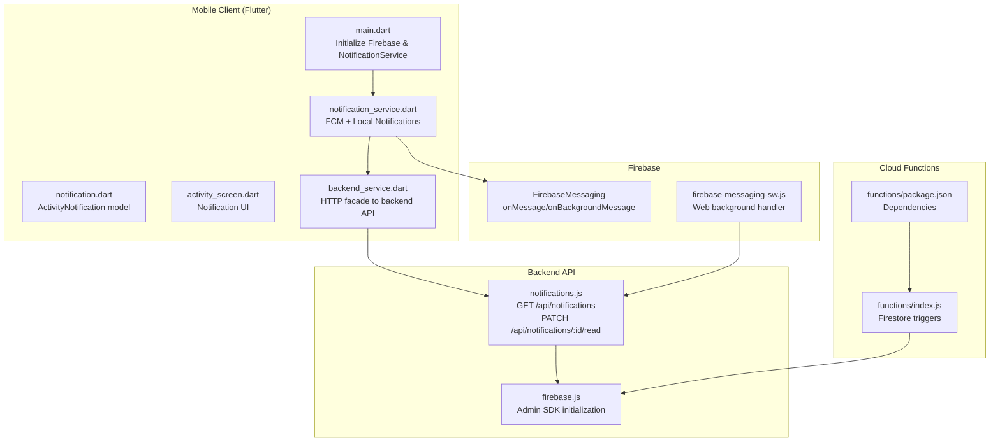
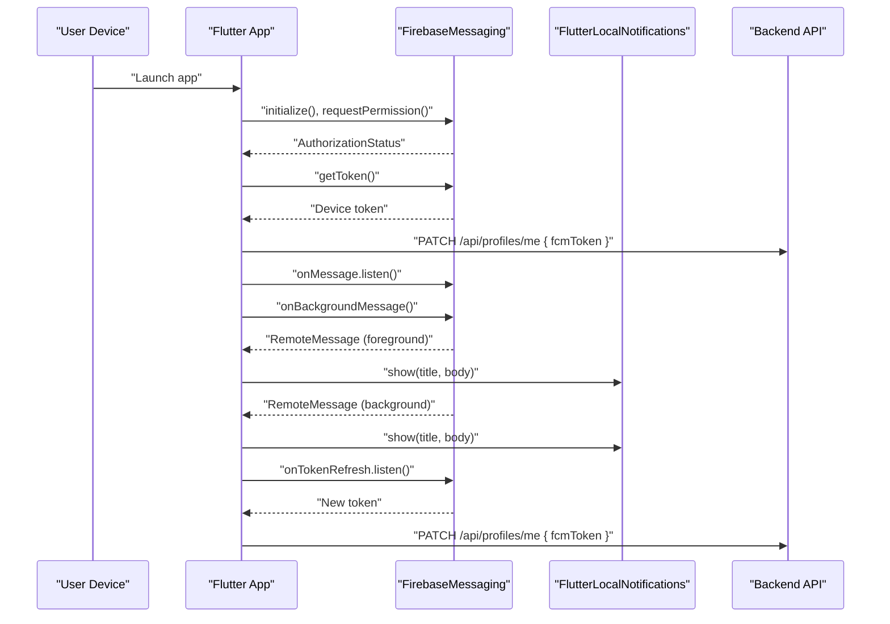
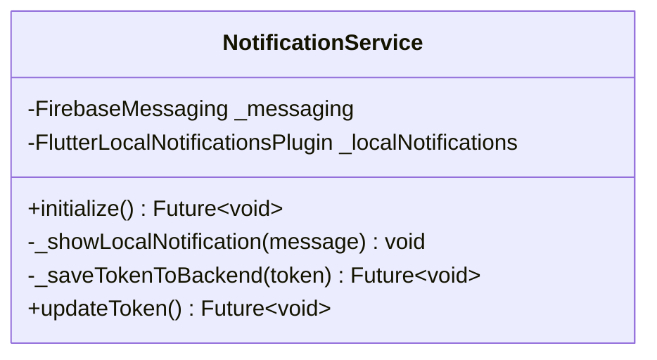
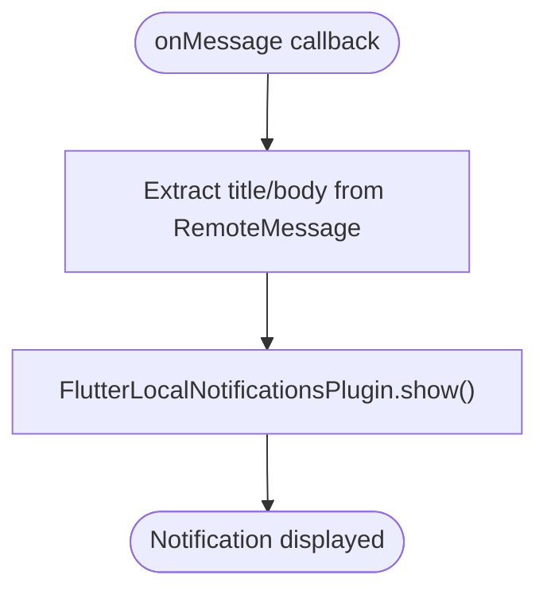
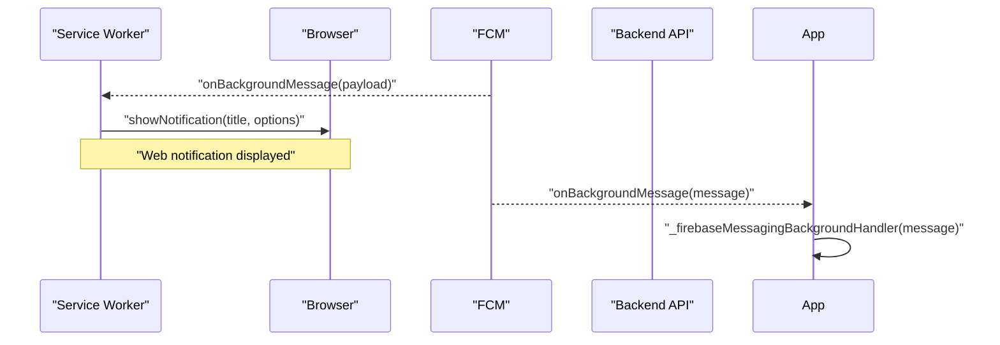
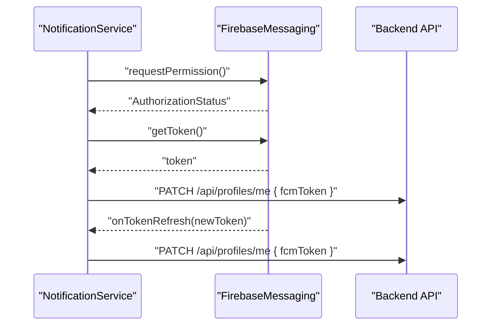
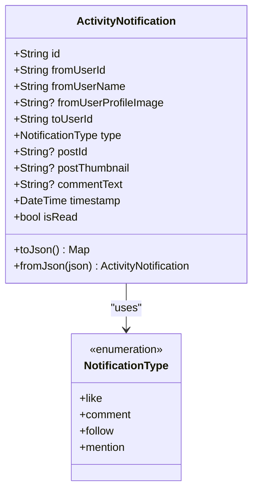
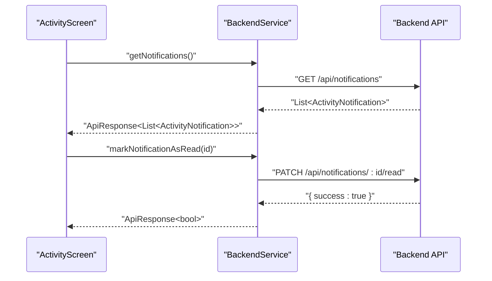
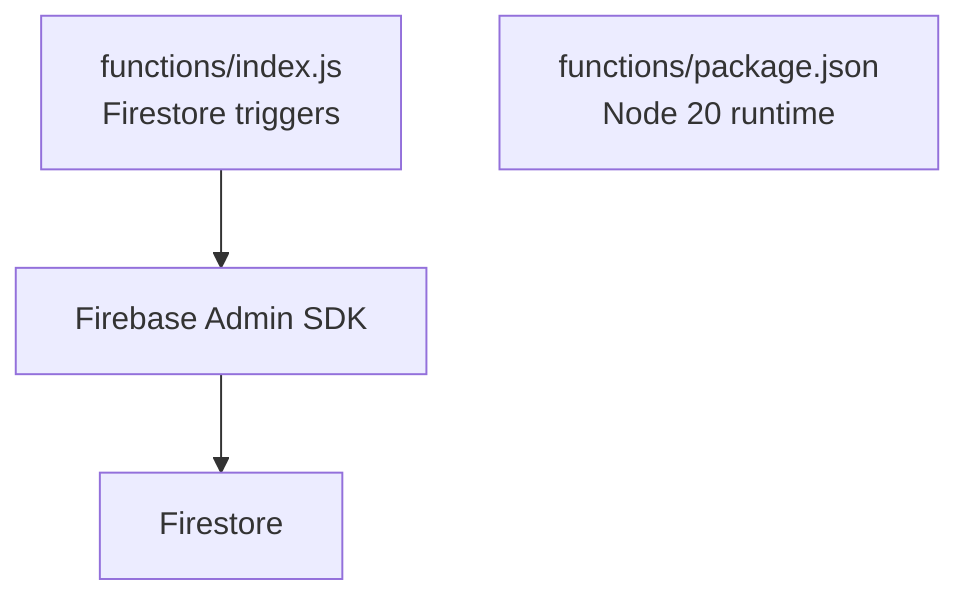
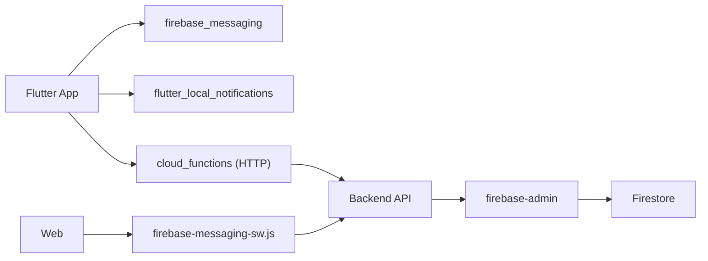

# Notification Service Integration

<cite>
**Referenced Files in This Document**
- [notification_service.dart](file://testpro-main/lib/services/notification_service.dart)
- [main.dart](file://testpro-main/lib/main.dart)
- [firebase_options.dart](file://testpro-main/lib/firebase_options.dart)
- [firebase-messaging-sw.js](file://testpro-main/web/firebase-messaging-sw.js)
- [AndroidManifest.xml](file://testpro-main/android/app/src/main/AndroidManifest.xml)
- [AppDelegate.swift](file://testpro-main/ios/Runner/AppDelegate.swift)
- [notification.dart](file://testpro-main/lib/models/notification.dart)
- [activity_screen.dart](file://testpro-main/lib/screens/activity_screen.dart)
- [backend_service.dart](file://testpro-main/lib/services/backend_service.dart)
- [notifications.js](file://backend/src/routes/notifications.js)
- [firebase.js](file://backend/src/config/firebase.js)
- [index.js](file://testpro-main/functions/index.js)
- [package.json](file://testpro-main/functions/package.json)
- [google-services.json](file://testpro-main/android/app/google-services.json)
- [pubspec.yaml](file://testpro-main/pubspec.yaml)
</cite>

## Table of Contents
1. [Introduction](#introduction)
2. [Project Structure](#project-structure)
3. [Core Components](#core-components)
4. [Architecture Overview](#architecture-overview)
5. [Detailed Component Analysis](#detailed-component-analysis)
6. [Dependency Analysis](#dependency-analysis)
7. [Performance Considerations](#performance-considerations)
8. [Troubleshooting Guide](#troubleshooting-guide)
9. [Conclusion](#conclusion)
10. [Appendices](#appendices)

## Introduction
This document explains the notification service architecture and Firebase Cloud Messaging (FCM) integration across the Flutter mobile application, Firebase Cloud Functions, and the backend API. It covers push notification handling, real-time message delivery, token lifecycle, foreground/background behavior, and notification data structures. It also documents the backend notification retrieval and read-state management APIs, and outlines cross-platform considerations for Android, iOS, Web, and macOS.

## Project Structure
The notification system spans three layers:
- Mobile client (Flutter): Initializes Firebase, requests permissions, manages device tokens, displays local notifications, and integrates with backend APIs.
- Firebase Cloud Functions: Hosts Firestore triggers and other functions; the messaging service is configured via web worker script for background handling on Web.
- Backend API: Provides endpoints to fetch user notifications and mark them as read; Firebase Admin SDK is used server-side for secure operations.

**Diagram sources**
- [main.dart](file://testpro-main/lib/main.dart#L12-L22)
- [notification_service.dart](file://testpro-main/lib/services/notification_service.dart#L13-L57)
- [notification.dart](file://testpro-main/lib/models/notification.dart#L8-L33)
- [activity_screen.dart](file://testpro-main/lib/screens/activity_screen.dart#L35-L70)
- [backend_service.dart](file://testpro-main/lib/services/backend_service.dart#L430-L448)
- [firebase-messaging-sw.js](file://testpro-main/web/firebase-messaging-sw.js#L1-L25)
- [notifications.js](file://backend/src/routes/notifications.js#L11-L48)
- [firebase.js](file://backend/src/config/firebase.js#L27-L44)
- [index.js](file://testpro-main/functions/index.js#L1-L112)
- [package.json](file://testpro-main/functions/package.json#L1-L15)

**Section sources**
- [main.dart](file://testpro-main/lib/main.dart#L12-L22)
- [notification_service.dart](file://testpro-main/lib/services/notification_service.dart#L13-L57)
- [firebase-messaging-sw.js](file://testpro-main/web/firebase-messaging-sw.js#L1-L25)
- [notifications.js](file://backend/src/routes/notifications.js#L11-L48)
- [firebase.js](file://backend/src/config/firebase.js#L27-L44)
- [index.js](file://testpro-main/functions/index.js#L1-L112)
- [package.json](file://testpro-main/functions/package.json#L1-L15)

## Core Components
- Mobile NotificationService: Initializes FCM, requests permission, retrieves and syncs device tokens, handles foreground/background messages, and shows local notifications.
- Web Background Handler: Registers a service worker to display notifications when the app is offline or in the background.
- Backend Routes: Provide endpoints to list notifications for a user and mark individual notifications as read.
- Firebase Admin SDK: Secures backend operations and enables Firestore triggers used elsewhere in the system.
- Notification Model: Defines the structure of activity notifications consumed by the UI.

**Section sources**
- [notification_service.dart](file://testpro-main/lib/services/notification_service.dart#L13-L93)
- [firebase-messaging-sw.js](file://testpro-main/web/firebase-messaging-sw.js#L15-L24)
- [notifications.js](file://backend/src/routes/notifications.js#L11-L48)
- [firebase.js](file://backend/src/config/firebase.js#L27-L44)
- [notification.dart](file://testpro-main/lib/models/notification.dart#L8-L33)

## Architecture Overview
The system supports:
- Foreground delivery: Remote messages received while the app is in the foreground are shown locally via Flutter Local Notifications.
- Background delivery: On Android/iOS, background handlers receive messages; on Web, a service worker displays notifications.
- Token lifecycle: Device tokens are requested upon permission grant and refreshed when FCM emits a token refresh event; tokens are synced to the backend profile endpoint.
- Cross-platform: Platform-specific Firebase options are configured; Android requires internet permissions; iOS/macOS rely on AppDelegate registration.

**Diagram sources**
- [notification_service.dart](file://testpro-main/lib/services/notification_service.dart#L17-L57)
- [backend_service.dart](file://testpro-main/lib/services/backend_service.dart#L296-L305)

**Section sources**
- [notification_service.dart](file://testpro-main/lib/services/notification_service.dart#L17-L57)
- [backend_service.dart](file://testpro-main/lib/services/backend_service.dart#L296-L305)

## Detailed Component Analysis

### Mobile NotificationService
Responsibilities:
- Permission request and token retrieval on app start.
- Local notification initialization and display.
- Background message handler registration.
- Token refresh handling and backend synchronization.

Key behaviors:
- Foreground: onMessage listens for RemoteMessage and shows a local notification.
- Background: onBackgroundMessage registers a top-level handler for release builds.
- Token lifecycle: getToken on startup and onTokenRefresh updates backend profile.

**Diagram sources**
- [notification_service.dart](file://testpro-main/lib/services/notification_service.dart#L13-L93)

**Section sources**
- [notification_service.dart](file://testpro-main/lib/services/notification_service.dart#L17-L93)

### Foreground Message Handling Flow

**Diagram sources**
- [notification_service.dart](file://testpro-main/lib/services/notification_service.dart#L46-L48)
- [notification_service.dart](file://testpro-main/lib/services/notification_service.dart#L59-L74)

**Section sources**
- [notification_service.dart](file://testpro-main/lib/services/notification_service.dart#L46-L74)

### Background Message Handling Flow
- Android/iOS: onBackgroundMessage registered as a top-level function to handle messages when the app is not in the foreground.
- Web: firebase-messaging-sw.js registers a background handler to display notifications via service worker.

**Diagram sources**
- [firebase-messaging-sw.js](file://testpro-main/web/firebase-messaging-sw.js#L15-L24)
- [notification_service.dart](file://testpro-main/lib/services/notification_service.dart#L8-L11)

**Section sources**
- [firebase-messaging-sw.js](file://testpro-main/web/firebase-messaging-sw.js#L15-L24)
- [notification_service.dart](file://testpro-main/lib/services/notification_service.dart#L8-L11)

### Token Lifecycle and Backend Synchronization
- On permission grant, device token is retrieved and sent to the backend profile endpoint.
- On token refresh, the new token is sent to the backend to keep records current.

**Diagram sources**
- [notification_service.dart](file://testpro-main/lib/services/notification_service.dart#L19-L33)
- [notification_service.dart](file://testpro-main/lib/services/notification_service.dart#L50-L53)
- [backend_service.dart](file://testpro-main/lib/services/backend_service.dart#L296-L305)

**Section sources**
- [notification_service.dart](file://testpro-main/lib/services/notification_service.dart#L19-L33)
- [notification_service.dart](file://testpro-main/lib/services/notification_service.dart#L50-L53)
- [backend_service.dart](file://testpro-main/lib/services/backend_service.dart#L296-L305)

### Notification Data Model and UI
- ActivityNotification defines fields for sender, recipient, type, content metadata, timestamp, and read state.
- The UI lists notifications, computes unread badges, and marks items as read on tap by calling the backend.

**Diagram sources**
- [notification.dart](file://testpro-main/lib/models/notification.dart#L1-L88)

**Section sources**
- [notification.dart](file://testpro-main/lib/models/notification.dart#L8-L33)
- [notification.dart](file://testpro-main/lib/models/notification.dart#L35-L87)

### Backend Notification Retrieval and Read-State Management
- GET /api/notifications: Returns paginated notifications for the authenticated user, ordered by timestamp descending.
- PATCH /api/notifications/:id/read: Marks a notification as read after validating ownership.

**Diagram sources**
- [activity_screen.dart](file://testpro-main/lib/screens/activity_screen.dart#L44-L70)
- [backend_service.dart](file://testpro-main/lib/services/backend_service.dart#L430-L448)
- [notifications.js](file://backend/src/routes/notifications.js#L11-L48)

**Section sources**
- [activity_screen.dart](file://testpro-main/lib/screens/activity_screen.dart#L44-L70)
- [backend_service.dart](file://testpro-main/lib/services/backend_service.dart#L430-L448)
- [notifications.js](file://backend/src/routes/notifications.js#L11-L48)

### Firebase Cloud Functions Integration
- Firestore triggers are defined for counters and other domain events.
- The functions runtime is configured to Node.js 20.

**Diagram sources**
- [index.js](file://testpro-main/functions/index.js#L1-L112)
- [package.json](file://testpro-main/functions/package.json#L1-L15)

**Section sources**
- [index.js](file://testpro-main/functions/index.js#L1-L112)
- [package.json](file://testpro-main/functions/package.json#L1-L15)

## Dependency Analysis
- Flutter app depends on firebase_core, firebase_messaging, flutter_local_notifications, and cloud_functions for HTTP calls to the backend.
- Backend uses firebase-admin for secure Firestore operations and Express routes for notifications.
- Web relies on a service worker script to handle background notifications.

**Diagram sources**
- [pubspec.yaml](file://testpro-main/pubspec.yaml#L25-L36)
- [firebase.js](file://backend/src/config/firebase.js#L27-L44)
- [firebase-messaging-sw.js](file://testpro-main/web/firebase-messaging-sw.js#L1-L25)

**Section sources**
- [pubspec.yaml](file://testpro-main/pubspec.yaml#L25-L36)
- [firebase.js](file://backend/src/config/firebase.js#L27-L44)
- [firebase-messaging-sw.js](file://testpro-main/web/firebase-messaging-sw.js#L1-L25)

## Performance Considerations
- Minimize network calls: Batch token updates and avoid redundant profile patches.
- Debounce UI updates: When marking notifications as read, apply optimistic UI updates and reconcile with backend responses.
- Efficient parsing: Use lightweight JSON parsing and avoid deep copies in notification lists.
- Background handler efficiency: Keep background handlers minimal to reduce battery drain.

## Troubleshooting Guide
Common issues and resolutions:
- Missing permissions: Ensure requestPermission is called and handled; check AuthorizationStatus before retrieving tokens.
- Token not syncing: Verify onTokenRefresh is registered and that the backend PATCH endpoint is reachable.
- Foreground notifications not showing: Confirm onMessage is registered and local notifications are initialized.
- Web background notifications: Ensure firebase-messaging-sw.js is deployed and service worker is registered.
- Android permissions: Confirm INTERNET permission is declared in AndroidManifest.xml.
- iOS/macOS: Ensure AppDelegate registers plugins and Firebase is initialized.

**Section sources**
- [notification_service.dart](file://testpro-main/lib/services/notification_service.dart#L19-L33)
- [notification_service.dart](file://testpro-main/lib/services/notification_service.dart#L46-L53)
- [firebase-messaging-sw.js](file://testpro-main/web/firebase-messaging-sw.js#L15-L24)
- [AndroidManifest.xml](file://testpro-main/android/app/src/main/AndroidManifest.xml#L3-L4)
- [AppDelegate.swift](file://testpro-main/ios/Runner/AppDelegate.swift#L10-L12)

## Conclusion
The notification service integrates FCM across platforms, manages device tokens securely, and provides a robust backend API for retrieving and updating notification read states. The architecture balances foreground and background delivery, supports cross-platform differences, and leverages Firebase Admin for secure server-side operations.

## Appendices

### Notification Payload Structures
- RemoteMessage (mobile): Contains notification and data payloads; title/body are extracted for local display.
- ActivityNotification (UI): Fields include sender info, type, optional post metadata, timestamp, and read state.

**Section sources**
- [notification_service.dart](file://testpro-main/lib/services/notification_service.dart#L59-L74)
- [notification.dart](file://testpro-main/lib/models/notification.dart#L8-L33)

### Notification Types
- like: Indicates a like action.
- comment: Includes comment text.
- follow: Indicates a follow action.
- mention: Indicates a mention in a post.

**Section sources**
- [notification.dart](file://testpro-main/lib/models/notification.dart#L1-L6)

### User Preference Handling
- The backend routes support listing and marking notifications as read; the UI optimistically updates read state and reconciles with backend responses.

**Section sources**
- [activity_screen.dart](file://testpro-main/lib/screens/activity_screen.dart#L232-L269)
- [backend_service.dart](file://testpro-main/lib/services/backend_service.dart#L440-L448)
- [notifications.js](file://backend/src/routes/notifications.js#L35-L48)

### Notification Permission Management
- Permission request occurs during initialization; only authorized users’ tokens are synced to the backend.

**Section sources**
- [notification_service.dart](file://testpro-main/lib/services/notification_service.dart#L19-L33)

### Foreground/Background State Handling
- Foreground: onMessage displays local notifications.
- Background: onBackgroundMessage handles messages when the app is not in focus; Web uses service worker.

**Section sources**
- [notification_service.dart](file://testpro-main/lib/services/notification_service.dart#L46-L56)
- [firebase-messaging-sw.js](file://testpro-main/web/firebase-messaging-sw.js#L15-L24)

### Notification Channel Configuration
- Android channels are initialized in NotificationService; adjust importance/priority as needed for different notification categories.

**Section sources**
- [notification_service.dart](file://testpro-main/lib/services/notification_service.dart#L36-L43)

### Cross-Platform Considerations
- Platform-specific Firebase options are configured; ensure keys match the respective platforms.
- Android requires internet permission; iOS/macOS rely on AppDelegate registration.

**Section sources**
- [firebase_options.dart](file://testpro-main/lib/firebase_options.dart#L18-L89)
- [AndroidManifest.xml](file://testpro-main/android/app/src/main/AndroidManifest.xml#L3-L4)
- [AppDelegate.swift](file://testpro-main/ios/Runner/AppDelegate.swift#L10-L12)

### Firebase Project Configuration
- Android google-services.json is present; ensure it matches the project configuration.
- Backend initializes Firebase Admin with service account credentials.

**Section sources**
- [google-services.json](file://testpro-main/android/app/google-services.json#L1-L38)
- [firebase.js](file://backend/src/config/firebase.js#L27-L44)