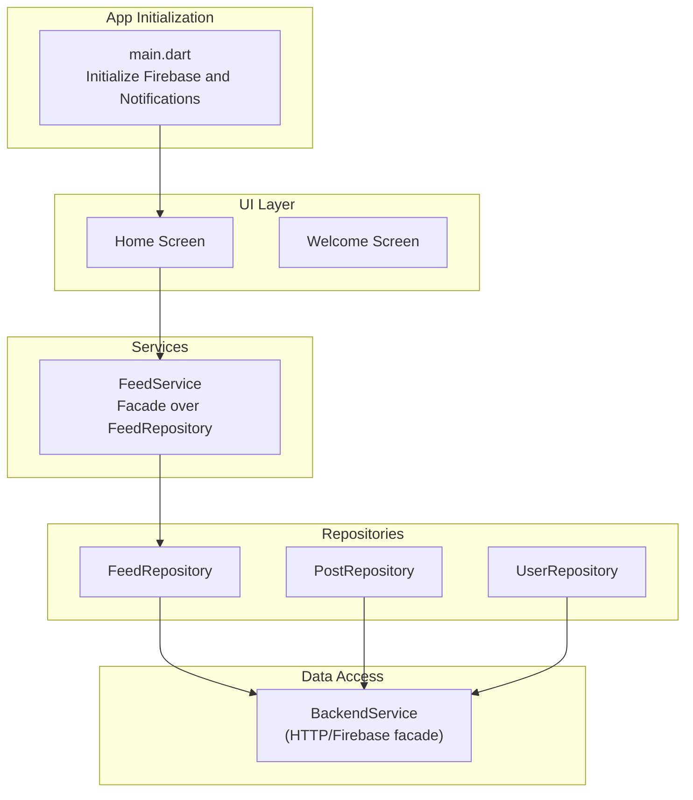
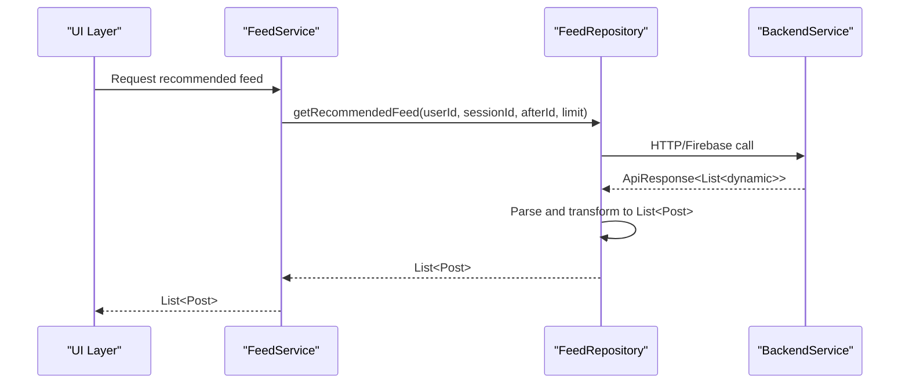
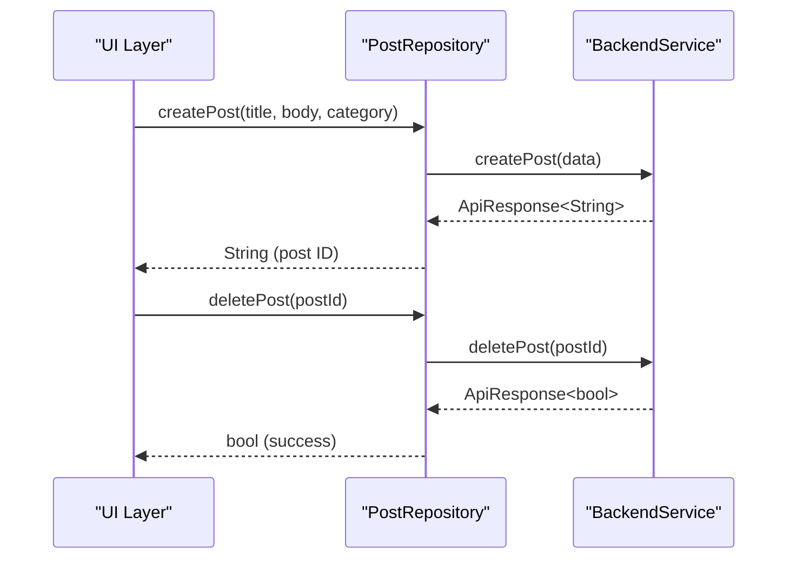
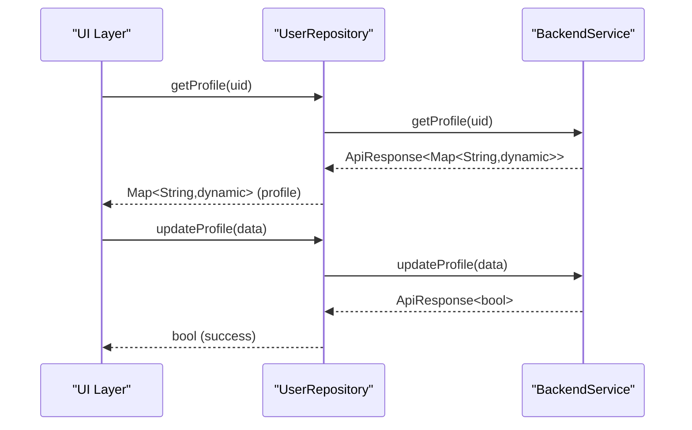
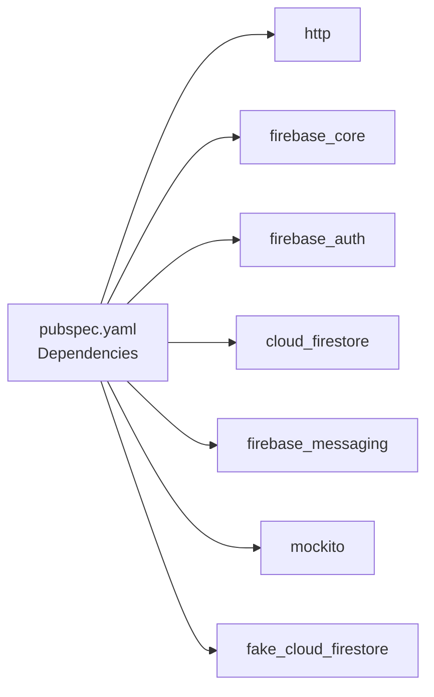

# Repository Pattern Implementation

<cite>
**Referenced Files in This Document**
- [main.dart](file://testpro-main/lib/main.dart)
- [pubspec.yaml](file://testpro-main/pubspec.yaml)
- [feed_service.dart](file://testpro-main/lib/services/feed_service.dart)
- [post_repository_test.dart](file://testpro-main/test_backup/repositories/post_repository_test.dart)
- [feed_repository_test.dart](file://testpro-main/test_backup/repositories/feed_repository_test.dart)
- [user_repository_test.dart](file://testpro-main/test_backup/repositories/user_repository_test.dart)
</cite>

## Table of Contents
1. [Introduction](#introduction)
2. [Project Structure](#project-structure)
3. [Core Components](#core-components)
4. [Architecture Overview](#architecture-overview)
5. [Detailed Component Analysis](#detailed-component-analysis)
6. [Dependency Analysis](#dependency-analysis)
7. [Performance Considerations](#performance-considerations)
8. [Troubleshooting Guide](#troubleshooting-guide)
9. [Conclusion](#conclusion)

## Introduction
This document explains the repository pattern implementation and data access layer architecture in the Flutter application. It focuses on how repositories abstract data sources, separate business logic from persistence, and enable testability via dependency injection and mock implementations. The repository layer interacts with a backend service facade to fetch and mutate data, while the UI layer remains agnostic of underlying data providers. Offline handling, caching, and synchronization strategies are discussed conceptually, along with practical patterns for data transformation, error handling, and cache invalidation.

## Project Structure
The repository pattern is implemented in the Flutter frontend under lib/, with supporting services and tests under test_backup/. The application initializes Firebase and notification services at startup and wires the UI around a user session model.

**Diagram sources**
- [main.dart](file://testpro-main/lib/main.dart#L12-L22)
- [feed_service.dart](file://testpro-main/lib/services/feed_service.dart#L1-L25)

**Section sources**
- [main.dart](file://testpro-main/lib/main.dart#L12-L22)
- [pubspec.yaml](file://testpro-main/pubspec.yaml#L10-L46)

## Core Components
- FeedService: A facade that delegates to FeedRepository, exposing a simplified interface to the UI layer.
- FeedRepository: Encapsulates feed retrieval logic and interacts with BackendService.
- PostRepository: Handles post creation, deletion, and paginated feed retrieval, validated by tests.
- UserRepository: Manages user profile operations (fetch and update), validated by tests.
- BackendService: Acts as a facade over HTTP/Firebase endpoints, enabling easy mocking and dependency inversion.
- ApiResponse: Standardized response wrapper used across repositories for parsing and pagination metadata.

Benefits of the repository pattern in this project:
- Abstraction of data sources behind a stable interface.
- Separation of concerns: UI consumes repositories; repositories consume BackendService.
- Testability: Easy to inject mock clients for unit tests.
- Consistent error handling and data transformation patterns.

**Section sources**
- [feed_service.dart](file://testpro-main/lib/services/feed_service.dart#L1-L25)
- [post_repository_test.dart](file://testpro-main/test_backup/repositories/post_repository_test.dart#L1-L86)
- [feed_repository_test.dart](file://testpro-main/test_backup/repositories/feed_repository_test.dart#L1-L46)
- [user_repository_test.dart](file://testpro-main/test_backup/repositories/user_repository_test.dart#L1-L43)

## Architecture Overview
The repository architecture follows a layered approach:
- UI layer depends on service facades.
- Services depend on repositories.
- Repositories depend on BackendService.
- BackendService encapsulates HTTP/Firebase calls and returns typed ApiResponse objects.

**Diagram sources**
- [feed_service.dart](file://testpro-main/lib/services/feed_service.dart#L12-L24)
- [feed_repository_test.dart](file://testpro-main/test_backup/repositories/feed_repository_test.dart#L9-L25)

## Detailed Component Analysis

### FeedService
- Purpose: Provides a single entry point for feed operations, delegating to FeedRepository.
- Dependency Injection: Uses a static setter to replace the internal repository instance, enabling test doubles.
- Usage: Called by UI to fetch recommended feeds with optional pagination parameters.

Implementation highlights:
- Static repository field and setter for DI.
- Method forwarding to repository with parameter passthrough.

**Section sources**
- [feed_service.dart](file://testpro-main/lib/services/feed_service.dart#L1-L25)

### FeedRepository
- Purpose: Encapsulates feed retrieval logic and transforms raw API responses into domain models.
- Mock Validation: Verified by tests that call BackendService and parse results into Post objects.

Key behaviors:
- Accepts pagination parameters (afterId, limit).
- Returns strongly-typed lists of Post objects.
- Delegates to BackendService for network calls.

**Section sources**
- [feed_repository_test.dart](file://testpro-main/test_backup/repositories/feed_repository_test.dart#L9-L25)

### PostRepository
- Purpose: Manages post lifecycle operations (create, delete, paginated feed).
- Mock Validation: Tests demonstrate that repository calls BackendService and returns parsed ApiResponse results.

Key behaviors:
- createPost(data): Sends data to BackendService and expects an ID.
- deletePost(id): Deletes a post via BackendService.
- getPostsPaginated(feedType): Fetches paginated feed with cursor and hasMore metadata.

**Diagram sources**
- [post_repository_test.dart](file://testpro-main/test_backup/repositories/post_repository_test.dart#L12-L27)

**Section sources**
- [post_repository_test.dart](file://testpro-main/test_backup/repositories/post_repository_test.dart#L1-L86)

### UserRepository
- Purpose: Manages user profile operations (getProfile, updateProfile).
- Mock Validation: Tests show repository delegates to BackendService and returns ApiResponse-wrapped results.

Key behaviors:
- getProfile(uid): Fetches user profile data.
- updateProfile(data): Updates profile fields and returns success.

**Diagram sources**
- [user_repository_test.dart](file://testpro-main/test_backup/repositories/user_repository_test.dart#L11-L24)

**Section sources**
- [user_repository_test.dart](file://testpro-main/test_backup/repositories/user_repository_test.dart#L1-L43)

### BackendService (Facade)
- Purpose: Centralizes HTTP/Firebase calls behind a stable interface.
- Testability: Replaced with mock implementations during unit tests to isolate repository logic.
- Usage: All repositories depend on BackendService rather than concrete HTTP/Firebase clients.

Mocking pattern:
- Tests override BackendService.instance with a ManualMockBackendClient.
- Methods return ApiResponse instances, enabling assertions on data passed and results returned.

**Section sources**
- [post_repository_test.dart](file://testpro-main/test_backup/repositories/post_repository_test.dart#L7-L28)
- [feed_repository_test.dart](file://testpro-main/test_backup/repositories/feed_repository_test.dart#L6-L26)
- [user_repository_test.dart](file://testpro-main/test_backup/repositories/user_repository_test.dart#L7-L25)

### Data Transformation Patterns
- ApiResponse<T>: Standard wrapper for API responses, carrying data and pagination metadata.
- Post parsing: Repositories convert raw API maps into strongly-typed Post objects.
- Pagination: Repositories expose nextCursor and hasMore to support incremental loading.

**Section sources**
- [post_repository_test.dart](file://testpro-main/test_backup/repositories/post_repository_test.dart#L73-L76)

### Error Handling in Data Access
- ApiResponse: Used to carry success/failure states and associated data.
- Repository responsibility: Translate API failures into domain-specific errors or propagate ApiResponse failures to callers.
- UI responsibility: Present errors surfaced by services/repos to users.

**Section sources**
- [post_repository_test.dart](file://testpro-main/test_backup/repositories/post_repository_test.dart#L7-L16)
- [feed_repository_test.dart](file://testpro-main/test_backup/repositories/feed_repository_test.dart#L9-L12)
- [user_repository_test.dart](file://testpro-main/test_backup/repositories/user_repository_test.dart#L11-L18)

### Dependency Injection and Mocking
- Static setter pattern: FeedService.repository allows replacing the internal repository with a test double.
- BackendService.instance replacement: Tests assign a mock client to BackendService.instance to control behavior.
- Benefits: Isolation of unit tests, deterministic outcomes, and easy verification of repository-to-backend interactions.

**Section sources**
- [feed_service.dart](file://testpro-main/lib/services/feed_service.dart#L8-L10)
- [post_repository_test.dart](file://testpro-main/test_backup/repositories/post_repository_test.dart#L34-L37)
- [feed_repository_test.dart](file://testpro-main/test_backup/repositories/feed_repository_test.dart#L32-L35)
- [user_repository_test.dart](file://testpro-main/test_backup/repositories/user_repository_test.dart#L31-L34)

### Repository Factory Patterns
- Current implementation: Repositories are instantiated directly in tests and accessed via services.
- Suggested factory pattern: Introduce a RepositoryFactory that creates repository instances bound to specific BackendService implementations (e.g., production vs. test). This would centralize repository instantiation and enable environment-specific configurations.

[No sources needed since this section proposes a pattern without analyzing specific files]

### Data Caching Strategies
- Conceptual guidance:
  - In-memory cache per repository keyed by query parameters to avoid redundant network calls.
  - Cache invalidation on write operations (create/update/delete) to maintain consistency.
  - TTL-based eviction to prevent stale data.
- Offline handling:
  - Queue write operations locally and sync when connectivity is restored.
  - Use optimistic updates in UI with rollback on failure.

[No sources needed since this section provides general guidance]

### Data Synchronization and Cache Invalidation
- On successful write operations, invalidate affected cache entries (e.g., feed pages containing the modified item).
- On read failures, attempt retry with exponential backoff and fall back to cached data if available.
- Use pagination cursors to incrementally refresh only newer items.

[No sources needed since this section provides general guidance]

## Dependency Analysis
External dependencies relevant to data access and testing:
- http: Used for HTTP requests in BackendService.
- firebase_*: Firebase core, auth, Firestore, messaging for cloud-backed data.
- Testing: flutter_test, mockito, fake_cloud_firestore for mocking and testing.

**Diagram sources**
- [pubspec.yaml](file://testpro-main/pubspec.yaml#L10-L46)

**Section sources**
- [pubspec.yaml](file://testpro-main/pubspec.yaml#L10-L46)

## Performance Considerations
- Minimize network calls: Use caching and pagination to reduce bandwidth and latency.
- Batch operations: Group writes where possible to reduce round trips.
- Lazy loading: Load additional data on demand using cursors and hasMore flags.
- Image/video optimization: Use cached_network_image and video_thumbnail to improve perceived performance.

[No sources needed since this section provides general guidance]

## Troubleshooting Guide
Common issues and resolutions:
- Authentication state changes not reflected: Ensure UserSession.update is called on auth state changes and cleared on sign-out.
- Repository calls failing in tests: Verify BackendService.instance is replaced with a mock before constructing repositories.
- Parsing errors: Confirm ApiResponse<T> wrappers are properly handled and data is transformed into domain models before use.

**Section sources**
- [main.dart](file://testpro-main/lib/main.dart#L45-L55)
- [post_repository_test.dart](file://testpro-main/test_backup/repositories/post_repository_test.dart#L34-L37)
- [feed_repository_test.dart](file://testpro-main/test_backup/repositories/feed_repository_test.dart#L32-L35)

## Conclusion
The repository pattern in this project cleanly separates data access concerns from UI logic, enabling testability and maintainability. Repositories act as translators between the UI and BackendService, returning standardized ApiResponse objects and transforming raw data into domain models. With static DI setters and mockable facades, the system supports robust unit testing. Extending the pattern with factories, caching, and offline capabilities will further strengthen the data access layer’s reliability and performance.