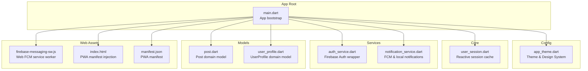
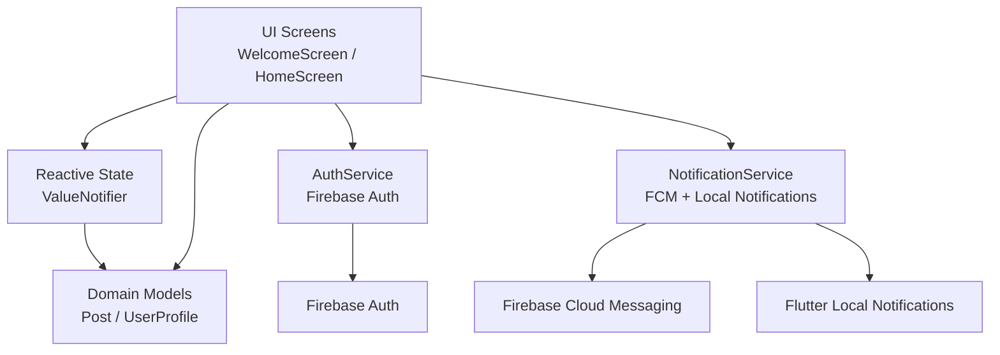
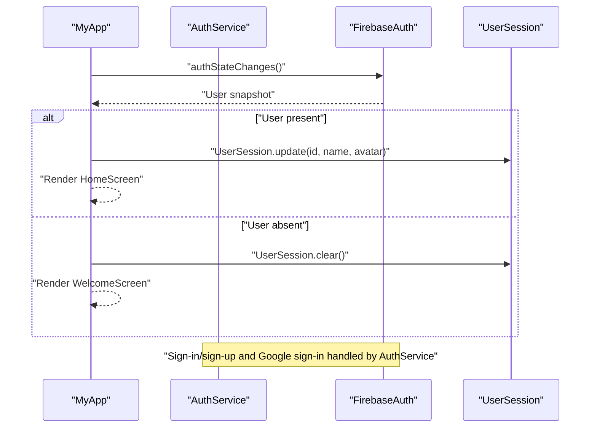
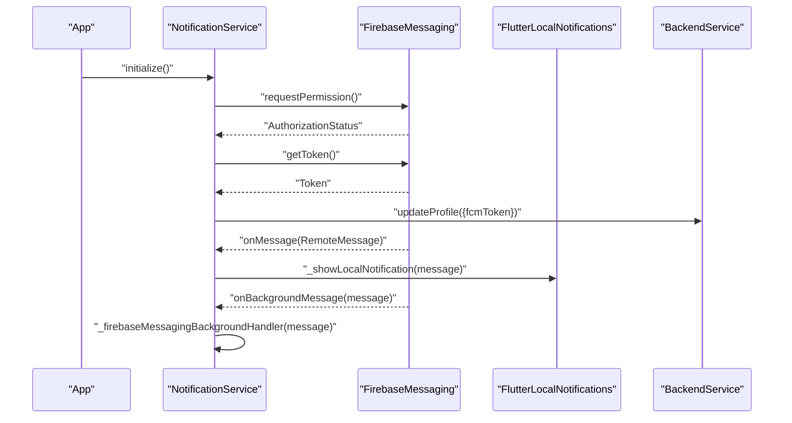
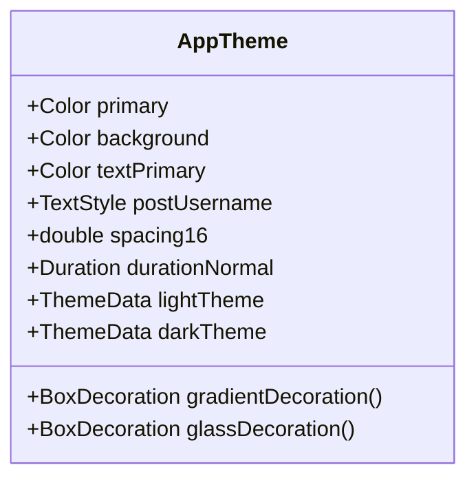
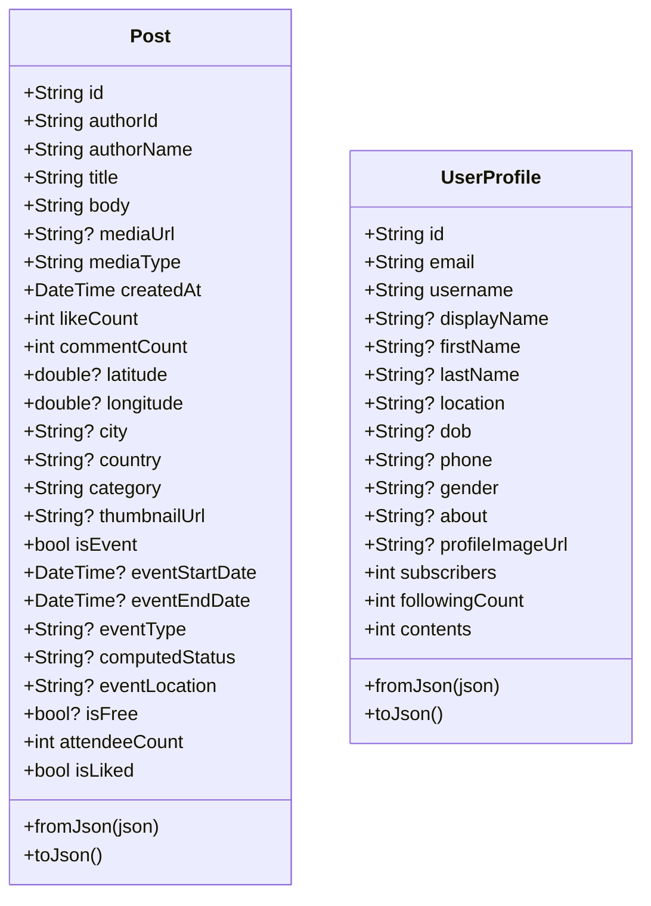
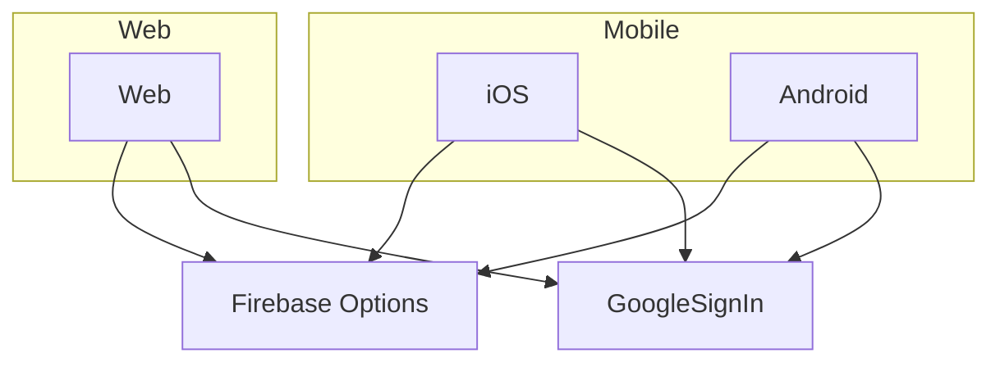
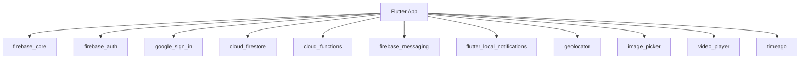

# Frontend Architecture (Flutter)

<cite>
**Referenced Files in This Document**
- [main.dart](file://testpro-main/lib/main.dart)
- [pubspec.yaml](file://testpro-main/pubspec.yaml)
- [app_theme.dart](file://testpro-main/lib/config/app_theme.dart)
- [user_session.dart](file://testpro-main/lib/core/session/user_session.dart)
- [auth_service.dart](file://testpro-main/lib/services/auth_service.dart)
- [notification_service.dart](file://testpro-main/lib/services/notification_service.dart)
- [post.dart](file://testpro-main/lib/models/post.dart)
- [user_profile.dart](file://testpro-main/lib/models/user_profile.dart)
- [firebase_options.dart](file://testpro-main/lib/firebase_options.dart)
- [firebase-messaging-sw.js](file://testpro-main/web/firebase-messaging-sw.js)
- [index.html](file://testpro-main/web/index.html)
- [manifest.json](file://testpro-main/web/manifest.json)
</cite>

## Table of Contents
1. [Introduction](#introduction)
2. [Project Structure](#project-structure)
3. [Core Components](#core-components)
4. [Architecture Overview](#architecture-overview)
5. [Detailed Component Analysis](#detailed-component-analysis)
6. [Dependency Analysis](#dependency-analysis)
7. [Performance Considerations](#performance-considerations)
8. [Troubleshooting Guide](#troubleshooting-guide)
9. [Conclusion](#conclusion)
10. [Appendices](#appendices)

## Introduction
This document describes the Flutter frontend architecture for the LocalMe application. It follows a layered MVC-like structure with clear separation between UI, business logic, and data layers. The application integrates Firebase for authentication, real-time messaging, and cloud functions, and uses a centralized session management model with reactive updates. Cross-platform support is implemented for iOS, Android, and Web, with platform-specific configurations and service initialization.

## Project Structure
The Flutter application is organized into feature-oriented packages under lib/, with distinct layers:
- config: Theming and typography definitions
- core: Session management and shared utilities
- models: Domain models for posts and user profiles
- services: Authentication, notifications, and backend integrations
- screens: Application screens (navigation and routing are handled via MaterialApp)
- widgets: Reusable UI components
- shared: Shared utilities and helpers
- utils: Formatting and navigation utilities
- firebase_options.dart: Platform-specific Firebase options

Key entry point initializes Firebase, notification service, and sets up the root widget with reactive authentication-driven navigation.

**Diagram sources**
- [main.dart](file://testpro-main/lib/main.dart#L12-L62)
- [app_theme.dart](file://testpro-main/lib/config/app_theme.dart#L132-L294)
- [user_session.dart](file://testpro-main/lib/core/session/user_session.dart#L12-L49)
- [auth_service.dart](file://testpro-main/lib/services/auth_service.dart#L5-L161)
- [notification_service.dart](file://testpro-main/lib/services/notification_service.dart#L13-L93)
- [post.dart](file://testpro-main/lib/models/post.dart#L1-L143)
- [user_profile.dart](file://testpro-main/lib/models/user_profile.dart#L1-L79)
- [firebase-messaging-sw.js](file://testpro-main/web/firebase-messaging-sw.js)
- [index.html](file://testpro-main/web/index.html)
- [manifest.json](file://testpro-main/web/manifest.json)

**Section sources**
- [main.dart](file://testpro-main/lib/main.dart#L12-L62)
- [pubspec.yaml](file://testpro-main/pubspec.yaml#L10-L61)

## Core Components
- App bootstrap and routing: Initializes Firebase and notification service, then renders either WelcomeScreen or HomeScreen based on auth state.
- Theme system: Centralized design tokens, typography, spacing, and Material 3 themes.
- Session management: Reactive ValueNotifier-based cache for current user data with helpers for identity checks.
- Authentication service: Wrapper around FirebaseAuth and GoogleSignIn with platform-aware behavior.
- Notification service: Foreground/background message handling, token lifecycle, and local notification delivery.
- Data models: Strongly-typed Post and UserProfile with JSON serialization/deserialization.

**Section sources**
- [main.dart](file://testpro-main/lib/main.dart#L12-L62)
- [app_theme.dart](file://testpro-main/lib/config/app_theme.dart#L8-L314)
- [user_session.dart](file://testpro-main/lib/core/session/user_session.dart#L12-L49)
- [auth_service.dart](file://testpro-main/lib/services/auth_service.dart#L5-L161)
- [notification_service.dart](file://testpro-main/lib/services/notification_service.dart#L13-L93)
- [post.dart](file://testpro-main/lib/models/post.dart#L1-L143)
- [user_profile.dart](file://testpro-main/lib/models/user_profile.dart#L1-L79)

## Architecture Overview
The application follows a layered architecture:
- Presentation Layer: Stateless widgets and screen widgets driven by reactive streams and ValueNotifiers.
- Business Logic Layer: Services encapsulate authentication, notifications, and data transformations.
- Data Layer: Models define domain structures; Firebase services provide persistence and real-time capabilities.

**Diagram sources**
- [main.dart](file://testpro-main/lib/main.dart#L24-L61)
- [user_session.dart](file://testpro-main/lib/core/session/user_session.dart#L12-L49)
- [auth_service.dart](file://testpro-main/lib/services/auth_service.dart#L5-L161)
- [notification_service.dart](file://testpro-main/lib/services/notification_service.dart#L13-L93)
- [post.dart](file://testpro-main/lib/models/post.dart#L1-L143)
- [user_profile.dart](file://testpro-main/lib/models/user_profile.dart#L1-L79)

## Detailed Component Analysis

### Authentication Flow and Session Management
The authentication flow is reactive and session-aware:
- On startup, Firebase is initialized and NotificationService is set up.
- The root widget listens to authStateChanges and switches between WelcomeScreen and HomeScreen accordingly.
- On user presence, UserSession is updated with uid, displayName, and avatar; on absence, it is cleared.
- AuthService exposes sign-in/sign-up with email/password and Google, password reset, profile updates, and sign-out.

**Diagram sources**
- [main.dart](file://testpro-main/lib/main.dart#L39-L58)
- [auth_service.dart](file://testpro-main/lib/services/auth_service.dart#L22-L117)
- [user_session.dart](file://testpro-main/lib/core/session/user_session.dart#L20-L43)

**Section sources**
- [main.dart](file://testpro-main/lib/main.dart#L12-L62)
- [auth_service.dart](file://testpro-main/lib/services/auth_service.dart#L5-L161)
- [user_session.dart](file://testpro-main/lib/core/session/user_session.dart#L12-L49)

### Real-Time Notifications and PWA Integration
NotificationService handles:
- Permission requests and token retrieval
- Synchronization of FCM tokens to backend
- Foreground message display via local notifications
- Background message handling via a top-level entry point
- Web-specific service worker for push notifications

**Diagram sources**
- [notification_service.dart](file://testpro-main/lib/services/notification_service.dart#L17-L57)
- [notification_service.dart](file://testpro-main/lib/services/notification_service.dart#L59-L85)
- [firebase-messaging-sw.js](file://testpro-main/web/firebase-messaging-sw.js)

**Section sources**
- [notification_service.dart](file://testpro-main/lib/services/notification_service.dart#L13-L93)
- [firebase-messaging-sw.js](file://testpro-main/web/firebase-messaging-sw.js)

### Theme System and Responsive Design
The theme system defines brand colors, typography, spacing, shadows, and Material 3-based ThemeData for light and dark modes. It also provides helper decorations for gradients and glassmorphism. While the code does not explicitly define breakpoints, the theme’s spacing and typography scales support responsive layouts across form factors.

**Diagram sources**
- [app_theme.dart](file://testpro-main/lib/config/app_theme.dart#L8-L314)

**Section sources**
- [app_theme.dart](file://testpro-main/lib/config/app_theme.dart#L132-L294)

### Data Models and Serialization
Domain models encapsulate data structures and provide JSON conversion:
- Post: Rich post entity with author info, media, geolocation, categories, events, and engagement metrics.
- UserProfile: User profile with personal attributes and counts.

**Diagram sources**
- [post.dart](file://testpro-main/lib/models/post.dart#L1-L143)
- [user_profile.dart](file://testpro-main/lib/models/user_profile.dart#L1-L79)

**Section sources**
- [post.dart](file://testpro-main/lib/models/post.dart#L1-L143)
- [user_profile.dart](file://testpro-main/lib/models/user_profile.dart#L1-L79)

### Cross-Platform Considerations
- Firebase initialization uses platform-specific options.
- Google Sign-In behavior differs on web vs. mobile; web uses a configured clientId while mobile uses the installed plugin.
- Web deployment includes PWA assets (service worker, manifest, and HTML injection).
- Dependencies include platform-specific plugins for notifications and auth.

**Diagram sources**
- [main.dart](file://testpro-main/lib/main.dart#L15-L17)
- [firebase_options.dart](file://testpro-main/lib/firebase_options.dart)
- [auth_service.dart](file://testpro-main/lib/services/auth_service.dart#L7-L9)

**Section sources**
- [main.dart](file://testpro-main/lib/main.dart#L15-L17)
- [auth_service.dart](file://testpro-main/lib/services/auth_service.dart#L7-L9)
- [pubspec.yaml](file://testpro-main/pubspec.yaml#L25-L36)
- [index.html](file://testpro-main/web/index.html)
- [manifest.json](file://testpro-main/web/manifest.json)

## Dependency Analysis
External dependencies include Firebase SDKs, Google Sign-In, cloud functions, local notifications, and media/image/video utilities. The app declares platform assets and fonts for web and mobile.

**Diagram sources**
- [pubspec.yaml](file://testpro-main/pubspec.yaml#L10-L46)

**Section sources**
- [pubspec.yaml](file://testpro-main/pubspec.yaml#L10-L61)

## Performance Considerations
- Reactive session updates minimize unnecessary rebuilds by updating a single notifier.
- Using ValueNotifier for small, cohesive state avoids heavy frameworks for simple caching.
- Foreground notifications are shown locally to avoid blocking network calls; token refresh is handled asynchronously.
- Consider lazy-loading images and videos to reduce initial memory footprint.
- Debounce or throttle frequent UI updates in hot loops.

## Troubleshooting Guide
- Authentication state not updating:
  - Verify authStateChanges subscription and ensure UserSession.update/clear are invoked on state changes.
- Google Sign-In failures on web:
  - Confirm clientId configuration and popup handling; handle cancellation gracefully.
- Notification permissions denied:
  - Ensure requestPermission is called and user grants permissions; check token retrieval and backend sync.
- PWA installation issues:
  - Validate manifest.json and service worker registration in index.html.

**Section sources**
- [main.dart](file://testpro-main/lib/main.dart#L39-L58)
- [auth_service.dart](file://testpro-main/lib/services/auth_service.dart#L56-L103)
- [notification_service.dart](file://testpro-main/lib/services/notification_service.dart#L17-L57)
- [index.html](file://testpro-main/web/index.html)
- [manifest.json](file://testpro-main/web/manifest.json)

## Conclusion
The Flutter frontend employs a clean separation of concerns with reactive session management, a thin service layer over Firebase, and a robust theme system. Authentication, notifications, and data models are modular and testable. The architecture supports cross-platform deployment with platform-specific adjustments and provides a foundation for scalable UI development.

## Appendices
- Navigation: The root widget uses a StreamBuilder over authStateChanges to switch between welcome and home screens.
- State Management: ValueNotifier-based caching for user session data ensures minimal rebuilds and predictable updates.
- PWA: Web assets enable push notifications and installability.