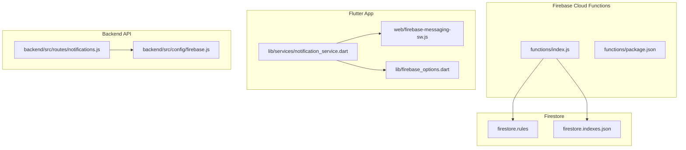
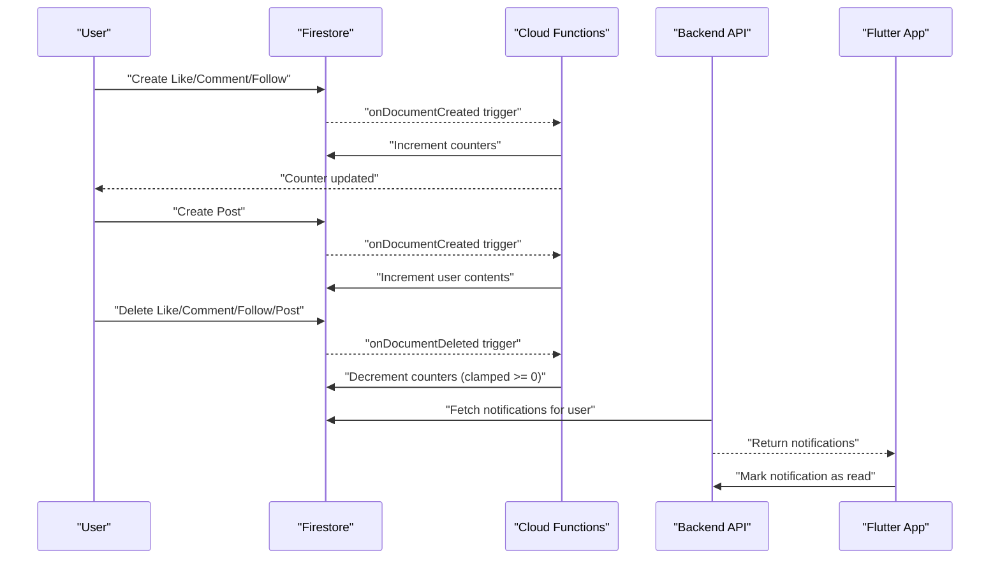
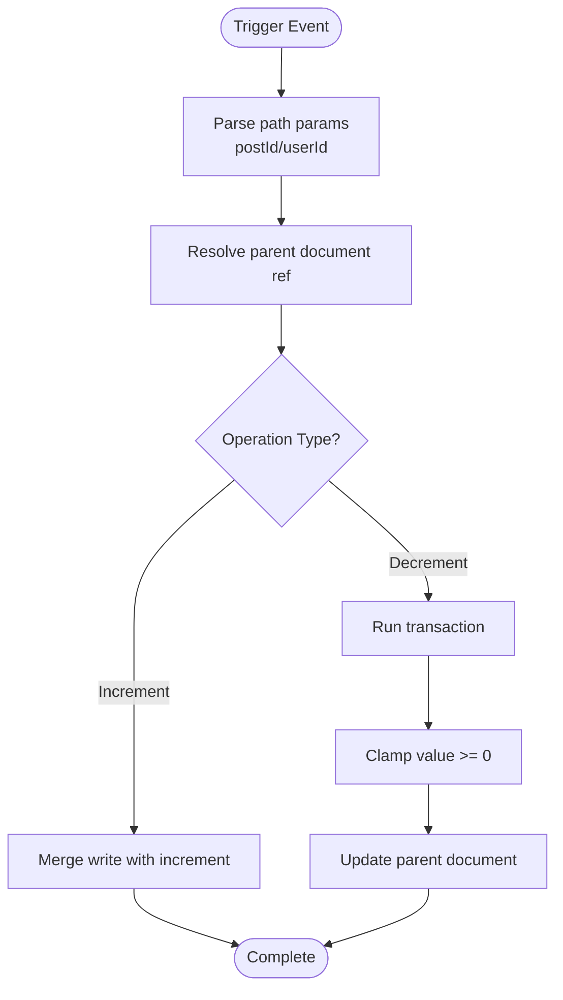
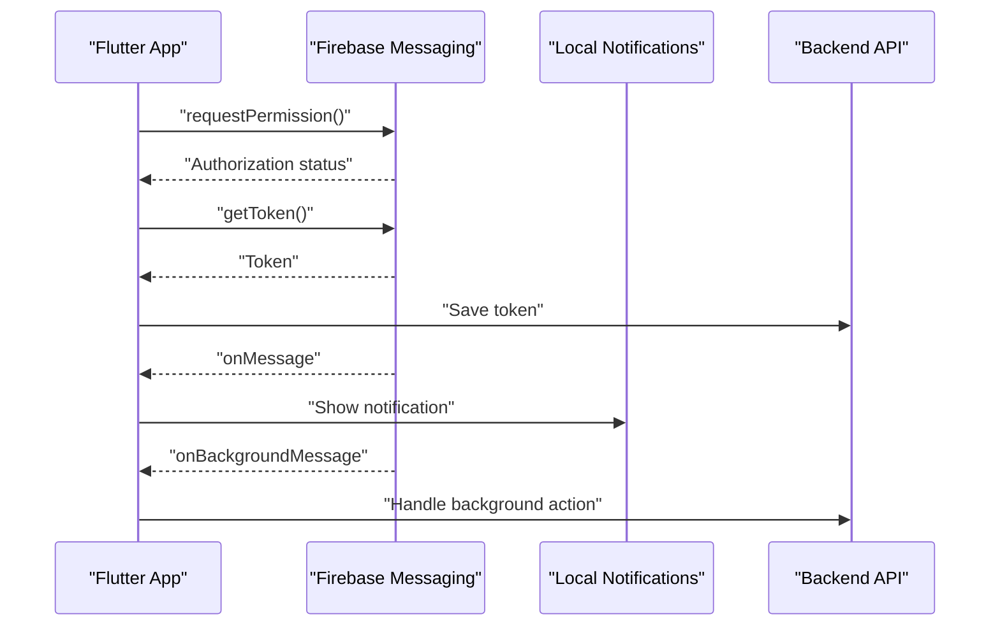
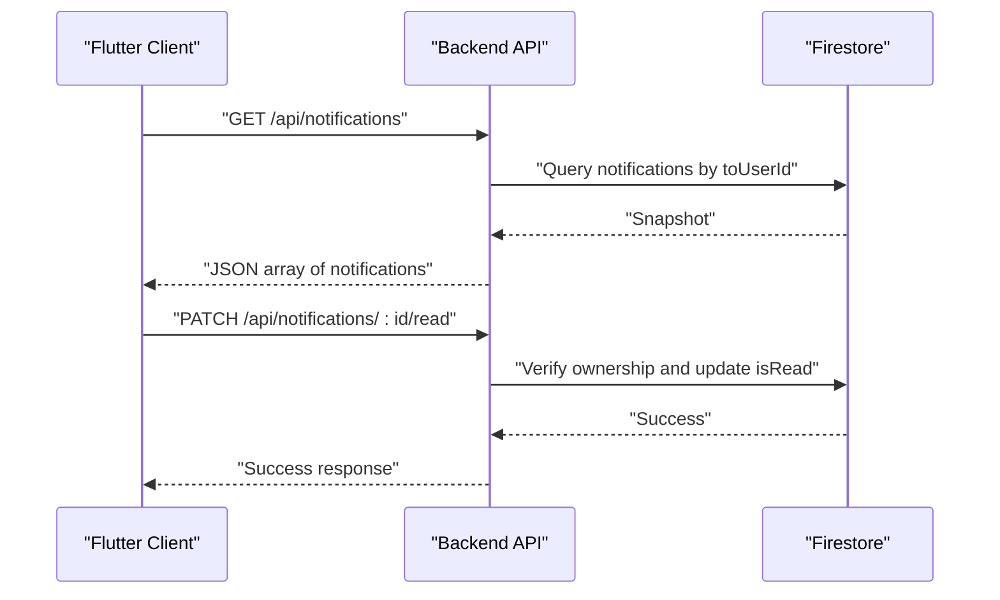
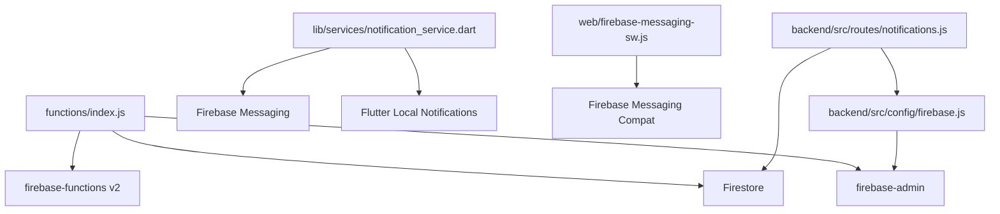

# Firebase Cloud Functions for Notifications

<cite>
**Referenced Files in This Document**
- [index.js](file://testpro-main/functions/index.js)
- [package.json](file://testpro-main/functions/package.json)
- [firebase.json](file://testpro-main/firebase.json)
- [firestore.indexes.json](file://testpro-main/firestore.indexes.json)
- [firestore.rules](file://testpro-main/firestore.rules)
- [notification_service.dart](file://testpro-main/lib/services/notification_service.dart)
- [firebase-messaging-sw.js](file://testpro-main/web/firebase-messaging-sw.js)
- [firebase_options.dart](file://testpro-main/lib/firebase_options.dart)
- [notifications.js](file://backend/src/routes/notifications.js)
- [firebase.js](file://backend/src/config/firebase.js)
- [DEPLOYMENT_GUIDE.md](file://DEPLOYMENT_GUIDE.md)
- [PRODUCTION_READINESS_AUDIT_REPORT.md](file://PRODUCTION_READINESS_AUDIT_REPORT.md)
</cite>

## Table of Contents
1. [Introduction](#introduction)
2. [Project Structure](#project-structure)
3. [Core Components](#core-components)
4. [Architecture Overview](#architecture-overview)
5. [Detailed Component Analysis](#detailed-component-analysis)
6. [Dependency Analysis](#dependency-analysis)
7. [Performance Considerations](#performance-considerations)
8. [Troubleshooting Guide](#troubleshooting-guide)
9. [Conclusion](#conclusion)
10. [Appendices](#appendices)

## Introduction
This document provides comprehensive documentation for the Firebase Cloud Functions used in the notification system. It explains the function architecture for Firestore-triggered counters, real-time data synchronization patterns, and background processing capabilities. It also covers deployment configuration, environment setup, integration with Firestore triggers, notification triggering scenarios, error handling strategies, performance optimization techniques, monitoring and logging approaches, and troubleshooting guidance for common deployment and runtime issues.

## Project Structure
The notification system spans three primary areas:
- Firebase Cloud Functions: Firestore-triggered background functions for counters and future notification logic
- Flutter Frontend: Local and background FCM handling via Firebase Messaging and local notifications
- Backend API: REST endpoints for retrieving and marking notifications as read

**Diagram sources**
- [index.js](file://testpro-main/functions/index.js#L1-L112)
- [package.json](file://testpro-main/functions/package.json#L1-L15)
- [firestore.rules](file://testpro-main/firestore.rules#L1-L11)
- [firestore.indexes.json](file://testpro-main/firestore.indexes.json#L1-L181)
- [notification_service.dart](file://testpro-main/lib/services/notification_service.dart#L1-L73)
- [firebase-messaging-sw.js](file://testpro-main/web/firebase-messaging-sw.js#L1-L25)
- [firebase_options.dart](file://testpro-main/lib/firebase_options.dart#L1-L89)
- [notifications.js](file://backend/src/routes/notifications.js#L1-L50)
- [firebase.js](file://backend/src/config/firebase.js#L1-L46)

**Section sources**
- [index.js](file://testpro-main/functions/index.js#L1-L112)
- [package.json](file://testpro-main/functions/package.json#L1-L15)
- [firebase.json](file://testpro-main/firebase.json#L1-L32)

## Core Components
This section outlines the core components involved in the notification system and their responsibilities.

- Firebase Cloud Functions (Firestore Triggers):
  - Counter increment/decrement functions for likes, comments, followers, and posts
  - OTP functions export placeholder references (currently unimplemented)
  - Uses Firebase Admin SDK and v2 Firestore triggers

- Flutter Frontend:
  - Initializes Firebase Messaging and requests permissions
  - Registers background message handler for FCM
  - Displays local notifications via Flutter Local Notifications plugin
  - Service worker handles background notifications for web

- Backend API:
  - REST endpoints to fetch and mark notifications as read
  - Uses Firebase Admin SDK for Firestore operations

**Section sources**
- [index.js](file://testpro-main/functions/index.js#L1-L112)
- [notification_service.dart](file://testpro-main/lib/services/notification_service.dart#L1-L73)
- [firebase-messaging-sw.js](file://testpro-main/web/firebase-messaging-sw.js#L1-L25)
- [notifications.js](file://backend/src/routes/notifications.js#L1-L50)
- [firebase.js](file://backend/src/config/firebase.js#L1-L46)

## Architecture Overview
The system follows a Firestore-first architecture with Cloud Functions reacting to data changes to maintain counters and prepare for future notification triggers. The Flutter app receives push notifications via Firebase Messaging and displays local notifications. The backend exposes REST endpoints for managing notification records.

**Diagram sources**
- [index.js](file://testpro-main/functions/index.js#L13-L109)
- [notifications.js](file://backend/src/routes/notifications.js#L11-L48)

## Detailed Component Analysis

### Cloud Functions: Firestore Triggers
The Cloud Functions module defines Firestore-triggered functions that maintain counters for likes, comments, followers, and posts. Each function listens to create/delete events in nested collections and updates parent documents atomically.

Key characteristics:
- Uses v2 Firestore triggers for improved reliability and performance
- Leverages transactions for decrement operations to prevent negative counts
- Uses merge writes to safely increment counters
- Extracts dynamic path parameters from event.params

**Diagram sources**
- [index.js](file://testpro-main/functions/index.js#L13-L109)

**Section sources**
- [index.js](file://testpro-main/functions/index.js#L13-L109)

### OTP Functions Export (Placeholder)
The Cloud Functions entry exports OTP functions, but the implementation file is missing, causing deployment failures. This indicates a planned feature that is currently non-functional.

**Section sources**
- [index.js](file://testpro-main/functions/index.js#L7-L9)
- [PRODUCTION_READINESS_AUDIT_REPORT.md](file://PRODUCTION_READINESS_AUDIT_REPORT.md#L142-L165)

### Flutter Notification Service
The Flutter app initializes Firebase Messaging, requests permissions, retrieves tokens, and registers background handlers. It also sets up local notifications for foreground and background states.

Key responsibilities:
- Request notification permissions
- Save FCM token to backend
- Initialize local notifications
- Handle foreground/background messages
- Register top-level background handler

**Diagram sources**
- [notification_service.dart](file://testpro-main/lib/services/notification_service.dart#L17-L57)

**Section sources**
- [notification_service.dart](file://testpro-main/lib/services/notification_service.dart#L1-L73)

### Background Message Service Worker (Web)
The web service worker handles background FCM messages and displays browser notifications. It initializes Firebase Messaging in the service worker context and shows notifications with a default icon.

**Section sources**
- [firebase-messaging-sw.js](file://testpro-main/web/firebase-messaging-sw.js#L1-L25)

### Backend REST API for Notifications
The backend provides REST endpoints to manage notifications:
- Fetch notifications for the authenticated user, ordered by timestamp
- Mark a specific notification as read after authorization checks

**Diagram sources**
- [notifications.js](file://backend/src/routes/notifications.js#L11-L48)

**Section sources**
- [notifications.js](file://backend/src/routes/notifications.js#L1-L50)
- [firebase.js](file://backend/src/config/firebase.js#L1-L46)

## Dependency Analysis
This section analyzes dependencies between components and highlights potential circular dependencies or external integrations.

**Diagram sources**
- [index.js](file://testpro-main/functions/index.js#L1-L12)
- [notification_service.dart](file://testpro-main/lib/services/notification_service.dart#L1-L15)
- [firebase-messaging-sw.js](file://testpro-main/web/firebase-messaging-sw.js#L1-L13)
- [notifications.js](file://backend/src/routes/notifications.js#L1-L5)
- [firebase.js](file://backend/src/config/firebase.js#L1-L10)

**Section sources**
- [package.json](file://testpro-main/functions/package.json#L8-L13)
- [firebase.json](file://testpro-main/firebase.json#L6-L8)

## Performance Considerations
- Use Firestore transactions for decrement operations to avoid race conditions and ensure atomicity
- Prefer merge writes for counter increments to minimize write conflicts
- Keep Cloud Function logic minimal and focused on data synchronization tasks
- Monitor Firestore query performance using existing collection group indexes
- Avoid heavy computations in Cloud Functions; delegate to backend or client when appropriate

[No sources needed since this section provides general guidance]

## Troubleshooting Guide
Common deployment and runtime issues:

- Missing OTP Functions Implementation:
  - Symptom: Deployment fails with module not found for OTP functions
  - Resolution: Implement the missing OTP functions file or remove exports from index.js

- Exposed Credentials and Hardcoded Keys:
  - Symptom: Security audit flags exposed Firebase private key and API keys
  - Resolution: Rotate credentials, clean repository history, and restrict API key usage

- CORS Misconfiguration:
  - Symptom: Cross-origin requests blocked or overly permissive
  - Resolution: Set specific production domains and environment-specific CORS configuration

- Proxy Endpoint Security:
  - Symptom: Open proxy endpoint vulnerability
  - Resolution: Uncomment and enforce URL whitelist and add rate limiting

- Localhost in Production Builds:
  - Symptom: Media uploads fail in production
  - Resolution: Use dart-define to override default API URL and ensure production backend URL

**Section sources**
- [PRODUCTION_READINESS_AUDIT_REPORT.md](file://PRODUCTION_READINESS_AUDIT_REPORT.md#L24-L51)
- [PRODUCTION_READINESS_AUDIT_REPORT.md](file://PRODUCTION_READINESS_AUDIT_REPORT.md#L55-L84)
- [PRODUCTION_READINESS_AUDIT_REPORT.md](file://PRODUCTION_READINESS_AUDIT_REPORT.md#L88-L110)
- [PRODUCTION_READINESS_AUDIT_REPORT.md](file://PRODUCTION_READINESS_AUDIT_REPORT.md#L169-L196)
- [DEPLOYMENT_GUIDE.md](file://DEPLOYMENT_GUIDE.md#L140-L150)

## Conclusion
The Firebase Cloud Functions provide a robust foundation for real-time data synchronization through Firestore triggers. While the current implementation focuses on counter maintenance, the architecture supports future expansion for notification generation and delivery. The Flutter frontend integrates seamlessly with Firebase Messaging and local notifications, while the backend offers REST endpoints for notification management. Addressing the identified security and configuration issues will ensure a production-ready deployment.

[No sources needed since this section summarizes without analyzing specific files]

## Appendices

### Deployment Configuration Checklist
- Install Node.js 20 for Cloud Functions runtime
- Configure Firebase Admin credentials securely
- Set up Firestore indexes for optimal query performance
- Define environment variables for backend services
- Restrict API keys and enable App Check for production

**Section sources**
- [package.json](file://testpro-main/functions/package.json#L4-L6)
- [firebase.js](file://backend/src/config/firebase.js#L7-L17)
- [firestore.indexes.json](file://testpro-main/firestore.indexes.json#L1-L181)
- [DEPLOYMENT_GUIDE.md](file://DEPLOYMENT_GUIDE.md#L138-L151)