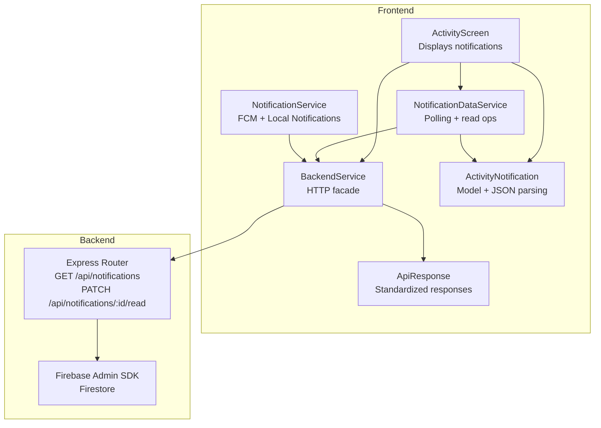
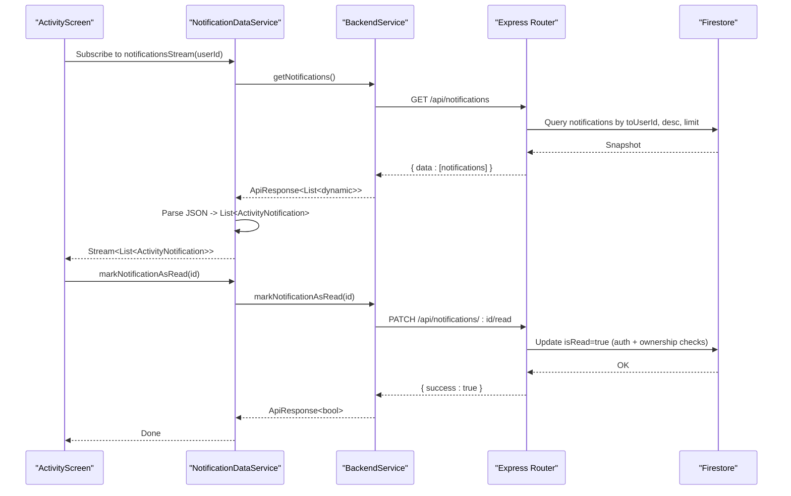
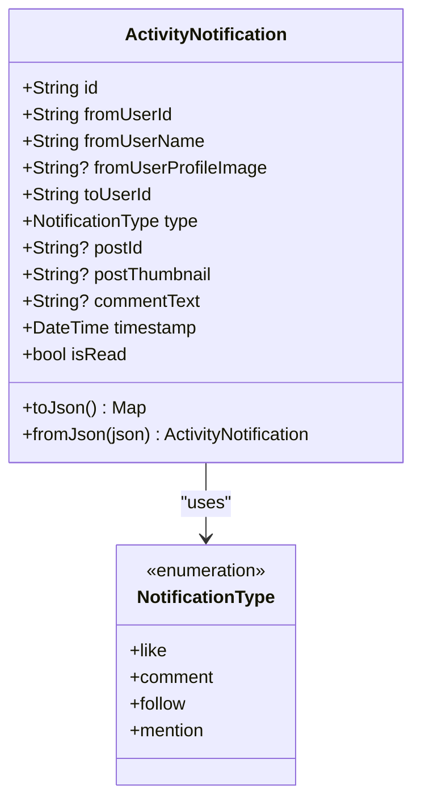
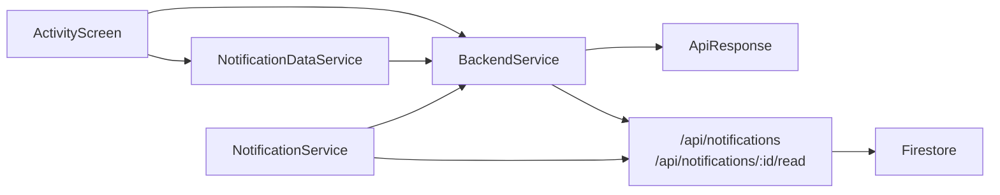

# Notification Data Service

<cite>
**Referenced Files in This Document**
- [notification_data_service.dart](file://testpro-main/lib/services/notification_data_service.dart)
- [notification_service.dart](file://testpro-main/lib/services/notification_service.dart)
- [notification.dart](file://testpro-main/lib/models/notification.dart)
- [activity_screen.dart](file://testpro-main/lib/screens/activity_screen.dart)
- [backend_service.dart](file://testpro-main/lib/services/backend_service.dart)
- [notifications.js](file://backend/src/routes/notifcations.js)
- [firebase.js](file://backend/src/config/firebase.js)
- [api_response.dart](file://testpro-main/lib/models/api_response.dart)
- [auth_service.dart](file://testpro-main/lib/services/auth_service.dart)
</cite>

## Table of Contents
1. [Introduction](#introduction)
2. [Project Structure](#project-structure)
3. [Core Components](#core-components)
4. [Architecture Overview](#architecture-overview)
5. [Detailed Component Analysis](#detailed-component-analysis)
6. [Dependency Analysis](#dependency-analysis)
7. [Performance Considerations](#performance-considerations)
8. [Troubleshooting Guide](#troubleshooting-guide)
9. [Conclusion](#conclusion)

## Introduction
This document describes the notification data service that manages notification state and data flow for the application. It covers the service architecture for handling notification collections, state management, and real-time-like updates. It also documents the data models used for notifications, caching strategies, synchronization with backend services, filtering and sorting logic, and error handling for offline scenarios and data consistency.

## Project Structure
The notification system spans the frontend Flutter application and the backend Express/Firebase service:
- Frontend: Services for fetching and updating notifications, UI screen for displaying notifications, and models for typed notification data.
- Backend: REST endpoints for retrieving notifications and marking them as read, backed by Firestore.

**Diagram sources**
- [activity_screen.dart](file://testpro-main/lib/screens/activity_screen.dart#L35-L70)
- [notification_data_service.dart](file://testpro-main/lib/services/notification_data_service.dart#L7-L25)
- [notification_service.dart](file://testpro-main/lib/services/notification_service.dart#L17-L57)
- [backend_service.dart](file://testpro-main/lib/services/backend_service.dart#L56-L57)
- [notifications.js](file://backend/src/routes/notifcations.js#L11-L48)
- [firebase.js](file://backend/src/config/firebase.js#L41-L44)
- [api_response.dart](file://testpro-main/lib/models/api_response.dart#L1-L69)
- [notification.dart](file://testpro-main/lib/models/notification.dart#L8-L87)

**Section sources**
- [activity_screen.dart](file://testpro-main/lib/screens/activity_screen.dart#L1-L399)
- [notification_data_service.dart](file://testpro-main/lib/services/notification_data_service.dart#L1-L40)
- [notification_service.dart](file://testpro-main/lib/services/notification_service.dart#L1-L94)
- [backend_service.dart](file://testpro-main/lib/services/backend_service.dart#L1-L497)
- [notifications.js](file://backend/src/routes/notifcations.js#L1-L51)
- [firebase.js](file://backend/src/config/firebase.js#L1-L46)
- [api_response.dart](file://testpro-main/lib/models/api_response.dart#L1-L69)
- [notification.dart](file://testpro-main/lib/models/notification.dart#L1-L88)

## Core Components
- NotificationDataService: Provides a periodic polling stream for notifications and exposes read operations.
- ActivityScreen: Consumes the polling stream, renders notifications, handles taps, and maintains local state.
- BackendService: HTTP facade that injects auth headers and standardizes responses.
- ActivityNotification: Typed model with JSON serialization/deserialization and safe parsing.
- NotificationService: Manages FCM permissions, token lifecycle, and local notifications.
- Backend routes: REST endpoints for listing notifications and marking individual notifications as read.

Key responsibilities:
- Fetch and poll notifications at a controlled cadence.
- Maintain optimistic UI updates for read state.
- Persist read state via backend PATCH endpoint.
- Provide a standardized response model for error handling.

**Section sources**
- [notification_data_service.dart](file://testpro-main/lib/services/notification_data_service.dart#L4-L39)
- [activity_screen.dart](file://testpro-main/lib/screens/activity_screen.dart#L19-L70)
- [backend_service.dart](file://testpro-main/lib/services/backend_service.dart#L56-L57)
- [notification.dart](file://testpro-main/lib/models/notification.dart#L8-L87)
- [notification_service.dart](file://testpro-main/lib/services/notification_service.dart#L13-L94)
- [notifications.js](file://backend/src/routes/notifcations.js#L11-L48)

## Architecture Overview
The notification flow combines periodic polling on the client with backend-backed persistence:

**Diagram sources**
- [notification_data_service.dart](file://testpro-main/lib/services/notification_data_service.dart#L7-L25)
- [backend_service.dart](file://testpro-main/lib/services/backend_service.dart#L430-L448)
- [notifications.js](file://backend/src/routes/notifcations.js#L11-L48)
- [firebase.js](file://backend/src/config/firebase.js#L41-L44)

## Detailed Component Analysis

### Notification Data Model
The notification model encapsulates fields for sender, recipient, type, related post, thumbnail, comment text, timestamp, and read state. It supports robust JSON parsing with safe defaults and converts to/from JSON for transport and persistence.

**Diagram sources**
- [notification.dart](file://testpro-main/lib/models/notification.dart#L8-L87)

**Section sources**
- [notification.dart](file://testpro-main/lib/models/notification.dart#L1-L88)

### Notification Data Service
Provides:
- A periodic polling stream that yields fresh notification lists every five minutes.
- An internal fetch method that calls the backend and parses JSON into typed models.
- A read operation that updates the backend and throws on failure.

Operational notes:
- Polling interval is intentionally long to avoid request storms.
- Read operations surface errors via exceptions for immediate feedback.

**Section sources**
- [notification_data_service.dart](file://testpro-main/lib/services/notification_data_service.dart#L4-L39)

### Activity Screen (Display and Interaction)
Responsibilities:
- Initializes tabs and loads notifications on startup.
- Renders a list with a simple "Earlier" section header after a fixed index.
- Computes unread count badge from local state.
- Handles tap events with optimistic read updates followed by backend synchronization.
- Navigates to post detail when a notification references a post.

Filtering and sorting:
- Sorting: Backend orders by timestamp descending.
- Filtering: Tabs exist for "All" and "Mentions"; filtering logic is present in the UI but not implemented in the backend route shown.

Display logic:
- Unread notifications are visually highlighted.
- Rich text composition depends on notification type.
- Optional post thumbnail rendering when available.

**Section sources**
- [activity_screen.dart](file://testpro-main/lib/screens/activity_screen.dart#L19-L70)
- [activity_screen.dart](file://testpro-main/lib/screens/activity_screen.dart#L182-L270)
- [activity_screen.dart](file://testpro-main/lib/screens/activity_screen.dart#L386-L398)

### Backend Service and API Responses
BackendService centralizes HTTP calls:
- Injects Authorization headers using Firebase ID tokens.
- Standardizes responses via ApiResponse<T>.
- Implements getNotifications and markNotificationAsRead.

ApiResponse<T>:
- Supports success/error branches with optional error codes.
- Parses nested pagination metadata.

**Section sources**
- [backend_service.dart](file://testpro-main/lib/services/backend_service.dart#L56-L57)
- [backend_service.dart](file://testpro-main/lib/services/backend_service.dart#L430-L448)
- [api_response.dart](file://testpro-main/lib/models/api_response.dart#L1-L69)

### Backend Routes and Firestore
REST endpoints:
- GET /api/notifications: Returns notifications for the authenticated user, ordered by timestamp descending, limited to a small number.
- PATCH /api/notifications/:id/read: Marks a notification as read after verifying existence and ownership.

Firestore:
- Uses Firestore collection "notifications".
- Applies where/filter/order/limit queries.

**Section sources**
- [notifications.js](file://backend/src/routes/notifcations.js#L11-L48)
- [firebase.js](file://backend/src/config/firebase.js#L41-L44)

### Real-Time Updates and Local Notifications
NotificationService:
- Requests notification permissions on supported platforms.
- Registers background and foreground handlers for FCM messages.
- Saves FCM tokens to the backend profile.
- Displays local notifications when app is in foreground.

Note: The primary notification stream is polling-based. Real-time updates rely on FCM for push notifications, not WebSocket subscriptions.

**Section sources**
- [notification_service.dart](file://testpro-main/lib/services/notification_service.dart#L17-L94)

## Dependency Analysis

**Diagram sources**
- [activity_screen.dart](file://testpro-main/lib/screens/activity_screen.dart#L35-L70)
- [notification_data_service.dart](file://testpro-main/lib/services/notification_data_service.dart#L7-L25)
- [backend_service.dart](file://testpro-main/lib/services/backend_service.dart#L56-L57)
- [api_response.dart](file://testpro-main/lib/models/api_response.dart#L1-L69)
- [notifications.js](file://backend/src/routes/notifcations.js#L11-L48)
- [firebase.js](file://backend/src/config/firebase.js#L41-L44)
- [notification_service.dart](file://testpro-main/lib/services/notification_service.dart#L17-L57)

**Section sources**
- [activity_screen.dart](file://testpro-main/lib/screens/activity_screen.dart#L1-L399)
- [notification_data_service.dart](file://testpro-main/lib/services/notification_data_service.dart#L1-L40)
- [backend_service.dart](file://testpro-main/lib/services/backend_service.dart#L1-L497)
- [notifications.js](file://backend/src/routes/notifcations.js#L1-L51)
- [firebase.js](file://backend/src/config/firebase.js#L1-L46)
- [api_response.dart](file://testpro-main/lib/models/api_response.dart#L1-L69)
- [notification_service.dart](file://testpro-main/lib/services/notification_service.dart#L1-L94)

## Performance Considerations
- Polling cadence: The service polls every five minutes to reduce backend load and conserve battery. This avoids near-real-time updates, which are unnecessary for notifications.
- Backend limits: The backend returns a small number of recent notifications, reducing payload sizes.
- Local state optimization: The UI performs optimistic updates for read state to minimize perceived latency.
- Token management: BackendService rotates custom tokens when available and falls back to Firebase tokens, avoiding redundant refresh cycles.

Recommendations:
- Introduce pagination cursors if the backend grows the dataset.
- Consider debouncing rapid UI interactions to avoid excessive read operations.
- Monitor network failures and back off retries gracefully.

**Section sources**
- [notification_data_service.dart](file://testpro-main/lib/services/notification_data_service.dart#L5-L12)
- [notifications.js](file://backend/src/routes/notifcations.js#L13-L17)
- [backend_service.dart](file://testpro-main/lib/services/backend_service.dart#L174-L212)

## Troubleshooting Guide
Common issues and resolutions:
- Authentication failures: If the user is not authenticated, token retrieval fails. Ensure the user is signed in before invoking notification APIs.
- Unauthorized access: PATCH /api/notifications/:id/read requires ownership of the notification. Verify the toUserId matches the authenticated user.
- Network errors: ApiResponse<T> wraps parsing and network errors. Inspect error codes and messages for actionable diagnostics.
- Offline scenarios: The UI remains usable while offline; however, read operations will fail until connectivity is restored. Consider queuing read operations locally if needed.
- Data consistency: The UI optimistically marks notifications as read. If the backend operation fails, the UI state can be reverted by reloading the list.

Operational checks:
- Confirm FCM token registration and backend sync.
- Validate Firestore security rules permit reads/writes for the authenticated user.
- Review backend logs for 404/403 responses indicating missing documents or unauthorized access.

**Section sources**
- [backend_service.dart](file://testpro-main/lib/services/backend_service.dart#L174-L212)
- [api_response.dart](file://testpro-main/lib/models/api_response.dart#L16-L50)
- [notifications.js](file://backend/src/routes/notifcations.js#L35-L48)
- [notification_service.dart](file://testpro-main/lib/services/notification_service.dart#L76-L92)

## Conclusion
The notification data service employs a pragmatic, low-friction architecture:
- Periodic polling ensures reliable updates without real-time infrastructure.
- Strong typing and standardized responses simplify error handling and data consistency.
- Optimistic UI updates improve responsiveness, with backend reconciliation for correctness.
- Backend routes are simple, secure, and efficient, leveraging Firestore’s querying capabilities.

This design balances simplicity, reliability, and performance while providing a solid foundation for future enhancements such as pagination, richer filtering, and optional real-time synchronization.