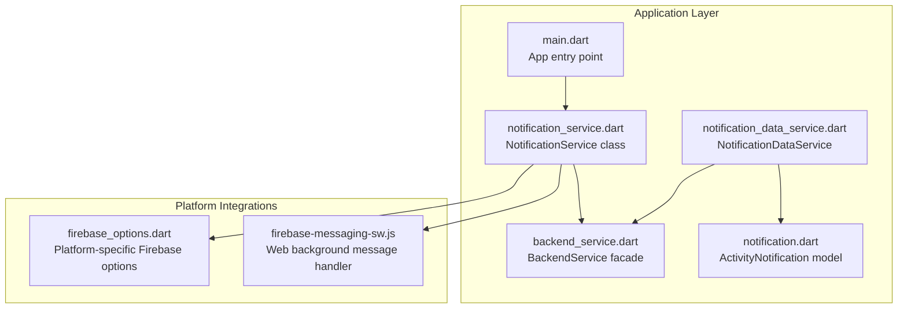
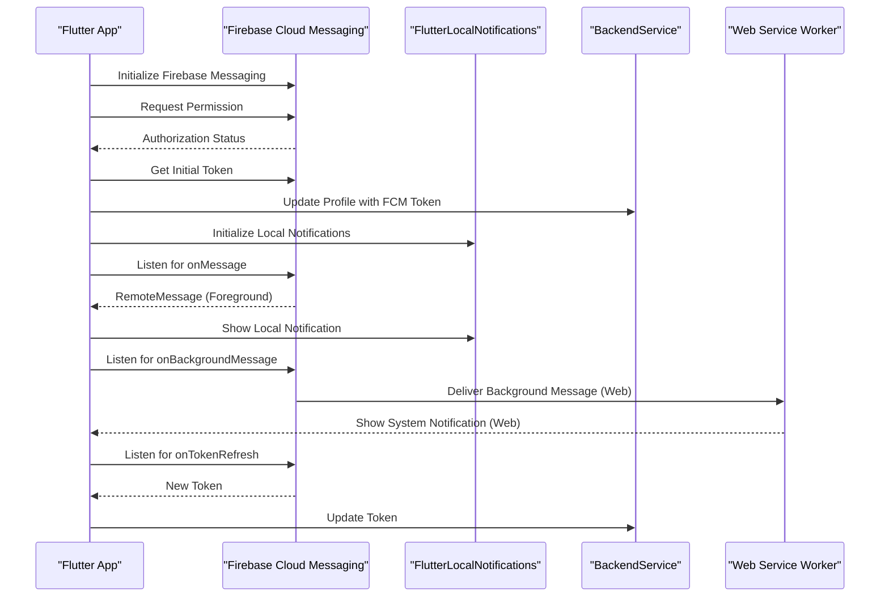
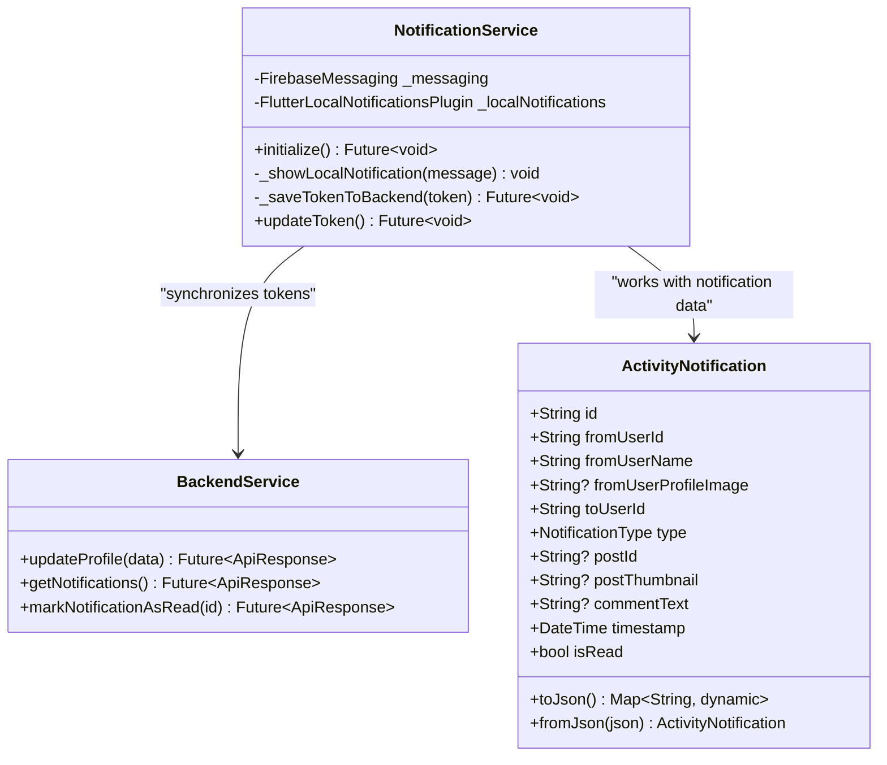
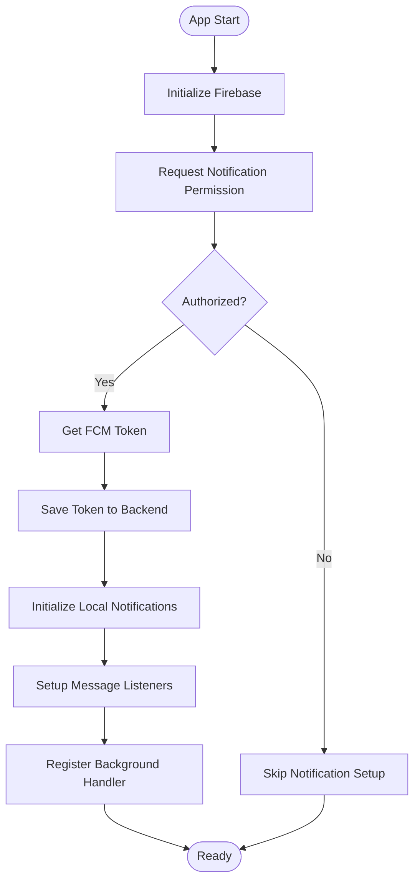
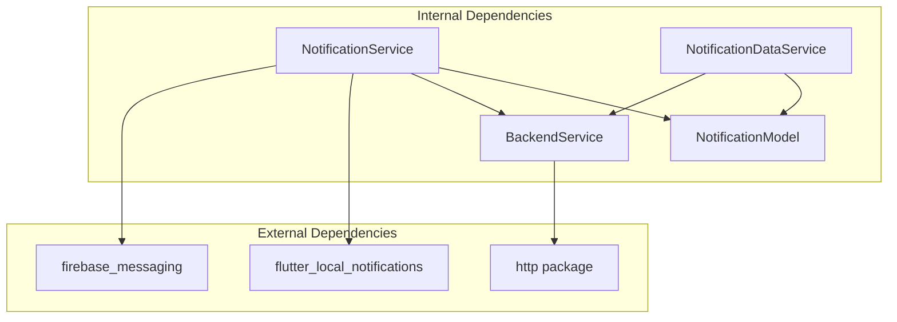

# Notification Service Implementation

<cite>
**Referenced Files in This Document**
- [notification_service.dart](file://testpro-main/lib/services/notification_service.dart)
- [main.dart](file://testpro-main/lib/main.dart)
- [backend_service.dart](file://testpro-main/lib/services/backend_service.dart)
- [notification.dart](file://testpro-main/lib/models/notification.dart)
- [notification_data_service.dart](file://testpro-main/lib/services/notification_data_service.dart)
- [firebase_options.dart](file://testpro-main/lib/firebase_options.dart)
- [firebase-messaging-sw.js](file://testpro-main/web/firebase-messaging-sw.js)
</cite>

## Table of Contents
1. [Introduction](#introduction)
2. [Project Structure](#project-structure)
3. [Core Components](#core-components)
4. [Architecture Overview](#architecture-overview)
5. [Detailed Component Analysis](#detailed-component-analysis)
6. [Dependency Analysis](#dependency-analysis)
7. [Performance Considerations](#performance-considerations)
8. [Troubleshooting Guide](#troubleshooting-guide)
9. [Conclusion](#conclusion)

## Introduction
This document provides comprehensive documentation for the NotificationService class implementation in the Flutter application. It covers initialization procedures including permission requests, Firebase Cloud Messaging (FCM) token management, and local notification setup. It explains the background message handler architecture and why it must be top-level for release mode, documents the token refresh mechanism, notification display logic, and integration with BackendService for token synchronization. Additionally, it includes examples of notification configuration for different platforms, error handling strategies, and debugging approaches for notification delivery issues.

## Project Structure
The notification system spans several key files:
- Application entry point initializes Firebase and the NotificationService
- NotificationService manages permissions, token lifecycle, local notifications, and background handlers
- BackendService handles token synchronization with the backend
- Web-specific service worker manages background messages for web targets
- Notification model and data service support notification data handling

**Diagram sources**
- [main.dart](file://testpro-main/lib/main.dart#L12-L22)
- [notification_service.dart](file://testpro-main/lib/services/notification_service.dart#L13-L93)
- [backend_service.dart](file://testpro-main/lib/services/backend_service.dart#L10-L67)
- [notification.dart](file://testpro-main/lib/models/notification.dart#L8-L33)
- [notification_data_service.dart](file://testpro-main/lib/services/notification_data_service.dart#L4-L39)
- [firebase_options.dart](file://testpro-main/lib/firebase_options.dart#L17-L89)
- [firebase-messaging-sw.js](file://testpro-main/web/firebase-messaging-sw.js#L1-L25)

**Section sources**
- [main.dart](file://testpro-main/lib/main.dart#L1-L63)
- [notification_service.dart](file://testpro-main/lib/services/notification_service.dart#L1-L94)

## Core Components
The NotificationService class orchestrates the entire notification lifecycle:
- Permission management for iOS and Android
- FCM token retrieval and synchronization
- Local notification setup and display
- Foreground and background message handling
- Token refresh monitoring

Key responsibilities include:
- Requesting notification permissions during initialization
- Retrieving initial FCM tokens and persisting them via BackendService
- Setting up local notification channels and display preferences
- Listening for foreground messages and displaying local notifications
- Monitoring token refresh events and updating backend records
- Registering a top-level background message handler for release builds

**Section sources**
- [notification_service.dart](file://testpro-main/lib/services/notification_service.dart#L13-L93)

## Architecture Overview
The notification architecture follows a layered approach with clear separation of concerns:

**Diagram sources**
- [notification_service.dart](file://testpro-main/lib/services/notification_service.dart#L17-L57)
- [backend_service.dart](file://testpro-main/lib/services/backend_service.dart#L296-L305)
- [firebase-messaging-sw.js](file://testpro-main/web/firebase-messaging-sw.js#L15-L24)

## Detailed Component Analysis

### NotificationService Class
The NotificationService class encapsulates all notification-related functionality:

**Diagram sources**
- [notification_service.dart](file://testpro-main/lib/services/notification_service.dart#L13-L93)
- [backend_service.dart](file://testpro-main/lib/services/backend_service.dart#L296-L305)
- [notification.dart](file://testpro-main/lib/models/notification.dart#L8-L87)

#### Initialization Process
The initialization sequence ensures proper setup across all platforms:

1. **Permission Request**: Requests notification permissions for iOS and Android 13+
2. **Token Retrieval**: Gets the initial FCM token if authorized
3. **Backend Synchronization**: Sends token to backend via BackendService
4. **Local Setup**: Initializes FlutterLocalNotifications with platform-specific settings
5. **Message Listeners**: Sets up foreground message handling and background handler registration

#### Background Message Handler Architecture
The background message handler must be top-level for release mode due to Flutter's tree-shaking and minification processes. The handler is marked with `@pragma('vm:entry-point')` to preserve it during compilation.

**Diagram sources**
- [notification_service.dart](file://testpro-main/lib/services/notification_service.dart#L17-L57)

#### Token Refresh Mechanism
The token refresh mechanism ensures continuous notification delivery:
- Monitors `onTokenRefresh` events from Firebase Messaging
- Automatically synchronizes new tokens with the backend
- Handles network failures gracefully with try-catch blocks
- Provides manual token update capability via `updateToken()`

#### Notification Display Logic
Local notification display follows platform-specific configurations:
- Android: Uses high-importance channel with max importance and priority
- iOS: Uses Darwin initialization settings
- Foreground messages trigger immediate local notification display
- Background messages are handled by the web service worker for web targets

**Section sources**
- [notification_service.dart](file://testpro-main/lib/services/notification_service.dart#L13-L93)

### BackendService Integration
The NotificationService integrates with BackendService for persistent token storage:
- Uses `updateProfile()` method to synchronize FCM tokens
- Implements retry logic and error handling for network operations
- Supports both automatic and manual token updates
- Maintains clean separation between notification logic and backend operations

**Section sources**
- [backend_service.dart](file://testpro-main/lib/services/backend_service.dart#L296-L305)
- [notification_service.dart](file://testpro-main/lib/services/notification_service.dart#L76-L92)

### Platform-Specific Configurations
Different platforms require specific configuration approaches:

#### Android Configuration
- High-importance notification channel with max priority
- Launcher icon resource for notification display
- Foreground service requirements for reliable delivery

#### iOS Configuration
- Darwin initialization settings
- Silent notification support for background processing
- Category and action configuration for interactive notifications

#### Web Configuration
- Dedicated service worker for background message handling
- Manifest file integration for web push notifications
- HTTPS requirements for production deployment

**Section sources**
- [notification_service.dart](file://testpro-main/lib/services/notification_service.dart#L36-L43)
- [firebase_options.dart](file://testpro-main/lib/firebase_options.dart#L43-L87)
- [firebase-messaging-sw.js](file://testpro-main/web/firebase-messaging-sw.js#L1-L25)

### Notification Data Model
The ActivityNotification model supports structured notification data:
- Enum-based notification types (like, comment, follow, mention)
- Comprehensive metadata for notification display
- JSON serialization/deserialization support
- Timestamp handling with flexible parsing

**Section sources**
- [notification.dart](file://testpro-main/lib/models/notification.dart#L1-L87)

### Notification Data Service
The NotificationDataService provides reactive notification data:
- Polling interval optimized for 5-minute intervals
- Stream-based notification fetching
- Read status management
- Server-side notification generation

**Section sources**
- [notification_data_service.dart](file://testpro-main/lib/services/notification_data_service.dart#L4-L39)

## Dependency Analysis
The notification system exhibits clear dependency relationships:

**Diagram sources**
- [notification_service.dart](file://testpro-main/lib/services/notification_service.dart#L1-L5)
- [backend_service.dart](file://testpro-main/lib/services/backend_service.dart#L1-L6)

**Section sources**
- [notification_service.dart](file://testpro-main/lib/services/notification_service.dart#L1-L5)
- [backend_service.dart](file://testpro-main/lib/services/backend_service.dart#L1-L6)

## Performance Considerations
Several performance optimizations are implemented:
- Token refresh monitoring prevents unnecessary backend calls
- Local notification caching reduces redundant displays
- Background message handler is top-level to avoid runtime overhead
- Notification polling interval set to 5 minutes to minimize server load
- Error handling prevents cascading failures during network issues

## Troubleshooting Guide

### Common Issues and Solutions

#### Permission Denied
- Verify permission request logic in initialization
- Check platform-specific permission requirements
- Ensure app has necessary manifest entries

#### Token Not Syncing
- Verify BackendService connectivity
- Check token refresh event handling
- Monitor network connectivity during initialization

#### Notifications Not Displaying
- Verify local notification initialization
- Check notification channel configuration
- Ensure foreground message handling is active

#### Background Delivery Issues
- Confirm service worker registration (web)
- Verify top-level background handler presence
- Check platform-specific background execution limits

### Debugging Approaches
- Enable debug logging during development
- Monitor Firebase console for token status
- Use platform-specific notification centers
- Implement comprehensive error handling
- Test across different platform configurations

**Section sources**
- [notification_service.dart](file://testpro-main/lib/services/notification_service.dart#L76-L92)

## Conclusion
The NotificationService implementation provides a robust foundation for cross-platform notification delivery. Its architecture balances simplicity with extensibility, supporting both foreground and background scenarios while maintaining clean separation of concerns. The integration with BackendService ensures persistent token management, while platform-specific configurations address unique requirements across Android, iOS, and web environments. The top-level background handler requirement for release mode highlights the importance of proper build configuration and testing across all deployment scenarios.