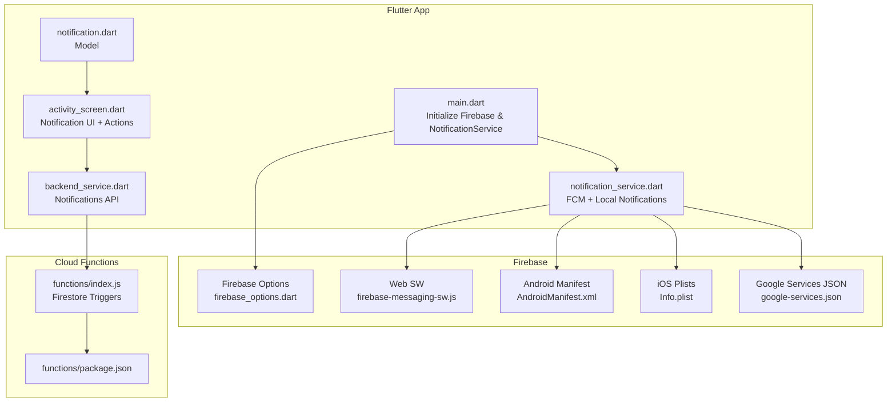
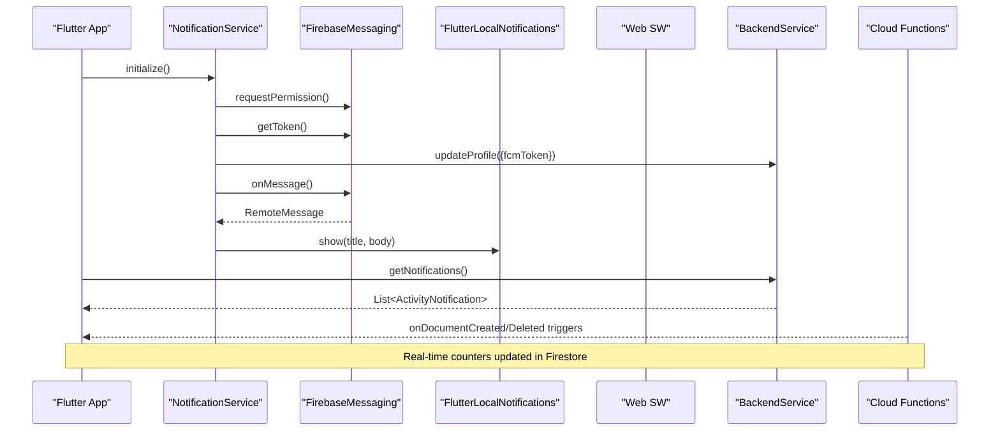
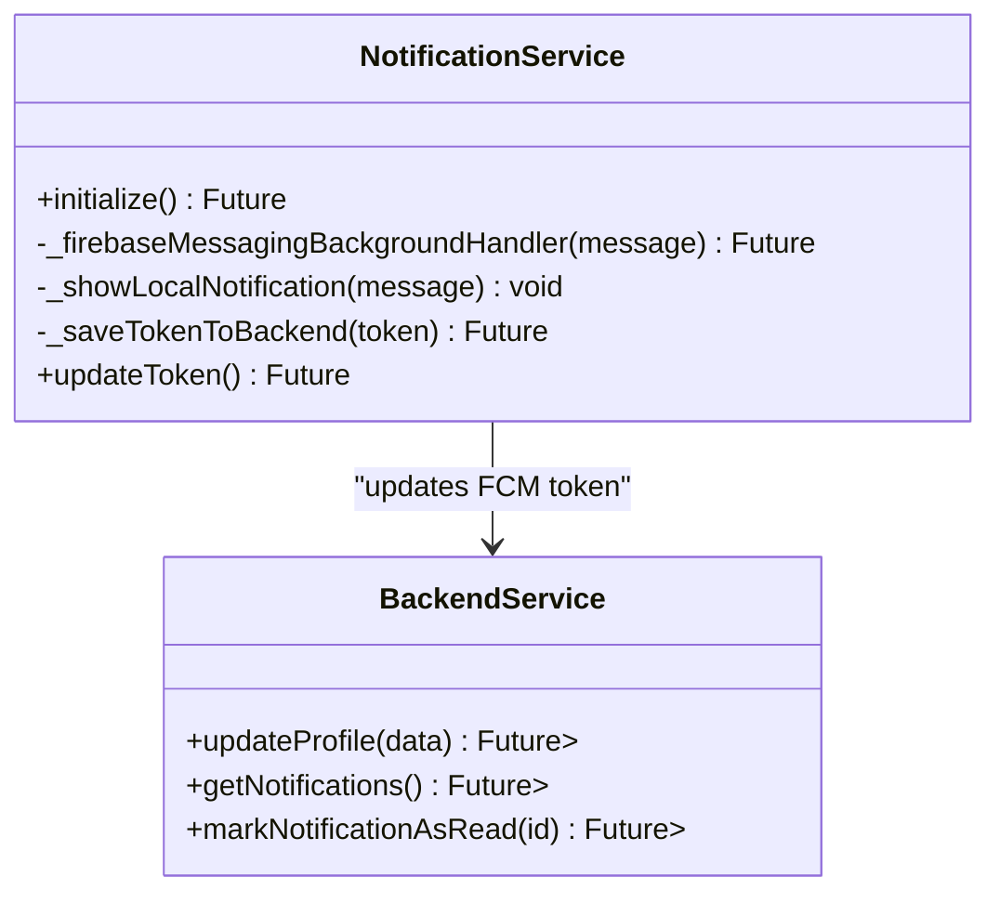
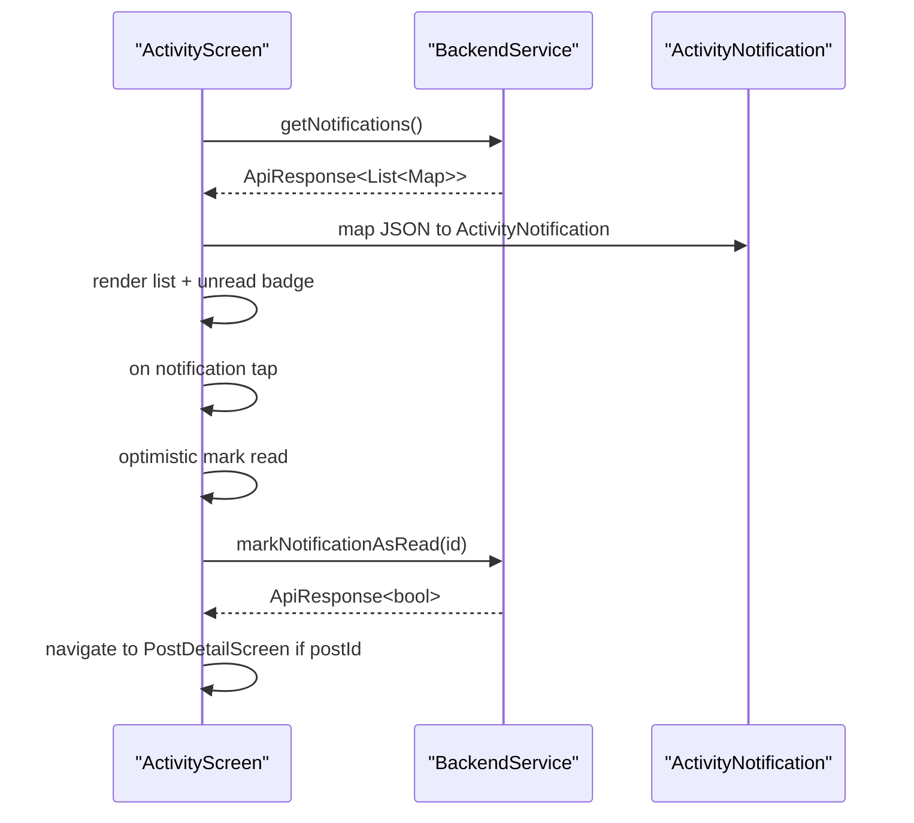
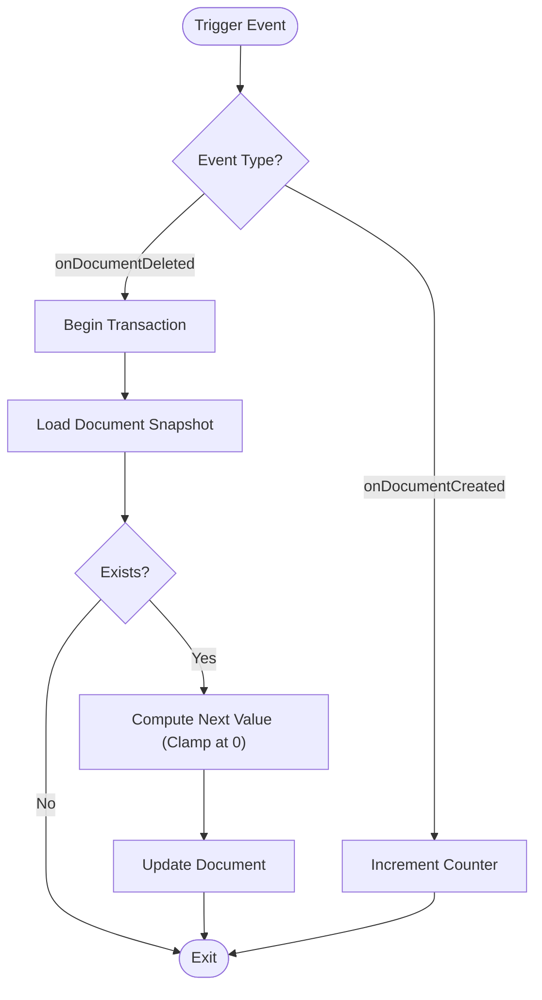
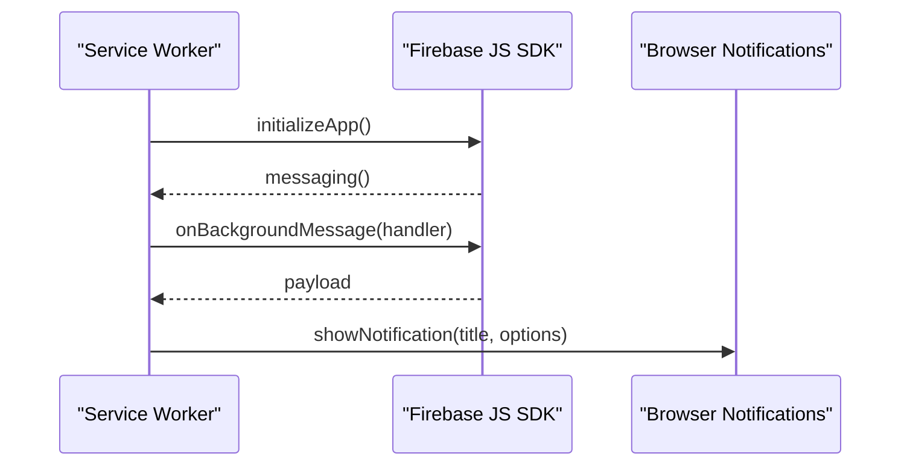
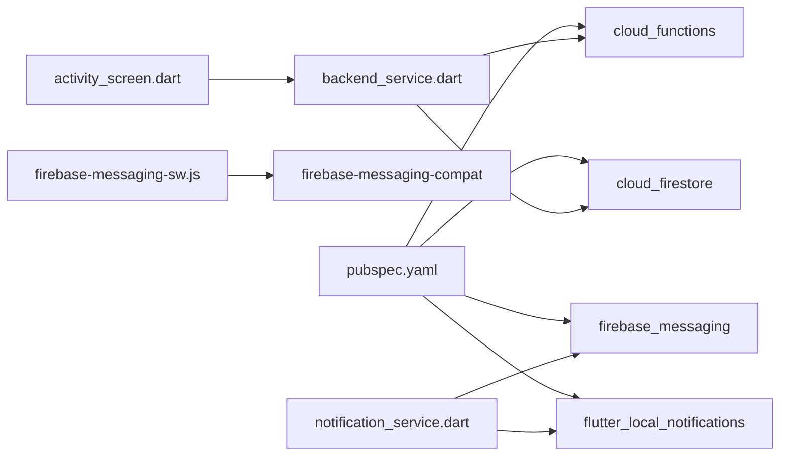

# Real-time Features and Notifications

<cite>
**Referenced Files in This Document**
- [notification_service.dart](file://testpro-main/lib/services/notification_service.dart)
- [main.dart](file://testpro-main/lib/main.dart)
- [backend_service.dart](file://testpro-main/lib/services/backend_service.dart)
- [notification.dart](file://testpro-main/lib/models/notification.dart)
- [activity_screen.dart](file://testpro-main/lib/screens/activity_screen.dart)
- [firebase_options.dart](file://testpro-main/lib/firebase_options.dart)
- [firebase-messaging-sw.js](file://testpro-main/web/firebase-messaging-sw.js)
- [index.js](file://testpro-main/functions/index.js)
- [package.json](file://testpro-main/functions/package.json)
- [pubspec.yaml](file://testpro-main/pubspec.yaml)
- [google-services.json](file://testpro-main/android/app/google-services.json)
- [AndroidManifest.xml](file://testpro-main/android/app/src/main/AndroidManifest.xml)
- [Info.plist](file://testpro-main/ios/Runner/Info.plist)
</cite>

## Table of Contents
1. [Introduction](#introduction)
2. [Project Structure](#project-structure)
3. [Core Components](#core-components)
4. [Architecture Overview](#architecture-overview)
5. [Detailed Component Analysis](#detailed-component-analysis)
6. [Dependency Analysis](#dependency-analysis)
7. [Performance Considerations](#performance-considerations)
8. [Troubleshooting Guide](#troubleshooting-guide)
9. [Conclusion](#conclusion)
10. [Appendices](#appendices)

## Introduction
This document explains the real-time features and notification system implemented in the project. It covers the NotificationService architecture, Firebase Cloud Messaging (FCM) integration, background notification handling, the notification data service for managing notification state, local notification display, and notification action handling. It also documents the Firebase Cloud Functions implementation for push notification triggers and real-time data synchronization, foreground/background notification processing, notification permission management, and cross-platform notification handling. Finally, it provides examples of real-time data binding, notification scheduling, and troubleshooting notification delivery issues.

## Project Structure
The notification system spans three layers:
- Frontend (Flutter): Initializes Firebase, manages permissions, displays local notifications, and binds notification data to UI.
- Backend (Cloud Functions): Implements Firestore-triggered counters and auxiliary OTP functions.
- Web: Provides a service worker for background FCM handling on the web platform.

**Diagram sources**
- [main.dart](file://testpro-main/lib/main.dart#L12-L22)
- [notification_service.dart](file://testpro-main/lib/services/notification_service.dart#L13-L93)
- [activity_screen.dart](file://testpro-main/lib/screens/activity_screen.dart#L19-L76)
- [backend_service.dart](file://testpro-main/lib/services/backend_service.dart#L430-L448)
- [notification.dart](file://testpro-main/lib/models/notification.dart#L8-L87)
- [firebase_options.dart](file://testpro-main/lib/firebase_options.dart#L17-L89)
- [firebase-messaging-sw.js](file://testpro-main/web/firebase-messaging-sw.js#L1-L25)
- [AndroidManifest.xml](file://testpro-main/android/app/src/main/AndroidManifest.xml#L1-L55)
- [Info.plist](file://testpro-main/ios/Runner/Info.plist#L1-L65)
- [google-services.json](file://testpro-main/android/app/google-services.json#L1-L38)
- [index.js](file://testpro-main/functions/index.js#L1-L112)
- [package.json](file://testpro-main/functions/package.json#L1-L15)

**Section sources**
- [main.dart](file://testpro-main/lib/main.dart#L12-L22)
- [notification_service.dart](file://testpro-main/lib/services/notification_service.dart#L13-L93)
- [activity_screen.dart](file://testpro-main/lib/screens/activity_screen.dart#L19-L76)
- [backend_service.dart](file://testpro-main/lib/services/backend_service.dart#L430-L448)
- [notification.dart](file://testpro-main/lib/models/notification.dart#L8-L87)
- [firebase_options.dart](file://testpro-main/lib/firebase_options.dart#L17-L89)
- [firebase-messaging-sw.js](file://testpro-main/web/firebase-messaging-sw.js#L1-L25)
- [AndroidManifest.xml](file://testpro-main/android/app/src/main/AndroidManifest.xml#L1-L55)
- [Info.plist](file://testpro-main/ios/Runner/Info.plist#L1-L65)
- [google-services.json](file://testpro-main/android/app/google-services.json#L1-L38)
- [index.js](file://testpro-main/functions/index.js#L1-L112)
- [package.json](file://testpro-main/functions/package.json#L1-L15)

## Core Components
- NotificationService: Orchestrates FCM permission, token retrieval/sync, foreground and background handlers, and local notification display.
- ActivityScreen: Fetches notifications via BackendService, renders them, and handles read actions.
- BackendService: Provides notification endpoints (list and mark as read) and other API integrations.
- Firestore Cloud Functions: Real-time counters for likes, comments, followers, and posts.
- Web Service Worker: Handles background FCM messages on the web.
- Firebase Options and Platform Configurations: Cross-platform initialization and permissions.

**Section sources**
- [notification_service.dart](file://testpro-main/lib/services/notification_service.dart#L13-L93)
- [activity_screen.dart](file://testpro-main/lib/screens/activity_screen.dart#L35-L70)
- [backend_service.dart](file://testpro-main/lib/services/backend_service.dart#L430-L448)
- [index.js](file://testpro-main/functions/index.js#L13-L109)
- [firebase-messaging-sw.js](file://testpro-main/web/firebase-messaging-sw.js#L15-L24)

## Architecture Overview
The system integrates Flutter with Firebase for push notifications and Firestore for real-time counters. The flow below maps actual code paths.

**Diagram sources**
- [notification_service.dart](file://testpro-main/lib/services/notification_service.dart#L17-L57)
- [notification_service.dart](file://testpro-main/lib/services/notification_service.dart#L59-L74)
- [backend_service.dart](file://testpro-main/lib/services/backend_service.dart#L430-L448)
- [index.js](file://testpro-main/functions/index.js#L13-L109)
- [firebase-messaging-sw.js](file://testpro-main/web/firebase-messaging-sw.js#L15-L24)

## Detailed Component Analysis

### NotificationService
Responsibilities:
- Permission management and token lifecycle
- Foreground message handling and local notification display
- Background message handler registration
- Token refresh and backend synchronization

Key behaviors:
- Requests notification permission on startup and stores the FCM token via BackendService.
- Initializes local notifications with platform-specific settings.
- Registers onMessage and onBackgroundMessage handlers.
- On token refresh, updates the backend with the new token.

**Diagram sources**
- [notification_service.dart](file://testpro-main/lib/services/notification_service.dart#L13-L93)
- [backend_service.dart](file://testpro-main/lib/services/backend_service.dart#L296-L305)
- [backend_service.dart](file://testpro-main/lib/services/backend_service.dart#L430-L448)
- [backend_service.dart](file://testpro-main/lib/services/backend_service.dart#L440-L448)

**Section sources**
- [notification_service.dart](file://testpro-main/lib/services/notification_service.dart#L17-L57)
- [notification_service.dart](file://testpro-main/lib/services/notification_service.dart#L59-L74)
- [notification_service.dart](file://testpro-main/lib/services/notification_service.dart#L76-L92)

### ActivityScreen and Notification Data Service
Responsibilities:
- Fetch notifications from BackendService
- Render notifications with read/unread state
- Handle navigation to post detail on tap
- Mark notifications as read with optimistic UI updates

Processing logic:
- Loads notifications on init and supports pull-to-refresh.
- Renders a tile per notification with user avatar, action text, timestamp, and optional thumbnail.
- Optimistically toggles isRead flag and calls BackendService.markNotificationAsRead.

**Diagram sources**
- [activity_screen.dart](file://testpro-main/lib/screens/activity_screen.dart#L35-L70)
- [activity_screen.dart](file://testpro-main/lib/screens/activity_screen.dart#L232-L269)
- [backend_service.dart](file://testpro-main/lib/services/backend_service.dart#L430-L448)
- [notification.dart](file://testpro-main/lib/models/notification.dart#L35-L55)

**Section sources**
- [activity_screen.dart](file://testpro-main/lib/screens/activity_screen.dart#L35-L70)
- [activity_screen.dart](file://testpro-main/lib/screens/activity_screen.dart#L232-L269)
- [backend_service.dart](file://testpro-main/lib/services/backend_service.dart#L430-L448)
- [notification.dart](file://testpro-main/lib/models/notification.dart#L35-L55)

### Firebase Cloud Functions (Real-time Counters)
Purpose:
- Maintain accurate counters for likes, comments, followers, and posts using Firestore triggers.
- Increment counters on create events and decrement on delete events with transactional clamping.

Implementation highlights:
- Uses onDocumentCreated and onDocumentDeleted for posts/likes, posts/comments, users/followers, and posts collections.
- Increments counters on create and clamps at zero on delete via transactions.

**Diagram sources**
- [index.js](file://testpro-main/functions/index.js#L13-L34)
- [index.js](file://testpro-main/functions/index.js#L22-L34)
- [index.js](file://testpro-main/functions/index.js#L37-L57)
- [index.js](file://testpro-main/functions/index.js#L46-L57)
- [index.js](file://testpro-main/functions/index.js#L60-L80)
- [index.js](file://testpro-main/functions/index.js#L69-L80)
- [index.js](file://testpro-main/functions/index.js#L83-L109)
- [index.js](file://testpro-main/functions/index.js#L95-L109)

**Section sources**
- [index.js](file://testpro-main/functions/index.js#L13-L34)
- [index.js](file://testpro-main/functions/index.js#L37-L57)
- [index.js](file://testpro-main/functions/index.js#L60-L80)
- [index.js](file://testpro-main/functions/index.js#L83-L109)

### Web Background Notification Handling
Purpose:
- Handle background FCM messages on the web using a service worker.
- Display notifications via the browser’s Notification API.

Key steps:
- Initializes Firebase in the service worker.
- Listens to onBackgroundMessage and shows a notification with title/body/icon.

**Diagram sources**
- [firebase-messaging-sw.js](file://testpro-main/web/firebase-messaging-sw.js#L1-L25)

**Section sources**
- [firebase-messaging-sw.js](file://testpro-main/web/firebase-messaging-sw.js#L1-L25)

### Cross-Platform Notification Handling
Cross-platform considerations:
- Android: Requires internet and media permissions in the manifest; local notifications initialized with Android settings.
- iOS: Uses Info.plist for app metadata and entitlements; FCM token stored via NotificationService.
- Web: Uses firebase-messaging-sw.js for background message handling.
- Shared Firebase options are resolved per platform via DefaultFirebaseOptions.

**Section sources**
- [AndroidManifest.xml](file://testpro-main/android/app/src/main/AndroidManifest.xml#L3-L10)
- [AndroidManifest.xml](file://testpro-main/android/app/src/main/AndroidManifest.xml#L42-L44)
- [Info.plist](file://testpro-main/ios/Runner/Info.plist#L1-L65)
- [firebase_options.dart](file://testpro-main/lib/firebase_options.dart#L17-L89)
- [firebase-messaging-sw.js](file://testpro-main/web/firebase-messaging-sw.js#L1-L25)

## Dependency Analysis
External dependencies relevant to notifications:
- Flutter: firebase_messaging, flutter_local_notifications
- Backend: cloud_functions, cloud_firestore
- Web: firebase-messaging-compat in service worker

**Diagram sources**
- [pubspec.yaml](file://testpro-main/pubspec.yaml#L25-L36)
- [firebase-messaging-sw.js](file://testpro-main/web/firebase-messaging-sw.js#L1-L2)
- [notification_service.dart](file://testpro-main/lib/services/notification_service.dart#L1-L4)
- [activity_screen.dart](file://testpro-main/lib/screens/activity_screen.dart#L1-L11)
- [backend_service.dart](file://testpro-main/lib/services/backend_service.dart#L1-L7)

**Section sources**
- [pubspec.yaml](file://testpro-main/pubspec.yaml#L25-L36)
- [notification_service.dart](file://testpro-main/lib/services/notification_service.dart#L1-L4)
- [activity_screen.dart](file://testpro-main/lib/screens/activity_screen.dart#L1-L11)
- [backend_service.dart](file://testpro-main/lib/services/backend_service.dart#L1-L7)
- [firebase-messaging-sw.js](file://testpro-main/web/firebase-messaging-sw.js#L1-L2)

## Performance Considerations
- Token lifecycle: Subscribe to onTokenRefresh to avoid stale tokens and reduce retry failures.
- Local notifications: Use platform-specific initialization settings to minimize overhead.
- Background handler: Keep the background handler lightweight; avoid heavy computations.
- API calls: Batch reads/writes and use optimistic UI updates to improve perceived performance.
- Firestore triggers: Transactions ensure consistency but add latency; keep payloads minimal.

## Troubleshooting Guide
Common issues and resolutions:
- Notifications not received on web:
  - Verify service worker registration and script path.
  - Confirm messagingSenderId/projectId/apiKey match firebase_options and google-services.json.
- Background notifications not showing:
  - Ensure onBackgroundMessage is registered and service worker is active.
  - Check browser notification permissions.
- Token not syncing:
  - Confirm requestPermission returns authorized status.
  - Verify updateProfile endpoint succeeds and network connectivity is stable.
- Read/unread state not updating:
  - Ensure optimistic UI updates are applied before calling markNotificationAsRead.
  - Confirm BackendService.markNotificationAsRead returns success.

**Section sources**
- [firebase-messaging-sw.js](file://testpro-main/web/firebase-messaging-sw.js#L15-L24)
- [notification_service.dart](file://testpro-main/lib/services/notification_service.dart#L19-L33)
- [notification_service.dart](file://testpro-main/lib/services/notification_service.dart#L76-L92)
- [activity_screen.dart](file://testpro-main/lib/screens/activity_screen.dart#L232-L269)
- [backend_service.dart](file://testpro-main/lib/services/backend_service.dart#L440-L448)

## Conclusion
The project implements a robust notification pipeline combining Flutter’s Firebase Messaging, local notifications, and Firestore-backed real-time counters. The NotificationService centralizes permission, token, and foreground/background handling, while ActivityScreen provides a responsive UI for notification management. Cloud Functions maintain data integrity for engagement metrics. Cross-platform configurations and a web service worker ensure consistent behavior across environments.

## Appendices

### Real-time Data Binding Examples
- Fetch notifications and render in ActivityScreen:
  - Call BackendService.getNotifications and map to ActivityNotification.
  - Use setState to update the UI and compute unread badges.
- Mark as read with optimistic update:
  - Toggle isRead locally, then call BackendService.markNotificationAsRead.

**Section sources**
- [activity_screen.dart](file://testpro-main/lib/screens/activity_screen.dart#L35-L70)
- [activity_screen.dart](file://testpro-main/lib/screens/activity_screen.dart#L232-L269)
- [backend_service.dart](file://testpro-main/lib/services/backend_service.dart#L430-L448)
- [notification.dart](file://testpro-main/lib/models/notification.dart#L35-L55)

### Notification Scheduling
- Schedule local notifications using FlutterLocalNotificationsPlugin.show with a unique id derived from the message hash.
- Use channel settings appropriate for platform defaults.

**Section sources**
- [notification_service.dart](file://testpro-main/lib/services/notification_service.dart#L59-L74)

### Cross-Platform Configuration Checklist
- Android: Add INTERNET and media permissions; confirm initialization settings.
- iOS: Validate Info.plist entries and bundle identifiers.
- Web: Ensure service worker script is served and onBackgroundMessage is registered.
- Shared: Match Firebase options across platforms and ensure google-services.json is present.

**Section sources**
- [AndroidManifest.xml](file://testpro-main/android/app/src/main/AndroidManifest.xml#L3-L10)
- [AndroidManifest.xml](file://testpro-main/android/app/src/main/AndroidManifest.xml#L42-L44)
- [Info.plist](file://testpro-main/ios/Runner/Info.plist#L1-L65)
- [firebase_options.dart](file://testpro-main/lib/firebase_options.dart#L17-L89)
- [google-services.json](file://testpro-main/android/app/google-services.json#L1-L38)
- [firebase-messaging-sw.js](file://testpro-main/web/firebase-messaging-sw.js#L1-L25)