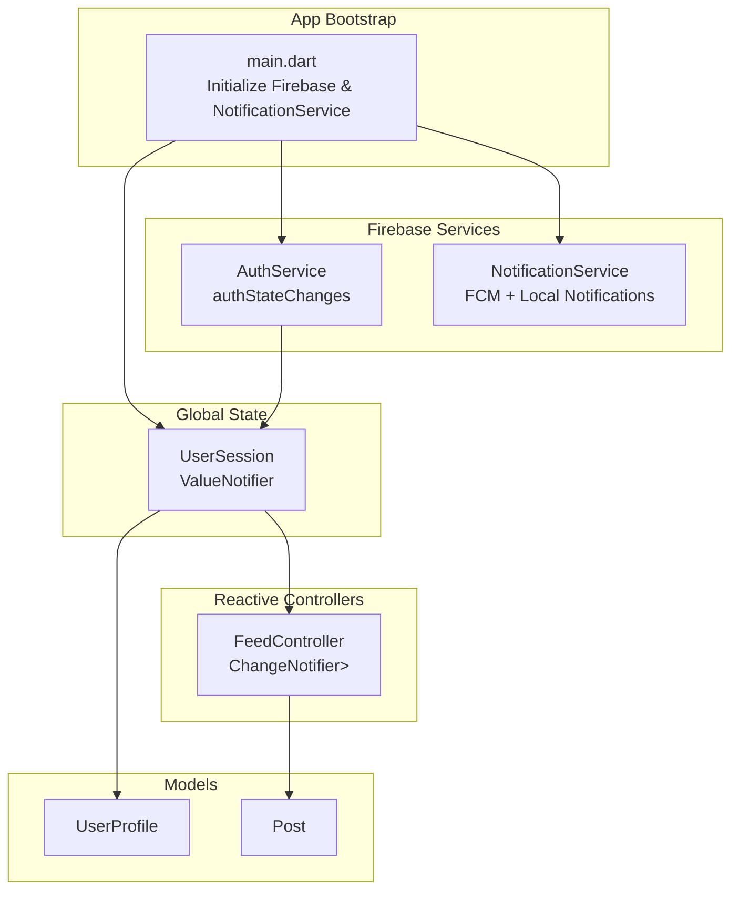
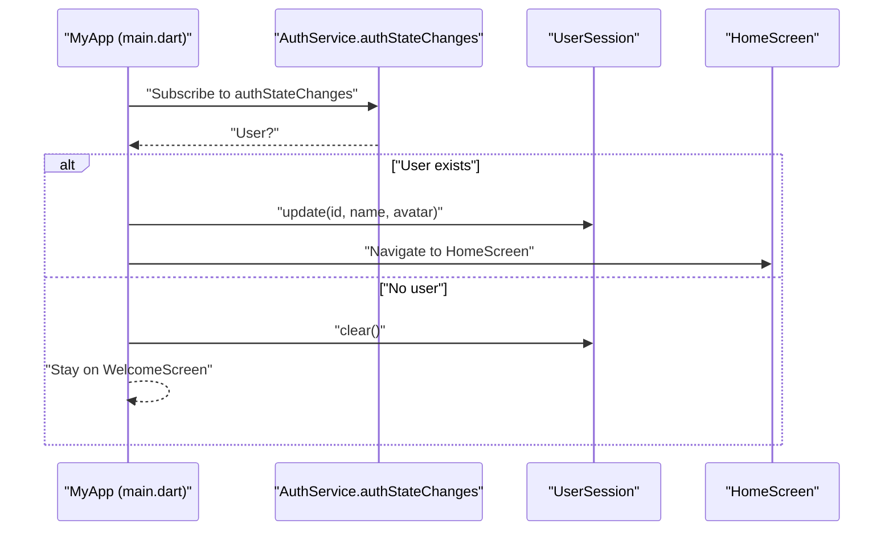
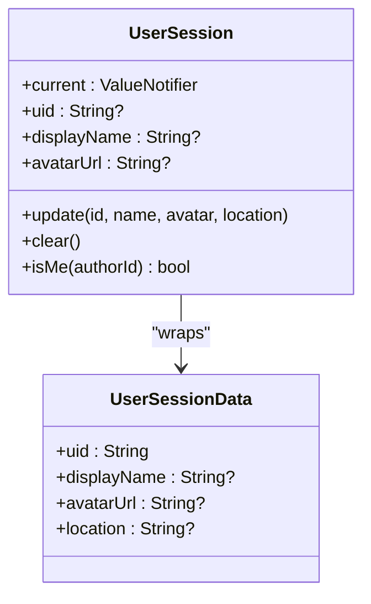
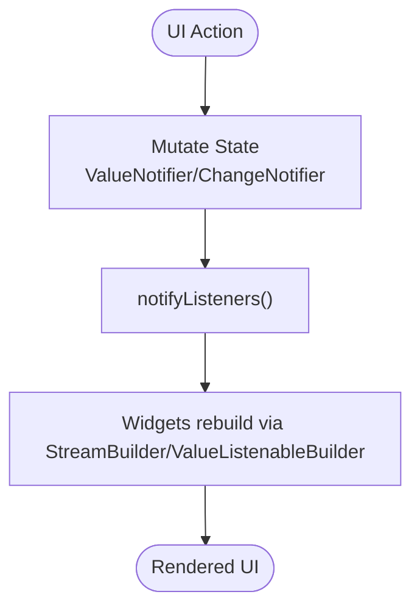
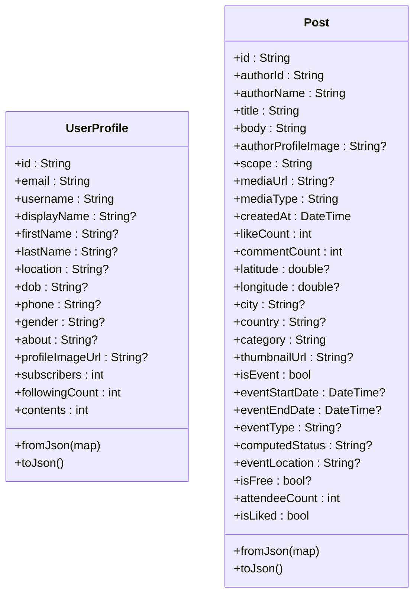
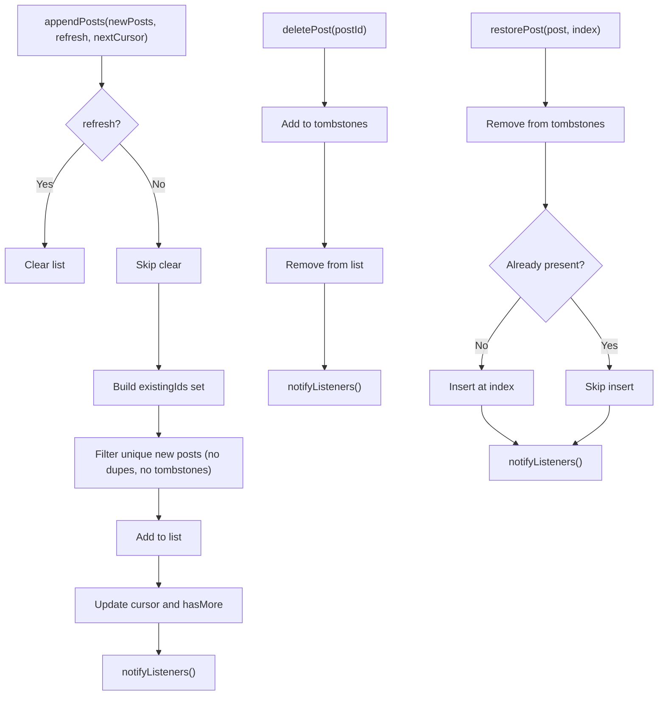
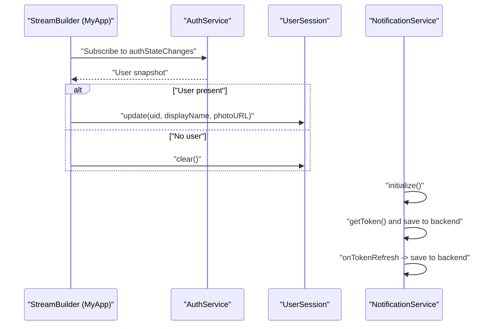
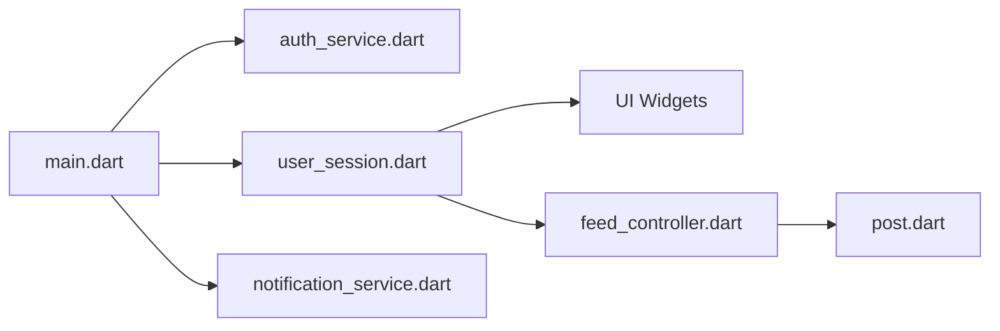

# State Management

<cite>
**Referenced Files in This Document**
- [main.dart](file://testpro-main/lib/main.dart)
- [user_session.dart](file://testpro-main/lib/core/session/user_session.dart)
- [feed_controller.dart](file://testpro-main/lib/core/state/feed_controller.dart)
- [user_profile.dart](file://testpro-main/lib/models/user_profile.dart)
- [post.dart](file://testpro-main/lib/models/post.dart)
- [auth_service.dart](file://testpro-main/lib/services/auth_service.dart)
- [notification_service.dart](file://testpro-main/lib/services/notification_service.dart)
</cite>

## Table of Contents
1. [Introduction](#introduction)
2. [Project Structure](#project-structure)
3. [Core Components](#core-components)
4. [Architecture Overview](#architecture-overview)
5. [Detailed Component Analysis](#detailed-component-analysis)
6. [Dependency Analysis](#dependency-analysis)
7. [Performance Considerations](#performance-considerations)
8. [Troubleshooting Guide](#troubleshooting-guide)
9. [Conclusion](#conclusion)

## Introduction
This document explains the state management architecture used in the Flutter application. It focuses on:
- The UserSession singleton pattern for global user state
- Reactive state updates via ValueNotifier and ChangeNotifier
- Model classes for UserProfile and Post, including properties and JSON mapping
- Integration between local state and Firebase streams
- Best practices for synchronization, memory management, and performance
- Patterns for updating state, managing listeners, and debugging state-related issues

## Project Structure
The state management spans several layers:
- Global user session state in a singleton
- Local reactive controllers for feed lists
- Model classes for domain entities
- Services integrating with Firebase for auth and messaging
- App bootstrap wiring auth state to session initialization

**Diagram sources**
- [main.dart](file://testpro-main/lib/main.dart#L12-L62)
- [user_session.dart](file://testpro-main/lib/core/session/user_session.dart#L12-L49)
- [feed_controller.dart](file://testpro-main/lib/core/state/feed_controller.dart#L6-L80)
- [user_profile.dart](file://testpro-main/lib/models/user_profile.dart#L1-L79)
- [post.dart](file://testpro-main/lib/models/post.dart#L1-L143)
- [auth_service.dart](file://testpro-main/lib/services/auth_service.dart#L5-L24)
- [notification_service.dart](file://testpro-main/lib/services/notification_service.dart#L13-L57)

**Section sources**
- [main.dart](file://testpro-main/lib/main.dart#L12-L62)

## Core Components
- UserSession: Singleton holding current user identity and metadata, exposed via a ValueNotifier for reactive UI updates.
- FeedController: Lightweight reactive controller for managing a mutable list of Post items, pagination state, and optimistic mutations.
- UserProfile and Post: Immutable model classes with fromJson/fromMap and toJson for serialization/deserialization.
- AuthService: Exposes Firebase Authentication streams and actions; used to drive UserSession updates.
- NotificationService: Integrates Firebase Messaging and local notifications; demonstrates reactive patterns for token lifecycle.

**Section sources**
- [user_session.dart](file://testpro-main/lib/core/session/user_session.dart#L12-L49)
- [feed_controller.dart](file://testpro-main/lib/core/state/feed_controller.dart#L6-L80)
- [user_profile.dart](file://testpro-main/lib/models/user_profile.dart#L1-L79)
- [post.dart](file://testpro-main/lib/models/post.dart#L1-L143)
- [auth_service.dart](file://testpro-main/lib/services/auth_service.dart#L5-L24)
- [notification_service.dart](file://testpro-main/lib/services/notification_service.dart#L13-L57)

## Architecture Overview
The app initializes Firebase and NotificationService at startup. The StreamBuilder listens to Firebase Authentication state changes and updates UserSession accordingly. UI widgets reactively rebuild when UserSession or FeedController emit updates.

**Diagram sources**
- [main.dart](file://testpro-main/lib/main.dart#L39-L59)
- [auth_service.dart](file://testpro-main/lib/services/auth_service.dart#L22-L23)
- [user_session.dart](file://testpro-main/lib/core/session/user_session.dart#L22-L43)

## Detailed Component Analysis

### UserSession Singleton Pattern
- Purpose: Centralized, reactive global user state.
- Implementation:
  - Holds a ValueNotifier<UserSessionData?> for change propagation.
  - Provides static update/clear/isMe helpers.
  - Backward-compatible legacy getters for uid/displayName/avatarUrl.
- Reactive usage: Widgets listen to UserSession.current; any update triggers rebuilds.

**Diagram sources**
- [user_session.dart](file://testpro-main/lib/core/session/user_session.dart#L12-L49)

**Section sources**
- [user_session.dart](file://testpro-main/lib/core/session/user_session.dart#L12-L49)
- [main.dart](file://testpro-main/lib/main.dart#L44-L55)

### Reactive State Updates with ValueNotifier and ChangeNotifier
- UserSession.current is a ValueNotifier<UserSessionData?>. Any assignment to current.value triggers listeners to rebuild.
- FeedController extends ChangeNotifier and exposes methods to mutate an internal list of Post and notify listeners.
- Typical patterns:
  - Use setter-like methods (e.g., FeedController.setLoading/setError) to toggle flags and notify.
  - Use appendPosts/deletePost/updatePost to manage list state and notify.

**Diagram sources**
- [user_session.dart](file://testpro-main/lib/core/session/user_session.dart#L13-L13)
- [feed_controller.dart](file://testpro-main/lib/core/state/feed_controller.dart#L63-L71)

**Section sources**
- [user_session.dart](file://testpro-main/lib/core/session/user_session.dart#L13-L13)
- [feed_controller.dart](file://testpro-main/lib/core/state/feed_controller.dart#L6-L80)

### Model Classes: UserProfile and Post
- UserProfile
  - Properties include identifiers, contact info, personal info, and counts.
  - fromJson/fromMap support flexible deserialization from backend payloads.
  - toJson serializes to a normalized map for persistence or network requests.
- Post
  - Rich entity with author info, content, media, geolocation, categories, and event fields.
  - Robust fromJson handles multiple payload shapes and defaults.
  - toJson serializes dates and optional fields consistently.

**Diagram sources**
- [user_profile.dart](file://testpro-main/lib/models/user_profile.dart#L1-L79)
- [post.dart](file://testpro-main/lib/models/post.dart#L1-L143)

**Section sources**
- [user_profile.dart](file://testpro-main/lib/models/user_profile.dart#L1-L79)
- [post.dart](file://testpro-main/lib/models/post.dart#L1-L143)

### FeedController: Reactive Feed State
- Responsibilities:
  - Manage a mutable list of Post with deduplication and tombstone filtering for optimistic deletes.
  - Track pagination state (cursor, hasMore, isLoading, error).
  - Provide methods to append, delete, restore, update, set loading/error, and clear.
- Optimistic deletion:
  - Adds deleted IDs to a tombstone set and removes them from the list immediately.
  - Provides a restore method to rollback if backend mutation fails.

**Diagram sources**
- [feed_controller.dart](file://testpro-main/lib/core/state/feed_controller.dart#L17-L53)

**Section sources**
- [feed_controller.dart](file://testpro-main/lib/core/state/feed_controller.dart#L6-L80)

### Integration Between Local State and Firebase Real-Time Updates
- Auth-driven session:
  - MyApp subscribes to AuthService.authStateChanges and updates UserSession on user presence or absence.
- Notification token lifecycle:
  - NotificationService requests permission, retrieves tokens, saves to backend on initial token and refresh, and shows local notifications.
- Reactive UI:
  - StreamBuilder reacts to authStateChanges to switch screens and initialize/clear session.

**Diagram sources**
- [main.dart](file://testpro-main/lib/main.dart#L39-L59)
- [auth_service.dart](file://testpro-main/lib/services/auth_service.dart#L22-L23)
- [notification_service.dart](file://testpro-main/lib/services/notification_service.dart#L17-L57)

**Section sources**
- [main.dart](file://testpro-main/lib/main.dart#L39-L59)
- [auth_service.dart](file://testpro-main/lib/services/auth_service.dart#L5-L24)
- [notification_service.dart](file://testpro-main/lib/services/notification_service.dart#L13-L57)

## Dependency Analysis
- MyApp depends on AuthService for authStateChanges and on UserSession for global state.
- UserSession is consumed by UI widgets via ValueNotifier subscription.
- FeedController is used by screens displaying feeds; it depends on Post model.
- NotificationService depends on Firebase Messaging and local notifications plugins.

**Diagram sources**
- [main.dart](file://testpro-main/lib/main.dart#L12-L62)
- [auth_service.dart](file://testpro-main/lib/services/auth_service.dart#L5-L24)
- [user_session.dart](file://testpro-main/lib/core/session/user_session.dart#L12-L49)
- [feed_controller.dart](file://testpro-main/lib/core/state/feed_controller.dart#L6-L80)
- [post.dart](file://testpro-main/lib/models/post.dart#L1-L143)
- [notification_service.dart](file://testpro-main/lib/services/notification_service.dart#L13-L57)

**Section sources**
- [main.dart](file://testpro-main/lib/main.dart#L12-L62)
- [user_session.dart](file://testpro-main/lib/core/session/user_session.dart#L12-L49)
- [feed_controller.dart](file://testpro-main/lib/core/state/feed_controller.dart#L6-L80)
- [post.dart](file://testpro-main/lib/models/post.dart#L1-L143)
- [auth_service.dart](file://testpro-main/lib/services/auth_service.dart#L5-L24)
- [notification_service.dart](file://testpro-main/lib/services/notification_service.dart#L13-L57)

## Performance Considerations
- Prefer immutable models (UserProfile, Post) to simplify equality checks and reduce accidental mutations.
- Use FeedController’s deduplication and tombstone filtering to avoid rendering stale or duplicate entries during rapid pagination.
- Minimize rebuild scope by listening to specific ValueNotifier/ChangeNotifier instances rather than global providers.
- Avoid frequent deep copies of large lists; leverage unmodifiable views where appropriate.
- Debounce or throttle UI updates when reacting to high-frequency streams to prevent excessive rebuilds.

## Troubleshooting Guide
- Auth state not updating session:
  - Verify that MyApp’s StreamBuilder receives authStateChanges and calls UserSession.update on user presence.
  - Confirm that UserSession.clear is invoked on sign-out.
- UI not reflecting session changes:
  - Ensure widgets subscribe to UserSession.current and rebuild on value changes.
- Feed not refreshing after delete:
  - Confirm deletePost adds to tombstones and removes from list, then notifyListeners.
  - Use restorePost if backend mutation fails to rollback.
- Notification token not syncing:
  - Check NotificationService.initialize completes successfully and handles onTokenRefresh.
  - Verify BackendService.updateProfile accepts fcmToken and succeeds.

**Section sources**
- [main.dart](file://testpro-main/lib/main.dart#L39-L59)
- [user_session.dart](file://testpro-main/lib/core/session/user_session.dart#L22-L43)
- [feed_controller.dart](file://testpro-main/lib/core/state/feed_controller.dart#L40-L53)
- [notification_service.dart](file://testpro-main/lib/services/notification_service.dart#L17-L57)

## Conclusion
The application employs a pragmatic, lightweight state management approach:
- A singleton UserSession powered by ValueNotifier centralizes global user state.
- FeedController provides reactive, optimistic list management with deduplication and rollback.
- Models encapsulate serialization and normalization for robust data handling.
- Firebase services integrate auth and messaging streams, driving UI updates and token lifecycle.

This design balances simplicity and reactivity while enabling scalable patterns for future enhancements.