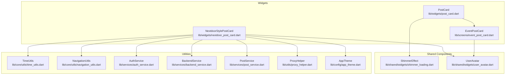
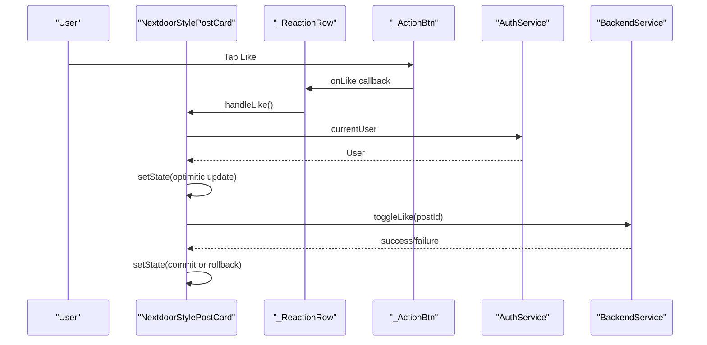
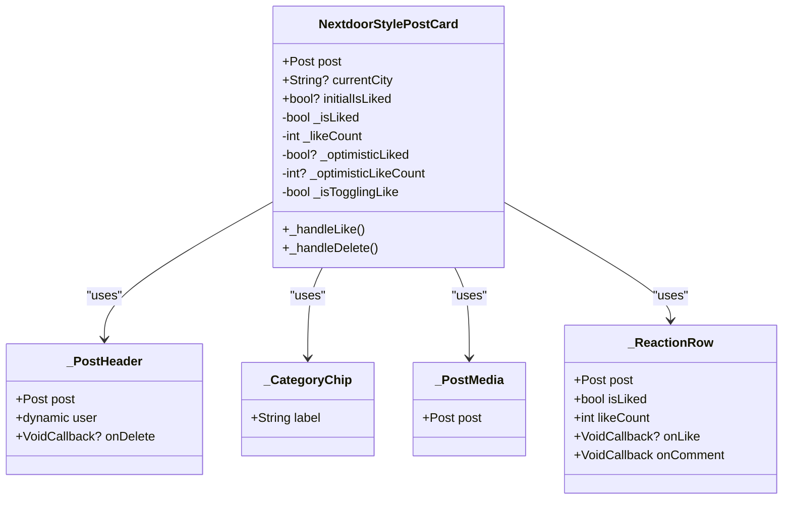
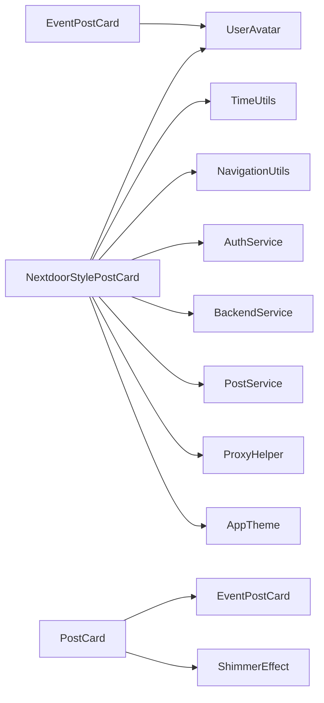

# Custom Widget Components

<cite>
**Referenced Files in This Document**
- [nextdoor_post_card.dart](file://lib/widgets/nextdoor_post_card.dart)
- [post_card.dart](file://lib/widgets/post_card.dart)
- [event_post_card.dart](file://lib/screens/event_post_card.dart)
- [post_action_row_test.dart](file://test_backup/widgets/post/post_action_row_test.dart)
- [REFACTOR_PLAN.md](file://REFACTOR_PLAN.md)
- [home_feed_list.dart](file://lib/widgets/home/home_feed_list.dart)
- [shimmer_loading.dart](file://lib/shared/widgets/shimmer_loading.dart)
- [user_avatar.dart](file://lib/shared/widgets/user_avatar.dart)
- [time_utils.dart](file://lib/core/utils/time_utils.dart)
- [navigation_utils.dart](file://lib/core/utils/navigation_utils.dart)
- [app_theme.dart](file://lib/config/app_theme.dart)
- [auth_service.dart](file://lib/services/auth_service.dart)
- [backend_service.dart](file://lib/services/backend_service.dart)
- [post_service.dart](file://lib/services/post_service.dart)
- [proxy_helper.dart](file://lib/utils/proxy_helper.dart)
- [post_detail_screen.dart](file://lib/screens/post_detail_screen.dart)
- [user_session.dart](file://lib/core/session/user_session.dart)
</cite>

## Table of Contents
1. [Introduction](#introduction)
2. [Project Structure](#project-structure)
3. [Core Components](#core-components)
4. [Architecture Overview](#architecture-overview)
5. [Detailed Component Analysis](#detailed-component-analysis)
6. [Dependency Analysis](#dependency-analysis)
7. [Performance Considerations](#performance-considerations)
8. [Testing Strategies](#testing-strategies)
9. [Accessibility Compliance](#accessibility-compliance)
10. [Troubleshooting Guide](#troubleshooting-guide)
11. [Conclusion](#conclusion)

## Introduction
This document provides comprehensive documentation for custom Flutter widget components used across the application. It focuses on three primary areas:
- PostCard widget implementation and composition patterns
- PostActionRow components and their state management
- Common UI widgets such as CustomButton and CustomTextField

The documentation explains widget interfaces, prop contracts, internal state management, styling approaches, responsive design patterns, testing strategies, performance optimizations, and accessibility compliance. It also highlights duplication concerns and refactoring opportunities identified in the project.

## Project Structure
The custom widgets are organized primarily under lib/widgets and lib/screens, with shared utilities and services supporting widget behavior. Key locations:
- Post cards and related UI: lib/widgets/nextdoor_post_card.dart, lib/widgets/post_card.dart, lib/screens/event_post_card.dart
- Shared widgets and helpers: lib/shared/widgets/, lib/core/utils/, lib/services/, lib/config/
- Tests: test_backup/widgets/post/post_action_row_test.dart
- Feed integration: lib/widgets/home/home_feed_list.dart



**Diagram sources**
- [nextdoor_post_card.dart](file://lib/widgets/nextdoor_post_card.dart#L1-L800)
- [post_card.dart](file://lib/widgets/post_card.dart#L1-L75)
- [event_post_card.dart](file://lib/screens/event_post_card.dart#L1-L52)
- [shimmer_loading.dart](file://lib/shared/widgets/shimmer_loading.dart#L1-L56)
- [user_avatar.dart](file://lib/shared/widgets/user_avatar.dart)
- [time_utils.dart](file://lib/core/utils/time_utils.dart)
- [navigation_utils.dart](file://lib/core/utils/navigation_utils.dart)
- [auth_service.dart](file://lib/services/auth_service.dart)
- [backend_service.dart](file://lib/services/backend_service.dart)
- [post_service.dart](file://lib/services/post_service.dart)
- [proxy_helper.dart](file://lib/utils/proxy_helper.dart)
- [app_theme.dart](file://lib/config/app_theme.dart)

**Section sources**
- [nextdoor_post_card.dart](file://lib/widgets/nextdoor_post_card.dart#L1-L800)
- [post_card.dart](file://lib/widgets/post_card.dart#L1-L75)
- [event_post_card.dart](file://lib/screens/event_post_card.dart#L1-L52)
- [home_feed_list.dart](file://lib/widgets/home/home_feed_list.dart#L215-L245)

## Core Components
This section introduces the primary custom widgets and their roles in the UI.

- NextdoorStylePostCard: A feature-complete post card with header, category chip, content, media, and reaction row. Implements optimistic UI updates for likes and supports event-specific rendering.
- PostCard: A simplified card that delegates to modular subcomponents (PostHeader, PostMediaDisplay, PostActionRow) and conditionally renders EventPostCard for events.
- EventPostCard: A specialized card for events composed of multiple sections (image, details, attendance, footer).
- PostActionRow: A reusable row of action buttons (useful, comments, replies) with optimistic updates and stream-based like state.

Key prop interfaces:
- NextdoorStylePostCard: Post model, optional currentCity, optional initialIsLiked
- PostCard: Post model
- EventPostCard: Post model
- PostActionRow: Post model, currentUserId, isLikedStream, onLikeToggle callback

State management patterns:
- Optimistic UI for likes with rollback on failure
- ValueListenableBuilder for reactive user session updates
- Local state for UI toggles and temporary counts

Styling and responsiveness:
- Consistent typography via AppTheme
- Responsive paddings and spacing
- Conditional rendering based on post.isEvent and post.computedStatus

**Section sources**
- [nextdoor_post_card.dart](file://lib/widgets/nextdoor_post_card.dart#L22-L36)
- [post_card.dart](file://lib/widgets/post_card.dart#L8-L14)
- [event_post_card.dart](file://lib/screens/event_post_card.dart#L8-L15)
- [post_action_row_test.dart](file://test_backup/widgets/post/post_action_row_test.dart#L8-L24)

## Architecture Overview
The widget architecture follows a composition pattern:
- Parent widgets (PostCard, NextdoorStylePostCard, EventPostCard) orchestrate layout and pass props to child components
- Child components encapsulate specific UI concerns (header, media, reactions)
- Services and utilities handle cross-cutting concerns (authentication, network, navigation, theming)



**Diagram sources**
- [nextdoor_post_card.dart](file://lib/widgets/nextdoor_post_card.dart#L54-L94)
- [auth_service.dart](file://lib/services/auth_service.dart)
- [backend_service.dart](file://lib/services/backend_service.dart)

**Section sources**
- [nextdoor_post_card.dart](file://lib/widgets/nextdoor_post_card.dart#L54-L94)

## Detailed Component Analysis

### NextdoorStylePostCard
NextdoorStylePostCard is a StatefulWidget that manages local state for likes and optimistically updates UI during network operations. It composes smaller widgets for header, category chip, content, media, and reactions.

Key implementation patterns:
- Prop interface: Post, optional currentCity, optional initialIsLiked
- Internal state: _isLiked, _likeCount, optimistic toggles, and a flag to prevent concurrent toggles
- Service integrations: AuthService for user context, BackendService for toggling likes, PostService for deletion, NavigationUtils for profile navigation
- Conditional rendering: Category chip, archived badges, event date range, media display, and reaction row
- Styling: AppTheme for typography, consistent spacing, and conditional text styling based on post status



**Diagram sources**
- [nextdoor_post_card.dart](file://lib/widgets/nextdoor_post_card.dart#L22-L36)
- [nextdoor_post_card.dart](file://lib/widgets/nextdoor_post_card.dart#L301-L412)
- [nextdoor_post_card.dart](file://lib/widgets/nextdoor_post_card.dart#L415-L439)
- [nextdoor_post_card.dart](file://lib/widgets/nextdoor_post_card.dart#L444-L505)
- [nextdoor_post_card.dart](file://lib/widgets/nextdoor_post_card.dart#L510-L586)

**Section sources**
- [nextdoor_post_card.dart](file://lib/widgets/nextdoor_post_card.dart#L22-L36)
- [nextdoor_post_card.dart](file://lib/widgets/nextdoor_post_card.dart#L38-L94)
- [nextdoor_post_card.dart](file://lib/widgets/nextdoor_post_card.dart#L134-L296)

### PostCard
PostCard acts as a coordinator that decides whether to render a standard post card or route to EventPostCard for events. It delegates content rendering to modular subcomponents.

Composition pattern:
- Delegates to PostHeader, PostMediaDisplay, and PostActionRow
- Conditionally renders EventPostCard when post.isEvent is true
- Provides consistent margins and shadow via BoxDecoration

**Section sources**
- [post_card.dart](file://lib/widgets/post_card.dart#L8-L75)

### EventPostCard
EventPostCard composes multiple specialized sections to present event details, images, attendance, and footer information. It demonstrates compositional reuse by importing dedicated widgets for each section.

**Section sources**
- [event_post_card.dart](file://lib/screens/event_post_card.dart#L8-L52)

### PostActionRow
PostActionRow displays actionable elements (useful, comments, replies) and supports optimistic updates. Tests demonstrate:
- Rendering of counts and labels
- Optimistic increment on like tap
- Callback invocation after a short delay to simulate network latency

```mermaid
sequenceDiagram
participant T as "WidgetTester"
participant PAR as "PostActionRow"
participant S as "isLikedStream"
participant CB as "onLikeToggle"
T->>PAR : pump widget
PAR->>S : listen to isLikedStream
T->>PAR : tap "Useful"
PAR->>PAR : setState(increment count optimistically)
PAR->>CB : onLikeToggle(id)
CB-->>PAR : future completes
PAR->>S : emit new liked state
S-->>PAR : rebuild with committed state
```

**Diagram sources**
- [post_action_row_test.dart](file://test_backup/widgets/post/post_action_row_test.dart#L51-L83)

**Section sources**
- [post_action_row_test.dart](file://test_backup/widgets/post/post_action_row_test.dart#L8-L85)

### Common UI Widgets: CustomButton and CustomTextField
While explicit CustomButton and CustomTextField implementations are not present in the analyzed files, the project includes reusable patterns that serve similar purposes:

- CustomButton patterns:
  - ElevatedButton with consistent styling and rounded corners
  - Action pills with icons and labels for compact interactions
  - Tile-based options sheets for contextual actions

- CustomTextField patterns:
  - Styled InputDecoration with consistent borders, hints, and content padding
  - Animated text field builders for entrance animations
  - Rich text toolbar components with interactive icons

These patterns enable consistent styling and behavior across the app while maintaining flexibility for customization.

**Section sources**
- [write_article_screen.dart](file://lib/screens/write_article_screen.dart#L233-L258)
- [new_post_screen.dart](file://lib/screens/new_post_screen.dart#L467-L510)
- [new_post_screen.dart](file://lib/screens/new_post_screen.dart#L552-L591)
- [welcome_screen.dart](file://lib/screens/welcome_screen.dart#L1219-L1254)
- [write_article_screen.dart](file://lib/screens/write_article_screen.dart#L295-L316)

## Dependency Analysis
The widgets depend on shared utilities and services for cross-cutting functionality. The following diagram outlines key dependencies:



**Diagram sources**
- [nextdoor_post_card.dart](file://lib/widgets/nextdoor_post_card.dart#L1-L16)
- [post_card.dart](file://lib/widgets/post_card.dart#L1-L7)
- [event_post_card.dart](file://lib/screens/event_post_card.dart#L1-L7)
- [shimmer_loading.dart](file://lib/shared/widgets/shimmer_loading.dart#L1-L56)

**Section sources**
- [nextdoor_post_card.dart](file://lib/widgets/nextdoor_post_card.dart#L1-L16)
- [post_card.dart](file://lib/widgets/post_card.dart#L1-L7)
- [event_post_card.dart](file://lib/screens/event_post_card.dart#L1-L7)
- [shimmer_loading.dart](file://lib/shared/widgets/shimmer_loading.dart#L1-L56)

## Performance Considerations
- Optimistic UI updates: Implemented in NextdoorStylePostCard to reduce perceived latency during like toggles
- Conditional rendering: Avoid unnecessary rebuilds by using if conditions and spread syntax for optional UI elements
- Image caching: ProxyHelper and Image.network with cacheWidth improve media loading performance
- Stateless widgets: Prefer StatelessWidget for static UI parts to reduce rebuild overhead
- ValueListenableBuilder: Efficiently rebuilds only affected subtrees when user session changes
- Avoid heavy work in build: Move computations to initState or callbacks

[No sources needed since this section provides general guidance]

## Testing Strategies
Recommended testing approaches for custom widgets:
- Widget tests: Use WidgetTester to verify rendering, interactions, and state changes
- Stream-based tests: For PostActionRow, test optimistic updates and stream-driven state transitions
- Mock services: Isolate widget logic by mocking AuthService, BackendService, and PostService
- Accessibility tests: Ensure proper semantics and focus order for interactive elements
- Performance tests: Measure frame times and widget rebuild frequency for complex lists

Examples from the repository:
- PostActionRow tests validate optimistic updates and callback invocation timing

**Section sources**
- [post_action_row_test.dart](file://test_backup/widgets/post/post_action_row_test.dart#L8-L85)

## Accessibility Compliance
Ensure custom widgets meet accessibility standards:
- Semantic labels: Provide meaningful text for icons and buttons
- Focus management: Maintain logical tab order and visible focus indicators
- Color contrast: Verify sufficient contrast for text and interactive elements
- Dynamic type: Support font scaling and text resizing
- Screen reader support: Use semantic widgets and provide accessible names/descriptions

[No sources needed since this section provides general guidance]

## Troubleshooting Guide
Common issues and resolutions:
- Like toggle not updating: Verify optimistic state commit/rollback and ensure mounted checks before setState
- Media loading failures: Confirm ProxyHelper URL generation and fallback error handling in Image.network
- Navigation issues: Ensure NavigationUtils is used consistently for profile navigation
- Session state not reflecting: Confirm ValueListenableBuilder is listening to UserSession.current

**Section sources**
- [nextdoor_post_card.dart](file://lib/widgets/nextdoor_post_card.dart#L54-L94)
- [nextdoor_post_card.dart](file://lib/widgets/nextdoor_post_card.dart#L444-L505)
- [navigation_utils.dart](file://lib/core/utils/navigation_utils.dart)
- [user_session.dart](file://lib/core/session/user_session.dart)

## Conclusion
The custom widget components demonstrate strong composition patterns, consistent styling via AppTheme, and robust state management with optimistic UI updates. The PostActionRow test suite illustrates effective strategies for testing asynchronous interactions. The project also identifies significant duplication across post card implementations, which should be addressed through refactoring to shared base components and centralized utilities.

[No sources needed since this section summarizes without analyzing specific files]