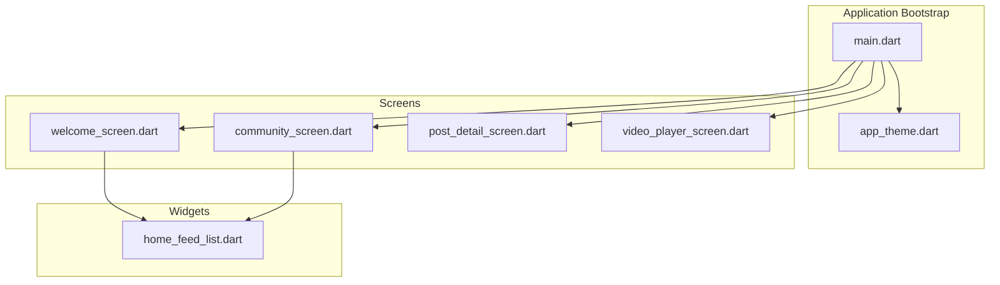
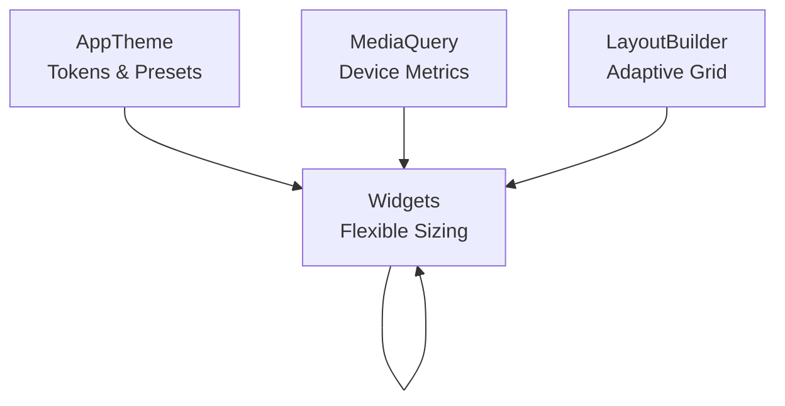
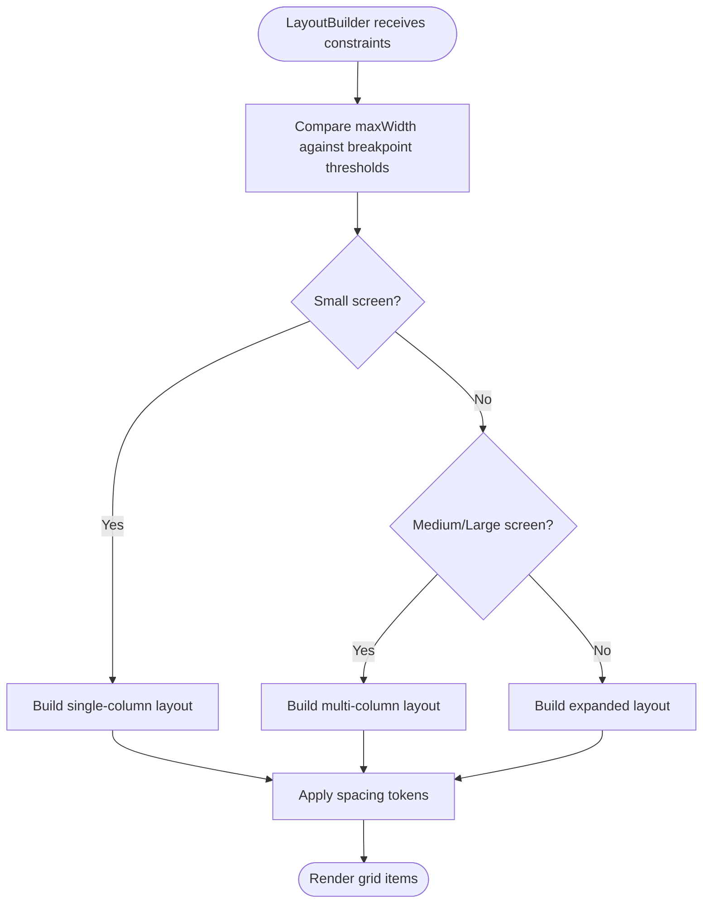
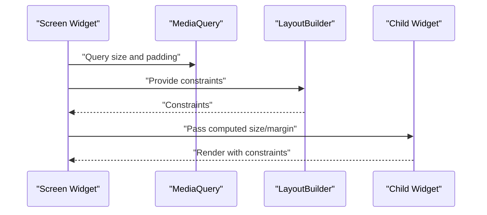
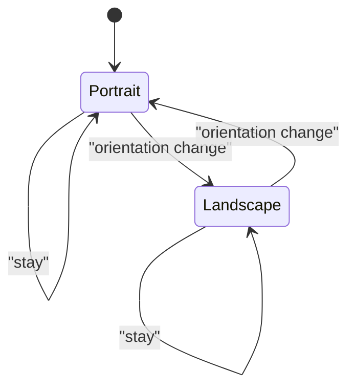
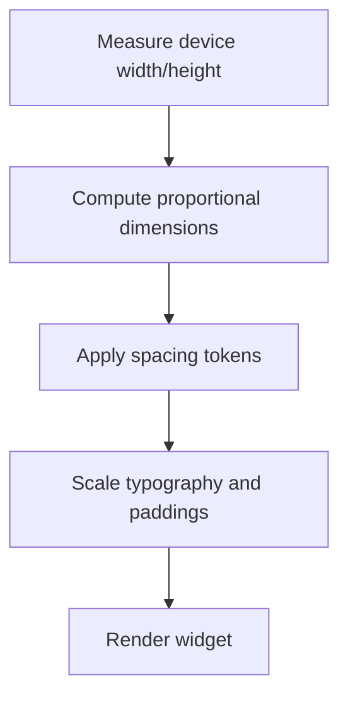
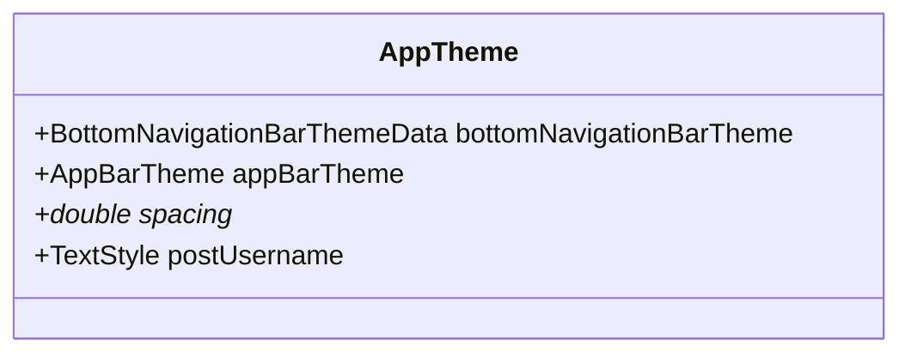
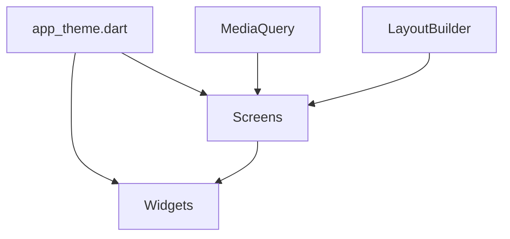

# Responsive Layout and Adaptive Design

<cite>
**Referenced Files in This Document**
- [main.dart](file://testpro-main/lib/main.dart)
- [app_theme.dart](file://testpro-main/lib/config/app_theme.dart)
- [app_colors.dart](file://testpro-main/lib/config/app_colors.dart)
- [app_typography.dart](file://testpro-main/lib/config/app_typography.dart)
- [welcome_screen.dart](file://testpro-main/lib/screens/welcome_screen.dart)
- [community_screen.dart](file://testpro-main/lib/screens/community_screen.dart)
- [post_detail_screen.dart](file://testpro-main/lib/screens/post_detail_screen.dart)
- [home_feed_list.dart](file://testpro-main/lib/widgets/home/home_feed_list.dart)
- [video_player_screen.dart](file://testpro-main/lib/screens/video_player_screen.dart)
- [pubspec.yaml](file://testpro-main/pubspec.yaml)
</cite>

## Table of Contents
1. [Introduction](#introduction)
2. [Project Structure](#project-structure)
3. [Core Components](#core-components)
4. [Architecture Overview](#architecture-overview)
5. [Detailed Component Analysis](#detailed-component-analysis)
6. [Dependency Analysis](#dependency-analysis)
7. [Performance Considerations](#performance-considerations)
8. [Troubleshooting Guide](#troubleshooting-guide)
9. [Conclusion](#conclusion)
10. [Appendices](#appendices)

## Introduction
This document explains how the project implements responsive layout and adaptive design across mobile, tablet, and web platforms. It focuses on the responsive grid system, breakpoint management, constraint-based positioning, and platform-specific UI adaptations. The guide also covers flexible widget sizing, adaptive navigation patterns, touch target optimization, and testing strategies for various screen sizes and orientations.

## Project Structure
The Flutter application organizes responsive UI concerns primarily in:
- Application bootstrap and theme configuration
- Screen-level layouts using MediaQuery and LayoutBuilder
- Widget-level adaptive sizing and positioning
- Platform-specific assets and configuration

**Diagram sources**
- [main.dart](file://testpro-main/lib/main.dart#L1-L63)
- [app_theme.dart](file://testpro-main/lib/config/app_theme.dart#L1-L308)
- [welcome_screen.dart](file://testpro-main/lib/screens/welcome_screen.dart)
- [community_screen.dart](file://testpro-main/lib/screens/community_screen.dart)
- [post_detail_screen.dart](file://testpro-main/lib/screens/post_detail_screen.dart)
- [home_feed_list.dart](file://testpro-main/lib/widgets/home/home_feed_list.dart)
- [video_player_screen.dart](file://testpro-main/lib/screens/video_player_screen.dart)

**Section sources**
- [main.dart](file://testpro-main/lib/main.dart#L1-L63)
- [pubspec.yaml](file://testpro-main/pubspec.yaml#L1-L61)

## Core Components
- Theme and Design System: Centralized color tokens, typography, spacing, and component themes enable consistent responsive behavior across breakpoints.
- Screen-level Layouts: Screens use MediaQuery for dynamic sizing and LayoutBuilder for adaptive grids.
- Widget-level Responsiveness: Individual widgets compute sizes and positions based on context metrics.
- Platform Adaptations: Orientation handling and platform-specific assets support cross-platform experiences.

Key implementation references:
- Theme and spacing tokens: [app_theme.dart](file://testpro-main/lib/config/app_theme.dart#L84-L104)
- Typography presets: [app_theme.dart](file://testpro-main/lib/config/app_theme.dart#L62-L83)
- Media queries and constraints: [welcome_screen.dart](file://testpro-main/lib/screens/welcome_screen.dart), [community_screen.dart](file://testpro-main/lib/screens/community_screen.dart), [post_detail_screen.dart](file://testpro-main/lib/screens/post_detail_screen.dart), [home_feed_list.dart](file://testpro-main/lib/widgets/home/home_feed_list.dart), [video_player_screen.dart](file://testpro-main/lib/screens/video_player_screen.dart)

**Section sources**
- [app_theme.dart](file://testpro-main/lib/config/app_theme.dart#L84-L104)
- [app_theme.dart](file://testpro-main/lib/config/app_theme.dart#L62-L83)
- [welcome_screen.dart](file://testpro-main/lib/screens/welcome_screen.dart)
- [community_screen.dart](file://testpro-main/lib/screens/community_screen.dart)
- [post_detail_screen.dart](file://testpro-main/lib/screens/post_detail_screen.dart)
- [home_feed_list.dart](file://testpro-main/lib/widgets/home/home_feed_list.dart)
- [video_player_screen.dart](file://testpro-main/lib/screens/video_player_screen.dart)

## Architecture Overview
The responsive architecture centers on:
- Global theme and spacing tokens for consistent scaling
- Screen-level constraints via MediaQuery and LayoutBuilder
- Widget-level sizing computed from context metrics
- Platform-specific adaptations for orientation and assets

**Diagram sources**
- [app_theme.dart](file://testpro-main/lib/config/app_theme.dart#L84-L104)
- [welcome_screen.dart](file://testpro-main/lib/screens/welcome_screen.dart)
- [community_screen.dart](file://testpro-main/lib/screens/community_screen.dart)
- [post_detail_screen.dart](file://testpro-main/lib/screens/post_detail_screen.dart)
- [home_feed_list.dart](file://testpro-main/lib/widgets/home/home_feed_list.dart)

## Detailed Component Analysis

### Responsive Grid System and Breakpoint Management
- Adaptive grid construction using LayoutBuilder to switch column counts and spacing thresholds.
- Breakpoint thresholds derived from device width ranges to optimize content density and readability.
- Consistent spacing tokens ensure proportional scaling across breakpoints.

Implementation references:
- Adaptive grid pattern: [community_screen.dart](file://testpro-main/lib/screens/community_screen.dart)
- Spacing tokens: [app_theme.dart](file://testpro-main/lib/config/app_theme.dart#L84-L93)

**Diagram sources**
- [community_screen.dart](file://testpro-main/lib/screens/community_screen.dart)
- [app_theme.dart](file://testpro-main/lib/config/app_theme.dart#L84-L93)

**Section sources**
- [community_screen.dart](file://testpro-main/lib/screens/community_screen.dart)
- [app_theme.dart](file://testpro-main/lib/config/app_theme.dart#L84-L93)

### Constraint-Based Positioning
- Widgets compute sizes and positions using MediaQuery for absolute measurements and LayoutBuilder for relative constraints.
- Constraint-aware padding and margins adapt to safe areas and platform-specific insets.

Implementation references:
- Absolute sizing with MediaQuery: [welcome_screen.dart](file://testpro-main/lib/screens/welcome_screen.dart), [post_detail_screen.dart](file://testpro-main/lib/screens/post_detail_screen.dart), [home_feed_list.dart](file://testpro-main/lib/widgets/home/home_feed_list.dart)
- Constraint-based layout: [community_screen.dart](file://testpro-main/lib/screens/community_screen.dart)

**Diagram sources**
- [welcome_screen.dart](file://testpro-main/lib/screens/welcome_screen.dart)
- [community_screen.dart](file://testpro-main/lib/screens/community_screen.dart)
- [post_detail_screen.dart](file://testpro-main/lib/screens/post_detail_screen.dart)
- [home_feed_list.dart](file://testpro-main/lib/widgets/home/home_feed_list.dart)

**Section sources**
- [welcome_screen.dart](file://testpro-main/lib/screens/welcome_screen.dart)
- [community_screen.dart](file://testpro-main/lib/screens/community_screen.dart)
- [post_detail_screen.dart](file://testpro-main/lib/screens/post_detail_screen.dart)
- [home_feed_list.dart](file://testpro-main/lib/widgets/home/home_feed_list.dart)

### Cross-Platform Layout Adaptation
- Orientation handling ensures layouts remain usable during rotation.
- Platform-specific assets and UI affordances maintain consistent UX across devices.

Implementation references:
- Orientation reset behavior: [video_player_screen.dart](file://testpro-main/lib/screens/video_player_screen.dart)
- Platform assets and fonts: [pubspec.yaml](file://testpro-main/pubspec.yaml#L50-L61)

**Diagram sources**
- [video_player_screen.dart](file://testpro-main/lib/screens/video_player_screen.dart)

**Section sources**
- [video_player_screen.dart](file://testpro-main/lib/screens/video_player_screen.dart)
- [pubspec.yaml](file://testpro-main/pubspec.yaml#L50-L61)

### Flexible Widget Sizing
- Widgets scale proportionally using MediaQuery-derived metrics and theme-defined spacing tokens.
- Typography scales consistently with text themes and font weights.

Implementation references:
- Proportional sizing: [welcome_screen.dart](file://testpro-main/lib/screens/welcome_screen.dart), [home_feed_list.dart](file://testpro-main/lib/widgets/home/home_feed_list.dart)
- Typography presets: [app_theme.dart](file://testpro-main/lib/config/app_theme.dart#L62-L83)

**Diagram sources**
- [welcome_screen.dart](file://testpro-main/lib/screens/welcome_screen.dart)
- [home_feed_list.dart](file://testpro-main/lib/widgets/home/home_feed_list.dart)
- [app_theme.dart](file://testpro-main/lib/config/app_theme.dart#L84-L93)

**Section sources**
- [welcome_screen.dart](file://testpro-main/lib/screens/welcome_screen.dart)
- [home_feed_list.dart](file://testpro-main/lib/widgets/home/home_feed_list.dart)
- [app_theme.dart](file://testpro-main/lib/config/app_theme.dart#L84-L93)

### Adaptive Navigation Patterns
- Bottom navigation adapts labels and selection indicators based on available space.
- App bar themes and elevation settings remain consistent across breakpoints.

Implementation references:
- Bottom navigation theme: [app_theme.dart](file://testpro-main/lib/config/app_theme.dart#L162-L171)
- App bar theme: [app_theme.dart](file://testpro-main/lib/config/app_theme.dart#L147-L160)

**Diagram sources**
- [app_theme.dart](file://testpro-main/lib/config/app_theme.dart#L162-L171)
- [app_theme.dart](file://testpro-main/lib/config/app_theme.dart#L147-L160)

**Section sources**
- [app_theme.dart](file://testpro-main/lib/config/app_theme.dart#L162-L171)
- [app_theme.dart](file://testpro-main/lib/config/app_theme.dart#L147-L160)

### Touch Target Optimization
- Button and input sizes adhere to theme-defined minimums for accessibility.
- Spacing tokens ensure adequate touch targets across screen densities.

Implementation references:
- Button themes and paddings: [app_theme.dart](file://testpro-main/lib/config/app_theme.dart#L231-L258)
- Spacing tokens: [app_theme.dart](file://testpro-main/lib/config/app_theme.dart#L84-L93)

**Section sources**
- [app_theme.dart](file://testpro-main/lib/config/app_theme.dart#L231-L258)
- [app_theme.dart](file://testpro-main/lib/config/app_theme.dart#L84-L93)

## Dependency Analysis
Responsive layout depends on:
- Theme tokens for consistent spacing and typography
- MediaQuery for runtime device metrics
- LayoutBuilder for adaptive grid construction
- Platform assets for visual fidelity

**Diagram sources**
- [app_theme.dart](file://testpro-main/lib/config/app_theme.dart#L84-L104)
- [welcome_screen.dart](file://testpro-main/lib/screens/welcome_screen.dart)
- [community_screen.dart](file://testpro-main/lib/screens/community_screen.dart)
- [post_detail_screen.dart](file://testpro-main/lib/screens/post_detail_screen.dart)
- [home_feed_list.dart](file://testpro-main/lib/widgets/home/home_feed_list.dart)

**Section sources**
- [app_theme.dart](file://testpro-main/lib/config/app_theme.dart#L84-L104)
- [welcome_screen.dart](file://testpro-main/lib/screens/welcome_screen.dart)
- [community_screen.dart](file://testpro-main/lib/screens/community_screen.dart)
- [post_detail_screen.dart](file://testpro-main/lib/screens/post_detail_screen.dart)
- [home_feed_list.dart](file://testpro-main/lib/widgets/home/home_feed_list.dart)

## Performance Considerations
- Prefer LayoutBuilder for adaptive grids to avoid unnecessary rebuilds.
- Use theme tokens for spacing and typography to minimize per-widget calculations.
- Cache MediaQuery results when repeatedly accessed within a single build pass.
- Keep widget trees shallow in adaptive layouts to reduce layout cost.

## Troubleshooting Guide
Common issues and resolutions:
- Inconsistent spacing across breakpoints: Verify theme spacing tokens and ensure widgets apply them uniformly.
- Overlapping content on small screens: Confirm LayoutBuilder thresholds and adjust column counts accordingly.
- Poor touch target visibility: Ensure button and input paddings meet theme minimums.
- Orientation-related layout glitches: Add orientation-aware resets and recompute constraints after rotation.

References:
- Spacing tokens: [app_theme.dart](file://testpro-main/lib/config/app_theme.dart#L84-L93)
- Deprecated color/typography modules: [app_colors.dart](file://testpro-main/lib/config/app_colors.dart#L3-L4), [app_typography.dart](file://testpro-main/lib/config/app_typography.dart#L3-L4)

**Section sources**
- [app_theme.dart](file://testpro-main/lib/config/app_theme.dart#L84-L93)
- [app_colors.dart](file://testpro-main/lib/config/app_colors.dart#L3-L4)
- [app_typography.dart](file://testpro-main/lib/config/app_typography.dart#L3-L4)

## Conclusion
The project achieves responsive and adaptive design through a combination of centralized theme tokens, constraint-based layout construction, and platform-aware adaptations. By leveraging MediaQuery, LayoutBuilder, and theme-presets, the UI remains flexible, accessible, and visually consistent across devices and orientations.

## Appendices
- Testing strategies for responsiveness:
  - Emulator/device testing across common breakpoints (small phone, large phone, tablet).
  - Orientation testing (portrait and landscape) for each breakpoint.
  - Accessibility checks for touch target sizes and contrast ratios.
  - Automated UI tests using widget testing to assert layout correctness under different constraints.