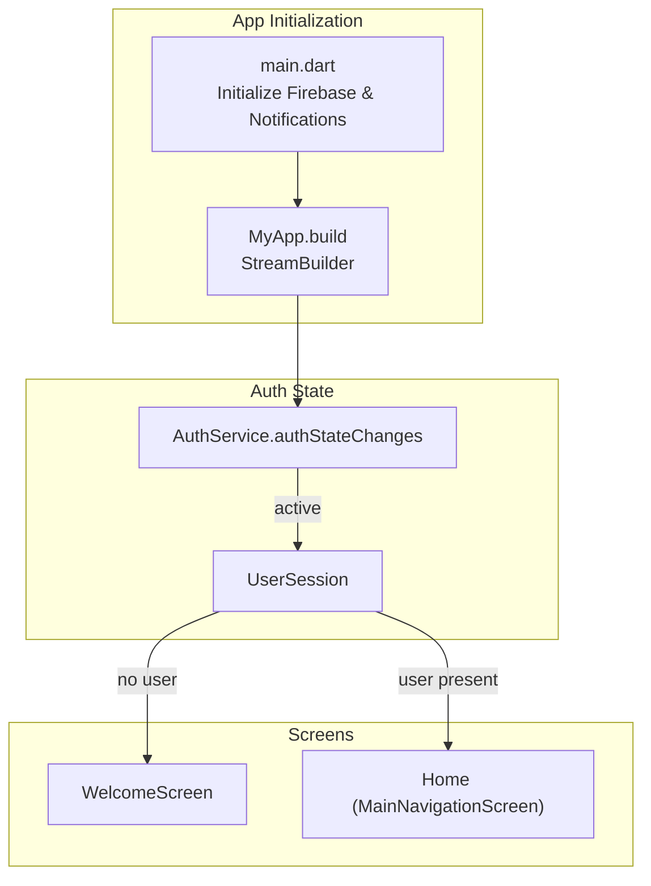
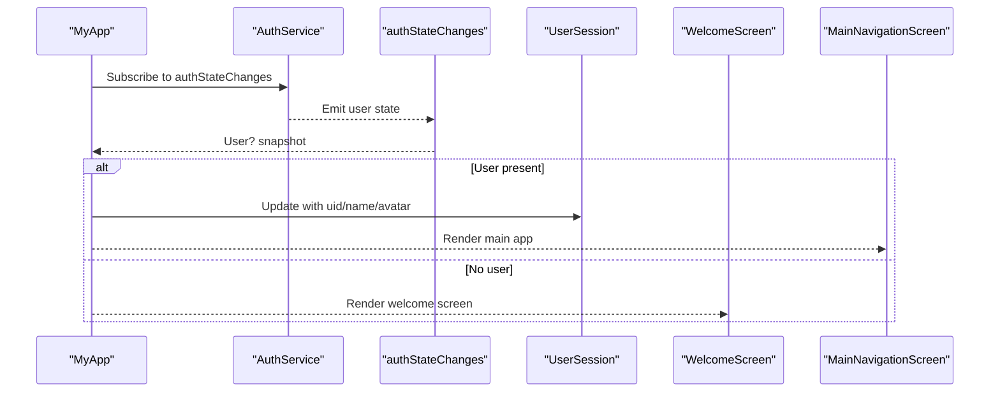
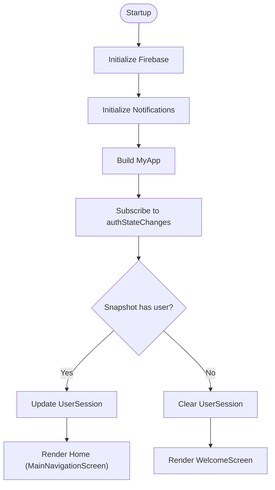
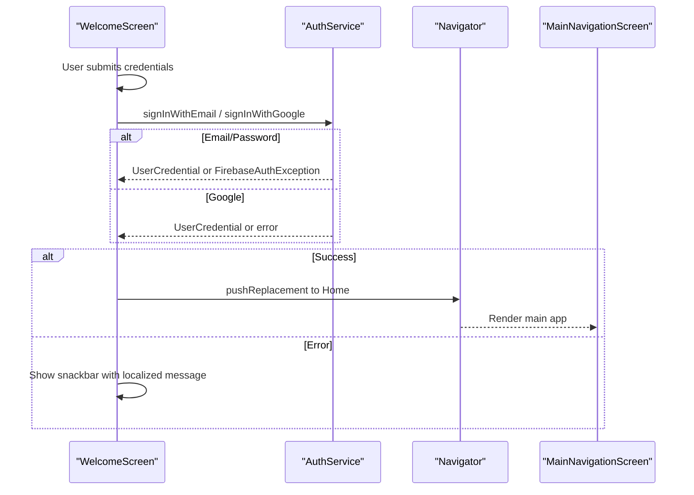
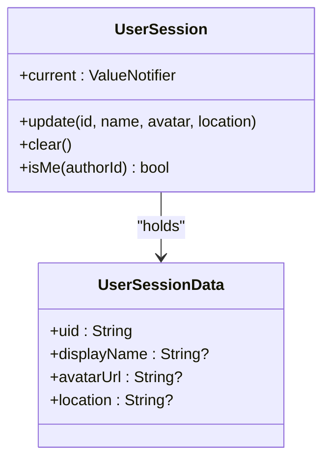
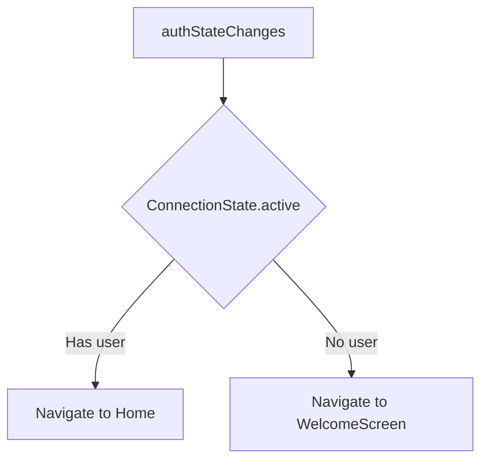
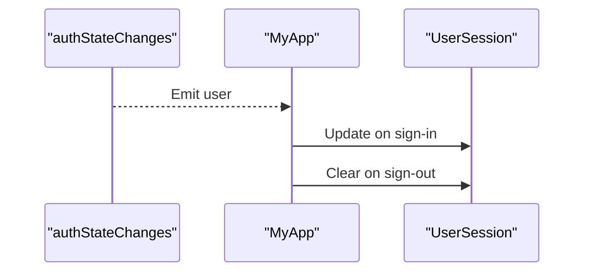
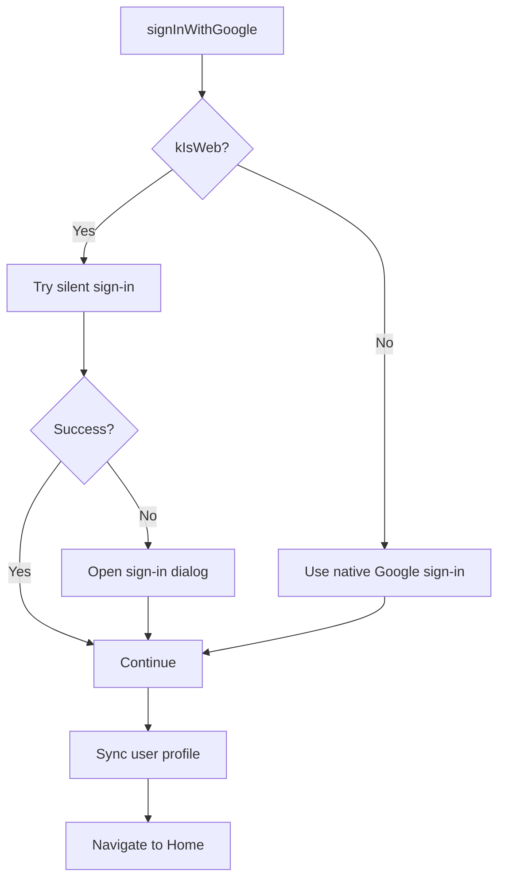
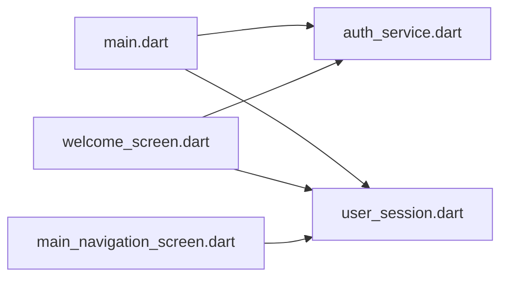

# Screen Architecture and Navigation

<cite>
**Referenced Files in This Document**
- [main.dart](file://testpro-main/lib/main.dart)
- [user_session.dart](file://testpro-main/lib/core/session/user_session.dart)
- [auth_service.dart](file://testpro-main/lib/services/auth_service.dart)
- [welcome_screen.dart](file://testpro-main/lib/screens/welcome_screen.dart)
- [main_navigation_screen.dart](file://testpro-main/lib/screens/main_navigation_screen.dart)
</cite>

## Table of Contents
1. [Introduction](#introduction)
2. [Project Structure](#project-structure)
3. [Core Components](#core-components)
4. [Architecture Overview](#architecture-overview)
5. [Detailed Component Analysis](#detailed-component-analysis)
6. [Dependency Analysis](#dependency-analysis)
7. [Performance Considerations](#performance-considerations)
8. [Troubleshooting Guide](#troubleshooting-guide)
9. [Conclusion](#conclusion)

## Introduction
This document explains the Flutter screen architecture and navigation system of the application. It covers the main entry point, routing configuration, screen hierarchy, and session-based navigation flow. It also documents the WelcomeScreen implementation, the main navigation container, and how authentication state drives navigation. The focus is on practical understanding for developers and product stakeholders, highlighting navigation patterns, route guards via reactive streams, state management integration, and platform-specific behaviors.

## Project Structure
The navigation and screen architecture centers around:
- Application entry point initializes Firebase and notification services, then renders either the WelcomeScreen or HomeScreen based on authentication state.
- Authentication state is observed reactively via a stream, enabling immediate navigation changes when the user signs in or out.
- The main navigation container hosts tabbed screens and a central create action.



**Diagram sources**
- [main.dart](file://testpro-main/lib/main.dart#L12-L62)
- [auth_service.dart](file://testpro-main/lib/services/auth_service.dart#L22-L24)
- [user_session.dart](file://testpro-main/lib/core/session/user_session.dart#L12-L49)

**Section sources**
- [main.dart](file://testpro-main/lib/main.dart#L12-L62)

## Core Components
- Application entry point and theme configuration.
- Reactive authentication state management.
- Session caching for user identity.
- Welcome screen with authentication flows.
- Main navigation container with bottom navigation and a central create action.

Key responsibilities:
- main.dart: Initializes Firebase and notifications, sets Material theme, and renders the root screen based on auth state.
- AuthService: Provides authentication operations and exposes a stream of auth state changes.
- UserSession: Caches current user data and clears it on sign-out.
- WelcomeScreen: Handles email/password and Google sign-in flows and navigates to the main app after successful authentication.
- MainNavigationScreen: Hosts tabbed screens and a central create action.

**Section sources**
- [main.dart](file://testpro-main/lib/main.dart#L12-L62)
- [auth_service.dart](file://testpro-main/lib/services/auth_service.dart#L5-L24)
- [user_session.dart](file://testpro-main/lib/core/session/user_session.dart#L12-L49)
- [welcome_screen.dart](file://testpro-main/lib/screens/welcome_screen.dart#L197-L279)
- [main_navigation_screen.dart](file://testpro-main/lib/screens/main_navigation_screen.dart#L19-L78)

## Architecture Overview
The navigation architecture is reactive and driven by Firebase Authentication:
- On startup, the app initializes Firebase and notification services.
- The root widget observes AuthService.authStateChanges.
- When a user is detected, the app updates UserSession and renders the main navigation container.
- When no user is detected, the app renders the WelcomeScreen.
- WelcomeScreen triggers navigation to the main app after successful authentication.



**Diagram sources**
- [main.dart](file://testpro-main/lib/main.dart#L39-L59)
- [auth_service.dart](file://testpro-main/lib/services/auth_service.dart#L22-L24)
- [user_session.dart](file://testpro-main/lib/core/session/user_session.dart#L22-L43)
- [welcome_screen.dart](file://testpro-main/lib/screens/welcome_screen.dart#L197-L279)
- [main_navigation_screen.dart](file://testpro-main/lib/screens/main_navigation_screen.dart#L19-L78)

## Detailed Component Analysis

### Application Entry Point and Routing Configuration
- Initializes Firebase and notification services.
- Sets up Material theme and debug banner.
- Uses a StreamBuilder over AuthService.authStateChanges to decide the root screen.
- On sign-in, updates UserSession with uid, display name, and avatar.
- On sign-out, clears UserSession.



**Diagram sources**
- [main.dart](file://testpro-main/lib/main.dart#L12-L62)
- [auth_service.dart](file://testpro-main/lib/services/auth_service.dart#L22-L24)
- [user_session.dart](file://testpro-main/lib/core/session/user_session.dart#L22-L43)

**Section sources**
- [main.dart](file://testpro-main/lib/main.dart#L12-L62)

### WelcomeScreen Implementation
- Initializes location and animations in initState.
- Provides email/password sign-in and Google sign-in flows.
- On successful sign-in, navigates to the main app with a custom transition.
- Displays localized error messages for common Firebase Auth exceptions.
- Uses a floating snackbar for feedback.



**Diagram sources**
- [welcome_screen.dart](file://testpro-main/lib/screens/welcome_screen.dart#L197-L279)
- [auth_service.dart](file://testpro-main/lib/services/auth_service.dart#L26-L53)
- [auth_service.dart](file://testpro-main/lib/services/auth_service.dart#L56-L103)

**Section sources**
- [welcome_screen.dart](file://testpro-main/lib/screens/welcome_screen.dart#L197-L279)

### Main Navigation Container
- Bottom navigation with indexed tabs.
- Central create action opens a modal NewPostScreen.
- Maintains IndexedStack for efficient rendering of visible tabs.
- On app start, detects location and synchronizes backend tokens.

```mermaid
flowchart TD
Start(["MainNavigationScreen"]) --> Init["Init: Detect location<br/>Sync backend tokens"]
Init --> Tabs["IndexedStack with tabs"]
Tabs --> Tap{"Tab tapped?"}
Tap --> |Create (index 2)| OpenModal["Navigator.push(NewPostScreen)"]
Tap --> |Other tabs| SwitchTab["Set currentIndex"]
SwitchTab --> Render["Render selected tab"]
OpenModal --> Render
```

**Diagram sources**
- [main_navigation_screen.dart](file://testpro-main/lib/screens/main_navigation_screen.dart#L23-L43)
- [main_navigation_screen.dart](file://testpro-main/lib/screens/main_navigation_screen.dart#L45-L78)

**Section sources**
- [main_navigation_screen.dart](file://testpro-main/lib/screens/main_navigation_screen.dart#L19-L78)

### Session-Based Navigation Flow
- UserSession caches uid, display name, and avatar.
- On sign-in, update is called to populate cache.
- On sign-out, clear is called to reset cache.
- The StreamBuilder in MyApp reacts to authStateChanges and switches screens accordingly.



**Diagram sources**
- [user_session.dart](file://testpro-main/lib/core/session/user_session.dart#L12-L49)

**Section sources**
- [user_session.dart](file://testpro-main/lib/core/session/user_session.dart#L12-L49)
- [main.dart](file://testpro-main/lib/main.dart#L44-L56)

### Route Guards and Conditional Navigation
- Route guard behavior is implemented via a StreamBuilder observing AuthService.authStateChanges.
- When the stream emits a user, navigation proceeds to the main app.
- When the stream emits no user, navigation remains on the WelcomeScreen.
- This pattern replaces traditional route guards with reactive UI updates.



**Diagram sources**
- [main.dart](file://testpro-main/lib/main.dart#L39-L59)
- [auth_service.dart](file://testpro-main/lib/services/auth_service.dart#L22-L24)

**Section sources**
- [main.dart](file://testpro-main/lib/main.dart#L39-L59)
- [auth_service.dart](file://testpro-main/lib/services/auth_service.dart#L22-L24)

### State Management Integration
- UserSession uses ValueNotifier to expose reactive user data.
- MyApp listens to authStateChanges and updates UserSession accordingly.
- This creates a clean separation between authentication state and UI rendering.



**Diagram sources**
- [main.dart](file://testpro-main/lib/main.dart#L39-L59)
- [user_session.dart](file://testpro-main/lib/core/session/user_session.dart#L22-L43)

**Section sources**
- [main.dart](file://testpro-main/lib/main.dart#L39-L59)
- [user_session.dart](file://testpro-main/lib/core/session/user_session.dart#L22-L43)

### Platform-Specific Navigation Behaviors
- Google sign-in adapts to web and mobile environments:
  - Web attempts silent sign-in, falls back to interactive sign-in, and handles cancellation gracefully.
  - Mobile uses standard Google sign-in flow.
- These platform differences are encapsulated within AuthService.signInWithGoogle.



**Diagram sources**
- [auth_service.dart](file://testpro-main/lib/services/auth_service.dart#L56-L103)

**Section sources**
- [auth_service.dart](file://testpro-main/lib/services/auth_service.dart#L56-L103)

### Examples of Screen Transitions
- WelcomeScreen to Home:
  - Uses pushReplacement with a custom transition combining fade and scale.
  - Triggered after successful authentication.
- MainNavigationScreen create action:
  - Uses push to open NewPostScreen modally.

**Section sources**
- [welcome_screen.dart](file://testpro-main/lib/screens/welcome_screen.dart#L212-L228)
- [main_navigation_screen.dart](file://testpro-main/lib/screens/main_navigation_screen.dart#L34-L41)

### Deep Linking Implementation
- No explicit deep linking handlers are present in the analyzed files.
- Consider adding a deep link handler in main.dart to parse incoming links and navigate to appropriate screens.

[No sources needed since this section provides general guidance]

## Dependency Analysis
- main.dart depends on AuthService for auth state and UserSession for caching.
- WelcomeScreen depends on AuthService for authentication and UserService for profile synchronization.
- MainNavigationScreen depends on location and backend services for initial setup.



**Diagram sources**
- [main.dart](file://testpro-main/lib/main.dart#L1-L11)
- [auth_service.dart](file://testpro-main/lib/services/auth_service.dart#L1-L10)
- [user_session.dart](file://testpro-main/lib/core/session/user_session.dart#L1-L10)
- [welcome_screen.dart](file://testpro-main/lib/screens/welcome_screen.dart#L1-L10)
- [main_navigation_screen.dart](file://testpro-main/lib/screens/main_navigation_screen.dart#L1-L10)

**Section sources**
- [main.dart](file://testpro-main/lib/main.dart#L1-L11)
- [auth_service.dart](file://testpro-main/lib/services/auth_service.dart#L1-L10)
- [user_session.dart](file://testpro-main/lib/core/session/user_session.dart#L1-L10)
- [welcome_screen.dart](file://testpro-main/lib/screens/welcome_screen.dart#L1-L10)
- [main_navigation_screen.dart](file://testpro-main/lib/screens/main_navigation_screen.dart#L1-L10)

## Performance Considerations
- Using StreamBuilder to drive navigation avoids unnecessary rebuilds by reacting only to auth state changes.
- IndexedStack in MainNavigationScreen keeps inactive tabs mounted, reducing repeated initialization costs.
- Animations in WelcomeScreen are pre-initialized in initState to avoid jank during first render.

[No sources needed since this section provides general guidance]

## Troubleshooting Guide
- Authentication state does not update:
  - Verify that Firebase is initialized and authStateChanges is subscribed.
  - Confirm that UserSession.update is called on sign-in and UserSession.clear is called on sign-out.
- Navigation does not occur after sign-in:
  - Ensure Navigator.pushReplacement is used in WelcomeScreen after successful authentication.
  - Confirm that the app is still mounted when updating state.
- Google sign-in fails on web:
  - Check for expected cancellation errors and handle gracefully.
  - Ensure client ID is configured for web builds.

**Section sources**
- [main.dart](file://testpro-main/lib/main.dart#L39-L59)
- [welcome_screen.dart](file://testpro-main/lib/screens/welcome_screen.dart#L253-L279)
- [auth_service.dart](file://testpro-main/lib/services/auth_service.dart#L56-L103)

## Conclusion
The application employs a reactive navigation architecture centered on Firebase Authentication. The root widget observes auth state and conditionally renders either the WelcomeScreen or the main app. UserSession caches user identity for downstream components. The main navigation container organizes primary screens with a central create action. Platform-specific behaviors are handled within AuthService, ensuring a consistent user experience across platforms. This design cleanly separates concerns and enables scalable navigation patterns.