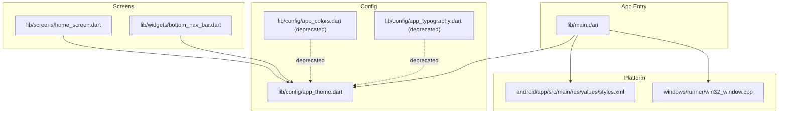
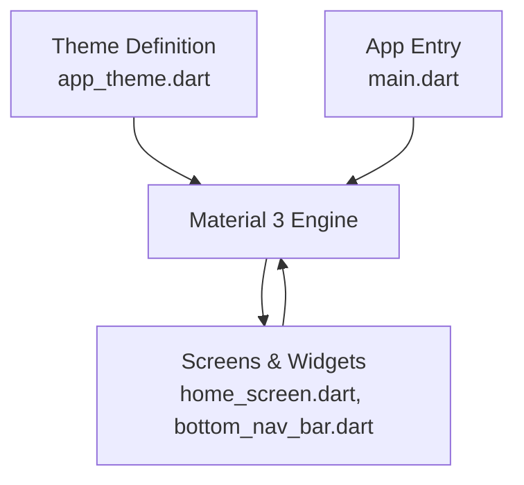
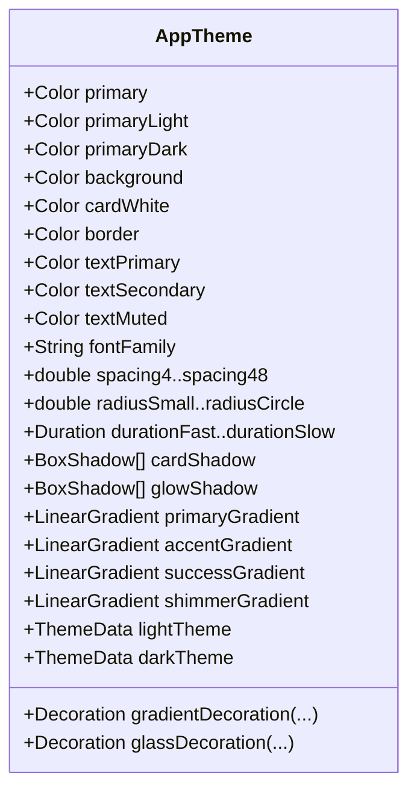
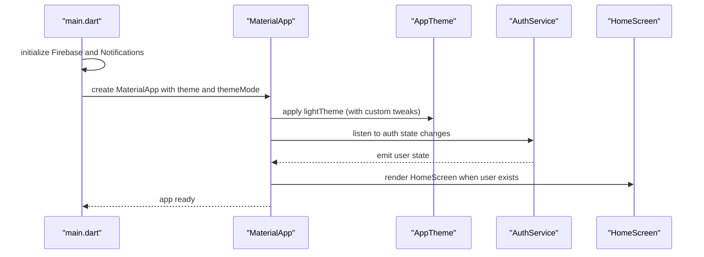
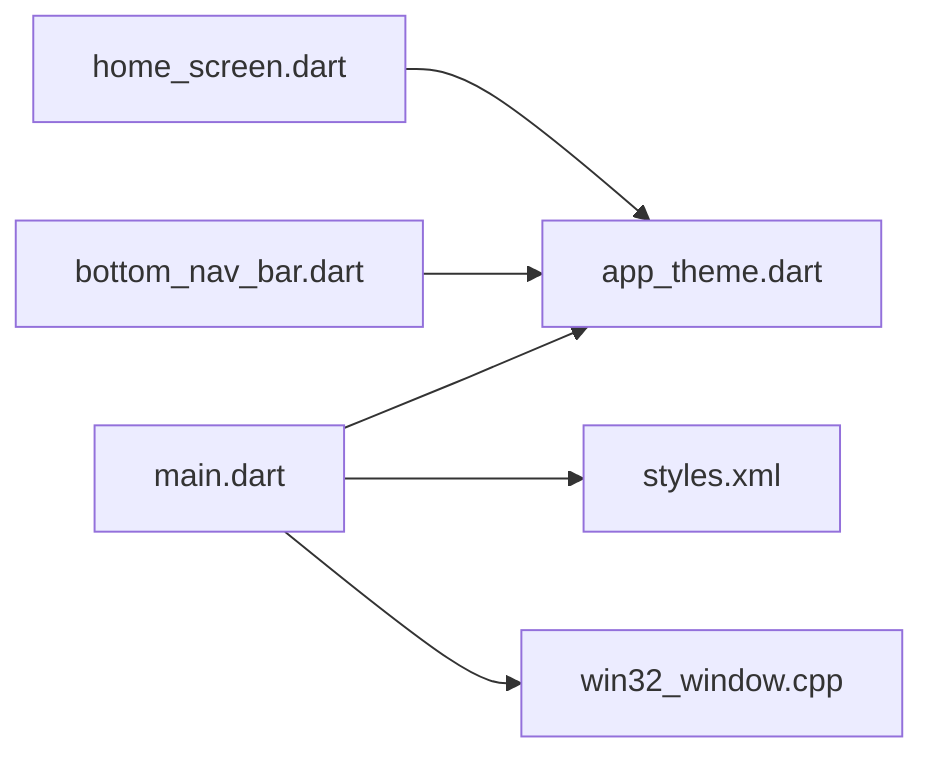

# Styling and Theming System

<cite>
**Referenced Files in This Document**
- [pubspec.yaml](file://testpro-main/pubspec.yaml)
- [main.dart](file://testpro-main/lib/main.dart)
- [app_theme.dart](file://testpro-main/lib/config/app_theme.dart)
- [app_colors.dart](file://testpro-main/lib/config/app_colors.dart)
- [app_typography.dart](file://testpro-main/lib/config/app_typography.dart)
- [home_screen.dart](file://testpro-main/lib/screens/home_screen.dart)
- [bottom_nav_bar.dart](file://testpro-main/lib/widgets/bottom_nav_bar.dart)
- [styles.xml](file://testpro-main/android/app/src/main/res/values/styles.xml)
- [win32_window.cpp](file://testpro-main/windows/runner/win32_window.cpp)
</cite>

## Table of Contents
1. [Introduction](#introduction)
2. [Project Structure](#project-structure)
3. [Core Components](#core-components)
4. [Architecture Overview](#architecture-overview)
5. [Detailed Component Analysis](#detailed-component-analysis)
6. [Dependency Analysis](#dependency-analysis)
7. [Performance Considerations](#performance-considerations)
8. [Troubleshooting Guide](#troubleshooting-guide)
9. [Conclusion](#conclusion)

## Introduction
This document explains the Flutter styling and theming system used in the project. It covers Material Design 3 integration, color scheme implementation, typography system, theme customization patterns, dark/light mode support, platform-specific styling adaptations, accessibility considerations, dynamic theming, and performance optimization. The goal is to help developers understand how the design system is structured and how to extend or modify it safely.

## Project Structure
The theming system is centralized in a dedicated configuration module and consumed across the app via the main entry point and various UI components.

**Diagram sources**
- [main.dart](file://testpro-main/lib/main.dart#L24-L62)
- [app_theme.dart](file://testpro-main/lib/config/app_theme.dart#L8-L314)
- [home_screen.dart](file://testpro-main/lib/screens/home_screen.dart#L1-L403)
- [bottom_nav_bar.dart](file://testpro-main/lib/widgets/bottom_nav_bar.dart#L1-L204)
- [styles.xml](file://testpro-main/android/app/src/main/res/values/styles.xml#L1-L19)
- [win32_window.cpp](file://testpro-main/windows/runner/win32_window.cpp#L275-L288)

**Section sources**
- [main.dart](file://testpro-main/lib/main.dart#L12-L62)
- [app_theme.dart](file://testpro-main/lib/config/app_theme.dart#L1-L314)

## Core Components
- Centralized theme definition: A single class defines brand colors, semantic colors, typography presets, spacing, shadows, gradients, and both light and dark Material 3 themes.
- App-wide theme application: The main app widget applies the theme and sets themeMode to light.
- Component-level usage: Screens and widgets reference theme constants and theme-provided styles for consistent visuals.

Key responsibilities:
- Define brand and semantic color tokens
- Provide typography presets and spacing scales
- Build ThemeData instances for Material 3
- Offer helper decorations for backgrounds and glassmorphism effects

**Section sources**
- [app_theme.dart](file://testpro-main/lib/config/app_theme.dart#L8-L314)
- [main.dart](file://testpro-main/lib/main.dart#L24-L62)

## Architecture Overview
The theming architecture follows a layered pattern:
- Theme definition layer: Centralized in a configuration file exporting static ThemeData instances and design tokens.
- Application layer: The main app widget applies the theme and exposes it to the widget tree.
- Consumption layer: Screens and widgets consume theme tokens and built-in theme data for consistent UI.

**Diagram sources**
- [app_theme.dart](file://testpro-main/lib/config/app_theme.dart#L132-L294)
- [main.dart](file://testpro-main/lib/main.dart#L29-L38)
- [home_screen.dart](file://testpro-main/lib/screens/home_screen.dart#L218-L238)
- [bottom_nav_bar.dart](file://testpro-main/lib/widgets/bottom_nav_bar.dart#L26-L74)

## Detailed Component Analysis

### Theme Definition and Material 3 Integration
The theme definition encapsulates:
- Brand and semantic colors
- Typography presets and TextTheme entries
- Spacing and border radius scales
- Shadows and gradients
- Light and dark ThemeData instances using Material 3 ColorScheme
- Theme-specific component themes (AppBar, BottomNavigationBar, Card, Divider, Chip, InputDecorator, Buttons, FloatingActionButton)

Highlights:
- Material 3 is enabled via a flag in ThemeData.
- ColorScheme is defined for both light and dark modes.
- Typography is unified under a font family and a set of TextTheme entries.
- Component themes are configured to match brand guidelines and platform expectations.

**Diagram sources**
- [app_theme.dart](file://testpro-main/lib/config/app_theme.dart#L11-L314)

**Section sources**
- [app_theme.dart](file://testpro-main/lib/config/app_theme.dart#L11-L314)

### Theme Application in the App
The main app widget:
- Initializes Firebase and notification services
- Creates the MaterialApp with a customized light theme
- Sets themeMode to light
- Uses a StreamBuilder to decide between welcome and home screens based on authentication state

Customizations:
- Copies the base light theme and adjusts splash behavior and scaffold background color
- Ensures Material 3 is enabled consistently

**Diagram sources**
- [main.dart](file://testpro-main/lib/main.dart#L12-L62)

**Section sources**
- [main.dart](file://testpro-main/lib/main.dart#L24-L62)

### Typography System
Typography is defined centrally and reused across components:
- A single font family is used for all text
- A comprehensive TextTheme provides sizes and weights for display, headline, title, body, and label categories
- Additional TextStyle presets are provided for specific UI elements (e.g., post username, meta, content, action count, tabs)
- Deprecated typography and color classes still exist but are superseded by the central theme

Practical usage:
- Screens and widgets reference AppTheme’s fontFamily and TextStyle presets
- Bottom navigation and home app bar use typography constants for labels and toggles

**Section sources**
- [app_theme.dart](file://testpro-main/lib/config/app_theme.dart#L62-L129)
- [home_screen.dart](file://testpro-main/lib/screens/home_screen.dart#L314-L316)
- [bottom_nav_bar.dart](file://testpro-main/lib/widgets/bottom_nav_bar.dart#L152-L158)
- [app_typography.dart](file://testpro-main/lib/config/app_typography.dart#L1-L61)

### Color Scheme and Semantic Tokens
Color tokens are organized by category:
- Brand colors (primary, light/dark variants)
- Background and surface colors
- Text colors (primary, secondary, muted)
- Semantic colors (e.g., like active, verified badges)
- Legacy aliases maintained for backward compatibility

Usage:
- ColorScheme drives Material 3 color roles
- Component themes reference brand and semantic colors
- Deprecated color classes remain for legacy code paths

**Section sources**
- [app_theme.dart](file://testpro-main/lib/config/app_theme.dart#L11-L61)
- [app_colors.dart](file://testpro-main/lib/config/app_colors.dart#L1-L20)

### Dark/Light Mode Support
- Two ThemeData instances are defined: light and dark
- The app currently sets themeMode to light and applies a customized light theme
- Dark theme is available and can be activated by switching themeMode and applying the dark theme

Recommendation:
- To enable dynamic theming, switch themeMode to system and apply both light and dark themes
- Consider persisting user preference and reacting to system appearance changes

**Section sources**
- [app_theme.dart](file://testpro-main/lib/config/app_theme.dart#L132-L294)
- [main.dart](file://testpro-main/lib/main.dart#L38-L38)

### Platform-Specific Styling Adaptations
Android:
- Launch and normal themes define window background behavior during startup and runtime
- These ensure consistent appearance while Flutter renders

Windows:
- The platform layer updates window chrome to align with system dark mode preferences
- This affects window title bars and controls for immersive dark mode

**Section sources**
- [styles.xml](file://testpro-main/android/app/src/main/res/values/styles.xml#L1-L19)
- [win32_window.cpp](file://testpro-main/windows/runner/win32_window.cpp#L275-L288)

### Accessibility Considerations
- Color contrast: Ensure sufficient contrast between foreground and background colors for readability
- Text scaling: Use relative sizing and flexible layouts to accommodate larger text
- Touch targets: Apply minimum spacing and sizing for interactive elements
- Focus indicators: Leverage Material 3 focus styles and ensure visible focus states
- Dynamic type: Prefer scalable typography scales and avoid fixed pixel sizes where possible

[No sources needed since this section provides general guidance]

### Dynamic Theming Patterns
Patterns demonstrated in the codebase:
- Centralized theme definition with static ThemeData instances
- App-level theme application with themeMode and custom theme tweaks
- Component-level consumption of theme tokens and built-in theme data

Extending dynamic theming:
- Add a theme controller/service to manage themeMode and swap themes at runtime
- Persist user preference and react to system appearance changes
- Provide theme preview and quick-switch UI

**Section sources**
- [app_theme.dart](file://testpro-main/lib/config/app_theme.dart#L132-L294)
- [main.dart](file://testpro-main/lib/main.dart#L29-L38)

### Responsive Typography Scaling
Approach:
- Use scalable units (e.g., sp for text scale) and rely on Flutter’s text scaling settings
- Keep typography presets in a central theme file for consistency
- Avoid hardcoding absolute sizes; prefer relative scales and theme-provided sizes

**Section sources**
- [app_theme.dart](file://testpro-main/lib/config/app_theme.dart#L175-L191)

### Examples of Theme Application and Customization
- Applying the theme in the main app widget with custom tweaks
- Consuming brand colors and typography in a screen and a bottom navigation component
- Using theme-provided component themes (e.g., AppBar, BottomNavigationBar) for consistent behavior

Paths to review:
- Theme application: [main.dart](file://testpro-main/lib/main.dart#L29-L38)
- Screen usage of theme tokens: [home_screen.dart](file://testpro-main/lib/screens/home_screen.dart#L219-L238)
- Component usage of typography and colors: [bottom_nav_bar.dart](file://testpro-main/lib/widgets/bottom_nav_bar.dart#L100-L158)

**Section sources**
- [main.dart](file://testpro-main/lib/main.dart#L29-L38)
- [home_screen.dart](file://testpro-main/lib/screens/home_screen.dart#L218-L238)
- [bottom_nav_bar.dart](file://testpro-main/lib/widgets/bottom_nav_bar.dart#L100-L158)

## Dependency Analysis
The theming system has clear boundaries and low coupling:
- main.dart depends on app_theme.dart for theme creation
- Screens depend on app_theme.dart for colors, typography, and background
- Widgets depend on app_theme.dart for consistent styling
- Platform-specific files (Android and Windows) influence initial appearance and system integration

**Diagram sources**
- [app_theme.dart](file://testpro-main/lib/config/app_theme.dart#L1-L314)
- [main.dart](file://testpro-main/lib/main.dart#L1-L62)
- [home_screen.dart](file://testpro-main/lib/screens/home_screen.dart#L1-L403)
- [bottom_nav_bar.dart](file://testpro-main/lib/widgets/bottom_nav_bar.dart#L1-L204)
- [styles.xml](file://testpro-main/android/app/src/main/res/values/styles.xml#L1-L19)
- [win32_window.cpp](file://testpro-main/windows/runner/win32_window.cpp#L275-L288)

**Section sources**
- [app_theme.dart](file://testpro-main/lib/config/app_theme.dart#L1-L314)
- [main.dart](file://testpro-main/lib/main.dart#L1-L62)

## Performance Considerations
- Centralize theme definitions to minimize recomputation and avoid scattered color/text styles
- Use theme-provided component themes to leverage Flutter’s optimized rendering
- Prefer static constants for colors and typography to reduce allocations
- Avoid deep nested custom styling; delegate to component themes where possible
- Keep font assets minimal and ensure only required weights are bundled

[No sources needed since this section provides general guidance]

## Troubleshooting Guide
Common issues and resolutions:
- Mismatched colors after theme changes: Verify that components use AppTheme constants and not hardcoded values
- Typography inconsistencies: Ensure components reference AppTheme’s fontFamily and TextStyle presets
- Dark mode not activating: Confirm themeMode is set appropriately and the dark theme is applied when needed
- Platform-specific appearance anomalies: Check Android and Windows platform files for correct theme application

**Section sources**
- [app_theme.dart](file://testpro-main/lib/config/app_theme.dart#L1-L314)
- [main.dart](file://testpro-main/lib/main.dart#L29-L38)
- [styles.xml](file://testpro-main/android/app/src/main/res/values/styles.xml#L1-L19)
- [win32_window.cpp](file://testpro-main/windows/runner/win32_window.cpp#L275-L288)

## Conclusion
The project implements a robust, centralized theming system aligned with Material 3. By consolidating design tokens, typography, and component themes in a single configuration file, it ensures consistency and maintainability. The app currently applies a light theme but retains the structure to enable dynamic theming and platform-specific adaptations. Following the patterns and recommendations here will help extend the system with confidence.