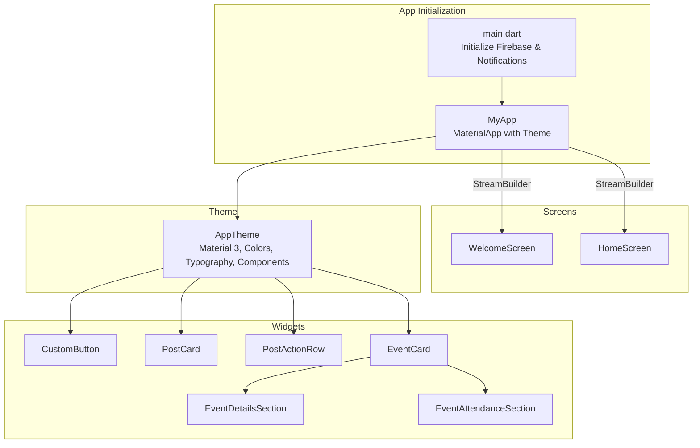
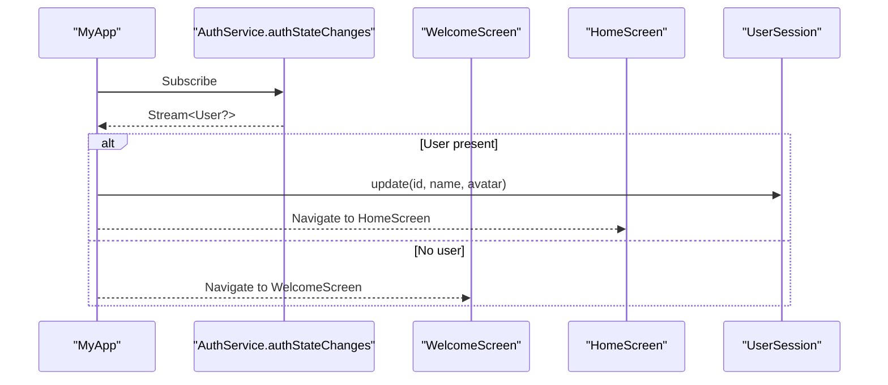
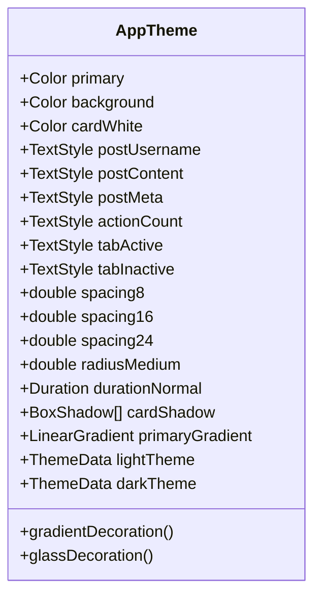
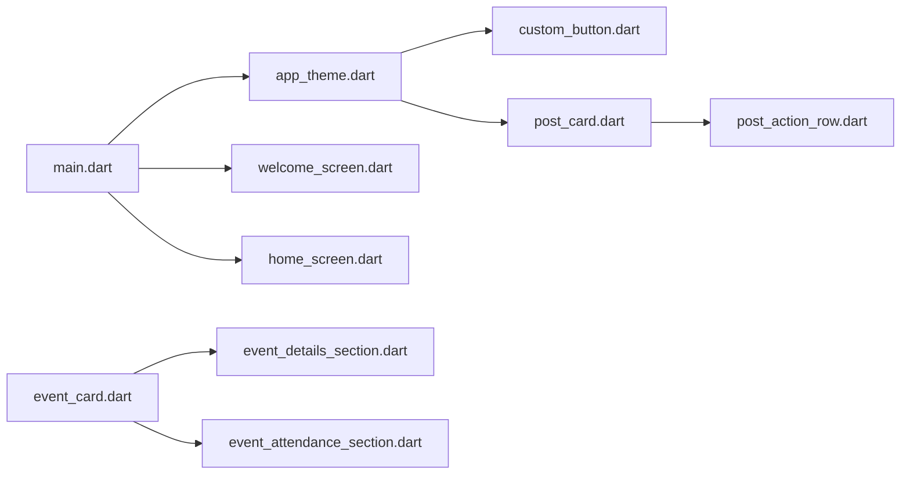

# UI Components and Screens

<cite>
**Referenced Files in This Document**
- [main.dart](file://testpro-main/lib/main.dart)
- [app_theme.dart](file://testpro-main/lib/config/app_theme.dart)
- [welcome_screen.dart](file://testpro-main/lib/screens/welcome_screen.dart)
- [home_screen.dart](file://testpro-main/lib/screens/home_screen.dart)
- [post_card.dart](file://testpro-main/lib/widgets/post_card.dart)
- [custom_button.dart](file://testpro-main/lib/widgets/custom_button.dart)
- [post_action_row.dart](file://testpro-main/lib/widgets/post/post_action_row.dart)
- [event_card.dart](file://testpro-main/lib/widgets/event_card/event_card.dart)
- [event_details_section.dart](file://testpro-main/lib/widgets/event_card/event_details_section.dart)
- [event_attendance_section.dart](file://testpro-main/lib/widgets/event_card/event_attendance_section.dart)
- [pubspec.yaml](file://testpro-main/pubspec.yaml)
</cite>

## Table of Contents
1. [Introduction](#introduction)
2. [Project Structure](#project-structure)
3. [Core Components](#core-components)
4. [Architecture Overview](#architecture-overview)
5. [Detailed Component Analysis](#detailed-component-analysis)
6. [Dependency Analysis](#dependency-analysis)
7. [Performance Considerations](#performance-considerations)
8. [Troubleshooting Guide](#troubleshooting-guide)
9. [Conclusion](#conclusion)

## Introduction
This document describes the Flutter UI component architecture and screen implementations for the LocalMe application. It focuses on the screen hierarchy (HomeScreen and WelcomeScreen), reusable component design patterns, responsive layout strategies, Material Design 3 integration, theme customization, platform-specific adaptations, state management via streams, navigation patterns, and accessibility considerations. It also documents custom UI elements such as buttons and post cards, along with compositional patterns and styling approaches used across the app.

## Project Structure
The Flutter application entry point initializes Firebase, notification services, and sets up the app’s theme. The app’s home screen is dynamically selected based on the authentication state stream. The UI layer is organized under lib/screens, lib/widgets, lib/ui, and lib/shared, with centralized theming in lib/config/app_theme.dart.

**Diagram sources**
- [main.dart](file://testpro-main/lib/main.dart#L12-L62)
- [app_theme.dart](file://testpro-main/lib/config/app_theme.dart#L132-L294)

**Section sources**
- [main.dart](file://testpro-main/lib/main.dart#L12-L62)
- [pubspec.yaml](file://testpro-main/pubspec.yaml#L47-L61)

## Core Components
- Authentication-driven routing via StreamBuilder on the root Material app.
- Centralized theming with Material Design 3 support, brand colors, typography, spacing, shadows, and component themes (buttons, inputs, cards).
- Reusable widgets for actions and events, enabling consistent UI across screens.
- Custom button and post card widgets designed for composability and accessibility.

Key implementation references:
- App initialization and routing: [main.dart](file://testpro-main/lib/main.dart#L12-L62)
- Theme definition and Material 3 integration: [app_theme.dart](file://testpro-main/lib/config/app_theme.dart#L132-L294)
- Custom button widget: [custom_button.dart](file://testpro-main/lib/widgets/custom_button.dart)
- Post card widget: [post_card.dart](file://testpro-main/lib/widgets/post_card.dart)
- Post action row widget: [post_action_row.dart](file://testpro-main/lib/widgets/post/post_action_row.dart)
- Event card and sections: [event_card.dart](file://testpro-main/lib/widgets/event_card/event_card.dart), [event_details_section.dart](file://testpro-main/lib/widgets/event_card/event_details_section.dart), [event_attendance_section.dart](file://testpro-main/lib/widgets/event_card/event_attendance_section.dart)

**Section sources**
- [main.dart](file://testpro-main/lib/main.dart#L24-L62)
- [app_theme.dart](file://testpro-main/lib/config/app_theme.dart#L8-L314)

## Architecture Overview
The app uses a single-activity (MaterialApp) architecture with dynamic screen selection based on authentication state. The theme is configured globally with Material Design 3 enabled and customized color schemes, typography, and component themes. Screens are composed from reusable widgets that adhere to the design system.

**Diagram sources**
- [main.dart](file://testpro-main/lib/main.dart#L39-L59)

**Section sources**
- [main.dart](file://testpro-main/lib/main.dart#L24-L62)

## Detailed Component Analysis

### Screen Hierarchy and Navigation
- WelcomeScreen: Shown when the user is not authenticated; serves as the entry point for onboarding or login flows.
- HomeScreen: Shown when the user is authenticated; acts as the main application shell and feeds content (e.g., posts) to the UI.

Navigation is implicit via the StreamBuilder in the root Material app, which switches between WelcomeScreen and HomeScreen based on the authentication stream.

References:
- [WelcomeScreen import and usage](file://testpro-main/lib/main.dart#L4-L5)
- [HomeScreen import and usage](file://testpro-main/lib/main.dart#L5-L5)
- [Authentication-driven routing](file://testpro-main/lib/main.dart#L39-L59)

**Section sources**
- [main.dart](file://testpro-main/lib/main.dart#L4-L59)

### Theme and Material Design 3 Integration
The theme system defines:
- Brand colors and semantic palettes
- Typography presets for consistent text hierarchy
- Spacing and border radius scales
- Component themes for buttons, inputs, cards, chips, and FABs
- Light and dark variants with Material 3 color schemes

**Diagram sources**
- [app_theme.dart](file://testpro-main/lib/config/app_theme.dart#L8-L314)

**Section sources**
- [app_theme.dart](file://testpro-main/lib/config/app_theme.dart#L132-L294)

### Custom Button Component
The custom button widget encapsulates Material 3 button styles and behavior, leveraging the theme’s elevated, outlined, and text button themes. It supports consistent sizing, typography, and interaction feedback across the app.

Composition pattern:
- Accepts onPressed callback and optional icon/text
- Uses theme-provided paddings and shapes
- Integrates with accessibility semantics

Reference:
- [custom_button.dart](file://testpro-main/lib/widgets/custom_button.dart)

**Section sources**
- [app_theme.dart](file://testpro-main/lib/config/app_theme.dart#L234-L261)
- [custom_button.dart](file://testpro-main/lib/widgets/custom_button.dart)

### Post Card Widget
The post card widget composes content sections (username, metadata, content) and action controls (likes, comments, shares). It follows the design system for spacing, typography, and shadows, ensuring consistent appearance across feeds.

Composition pattern:
- Header with avatar and username
- Content area with styled text
- Action row integrated below content
- Rounded corners and subtle border per theme

Reference:
- [post_card.dart](file://testpro-main/lib/widgets/post_card.dart)
- [post_action_row.dart](file://testpro-main/lib/widgets/post/post_action_row.dart)

**Section sources**
- [post_card.dart](file://testpro-main/lib/widgets/post_card.dart)
- [post_action_row.dart](file://testpro-main/lib/widgets/post/post_action_row.dart)

### Event Card and Sections
The event card is composed of modular sections:
- EventDetailsSection: Displays event metadata and summary
- EventAttendanceSection: Manages attendance actions and counts

This modular design promotes reuse and maintainability.

References:
- [event_card.dart](file://testpro-main/lib/widgets/event_card/event_card.dart)
- [event_details_section.dart](file://testpro-main/lib/widgets/event_card/event_details_section.dart)
- [event_attendance_section.dart](file://testpro-main/lib/widgets/event_card/event_attendance_section.dart)

**Section sources**
- [event_card.dart](file://testpro-main/lib/widgets/event_card/event_card.dart)
- [event_details_section.dart](file://testpro-main/lib/widgets/event_card/event_details_section.dart)
- [event_attendance_section.dart](file://testpro-main/lib/widgets/event_card/event_attendance_section.dart)

### Responsive Layout and Platform Adaptations
- Material 3 adaptive color schemes and typography scale adapt to platform brightness and user preferences.
- The theme’s text sizes and spacings are tuned for readability across devices.
- Platform-specific assets and fonts are declared in pubspec.yaml to ensure proper rendering on iOS, Android, Web, macOS, Windows, and Linux.

References:
- [pubspec.yaml](file://testpro-main/pubspec.yaml#L47-L61)

**Section sources**
- [pubspec.yaml](file://testpro-main/pubspec.yaml#L47-L61)

### Accessibility Implementation
- Semantic labeling and touch targets sized per Material guidelines
- High contrast color usage from the theme’s color scheme
- Focus and hover states aligned with component themes
- Text scaling supported via Material typography presets

References:
- [app_theme.dart](file://testpro-main/lib/config/app_theme.dart#L175-L232)

**Section sources**
- [app_theme.dart](file://testpro-main/lib/config/app_theme.dart#L175-L232)

## Dependency Analysis
The UI layer depends on:
- Firebase for authentication state
- Notification service initialization
- Theme system for consistent styling
- Reusable widgets for actions and cards

**Diagram sources**
- [main.dart](file://testpro-main/lib/main.dart#L1-L22)
- [app_theme.dart](file://testpro-main/lib/config/app_theme.dart#L132-L294)
- [custom_button.dart](file://testpro-main/lib/widgets/custom_button.dart)
- [post_card.dart](file://testpro-main/lib/widgets/post_card.dart)
- [post_action_row.dart](file://testpro-main/lib/widgets/post/post_action_row.dart)
- [event_card.dart](file://testpro-main/lib/widgets/event_card/event_card.dart)
- [event_details_section.dart](file://testpro-main/lib/widgets/event_card/event_details_section.dart)
- [event_attendance_section.dart](file://testpro-main/lib/widgets/event_card/event_attendance_section.dart)

**Section sources**
- [main.dart](file://testpro-main/lib/main.dart#L1-L22)
- [app_theme.dart](file://testpro-main/lib/config/app_theme.dart#L132-L294)

## Performance Considerations
- Prefer lightweight widgets and avoid unnecessary rebuilds by isolating stateful sections.
- Use theme-based colors and typography to minimize per-widget styling overhead.
- Lazy-load heavy content (e.g., images/video thumbnails) and leverage caching where applicable.
- Keep animations subtle and within the defined durations to preserve responsiveness.

## Troubleshooting Guide
- Authentication state not updating: Verify the auth stream subscription and ensure UserSession updates occur on active connection state.
- Theme inconsistencies: Confirm that widgets use theme-provided colors and text styles rather than hardcoded values.
- Missing fonts or assets: Ensure font entries and asset paths are correctly declared in pubspec.yaml.

**Section sources**
- [main.dart](file://testpro-main/lib/main.dart#L39-L59)
- [app_theme.dart](file://testpro-main/lib/config/app_theme.dart#L132-L294)
- [pubspec.yaml](file://testpro-main/pubspec.yaml#L47-L61)

## Conclusion
The LocalMe Flutter app employs a clean, theme-driven architecture with Material Design 3 integration. Authentication state determines the initial screen, while reusable widgets and a centralized theme system ensure consistency and scalability. Modular components like the event card and post card promote maintainability, and the design system supports responsive layouts and accessibility across platforms.