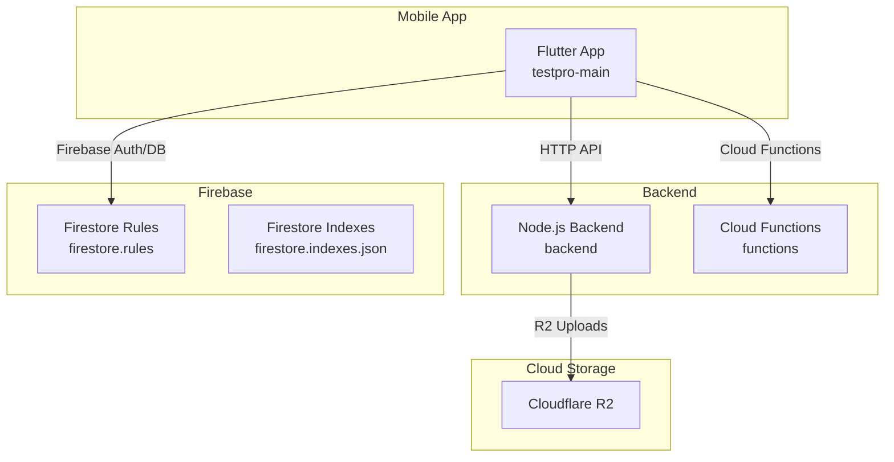
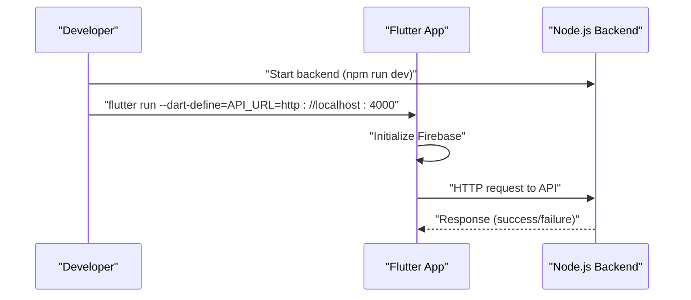
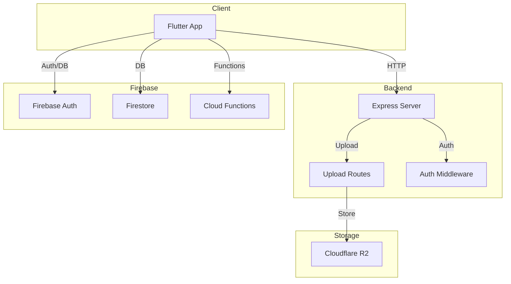

# Getting Started

<cite>
**Referenced Files in This Document**
- [README.md](file://testpro-main/README.md)
- [backend/README.md](file://backend/README.md)
- [pubspec.yaml](file://testpro-main/pubspec.yaml)
- [backend/package.json](file://backend/package.json)
- [backend/.env.example](file://backend/.env.example)
- [backend/src/config/env.js](file://backend/src/config/env.js)
- [backend/src/config/firebase.js](file://backend/src/config/firebase.js)
- [testpro-main/lib/main.dart](file://testpro-main/lib/main.dart)
- [testpro-main/firebase.json](file://testpro-main/firebase.json)
- [testpro-main/android/app/google-services.json](file://testpro-main/android/app/google-services.json)
- [testpro-main/firestore.rules](file://testpro-main/firestore.rules)
- [testpro-main/firestore.indexes.json](file://testpro-main/firestore.indexes.json)
- [testpro-main/functions/package.json](file://testpro-main/functions/package.json)
</cite>

## Table of Contents
1. [Introduction](#introduction)
2. [Project Structure](#project-structure)
3. [Prerequisites](#prerequisites)
4. [Environment Setup](#environment-setup)
5. [Step-by-Step Setup](#step-by-step-setup)
6. [Running the Development Servers](#running-the-development-servers)
7. [Connecting the Mobile App to the Backend](#connecting-the-mobile-app-to-the-backend)
8. [Initial Verification](#initial-verification)
9. [Quick Start Examples](#quick-start-examples)
10. [Troubleshooting Guide](#troubleshooting-guide)
11. [Architecture Overview](#architecture-overview)
12. [Conclusion](#conclusion)

## Introduction
This guide helps you set up the LocalMe development environment locally. It covers prerequisites, Flutter mobile app setup, Node.js backend setup, environment configuration, Firebase project setup, dependency installation, running development servers, and connecting the mobile app to the backend API. It also includes troubleshooting tips and quick start examples for first-time contributors.

## Project Structure
LocalMe consists of:
- Flutter mobile app (testpro-main) with cross-platform support (Android, iOS, Web, desktop)
- Node.js backend (backend) for media upload and API services
- Firebase Cloud Functions (functions) and Firestore security rules
- Cloudflare R2 for media storage

**Diagram sources**
- [testpro-main/README.md](file://testpro-main/README.md#L24-L42)
- [backend/README.md](file://backend/README.md#L5-L21)
- [testpro-main/firebase.json](file://testpro-main/firebase.json#L1-L32)
- [testpro-main/firestore.rules](file://testpro-main/firestore.rules#L1-L11)
- [testpro-main/firestore.indexes.json](file://testpro-main/firestore.indexes.json#L1-L181)

**Section sources**
- [testpro-main/README.md](file://testpro-main/README.md#L24-L42)
- [backend/README.md](file://backend/README.md#L5-L21)

## Prerequisites
- Flutter SDK: ^3.10.3
- Node.js: >=20.0.0 (required for backend)
- Firebase project with Authentication, Firestore, and Cloud Functions enabled
- Cloudflare R2 account for media storage
- Android/iOS development tools (as applicable)

**Section sources**
- [testpro-main/README.md](file://testpro-main/README.md#L15-L21)
- [backend/package.json](file://backend/package.json#L7-L9)
- [pubspec.yaml](file://testpro-main/pubspec.yaml#L7-L8)

## Environment Setup
### Flutter App Environment Variables
- API_URL: Backend API base URL (required for mobile app to connect)
- GOOGLE_CLIENT_ID: Google OAuth client ID (web only)

Set during development via command-line flags or CI/CD secrets.

**Section sources**
- [testpro-main/README.md](file://testpro-main/README.md#L211-L232)

### Backend Environment Variables
Copy the example environment file and fill in your Firebase and R2 credentials.

- PORT, NODE_ENV
- FIREBASE_PROJECT_ID, FIREBASE_PRIVATE_KEY, FIREBASE_CLIENT_EMAIL
- R2_ACCOUNT_ID, R2_ACCESS_KEY_ID, R2_SECRET_ACCESS_KEY, R2_BUCKET_NAME, R2_PUBLIC_BASE_URL
- CORS_ORIGIN

**Section sources**
- [backend/.env.example](file://backend/.env.example#L1-L25)
- [backend/README.md](file://backend/README.md#L46-L68)

## Step-by-Step Setup

### 1. Clone and Prepare
- Clone the repository and navigate to the project root.
- Open the Flutter project at testpro-main.

**Section sources**
- [testpro-main/README.md](file://testpro-main/README.md#L48-L53)

### 2. Flutter App Setup
- Install dependencies:
  - flutter pub get
- Configure Firebase:
  - Create a Firebase project and enable Authentication and Firestore.
  - Download google-services.json (Android) and place at android/app/google-services.json.
  - iOS requires GoogleService-Info.plist; ensure it is present before building iOS.
- Set environment variables:
  - Use --dart-define flags to pass API_URL and GOOGLE_CLIENT_ID during development.

**Section sources**
- [testpro-main/README.md](file://testpro-main/README.md#L55-L83)
- [testpro-main/android/app/google-services.json](file://testpro-main/android/app/google-services.json#L1-L38)
- [testpro-main/firebase.json](file://testpro-main/firebase.json#L9-L31)

### 3. Backend Setup
- Navigate to backend directory.
- Install dependencies:
  - npm install
- Configure environment:
  - Copy .env.example to .env and edit with your credentials.
  - Obtain Firebase Admin credentials from Firebase Console > Project Settings > Service Accounts.
  - Obtain Cloudflare R2 credentials and token from Cloudflare Dashboard > R2.
- Run backend:
  - Development: npm run dev
  - Production: npm start

**Section sources**
- [testpro-main/README.md](file://testpro-main/README.md#L85-L151)
- [backend/README.md](file://backend/README.md#L38-L80)
- [backend/package.json](file://backend/package.json#L10-L14)

### 4. Firebase Cloud Functions Setup
- Navigate to functions directory.
- Install dependencies:
  - npm install
- Deploy functions:
  - firebase deploy --only functions

**Section sources**
- [testpro-main/README.md](file://testpro-main/README.md#L153-L177)
- [functions/package.json](file://testpro-main/functions/package.json#L1-L15)

### 5. Deploy Firestore Security Rules and Indexes
- Deploy rules:
  - firebase deploy --only firestore:rules
- Firestore indexes are defined in firestore.indexes.json.

**Section sources**
- [testpro-main/README.md](file://testpro-main/README.md#L173-L177)
- [testpro-main/firestore.rules](file://testpro-main/firestore.rules#L1-L11)
- [testpro-main/firestore.indexes.json](file://testpro-main/firestore.indexes.json#L1-L181)

## Running the Development Servers
- Backend:
  - npm run dev (watch-mode for development)
- Flutter app:
  - flutter run (connected device/emulator)
  - flutter run -d chrome (web)
  - flutter run --dart-define=API_URL=http://localhost:4000 (custom backend URL)

**Section sources**
- [backend/package.json](file://backend/package.json#L12)
- [testpro-main/README.md](file://testpro-main/README.md#L181-L194)

## Connecting the Mobile App to the Backend
- Ensure the backend is running locally or on a reachable host.
- Pass API_URL via --dart-define when launching the app.
- Confirm the mobile app initializes Firebase and navigates to the correct screen.

**Diagram sources**
- [testpro-main/lib/main.dart](file://testpro-main/lib/main.dart#L12-L22)
- [testpro-main/README.md](file://testpro-main/README.md#L181-L194)
- [backend/package.json](file://backend/package.json#L12)

**Section sources**
- [testpro-main/lib/main.dart](file://testpro-main/lib/main.dart#L12-L22)
- [testpro-main/README.md](file://testpro-main/README.md#L181-L194)

## Initial Verification
- Backend health check endpoint:
  - GET /health
- Successful response indicates the backend is running and configured.
- Verify environment variables are loaded by checking initialization logs.

**Section sources**
- [backend/README.md](file://backend/README.md#L82-L96)
- [backend/src/config/env.js](file://backend/src/config/env.js#L6-L22)
- [backend/src/config/firebase.js](file://backend/src/config/firebase.js#L7-L17)

## Quick Start Examples
- First-time contributor tasks:
  - Create a test account via the app’s authentication flow.
  - Post a test image/video to verify media upload to R2.
  - Explore feeds (local/national/global) to confirm data retrieval.
  - Trigger a notification via Cloud Functions if implemented.

[No sources needed since this section provides general guidance]

## Troubleshooting Guide
Common issues and resolutions:
- API_URL not set warning:
  - Set API_URL via --dart-define flag.
- Images not loading:
  - Verify backend is running, check R2 credentials, and confirm R2_PUBLIC_BASE_URL.
- Google Sign-In fails on web:
  - Set GOOGLE_CLIENT_ID and ensure it matches Firebase Console.
- Build errors after setup:
  - flutter clean, flutter pub get, flutter run.
- Backend upload fails:
  - Check Firebase token validity, R2 credentials, and review backend logs.

**Section sources**
- [testpro-main/README.md](file://testpro-main/README.md#L235-L263)

## Architecture Overview
High-level flow of LocalMe components and data paths.

**Diagram sources**
- [backend/README.md](file://backend/README.md#L5-L21)
- [testpro-main/README.md](file://testpro-main/README.md#L24-L42)
- [testpro-main/firebase.json](file://testpro-main/firebase.json#L1-L32)

## Conclusion
You now have the fundamentals to run LocalMe locally: Flutter app configured with Firebase, Node.js backend with environment variables, deployed Firestore rules and indexes, and Cloud Functions ready for extension. Use the verification steps and troubleshooting tips to resolve common setup issues quickly.