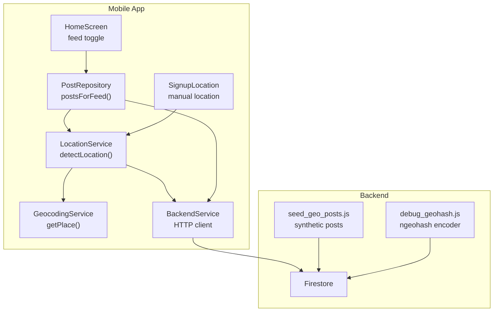
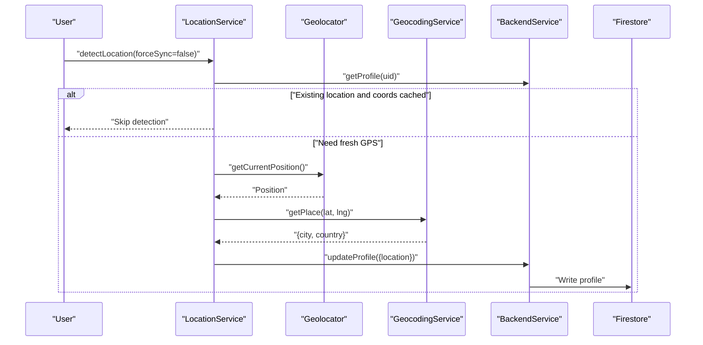
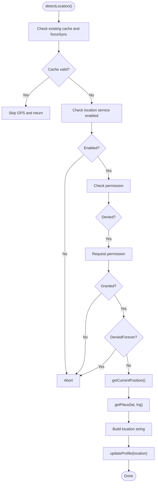
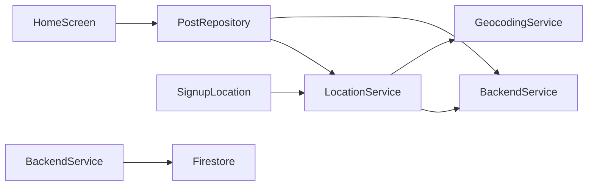

# Location Services

<cite>
**Referenced Files in This Document**
- [location_service.dart](file://testpro-main/lib/services/location_service.dart)
- [geocoding_service.dart](file://testpro-main/lib/services/geocoding_service.dart)
- [post.dart](file://testpro-main/lib/models/post.dart)
- [post_repository.dart](file://testpro-main/lib/repositories/post_repository.dart)
- [backend_service.dart](file://testpro-main/lib/services/backend_service.dart)
- [home_screen.dart](file://testpro-main/lib/screens/home_screen.dart)
- [signup_location.dart](file://testpro-main/lib/screens/signup/signup_location.dart)
- [event_details_section.dart](file://testpro-main/lib/widgets/event_card/event_details_section.dart)
- [event_group.dart](file://testpro-main/lib/models/event_group.dart)
- [seed_geo_posts.js](file://backend/scripts/seed_geo_posts.js)
- [debug_geohash.js](file://backend/scripts/debug_geohash.js)
</cite>

## Table of Contents
1. [Introduction](#introduction)
2. [Project Structure](#project-structure)
3. [Core Components](#core-components)
4. [Architecture Overview](#architecture-overview)
5. [Detailed Component Analysis](#detailed-component-analysis)
6. [Dependency Analysis](#dependency-analysis)
7. [Performance Considerations](#performance-considerations)
8. [Troubleshooting Guide](#troubleshooting-guide)
9. [Conclusion](#conclusion)
10. [Appendices](#appendices)

## Introduction
This document explains the location-based services and geolocation integration across the mobile application and backend. It covers GPS coordinate handling, reverse geocoding, proximity-aware feed retrieval, event management with location-based discovery, and privacy controls for location sharing. It also documents geohashing concepts present in the backend scripts and how the frontend consumes location data to filter and sort content.

## Project Structure
The location stack spans the Flutter frontend and Firebase/Node.js backend:
- Frontend services handle location detection, reverse geocoding, and feed filtering.
- Backend scripts demonstrate synthetic geospatial seeding and geohashing exploration.
- Models represent posts and events with optional location fields.

**Diagram sources**
- [location_service.dart](file://testpro-main/lib/services/location_service.dart#L1-L92)
- [geocoding_service.dart](file://testpro-main/lib/services/geocoding_service.dart#L1-L38)
- [post_repository.dart](file://testpro-main/lib/repositories/post_repository.dart#L149-L167)
- [backend_service.dart](file://testpro-main/lib/services/backend_service.dart#L473-L496)
- [home_screen.dart](file://testpro-main/lib/screens/home_screen.dart#L123-L148)
- [signup_location.dart](file://testpro-main/lib/screens/signup/signup_location.dart#L80-L116)
- [seed_geo_posts.js](file://backend/scripts/seed_geo_posts.js#L1-L110)
- [debug_geohash.js](file://backend/scripts/debug_geohash.js#L1-L16)

**Section sources**
- [location_service.dart](file://testpro-main/lib/services/location_service.dart#L1-L92)
- [geocoding_service.dart](file://testpro-main/lib/services/geocoding_service.dart#L1-L38)
- [post_repository.dart](file://testpro-main/lib/repositories/post_repository.dart#L149-L167)
- [backend_service.dart](file://testpro-main/lib/services/backend_service.dart#L473-L496)
- [home_screen.dart](file://testpro-main/lib/screens/home_screen.dart#L123-L148)
- [signup_location.dart](file://testpro-main/lib/screens/signup/signup_location.dart#L80-L116)
- [seed_geo_posts.js](file://backend/scripts/seed_geo_posts.js#L1-L110)
- [debug_geohash.js](file://backend/scripts/debug_geohash.js#L1-L16)

## Core Components
- LocationService: Centralizes GPS acquisition, caching, reverse geocoding, and backend synchronization.
- GeocodingService: Performs client-side reverse geocoding using a public API.
- Post model: Captures optional location fields and event metadata for proximity and event discovery.
- PostRepository: Supplies feed data with optional latitude/longitude filters and country scoping.
- BackendService: Provides HTTP endpoints for event attendance checks and other interactions.
- HomeScreen and SignupLocation: Drive user-facing location opt-in and feed toggling.

**Section sources**
- [location_service.dart](file://testpro-main/lib/services/location_service.dart#L1-L92)
- [geocoding_service.dart](file://testpro-main/lib/services/geocoding_service.dart#L1-L38)
- [post.dart](file://testpro-main/lib/models/post.dart#L1-L143)
- [post_repository.dart](file://testpro-main/lib/repositories/post_repository.dart#L149-L167)
- [backend_service.dart](file://testpro-main/lib/services/backend_service.dart#L473-L496)
- [home_screen.dart](file://testpro-main/lib/screens/home_screen.dart#L123-L148)
- [signup_location.dart](file://testpro-main/lib/screens/signup/signup_location.dart#L80-L116)

## Architecture Overview
The location pipeline:
1. User initiates location detection via LocationService.
2. Geolocator fetches a Position with desired accuracy and timeout.
3. Reverse geocoding resolves city/country from coordinates.
4. Profile location is synced to backend.
5. Feed queries pass lat/lng and country filters to backend for proximity and global views.
6. Events are represented in Post model with eventLocation and timing fields.

**Diagram sources**
- [location_service.dart](file://testpro-main/lib/services/location_service.dart#L18-L85)
- [geocoding_service.dart](file://testpro-main/lib/services/geocoding_service.dart#L9-L36)
- [backend_service.dart](file://testpro-main/lib/services/backend_service.dart#L473-L496)

## Detailed Component Analysis

### LocationService
Responsibilities:
- Permission gating and service availability checks.
- GPS acquisition with accuracy/time limits.
- Reverse geocoding and caching city/country.
- Backend profile synchronization with location string.

Key behaviors:
- Skips detection if already cached and not forced.
- Requests permission if denied; aborts on permanent denial.
- Builds a location string for profile storage and feed queries.

**Diagram sources**
- [location_service.dart](file://testpro-main/lib/services/location_service.dart#L18-L85)

**Section sources**
- [location_service.dart](file://testpro-main/lib/services/location_service.dart#L1-L92)

### GeocodingService
Responsibilities:
- Reverse geocodes coordinates to city/country using a public API.
- Returns structured fields suitable for UI and backend storage.

Behavior:
- Uses BigDataCloud free endpoint with locality language set.
- Applies fallbacks when city is empty.
- Returns safe defaults on failure.

**Section sources**
- [geocoding_service.dart](file://testpro-main/lib/services/geocoding_service.dart#L1-L38)

### Post Model and Event Fields
Post captures:
- Optional latitude/longitude and city/country for proximity filtering.
- Event-specific fields: eventLocation, eventStartDate, eventEndDate, eventType, isFree, attendeeCount.
- Category-based event inference and backward-compatible date mapping.

Implications:
- Enables proximity-based feed sorting and event discovery.
- Supports event grouping and attendance tracking via backend.

**Section sources**
- [post.dart](file://testpro-main/lib/models/post.dart#L1-L143)

### PostRepository Feed Filtering
Behavior:
- Retrieves current position from LocationService.
- Calls BackendService.getPosts with lat/lng and country filters.
- Streams lists of Post objects for UI consumption.

Notes:
- Cursor handling is conditionally applied based on feed type.
- Country scoping supports global vs nearby feeds.

**Section sources**
- [post_repository.dart](file://testpro-main/lib/repositories/post_repository.dart#L149-L167)

### BackendService Event Attendance
Endpoints:
- Check event attendance for a given event ID.
- Retrieve user's event IDs.

Usage:
- Used by UI widgets to reflect attendance state and manage user participation.

**Section sources**
- [backend_service.dart](file://testpro-main/lib/services/backend_service.dart#L473-L496)

### HomeScreen and SignupLocation
- HomeScreen detects and syncs location during initialization and updates profile if needed.
- SignupLocation screen provides manual location entry and triggers automatic detection.

Privacy:
- Manual override allows users to set location without GPS.
- Profile sync avoids redundant writes.

**Section sources**
- [home_screen.dart](file://testpro-main/lib/screens/home_screen.dart#L123-L148)
- [signup_location.dart](file://testpro-main/lib/screens/signup/signup_location.dart#L80-L116)

### Event Card Details
- Displays eventLocation from Post model.
- Supports event discovery and engagement.

**Section sources**
- [event_details_section.dart](file://testpro-main/lib/widgets/event_card/event_details_section.dart#L83-L116)

### EventGroup Model
- Represents event groups with status and timestamps.
- Useful for organizing event-related activities.

**Section sources**
- [event_group.dart](file://testpro-main/lib/models/event_group.dart#L1-L35)

### Geohashing Implementation and Spatial Indexing
- Backend script debug_geohash.js demonstrates encoding coordinates at different precisions.
- seed_geo_posts.js generates synthetic posts with latitude/longitude for proximity testing.

Implications:
- Geohashing can be used for spatial indexing and proximity queries at scale.
- Current frontend uses lat/lng filters; geohash-based queries could be introduced later.

**Section sources**
- [debug_geohash.js](file://backend/scripts/debug_geohash.js#L1-L16)
- [seed_geo_posts.js](file://backend/scripts/seed_geo_posts.js#L1-L110)

## Dependency Analysis
High-level dependencies:
- LocationService depends on Geolocator, GeocodingService, BackendService, and AuthService.
- PostRepository depends on BackendService and LocationService for feed filtering.
- HomeScreen and SignupLocation depend on LocationService for user experience.
- BackendService encapsulates HTTP interactions with Firestore.

**Diagram sources**
- [location_service.dart](file://testpro-main/lib/services/location_service.dart#L1-L92)
- [geocoding_service.dart](file://testpro-main/lib/services/geocoding_service.dart#L1-L38)
- [post_repository.dart](file://testpro-main/lib/repositories/post_repository.dart#L149-L167)
- [backend_service.dart](file://testpro-main/lib/services/backend_service.dart#L473-L496)
- [home_screen.dart](file://testpro-main/lib/screens/home_screen.dart#L123-L148)
- [signup_location.dart](file://testpro-main/lib/screens/signup/signup_location.dart#L80-L116)

**Section sources**
- [location_service.dart](file://testpro-main/lib/services/location_service.dart#L1-L92)
- [geocoding_service.dart](file://testpro-main/lib/services/geocoding_service.dart#L1-L38)
- [post_repository.dart](file://testpro-main/lib/repositories/post_repository.dart#L149-L167)
- [backend_service.dart](file://testpro-main/lib/services/backend_service.dart#L473-L496)
- [home_screen.dart](file://testpro-main/lib/screens/home_screen.dart#L123-L148)
- [signup_location.dart](file://testpro-main/lib/screens/signup/signup_location.dart#L80-L116)

## Performance Considerations
- Accuracy and battery:
  - getCurrentPosition uses medium accuracy and a short time limit to balance speed and power.
  - Consider reducing frequency of detections and using region monitoring for background scenarios.
- Network costs:
  - Reverse geocoding is performed once per detection; cache results to minimize repeated calls.
- Backend filtering:
  - Lat/lng filters enable proximity queries; consider adding geohash-based indexes for large-scale performance.
- UI responsiveness:
  - Debounce feed refreshes and avoid redundant profile updates.

[No sources needed since this section provides general guidance]

## Troubleshooting Guide
Common issues and resolutions:
- Location service disabled:
  - Ensure device location services are enabled before requesting permission.
- Permission denied:
  - Request permission again; if permanently denied, guide users to device settings.
- No coordinates despite existing city:
  - Force sync to re-acquire GPS and update profile.
- Reverse geocoding failures:
  - Fall back to subdivision names and log errors for diagnostics.
- Feed not updating:
  - Verify that lat/lng are passed to getPosts and that the user’s country scope is set.

**Section sources**
- [location_service.dart](file://testpro-main/lib/services/location_service.dart#L48-L85)
- [geocoding_service.dart](file://testpro-main/lib/services/geocoding_service.dart#L9-L36)
- [post_repository.dart](file://testpro-main/lib/repositories/post_repository.dart#L149-L167)

## Conclusion
The application integrates GPS detection, reverse geocoding, and location-aware feed filtering. Event management leverages Post model fields for location-based discovery and attendance tracking. While the frontend currently filters by lat/lng, the backend includes geohashing utilities that can support scalable spatial indexing and proximity queries. Privacy controls include explicit opt-in via permission prompts and manual location entry.

[No sources needed since this section summarizes without analyzing specific files]

## Appendices

### Privacy Controls and Opt-In Mechanisms
- Explicit permission handling ensures users approve location access.
- Manual location entry allows opting in without GPS.
- Profile updates occur only when location changes, minimizing unnecessary writes.

**Section sources**
- [location_service.dart](file://testpro-main/lib/services/location_service.dart#L48-L85)
- [signup_location.dart](file://testpro-main/lib/screens/signup/signup_location.dart#L80-L116)

### Geofencing and Proximity Alerts
- Not implemented in the current codebase.
- Suggested approach:
  - Use platform geofence APIs to monitor region transitions.
  - Trigger alerts when entering/exiting proximity to event locations or user-defined areas.
  - Combine with background location updates and battery optimization strategies.

[No sources needed since this section provides general guidance]

### Location History Management
- Not implemented in the current codebase.
- Suggested approach:
  - Persist recent positions locally with user consent.
  - Provide controls to export or delete history.
  - Anonymize historical data by aggregating into regions or removing precise timestamps.

[No sources needed since this section provides general guidance]

### Accuracy, Battery, and Permissions Across Platforms
- Android/iOS:
  - Use platform-specific geolocator plugins with appropriate accuracy levels.
  - Respect user choices and handle denials gracefully.
  - Batch network requests and debounce location updates to save battery.
- Web:
  - Use browser geolocation API with user gesture prompts.
  - Provide clear privacy notices and opt-out mechanisms.

[No sources needed since this section provides general guidance]