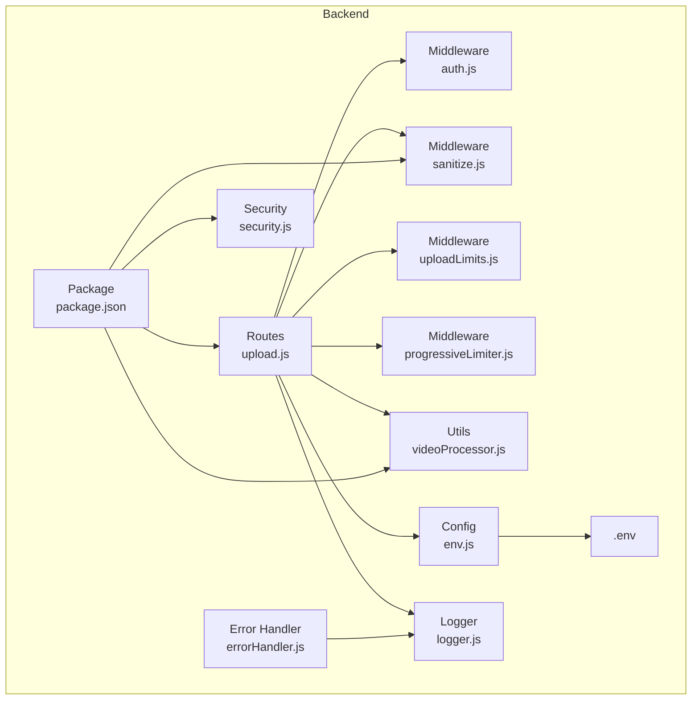
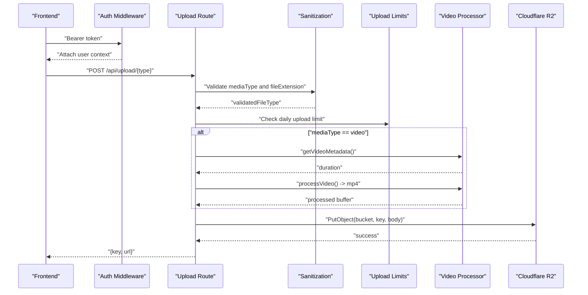
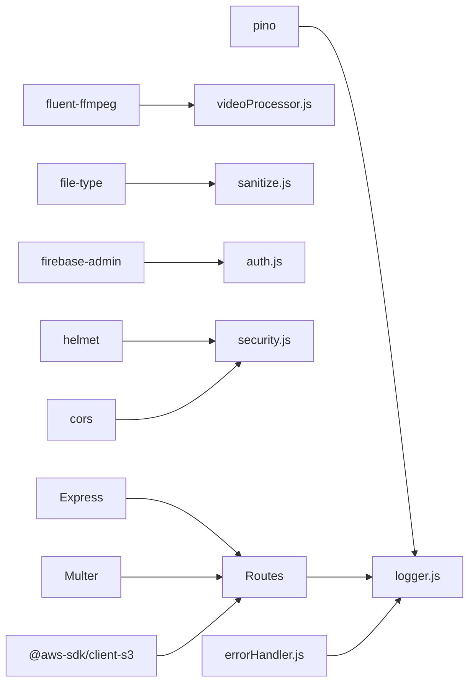
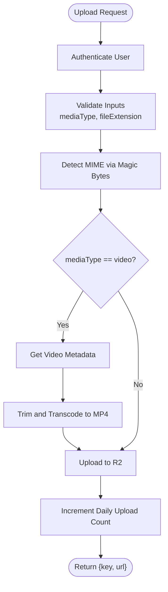

# Media Processing

<cite>
**Referenced Files in This Document**
- [upload.js](file://backend/src/routes/upload.js)
- [sanitize.js](file://backend/src/middleware/sanitize.js)
- [uploadLimits.js](file://backend/src/middleware/uploadLimits.js)
- [videoProcessor.js](file://backend/src/utils/videoProcessor.js)
- [auth.js](file://backend/src/middleware/auth.js)
- [security.js](file://backend/src/middleware/security.js)
- [env.js](file://backend/src/config/env.js)
- [.env](file://backend/.env)
- [package.json](file://backend/package.json)
- [logger.js](file://backend/src/utils/logger.js)
- [errorHandler.js](file://backend/src/middleware/errorHandler.js)
- [progressiveLimiter.js](file://backend/src/middleware/progressiveLimiter.js)
- [proxy.js](file://backend/src/routes/proxy.js)
- [DEPLOYMENT_GUIDE.md](file://DEPLOYMENT_GUIDE.md)
- [PRODUCTION_READINESS_AUDIT_REPORT.md](file://PRODUCTION_READINESS_AUDIT_REPORT.md)
</cite>

## Table of Contents
1. [Introduction](#introduction)
2. [Project Structure](#project-structure)
3. [Core Components](#core-components)
4. [Architecture Overview](#architecture-overview)
5. [Detailed Component Analysis](#detailed-component-analysis)
6. [Dependency Analysis](#dependency-analysis)
7. [Performance Considerations](#performance-considerations)
8. [Troubleshooting Guide](#troubleshooting-guide)
9. [Conclusion](#conclusion)
10. [Appendices](#appendices)

## Introduction
This document describes the media processing system responsible for secure image and video uploads, validation, sanitization, and storage via Cloudflare R2. It explains the upload validation and sanitization workflow, security controls against malicious content, the video processing pipeline (transcoding, trimming, format conversion, and quality optimization), and Cloudflare R2 integration for media storage, CDN distribution, and access control. It also covers compression algorithms, size optimization techniques, supported file formats, error handling, retry strategies, and storage quota management. Practical examples illustrate typical media processing workflows and integration patterns with the frontend application.

## Project Structure
The media upload and processing logic resides primarily in the backend under the src directory:
- Routes define upload endpoints for profile images and post media.
- Middleware enforces authentication, token expiration, request size limits, file validation, magic-byte verification, and progressive rate limiting.
- Utilities encapsulate video metadata extraction and FFmpeg-based processing.
- Configuration and environment variables manage R2 connectivity and public URLs.
- Security middleware applies enterprise-grade headers and CORS policies.
- Error handling centralizes logging and response formatting.

**Diagram sources**
- [upload.js](file://backend/src/routes/upload.js#L1-L225)
- [auth.js](file://backend/src/middleware/auth.js#L1-L164)
- [sanitize.js](file://backend/src/middleware/sanitize.js#L1-L154)
- [uploadLimits.js](file://backend/src/middleware/uploadLimits.js#L1-L55)
- [progressiveLimiter.js](file://backend/src/middleware/progressiveLimiter.js#L1-L61)
- [videoProcessor.js](file://backend/src/utils/videoProcessor.js#L1-L61)
- [env.js](file://backend/src/config/env.js#L1-L31)
- [.env](file://backend/.env#L1-L22)
- [package.json](file://backend/package.json#L1-L56)
- [logger.js](file://backend/src/utils/logger.js#L1-L29)
- [errorHandler.js](file://backend/src/middleware/errorHandler.js#L1-L35)
- [security.js](file://backend/src/middleware/security.js#L1-L75)

**Section sources**
- [upload.js](file://backend/src/routes/upload.js#L1-L225)
- [env.js](file://backend/src/config/env.js#L1-L31)
- [.env](file://backend/.env#L1-L22)
- [package.json](file://backend/package.json#L1-L56)

## Core Components
- Upload routes: Profile image and post media endpoints with memory-based Multer uploads, validation, and R2 storage.
- File validation and sanitization: Express validators, magic-byte detection, MIME type enforcement, and token expiration checks.
- Video processing: Metadata probing and FFmpeg-based transcoding with trimming, format conversion to MP4, and quality optimization.
- Cloudflare R2 integration: S3-compatible client configured with account credentials and bucket settings; public URL exposure via configured base URL.
- Rate limiting and quotas: Progressive rate limiting and daily upload caps enforced via Firestore.
- Security: Helmet headers, strict CORS, request timeouts, and centralized error handling.

**Section sources**
- [upload.js](file://backend/src/routes/upload.js#L25-L222)
- [sanitize.js](file://backend/src/middleware/sanitize.js#L32-L99)
- [videoProcessor.js](file://backend/src/utils/videoProcessor.js#L12-L60)
- [env.js](file://backend/src/config/env.js#L15-L21)
- [uploadLimits.js](file://backend/src/middleware/uploadLimits.js#L10-L54)
- [security.js](file://backend/src/middleware/security.js#L9-L74)
- [errorHandler.js](file://backend/src/middleware/errorHandler.js#L3-L31)

## Architecture Overview
The media upload flow integrates authentication, validation, optional video processing, and R2 storage. The frontend sends multipart form data to the backend, which validates inputs, optionally processes video, and stores the file in R2. Public URLs are constructed using the configured base URL.

**Diagram sources**
- [upload.js](file://backend/src/routes/upload.js#L80-L222)
- [sanitize.js](file://backend/src/middleware/sanitize.js#L32-L99)
- [uploadLimits.js](file://backend/src/middleware/uploadLimits.js#L10-L36)
- [videoProcessor.js](file://backend/src/utils/videoProcessor.js#L12-L60)

## Detailed Component Analysis

### Upload Routes and Endpoints
- Profile image upload: Validates file type via magic bytes, constructs a unique key under a profile-images path, and uploads to R2. Returns the stored key and public URL.
- Post media upload: Accepts mediaType and postId, enforces daily upload limits, validates file type, optionally processes video (trimming and MP4 conversion), writes temporary files for processing, and uploads the final buffer to R2. Increments daily upload count after successful storage.

Key behaviors:
- Memory-based uploads with a 200 MB limit.
- Temporary file usage for video processing on disk.
- Consistent MP4 output for videos.
- Cleanup of temporary files in a finally block.

**Section sources**
- [upload.js](file://backend/src/routes/upload.js#L81-L122)
- [upload.js](file://backend/src/routes/upload.js#L124-L222)

### File Upload Validation and Sanitization
- Request sanitization: Applies mongoSanitize, XSS cleaning, and HPP protections to incoming requests.
- Input validation: Ensures mediaType is image or video and fileExtension matches allowed values.
- Magic-byte validation: Detects actual MIME type from buffer and verifies it aligns with declared mediaType.
- Token expiration: Enforces token age checks for non-custom tokens and allows relaxed expiration for better UX while logging security events.

Security measures:
- Express validators capture invalid inputs early.
- Magic-byte detection prevents MIME sniffing bypasses.
- Security events logged for suspicious attempts.

**Section sources**
- [sanitize.js](file://backend/src/middleware/sanitize.js#L8-L29)
- [sanitize.js](file://backend/src/middleware/sanitize.js#L32-L40)
- [sanitize.js](file://backend/src/middleware/sanitize.js#L42-L99)
- [sanitize.js](file://backend/src/middleware/sanitize.js#L101-L132)
- [logger.js](file://backend/src/utils/logger.js#L20-L26)

### Video Processing Pipeline
- Metadata extraction: Uses FFprobe to retrieve duration and other attributes.
- Transcoding and trimming: FFmpeg-based processing trims videos exceeding a threshold and converts them to MP4 with H.264/AAC, applying quality settings and faststart optimization.
- Output format: Ensures consistent MP4 output for videos, updating keys accordingly.

Compression and optimization:
- CRF-based quality control.
- Faststart flag for progressive download.
- Duration-based trimming to enforce maximum length.

**Section sources**
- [videoProcessor.js](file://backend/src/utils/videoProcessor.js#L12-L22)
- [videoProcessor.js](file://backend/src/utils/videoProcessor.js#L31-L60)

### Cloudflare R2 Integration
- Client configuration: S3-compatible client using account ID, access key, secret key, and bucket name from environment variables.
- Endpoint construction: Uses the account-based endpoint URL.
- Upload mechanism: PutObject with explicit Content-Type, Content-Length, and CacheControl headers.
- Public URL exposure: Constructed using R2_PUBLIC_BASE_URL and stored key.

Access control:
- Authentication required for all upload endpoints.
- CORS configured with allowed origins and credentials support.

**Section sources**
- [upload.js](file://backend/src/routes/upload.js#L36-L43)
- [upload.js](file://backend/src/routes/upload.js#L61-L75)
- [env.js](file://backend/src/config/env.js#L15-L21)
- [.env](file://backend/.env#L8-L13)
- [security.js](file://backend/src/middleware/security.js#L16-L46)

### Storage Quota Management and Retry Mechanisms
- Daily upload cap: Enforced via Firestore document keyed by user and date; increments after successful R2 upload.
- Retry strategy: Not implemented in code; failures are logged and returned to the client. Consider implementing exponential backoff at the client or queue-based retries externally.

**Section sources**
- [uploadLimits.js](file://backend/src/middleware/uploadLimits.js#L10-L36)
- [uploadLimits.js](file://backend/src/middleware/uploadLimits.js#L42-L54)
- [upload.js](file://backend/src/routes/upload.js#L186-L187)

### Security Measures Against Malicious Content
- Authentication: Dual-path JWT and Firebase ID token verification with revocation checks and status validation.
- Token expiration: Enforces token age with relaxed policy for better UX while logging security events.
- Request size limits: Validates Content-Length to prevent oversized payloads.
- Input sanitization: Express validators and sanitizers mitigate injection and XSS risks.
- CORS and headers: Stricter origin whitelisting and security headers via Helmet.

**Section sources**
- [auth.js](file://backend/src/middleware/auth.js#L20-L161)
- [sanitize.js](file://backend/src/middleware/sanitize.js#L101-L132)
- [sanitize.js](file://backend/src/middleware/sanitize.js#L135-L153)
- [security.js](file://backend/src/middleware/security.js#L9-L46)
- [logger.js](file://backend/src/utils/logger.js#L20-L26)

### Supported File Formats and Compression
Supported formats:
- Images: JPEG, PNG, WebP, GIF.
- Videos: MP4, WebM, MOV.

Compression and optimization:
- Video: H.264 video codec, AAC audio codec, MP4 container, CRF-based quality, faststart optimization.
- Image: Determined by upload flow; images are stored as uploaded with appropriate MIME type.

**Section sources**
- [sanitize.js](file://backend/src/middleware/sanitize.js#L36-L38)
- [sanitize.js](file://backend/src/middleware/sanitize.js#L64-L67)
- [videoProcessor.js](file://backend/src/utils/videoProcessor.js#L34-L41)

### Error Handling and Logging
- Centralized error handler: Logs request context, method, path, and body; returns structured error responses with optional stack traces in non-production environments.
- Security event logging: Dedicated function for security-related warnings with metadata.
- Timeout handling: Route-specific timeouts; multipart and slow routes bypass strict timeouts.

**Section sources**
- [errorHandler.js](file://backend/src/middleware/errorHandler.js#L3-L31)
- [logger.js](file://backend/src/utils/logger.js#L20-L26)
- [security.js](file://backend/src/middleware/security.js#L48-L74)

### CDN Distribution and Access Control
- CDN distribution: Public URLs constructed from R2_PUBLIC_BASE_URL; caching controlled via Cache-Control headers during upload.
- Access control: Authentication required; CORS configured with allowed origins and credentials; security headers applied.

**Section sources**
- [upload.js](file://backend/src/routes/upload.js#L106-L109)
- [upload.js](file://backend/src/routes/upload.js#L197-L199)
- [upload.js](file://backend/src/routes/upload.js#L72)
- [security.js](file://backend/src/middleware/security.js#L16-L46)

### Practical Examples of Media Processing Workflows
- Profile image upload:
  - Frontend sends a single image file with mediaType=image.
  - Backend validates MIME type, generates a unique key, uploads to R2, and returns key and URL.
- Post video upload:
  - Frontend sends a video file with mediaType=video and optional postId.
  - Backend checks daily limit, validates file type, extracts metadata, processes video (trimming and MP4 conversion), uploads to R2, increments quota, and returns key and URL.

Integration patterns:
- Frontend sets Authorization header with Bearer token.
- Frontend constructs multipart payload with file and mediaType.
- Frontend handles returned key and URL for subsequent operations (e.g., attaching to posts).

**Section sources**
- [upload.js](file://backend/src/routes/upload.js#L81-L122)
- [upload.js](file://backend/src/routes/upload.js#L124-L222)

## Dependency Analysis
The upload system relies on several external libraries and services:
- Express for routing and middleware.
- Multer for memory-based uploads.
- AWS SDK S3 client for R2 compatibility.
- FFmpeg and fluent-ffmpeg for video processing.
- file-type for magic-byte detection.
- Firebase Admin for authentication.
- Helmet and CORS for security and cross-origin handling.
- Pino for structured logging.

**Diagram sources**
- [package.json](file://backend/package.json#L24-L54)
- [upload.js](file://backend/src/routes/upload.js#L1-L20)
- [videoProcessor.js](file://backend/src/utils/videoProcessor.js#L1-L5)
- [sanitize.js](file://backend/src/middleware/sanitize.js#L49-L50)
- [auth.js](file://backend/src/middleware/auth.js#L1-L5)
- [security.js](file://backend/src/middleware/security.js#L1-L4)
- [logger.js](file://backend/src/utils/logger.js#L1-L13)
- [errorHandler.js](file://backend/src/middleware/errorHandler.js#L1-L2)

**Section sources**
- [package.json](file://backend/package.json#L24-L54)

## Performance Considerations
- Memory-based uploads: Large videos consume RAM; consider streaming to disk for very large files.
- FFmpeg processing: CPU-intensive; offload to dedicated workers or containers with sufficient CPU.
- Temporary files: Ensure adequate disk space and cleanup; current implementation cleans up in finally blocks.
- CDN caching: Public immutable caching reduces origin load; tune Cache-Control as needed.
- Rate limiting: Progressive limiter mitigates abuse; adjust policies based on traffic patterns.

[No sources needed since this section provides general guidance]

## Troubleshooting Guide
Common issues and resolutions:
- Missing environment variables: Ensure R2 credentials, bucket name, and public base URL are set.
- Firebase initialization failure: Verify private key formatting and client email.
- R2 upload failures: Confirm credentials, bucket permissions, and public base URL correctness.
- Rate limit errors: Wait for cooldown or adjust policies; verify IP identification behind proxies.
- Video processing errors: Check FFmpeg availability and disk space; review logs for FFmpeg errors.
- Security events: Monitor logs for validation failures, expired tokens, and request size violations.

**Section sources**
- [PRODUCTION_READINESS_AUDIT_REPORT.md](file://PRODUCTION_READINESS_AUDIT_REPORT.md#L22-L53)
- [DEPLOYMENT_GUIDE.md](file://DEPLOYMENT_GUIDE.md#L9-L87)
- [errorHandler.js](file://backend/src/middleware/errorHandler.js#L6-L14)
- [logger.js](file://backend/src/utils/logger.js#L20-L26)

## Conclusion
The media processing system provides a robust, secure, and scalable foundation for handling image and video uploads. It enforces strong validation and sanitization, performs optional video processing to ensure consistent formats and optimized sizes, and integrates seamlessly with Cloudflare R2 for reliable storage and CDN distribution. While the current implementation focuses on correctness and security, enhancements such as retry mechanisms and improved error handling could further strengthen reliability.

[No sources needed since this section summarizes without analyzing specific files]

## Appendices

### Appendix A: Upload Flow Details

**Diagram sources**
- [upload.js](file://backend/src/routes/upload.js#L140-L222)
- [sanitize.js](file://backend/src/middleware/sanitize.js#L42-L99)
- [videoProcessor.js](file://backend/src/utils/videoProcessor.js#L12-L60)
- [uploadLimits.js](file://backend/src/middleware/uploadLimits.js#L42-L54)