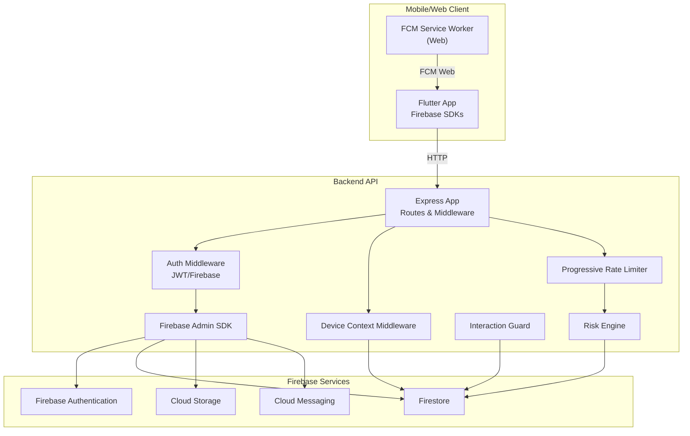
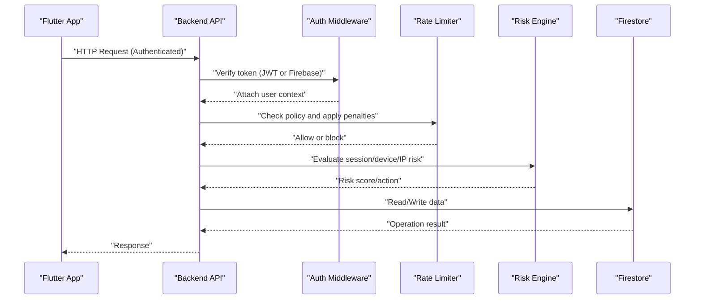
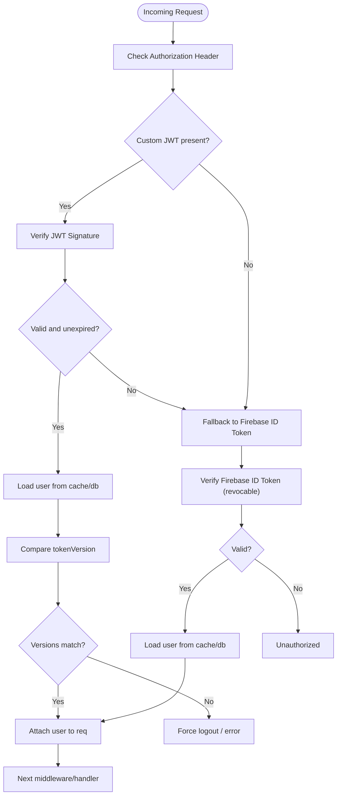
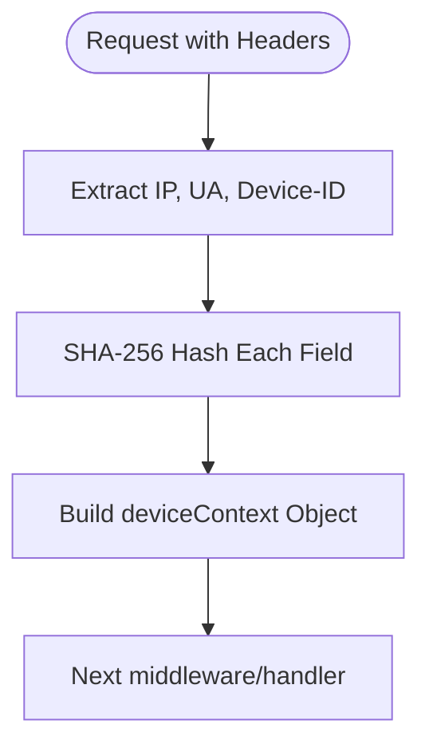
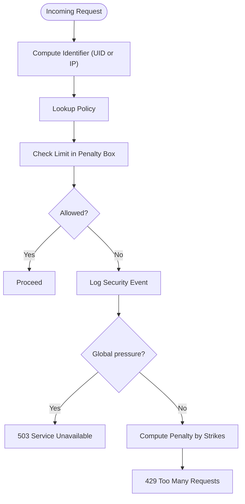
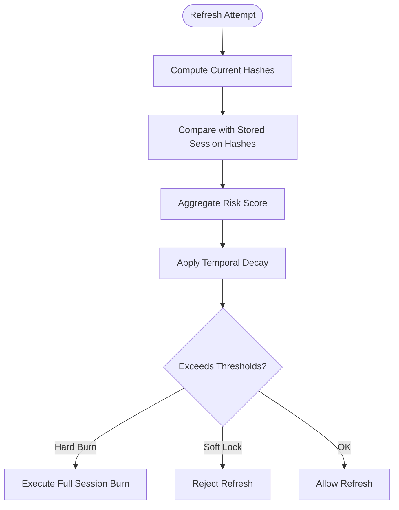
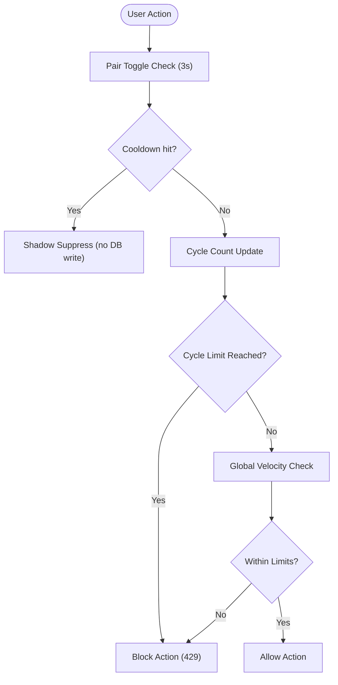
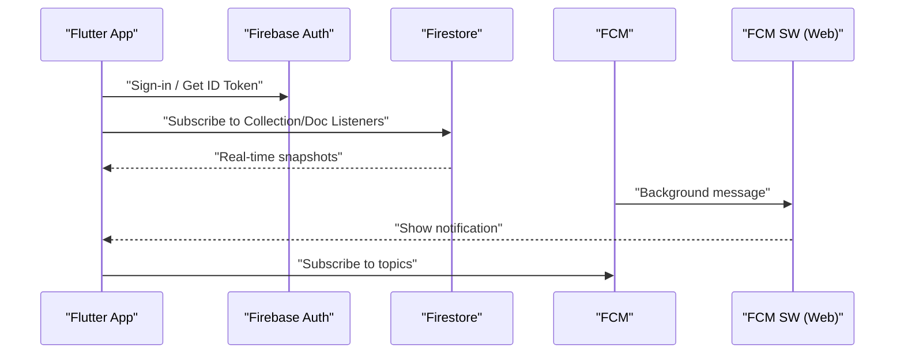
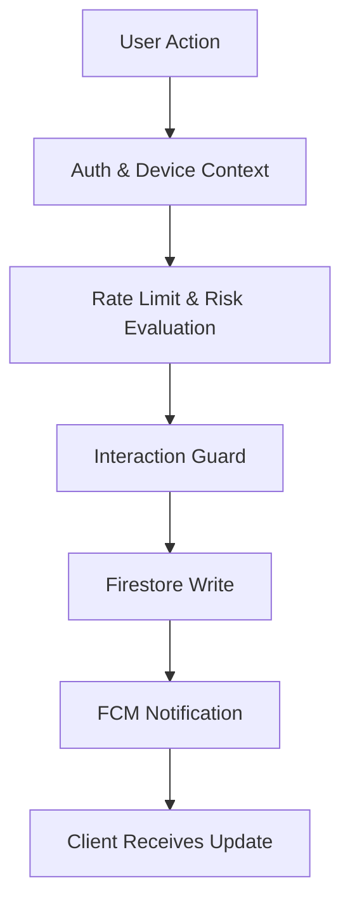
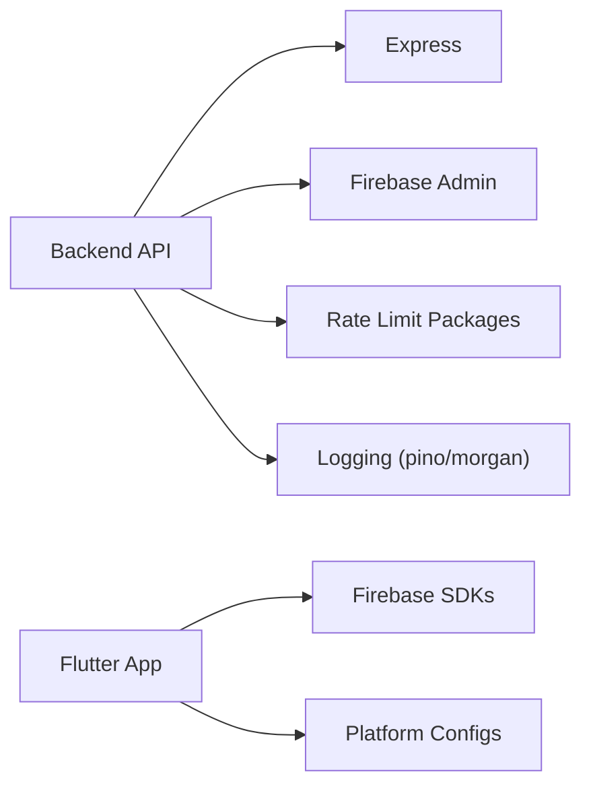

# Architecture Overview

<cite>
**Referenced Files in This Document**
- [backend/src/app.js](file://backend/src/app.js)
- [backend/src/index.js](file://backend/src/index.js)
- [backend/package.json](file://backend/package.json)
- [backend/src/middleware/auth.js](file://backend/src/middleware/auth.js)
- [backend/src/middleware/deviceContext.js](file://backend/src/middleware/deviceContext.js)
- [backend/src/middleware/progressiveLimiter.js](file://backend/src/middleware/progressiveLimiter.js)
- [backend/src/services/RiskEngine.js](file://backend/src/services/RiskEngine.js)
- [backend/src/services/InteractionGuard.js](file://backend/src/services/InteractionGuard.js)
- [backend/src/config/firebase.js](file://backend/src/config/firebase.js)
- [testpro-main/pubspec.yaml](file://testpro-main/pubspec.yaml)
- [testpro-main/lib/firebase_options.dart](file://testpro-main/lib/firebase_options.dart)
- [testpro-main/android/app/google-services.json](file://testpro-main/android/app/google-services.json)
- [testpro-main/web/firebase-messaging-sw.js](file://testpro-main/web/firebase-messaging-sw.js)
</cite>

## Table of Contents
1. [Introduction](#introduction)
2. [Project Structure](#project-structure)
3. [Core Components](#core-components)
4. [Architecture Overview](#architecture-overview)
5. [Detailed Component Analysis](#detailed-component-analysis)
6. [Dependency Analysis](#dependency-analysis)
7. [Performance Considerations](#performance-considerations)
8. [Troubleshooting Guide](#troubleshooting-guide)
9. [Conclusion](#conclusion)
10. [Appendices](#appendices)

## Introduction
This document presents the architecture of LocalMe’s system, focusing on the separation between the Flutter mobile application and the Node.js backend API, and how they integrate with Firebase services. It explains request flows from user actions through authentication, content processing, storage, and delivery, and documents the security architecture including JWT token management, device context tracking, risk assessment, and progressive rate limiting. Real-time communication is covered via Firebase Cloud Messaging and Firestore listeners. Cross-cutting concerns such as authentication, logging, error handling, and performance monitoring are addressed, along with technology stack integration patterns.

## Project Structure
LocalMe comprises two primary parts:
- Backend API: A Node.js/Express application with middleware for security, rate limiting, and authentication, and services for risk assessment and interaction guarding.
- Flutter Mobile/Web Application: A multi-platform client using Firebase for authentication, real-time data, and push notifications.

**Diagram sources**
- [backend/src/app.js](file://backend/src/app.js#L1-L78)
- [backend/src/middleware/auth.js](file://backend/src/middleware/auth.js#L1-L164)
- [backend/src/middleware/deviceContext.js](file://backend/src/middleware/deviceContext.js#L1-L24)
- [backend/src/middleware/progressiveLimiter.js](file://backend/src/middleware/progressiveLimiter.js#L1-L61)
- [backend/src/services/RiskEngine.js](file://backend/src/services/RiskEngine.js#L1-L170)
- [backend/src/services/InteractionGuard.js](file://backend/src/services/InteractionGuard.js#L1-L124)
- [backend/src/config/firebase.js](file://backend/src/config/firebase.js#L1-L46)
- [testpro-main/pubspec.yaml](file://testpro-main/pubspec.yaml#L10-L45)
- [testpro-main/lib/firebase_options.dart](file://testpro-main/lib/firebase_options.dart#L17-L89)
- [testpro-main/web/firebase-messaging-sw.js](file://testpro-main/web/firebase-messaging-sw.js#L1-L25)

**Section sources**
- [backend/src/app.js](file://backend/src/app.js#L1-L78)
- [backend/src/index.js](file://backend/src/index.js#L1-L37)
- [backend/package.json](file://backend/package.json#L1-L56)
- [testpro-main/pubspec.yaml](file://testpro-main/pubspec.yaml#L10-L45)

## Core Components
- Express application with layered middleware for security, logging, rate limiting, and routing.
- Authentication middleware supporting both custom short-lived JWTs and Firebase ID tokens, with user caching and token version checks.
- Device context middleware hashing sensitive identifiers to enforce privacy and aid risk evaluation.
- Progressive rate limiter with policy-driven controls and a global penalty box for coordinated abuse mitigation.
- Risk engine evaluating session continuity and device/user-agent/IP changes, with thresholds for soft lock and hard burn.
- Interaction guard preventing graph abuse via pair-toggle cooldowns and velocity checks.
- Firebase Admin SDK integration for secure backend operations against Firestore, Authentication, and Messaging.

**Section sources**
- [backend/src/app.js](file://backend/src/app.js#L1-L78)
- [backend/src/middleware/auth.js](file://backend/src/middleware/auth.js#L1-L164)
- [backend/src/middleware/deviceContext.js](file://backend/src/middleware/deviceContext.js#L1-L24)
- [backend/src/middleware/progressiveLimiter.js](file://backend/src/middleware/progressiveLimiter.js#L1-L61)
- [backend/src/services/RiskEngine.js](file://backend/src/services/RiskEngine.js#L1-L170)
- [backend/src/services/InteractionGuard.js](file://backend/src/services/InteractionGuard.js#L1-L124)
- [backend/src/config/firebase.js](file://backend/src/config/firebase.js#L1-L46)

## Architecture Overview
The system separates presentation (Flutter) from backend logic (Node.js), while both integrate tightly with Firebase services. Requests flow from the Flutter app to the backend API over HTTPS, with authentication validated either via custom JWTs or Firebase ID tokens. The backend enforces rate limits and security policies, persists data to Firestore, and triggers Firebase services for notifications and storage. Real-time updates are delivered via Firestore listeners and FCM.

**Diagram sources**
- [backend/src/app.js](file://backend/src/app.js#L21-L60)
- [backend/src/middleware/auth.js](file://backend/src/middleware/auth.js#L20-L161)
- [backend/src/middleware/progressiveLimiter.js](file://backend/src/middleware/progressiveLimiter.js#L22-L60)
- [backend/src/services/RiskEngine.js](file://backend/src/services/RiskEngine.js#L71-L130)
- [backend/src/config/firebase.js](file://backend/src/config/firebase.js#L41-L45)

## Detailed Component Analysis

### Authentication and Token Management
- Accepts Bearer tokens; tries custom JWT verification first, then falls back to Firebase ID token verification with revocation checking enabled.
- Attaches a normalized user object to the request, including display metadata and role/status.
- Implements token version checks to force logout on policy changes and blocks suspended accounts.
- Uses an in-memory cache for user profiles to reduce Firestore reads.

**Diagram sources**
- [backend/src/middleware/auth.js](file://backend/src/middleware/auth.js#L20-L161)

**Section sources**
- [backend/src/middleware/auth.js](file://backend/src/middleware/auth.js#L1-L164)
- [backend/src/config/firebase.js](file://backend/src/config/firebase.js#L1-L46)

### Device Context Tracking and Privacy
- Extracts and hashes IP, User-Agent, and device ID to avoid storing raw identifying data.
- Enforces device ID presence for specific refresh endpoints.
- Provides deterministic fingerprints for risk scoring and session continuity checks.

**Diagram sources**
- [backend/src/middleware/deviceContext.js](file://backend/src/middleware/deviceContext.js#L7-L23)

**Section sources**
- [backend/src/middleware/deviceContext.js](file://backend/src/middleware/deviceContext.js#L1-L24)

### Progressive Rate Limiting and Penalties
- Centralized policy map defines per-action limits and windows.
- Uses a global penalty box to track per-identifier counters and apply escalating penalties.
- Supports user-based limiting when a user is authenticated.

**Diagram sources**
- [backend/src/middleware/progressiveLimiter.js](file://backend/src/middleware/progressiveLimiter.js#L22-L60)

**Section sources**
- [backend/src/middleware/progressiveLimiter.js](file://backend/src/middleware/progressiveLimiter.js#L1-L61)

### Risk Assessment Engine
- Evaluates refresh risk by comparing device/user-agent/IP hashes.
- Applies temporal decay to risk scores based on last seen.
- Enforces thresholds for soft lock and hard burn actions.
- Performs session continuity checks to detect concurrent refresh races and excessive rotation.

**Diagram sources**
- [backend/src/services/RiskEngine.js](file://backend/src/services/RiskEngine.js#L11-L130)

**Section sources**
- [backend/src/services/RiskEngine.js](file://backend/src/services/RiskEngine.js#L1-L170)

### Interaction Guard (Graph Integrity)
- Prevents abuse via pair-toggle cooldowns and cycle detection.
- Enforces global velocity caps for likes and follows.
- Maintains in-memory state with periodic cleanup.

**Diagram sources**
- [backend/src/services/InteractionGuard.js](file://backend/src/services/InteractionGuard.js#L47-L122)

**Section sources**
- [backend/src/services/InteractionGuard.js](file://backend/src/services/InteractionGuard.js#L1-L124)

### Real-Time Communication Architecture
- Flutter integrates Firebase SDKs for Authentication, Firestore, Cloud Functions, and Messaging.
- Web builds use a service worker to receive background FCM messages.
- Firestore listeners enable real-time updates for feeds and notifications.

**Diagram sources**
- [testpro-main/pubspec.yaml](file://testpro-main/pubspec.yaml#L25-L36)
- [testpro-main/lib/firebase_options.dart](file://testpro-main/lib/firebase_options.dart#L17-L89)
- [testpro-main/web/firebase-messaging-sw.js](file://testpro-main/web/firebase-messaging-sw.js#L1-L25)

**Section sources**
- [testpro-main/pubspec.yaml](file://testpro-main/pubspec.yaml#L10-L45)
- [testpro-main/lib/firebase_options.dart](file://testpro-main/lib/firebase_options.dart#L17-L89)
- [testpro-main/web/firebase-messaging-sw.js](file://testpro-main/web/firebase-messaging-sw.js#L1-L25)

### Data Flow Patterns
- User actions (likes, follows, uploads) traverse through auth, guards, and rate limiting before hitting Firestore.
- Uploads leverage Firebase services and Cloud Storage; processing hooks can be implemented via Cloud Functions.
- Notifications are triggered via FCM and rendered locally or in the background via the service worker.

**Diagram sources**
- [backend/src/middleware/auth.js](file://backend/src/middleware/auth.js#L20-L161)
- [backend/src/middleware/deviceContext.js](file://backend/src/middleware/deviceContext.js#L7-L23)
- [backend/src/middleware/progressiveLimiter.js](file://backend/src/middleware/progressiveLimiter.js#L22-L60)
- [backend/src/services/InteractionGuard.js](file://backend/src/services/InteractionGuard.js#L47-L122)
- [backend/src/services/RiskEngine.js](file://backend/src/services/RiskEngine.js#L71-L130)
- [backend/src/config/firebase.js](file://backend/src/config/firebase.js#L41-L45)

## Dependency Analysis
- Backend depends on Express, Firebase Admin SDK, helmet/cors/morgan for security and logging, and rate-limiting packages.
- Flutter depends on Firebase SDKs for core features and platform-specific configurations.

**Diagram sources**
- [backend/package.json](file://backend/package.json#L24-L54)
- [testpro-main/pubspec.yaml](file://testpro-main/pubspec.yaml#L25-L36)

**Section sources**
- [backend/package.json](file://backend/package.json#L1-L56)
- [testpro-main/pubspec.yaml](file://testpro-main/pubspec.yaml#L10-L45)

## Performance Considerations
- Use the in-memory user cache in the auth middleware to minimize Firestore reads.
- Apply progressive rate limiting to reduce load during spikes and mitigate abuse.
- Keep device context hashing to avoid storing sensitive data and reduce index sizes.
- Monitor logs and integrate performance monitoring to track latency and throughput.

## Troubleshooting Guide
- Authentication failures: Check token presence/format, verify JWT signature and expiry, and confirm Firebase ID token validity and revocation status.
- Rate limiting: Review policy keys and per-identifier counters; escalate penalties are intentional for abuse mitigation.
- Risk events: Investigate device/user-agent/IP hash mismatches and session continuity anomalies.
- Interaction guard blocks: Validate rapid toggling patterns and global velocity limits.
- Logging: Inspect centralized error and HTTP logs for structured entries and stack traces.

**Section sources**
- [backend/src/middleware/auth.js](file://backend/src/middleware/auth.js#L20-L161)
- [backend/src/middleware/progressiveLimiter.js](file://backend/src/middleware/progressiveLimiter.js#L33-L56)
- [backend/src/services/RiskEngine.js](file://backend/src/services/RiskEngine.js#L126-L130)
- [backend/src/services/InteractionGuard.js](file://backend/src/services/InteractionGuard.js#L60-L76)

## Conclusion
LocalMe’s architecture cleanly separates the Flutter client from the Node.js backend while leveraging Firebase for identity, real-time data, and messaging. The backend enforces robust security through dual token verification, device context hashing, progressive rate limiting, and a risk-aware session continuity engine. Together, these components deliver a secure, responsive platform with strong protections against abuse and scalable real-time experiences.

## Appendices

### Technology Stack Integration Highlights
- Backend: Express, Firebase Admin SDK, helmet/cors/morgan, rate-limiting and slow-down packages, pino/winston for logging.
- Flutter: firebase_core, firebase_auth, cloud_firestore, firebase_messaging, cloud_functions, geocoding, http.

**Section sources**
- [backend/package.json](file://backend/package.json#L24-L54)
- [testpro-main/pubspec.yaml](file://testpro-main/pubspec.yaml#L25-L36)