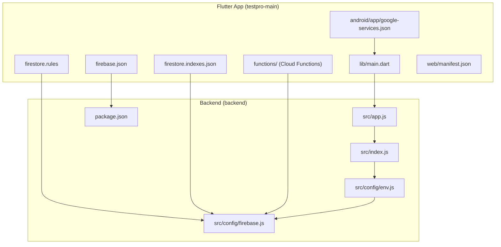

# Getting Started

<cite>
**Referenced Files in This Document**
- [README.md](file://README.md)
- [pubspec.yaml](file://testpro-main/pubspec.yaml)
- [main.dart](file://testpro-main/lib/main.dart)
- [firebase.json](file://testpro-main/firebase.json)
- [google-services.json](file://testpro-main/android/app/google-services.json)
- [package.json](file://backend/package.json)
- [env.js](file://backend/src/config/env.js)
- [firebase.js](file://backend/src/config/firebase.js)
- [index.js](file://backend/src/index.js)
- [app.js](file://backend/src/app.js)
- [firestore.rules](file://testpro-main/firestore.rules)
- [firestore.indexes.json](file://testpro-main/firestore.indexes.json)
- [manifest.json](file://testpro-main/web/manifest.json)
- [functions/package.json](file://testpro-main/functions/package.json)
</cite>

## Table of Contents
1. [Introduction](#introduction)
2. [Prerequisites](#prerequisites)
3. [Project Structure Walkthrough](#project-structure-walkthrough)
4. [Environment Setup](#environment-setup)
5. [Flutter App Setup](#flutter-app-setup)
6. [Backend API Server Setup](#backend-api-server-setup)
7. [Firebase Project Configuration](#firebase-project-configuration)
8. [Running the Application](#running-the-application)
9. [Verification Steps](#verification-steps)
10. [Platform-Specific Setup](#platform-specific-setup)
11. [Debugging and Development Tools](#debugging-and-development-tools)
12. [Troubleshooting Guide](#troubleshooting-guide)
13. [Conclusion](#conclusion)

## Introduction
This guide walks you through setting up the LocalMe development environment from scratch. You will install the Flutter SDK, configure Node.js, set up Firebase, and connect the Flutter frontend with the Node.js backend. The project uses Firebase for authentication and Firestore, Cloudflare R2 for media storage, and Express.js for the backend API.

## Prerequisites
Before starting, ensure you have:
- Flutter SDK: ^3.10.3
- Node.js: >=20.0.0 (for backend)
- Android Studio or VS Code for Flutter development
- Firebase account with a Firebase project
- Cloudflare account with R2 bucket configured
- Git for cloning the repository

These requirements are defined in the project documentation and dependency manifests.

**Section sources**
- [README.md](file://README.md#L15-L21)
- [pubspec.yaml](file://testpro-main/pubspec.yaml#L7-L8)
- [package.json](file://backend/package.json#L7-L8)

## Project Structure Walkthrough
The repository is organized into two main parts:
- Flutter application: testpro-main/
- Backend API: backend/

Key directories and files:
- Flutter app: lib/, android/, ios/, web/, functions/, firebase.json, firestore.rules, firestore.indexes.json
- Backend: src/, scripts/, .env, .env.example, package.json
- Shared configuration: firebase.json, firestore.rules, firestore.indexes.json

**Diagram sources**
- [main.dart](file://testpro-main/lib/main.dart#L1-L22)
- [firebase.json](file://testpro-main/firebase.json#L1-L32)
- [google-services.json](file://testpro-main/android/app/google-services.json#L1-L38)
- [firestore.rules](file://testpro-main/firestore.rules#L1-L11)
- [firestore.indexes.json](file://testpro-main/firestore.indexes.json#L1-L181)
- [app.js](file://backend/src/app.js#L1-L78)
- [index.js](file://backend/src/index.js#L1-L37)
- [env.js](file://backend/src/config/env.js#L1-L31)
- [firebase.js](file://backend/src/config/firebase.js#L1-L46)
- [package.json](file://backend/package.json#L1-L56)

**Section sources**
- [README.md](file://README.md#L24-L42)

## Environment Setup
Set up your development environment with the required tools and versions.

- Flutter SDK: ^3.10.3
- Node.js: >=20.0.0

Installers and setup instructions are available from the official websites. After installation, verify versions:
- Flutter: flutter --version
- Node.js: node --version

**Section sources**
- [pubspec.yaml](file://testpro-main/pubspec.yaml#L7-L8)
- [package.json](file://backend/package.json#L7-L8)

## Flutter App Setup
Follow these steps to prepare the Flutter application.

1. Install dependencies
   - Run: flutter pub get

2. Configure Firebase
   - Create a Firebase project at the Firebase Console.
   - Enable Authentication (Email/Password and Google), Cloud Firestore, and Cloud Functions.
   - Download google-services.json (Android) and GoogleService-Info.plist (iOS).
   - Place google-services.json in android/app/google-services.json.
   - Place GoogleService-Info.plist in ios/Runner/GoogleService-Info.plist.

3. Configure environment variables
   - For development, pass API_URL via --dart-define flag when running:
     - flutter run --dart-define=API_URL=http://localhost:4000
   - For Google OAuth on web, set GOOGLE_CLIENT_ID similarly.

4. Optional: Configure fonts and assets
   - The project includes Inter fonts and video assets under assets/.

**Section sources**
- [README.md](file://README.md#L55-L83)
- [firebase.json](file://testpro-main/firebase.json#L1-L32)
- [google-services.json](file://testpro-main/android/app/google-services.json#L1-L38)
- [main.dart](file://testpro-main/lib/main.dart#L12-L22)

## Backend API Server Setup
Set up and run the Node.js backend API server.

1. Navigate to backend directory
   - cd backend

2. Install dependencies
   - npm install

3. Configure environment variables
   - Copy the example environment file: cp .env.example .env
   - Edit .env with your credentials:
     - PORT=4000
     - NODE_ENV=development
     - FIREBASE_PROJECT_ID, FIREBASE_PRIVATE_KEY, FIREBASE_CLIENT_EMAIL
     - R2_ACCOUNT_ID, R2_ACCESS_KEY_ID, R2_SECRET_ACCESS_KEY, R2_BUCKET_NAME, R2_PUBLIC_BASE_URL
     - CORS_ORIGIN=*

4. Start the backend server
   - Development: npm run dev
   - Production: npm start

5. Verify backend health
   - Access http://localhost:4000/health to confirm the server is running.

**Section sources**
- [README.md](file://README.md#L85-L151)
- [.env.example](file://backend/.env.example#L1-L25)
- [env.js](file://backend/src/config/env.js#L1-L31)
- [index.js](file://backend/src/index.js#L5-L8)

## Firebase Project Configuration
Configure Firebase for authentication, Firestore, and Cloud Functions.

1. Project settings
   - Enable Authentication: Email/Password and Google Sign-In.
   - Enable Cloud Firestore.
   - Enable Cloud Functions.

2. Service account credentials
   - In Firebase Console > Project Settings > Service Accounts, generate a new private key.
   - Copy the values into your backend .env file:
     - FIREBASE_PROJECT_ID
     - FIREBASE_PRIVATE_KEY
     - FIREBASE_CLIENT_EMAIL

3. Firestore security rules and indexes
   - Deploy Firestore rules and indexes using the provided files:
     - firestore.rules
     - firestore.indexes.json

4. Flutter Firebase options
   - firebase.json defines platform configurations for Android, iOS, macOS, web, and Windows.
   - The Flutter app initializes Firebase using DefaultFirebaseOptions.currentPlatform.

**Section sources**
- [README.md](file://README.md#L63-L72)
- [firebase.json](file://testpro-main/firebase.json#L1-L32)
- [firestore.rules](file://testpro-main/firestore.rules#L1-L11)
- [firestore.indexes.json](file://testpro-main/firestore.indexes.json#L1-L181)
- [firebase.js](file://backend/src/config/firebase.js#L7-L17)

## Running the Application
Start both the Flutter app and the backend server, then connect them.

1. Start the backend server
   - From the backend directory:
     - npm run dev

2. Start the Flutter app
   - From the testpro-main directory:
     - flutter run (device/emulator)
     - flutter run -d chrome (web)
     - flutter run --dart-define=API_URL=http://localhost:4000 (custom API URL)

3. Verify connectivity
   - Ensure the Flutter app can reach http://localhost:4000/health.
   - Confirm authentication flows work with Firebase.

**Section sources**
- [README.md](file://README.md#L181-L194)
- [index.js](file://backend/src/index.js#L5-L8)

## Verification Steps
Confirm your development environment is working correctly.

- Backend health check
  - curl http://localhost:4000/health
  - Expect a JSON response indicating status: ok

- Flutter app startup
  - flutter run completes without fatal errors
  - App initializes Firebase and navigates to Welcome or Home screen

- Authentication flow
  - Sign in using Email/Password or Google Sign-In
  - Verify user session and navigation to Home screen

- Media upload (if testing upload flow)
  - Ensure R2 credentials are valid in backend .env
  - Confirm uploads succeed and images load

**Section sources**
- [README.md](file://README.md#L235-L262)
- [index.js](file://backend/src/index.js#L23-L29)

## Platform-Specific Setup
Configure platform-specific requirements for Android, iOS, and web.

- Android
  - Place google-services.json in android/app/google-services.json
  - Ensure Gradle and Android SDK are installed
  - Use Android Studio or flutter run with an emulator/device

- iOS
  - Place GoogleService-Info.plist in ios/Runner/GoogleService-Info.plist
  - Use Xcode or flutter run with an iOS simulator/device

- Web
  - Configure web/manifest.json for PWA metadata
  - Run flutter run -d chrome
  - Set GOOGLE_CLIENT_ID for Google Sign-In on web via --dart-define

- Firebase platforms
  - firebase.json defines platform configurations for Android, iOS, macOS, web, and Windows
  - Flutter app uses DefaultFirebaseOptions.currentPlatform to initialize

**Section sources**
- [README.md](file://README.md#L63-L83)
- [firebase.json](file://testpro-main/firebase.json#L9-L31)
- [google-services.json](file://testpro-main/android/app/google-services.json#L1-L38)
- [manifest.json](file://testpro-main/web/manifest.json#L1-L36)

## Debugging and Development Tools
Use these tools and techniques to debug the integrated system.

- Flutter
  - flutter run with verbose logging
  - flutter attach to debug on a connected device
  - flutter analyze for static analysis

- Backend
  - npm run dev enables --watch mode for automatic restarts during development
  - Check backend logs for unhandled rejections and uncaught exceptions
  - Use curl or Postman to test endpoints

- Firebase
  - Monitor Firestore rules violations and Cloud Function logs
  - Validate service account credentials in backend .env

- Browser DevTools
  - Inspect network requests to the backend API
  - Check console for authentication and initialization errors

**Section sources**
- [README.md](file://README.md#L235-L262)
- [index.js](file://backend/src/index.js#L29-L36)

## Troubleshooting Guide
Common setup issues and resolutions.

- Port conflicts
  - Issue: Backend fails to start on PORT=4000
  - Resolution: Change PORT in backend/.env or kill the conflicting process

- Authentication problems
  - Issue: Google Sign-In fails on web
  - Resolution: Set GOOGLE_CLIENT_ID via --dart-define and verify client ID matches Firebase Console

  - Issue: API_URL not set warning
  - Resolution: Pass --dart-define=API_URL=http://localhost:4000 when running Flutter

- Firebase configuration errors
  - Issue: Firebase Admin initialization fails
  - Resolution: Verify FIREBASE_PROJECT_ID, FIREBASE_PRIVATE_KEY, and FIREBASE_CLIENT_EMAIL in backend .env
  - Ensure private key format is correct (literal \n characters preserved)

- Build errors after setup
  - Resolution: flutter clean, flutter pub get, then flutter run

- Backend upload failures
  - Resolution: Verify R2 credentials and backend logs; ensure Firestore rules allow backend access

**Section sources**
- [README.md](file://README.md#L235-L262)
- [env.js](file://backend/src/config/env.js#L10-L21)
- [firebase.js](file://backend/src/config/firebase.js#L13-L17)

## Conclusion
You now have the LocalMe development environment ready. The Flutter app connects to Firebase for authentication and Firestore, while the Node.js backend handles media uploads via Cloudflare R2. Use the verification steps to confirm everything works, and refer to the troubleshooting guide for common issues. For production deployment, follow the deployment instructions in the project documentation.