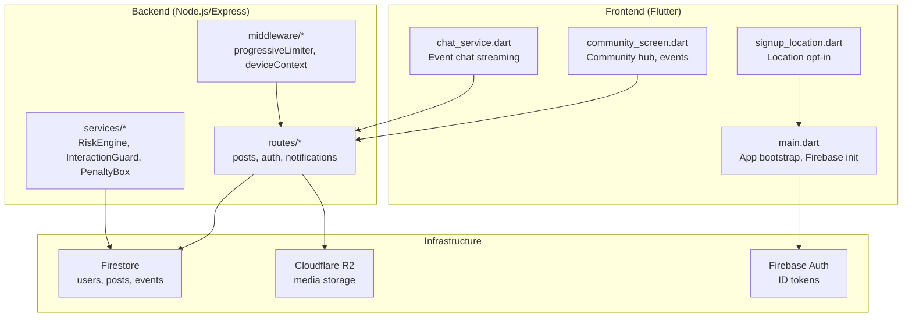
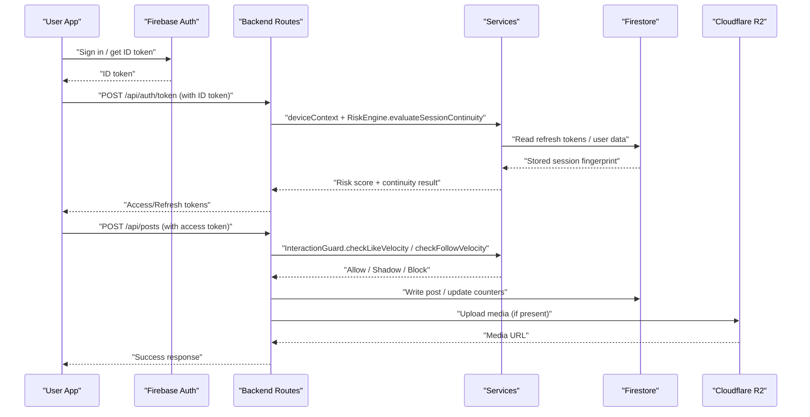
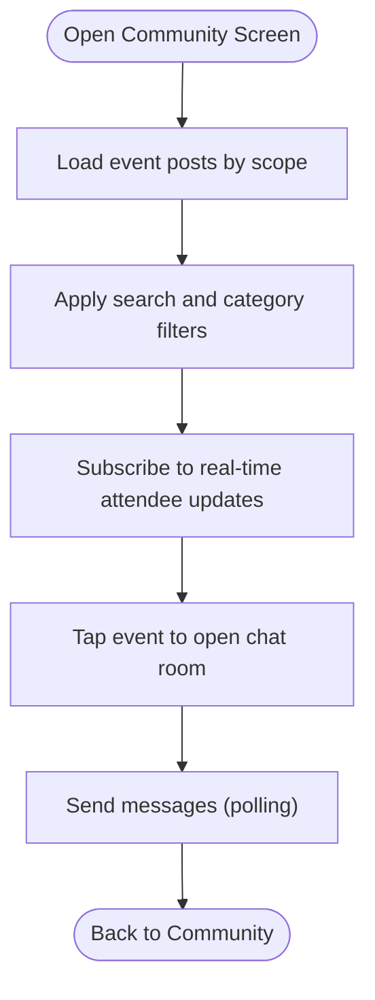
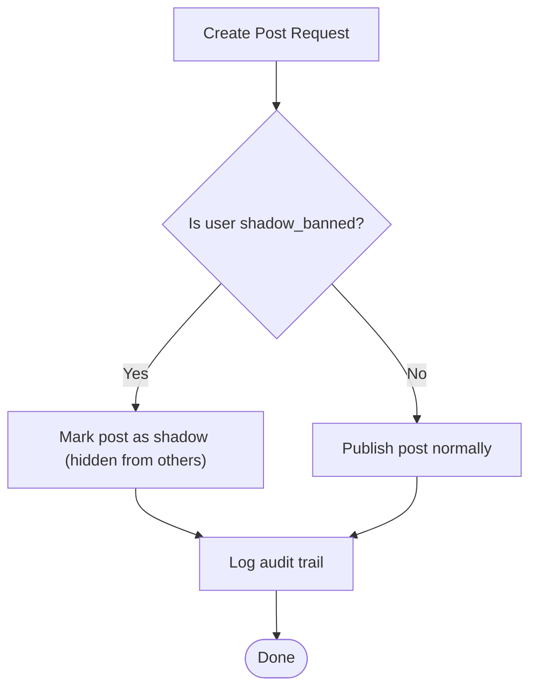
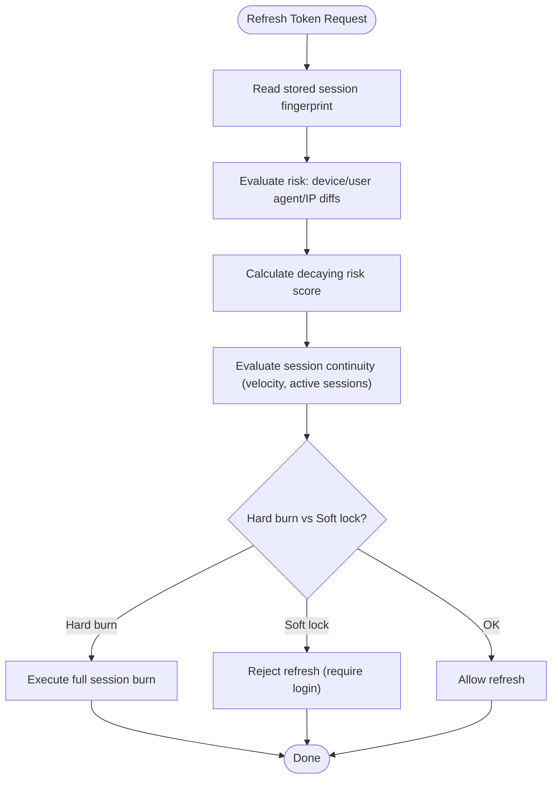
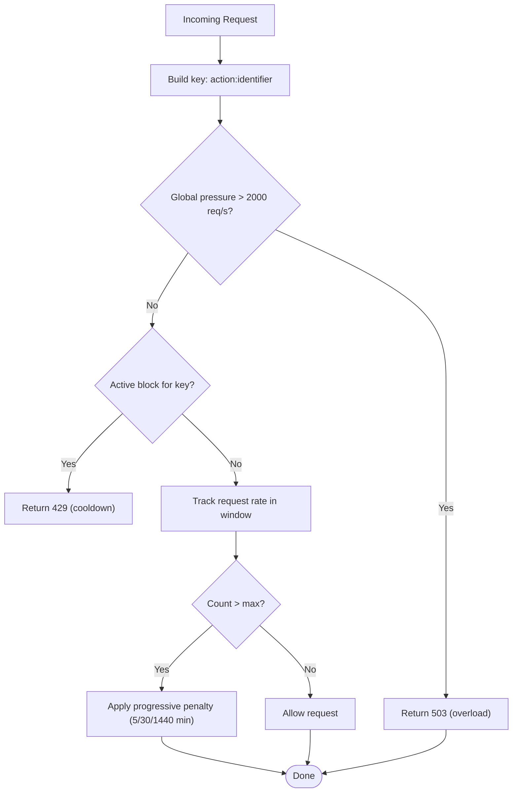
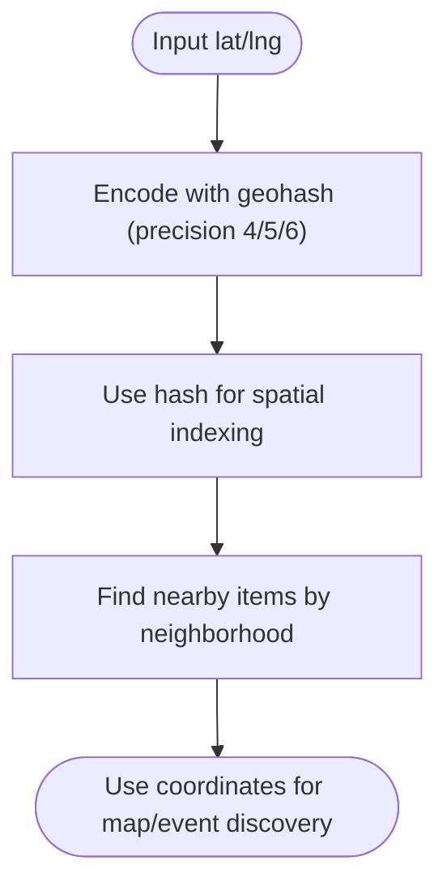
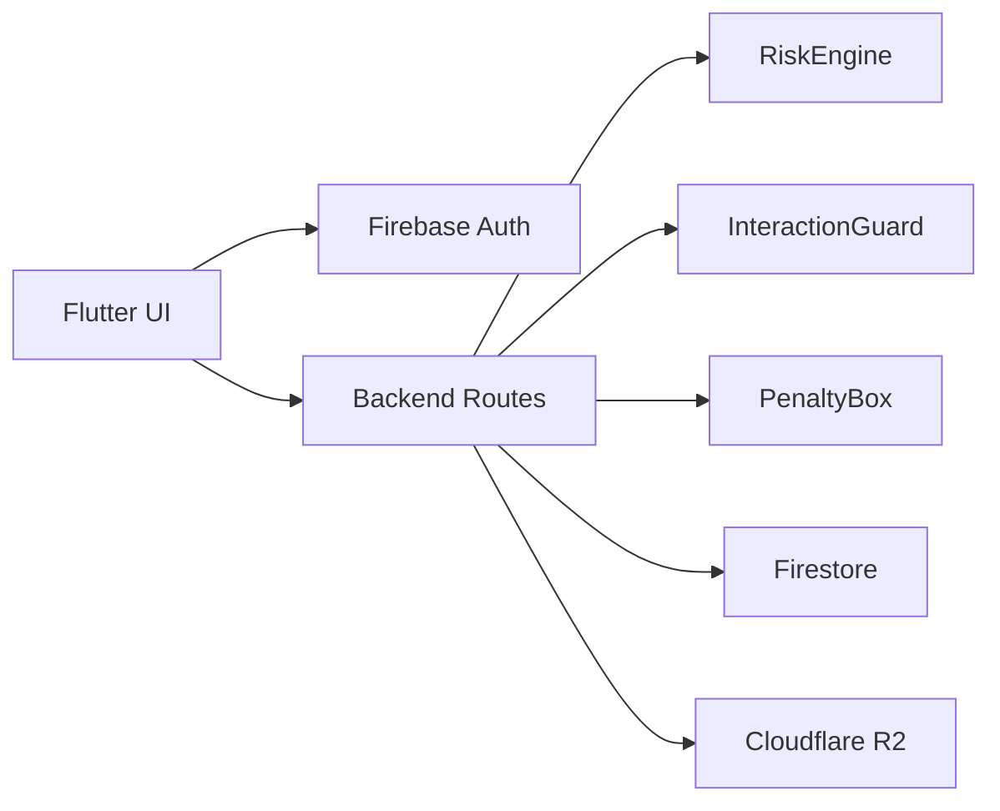

# Introduction

<cite>
**Referenced Files in This Document**
- [PRD.md](file://PRD.md)
- [main.dart](file://testpro-main/lib/main.dart)
- [community_screen.dart](file://testpro-main/lib/screens/community_screen.dart)
- [chat_service.dart](file://testpro-main/lib/services/chat_service.dart)
- [signup_location.dart](file://testpro-main/lib/screens/signup/signup_location.dart)
- [posts.js](file://backend/src/routes/posts.js)
- [auth.js](file://backend/src/routes/auth.js)
- [RiskEngine.js](file://backend/src/services/RiskEngine.js)
- [InteractionGuard.js](file://backend/src/services/InteractionGuard.js)
- [PenaltyBox.js](file://backend/src/services/PenaltyBox.js)
- [progressiveLimiter.js](file://backend/src/middleware/progressiveLimiter.js)
- [debug_geohash.js](file://backend/scripts/debug_geohash.js)
- [backend README.md](file://backend/README.md)
- [SECURITY.md](file://testpro-main/SECURITY.md)
</cite>

## Table of Contents
1. [Introduction](#introduction)
2. [Project Structure](#project-structure)
3. [Core Components](#core-components)
4. [Architecture Overview](#architecture-overview)
5. [Detailed Component Analysis](#detailed-component-analysis)
6. [Dependency Analysis](#dependency-analysis)
7. [Performance Considerations](#performance-considerations)
8. [Troubleshooting Guide](#troubleshooting-guide)
9. [Conclusion](#conclusion)

## Introduction
LocalMe is a location-based social media platform designed to bring people together through shared moments, events, and experiences rooted in real-world geography. At its core, LocalMe is a community-driven social network that enables users to discover, create, and engage with content that matters to them and those around them. The platform emphasizes privacy controls, safety-first moderation, and tools that help build meaningful, location-aware communities.

Key value propositions:
- Location-based content discovery: Users can explore nearby posts, events, and articles, with feeds scoped to city/region or globally.
- Real-time communication: Live chat within event groups and near-real-time updates for interactions and community activity.
- Shadow banning system: A nuanced moderation approach that suppresses visibility for problematic accounts while allowing them to remain registered.
- Community building tools: Event creation, “going” tracking, chat rooms, and curated community hubs for local engagement.
- Privacy and safety: Built-in risk assessment, behavioral session continuity checks, and progressive rate limiting to protect users and infrastructure.

Target audience and primary use cases:
- Local residents seeking nearby events, conversations, and community updates.
- Creators and thought leaders sharing long-form content with local or global reach.
- Event organizers and participants coordinating meetups, digital events, and discussions.

What makes LocalMe different:
- Unlike traditional social networks, LocalMe prioritizes local relevance and geographic context, enabling hyper-local discovery and engagement.
- Privacy-first design ensures user safety through layered security, behavioral anomaly detection, and transparent moderation.
- Practical examples:
  - A user shares a local food event with a photo and location tag; nearby users see it first, and the event page includes a live chat for attendees.
  - A creator publishes a long-form article with geotags; the discovery engine surfaces it to readers based on watch time, likes, comments, and shares.
  - A new user’s account is protected by a short “cooling period” before posting, and shadow bans keep disruptive content from influencing others without banning the account.

Unique features:
- Geohashing for precise location tracking: A geohash encoder demonstrates how latitude and longitude are compactly represented for indexing and proximity queries.
- Risk assessment engine: Evaluates device/user agent/IP changes and session continuity to detect suspicious refresh patterns and trigger protective actions.
- Progressive rate limiting: A high-speed, in-memory limiter that escalates penalties over time, protecting the platform from abuse while maintaining responsiveness.

## Project Structure
LocalMe is organized into a Flutter frontend and a Node.js/Express backend, with Firebase Authentication, Firestore, and Cloudflare R2 for storage. The frontend initializes Firebase, manages user sessions, and exposes screens for community, events, and chat. The backend enforces security, handles uploads, and provides APIs for posts, authentication, and notifications.

**Diagram sources**
- [main.dart](file://testpro-main/lib/main.dart#L12-L22)
- [community_screen.dart](file://testpro-main/lib/screens/community_screen.dart#L11-L44)
- [chat_service.dart](file://testpro-main/lib/services/chat_service.dart#L6-L35)
- [signup_location.dart](file://testpro-main/lib/screens/signup/signup_location.dart#L80-L116)
- [posts.js](file://backend/src/routes/posts.js#L90-L207)
- [auth.js](file://backend/src/routes/auth.js#L15-L35)
- [RiskEngine.js](file://backend/src/services/RiskEngine.js#L4-L49)
- [PenaltyBox.js](file://backend/src/services/PenaltyBox.js#L22-L68)
- [progressiveLimiter.js](file://backend/src/middleware/progressiveLimiter.js#L22-L60)

**Section sources**
- [main.dart](file://testpro-main/lib/main.dart#L12-L22)
- [community_screen.dart](file://testpro-main/lib/screens/community_screen.dart#L11-L44)
- [chat_service.dart](file://testpro-main/lib/services/chat_service.dart#L6-L35)
- [signup_location.dart](file://testpro-main/lib/screens/signup/signup_location.dart#L80-L116)
- [posts.js](file://backend/src/routes/posts.js#L90-L207)
- [auth.js](file://backend/src/routes/auth.js#L15-L35)
- [RiskEngine.js](file://backend/src/services/RiskEngine.js#L4-L49)
- [PenaltyBox.js](file://backend/src/services/PenaltyBox.js#L22-L68)
- [progressiveLimiter.js](file://backend/src/middleware/progressiveLimiter.js#L22-L60)

## Core Components
- Frontend app bootstrap and session management: Initializes Firebase, sets up theme, and routes users to Home or Welcome screens based on auth state.
- Community and event hub: Streams event posts, supports search and category filters, and integrates real-time attendee updates.
- Chat service: Provides near-real-time chat streams for event-specific conversations.
- Authentication and security: Exchanges Firebase ID tokens for custom access/refresh pairs, evaluates session continuity, and applies risk-based protections.
- Moderation and safety:
  - Shadow banning: Posts from flagged accounts are hidden from others while still being stored.
  - Interaction guard: Detects rapid toggles and excessive velocity to prevent graph abuse.
  - Risk engine: Scores device/user agent/IP changes and evaluates session continuity to mitigate token theft and refresh storms.
  - Progressive rate limiting: Applies escalating penalties for abuse while maintaining service availability.

**Section sources**
- [main.dart](file://testpro-main/lib/main.dart#L24-L62)
- [community_screen.dart](file://testpro-main/lib/screens/community_screen.dart#L18-L44)
- [chat_service.dart](file://testpro-main/lib/services/chat_service.dart#L6-L35)
- [auth.js](file://backend/src/routes/auth.js#L15-L35)
- [posts.js](file://backend/src/routes/posts.js#L121-L124)
- [InteractionGuard.js](file://backend/src/services/InteractionGuard.js#L47-L80)
- [RiskEngine.js](file://backend/src/services/RiskEngine.js#L11-L30)
- [progressiveLimiter.js](file://backend/src/middleware/progressiveLimiter.js#L32-L56)

## Architecture Overview
LocalMe’s architecture balances a modern Flutter UI with a secure, scalable backend. The frontend authenticates via Firebase, then communicates with backend routes secured by JWT and progressive rate limiting. The backend stores data in Firestore and serves media via Cloudflare R2. Safety is enforced through risk scoring, behavioral anomaly detection, and shadow moderation.

**Diagram sources**
- [auth.js](file://backend/src/routes/auth.js#L15-L35)
- [RiskEngine.js](file://backend/src/services/RiskEngine.js#L71-L130)
- [InteractionGuard.js](file://backend/src/services/InteractionGuard.js#L47-L80)
- [posts.js](file://backend/src/routes/posts.js#L90-L207)
- [backend README.md](file://backend/README.md#L82-L139)

**Section sources**
- [auth.js](file://backend/src/routes/auth.js#L15-L35)
- [RiskEngine.js](file://backend/src/services/RiskEngine.js#L71-L130)
- [InteractionGuard.js](file://backend/src/services/InteractionGuard.js#L47-L80)
- [posts.js](file://backend/src/routes/posts.js#L90-L207)
- [backend README.md](file://backend/README.md#L82-L139)

## Detailed Component Analysis

### Location-Based Discovery and Community Building
- Discovery engine scopes content by region and global scope, with a recommendation model that considers watch time, likes, comments, and shares. The UI exposes a Community tab with event listings and real-time attendee counts.
- Event management includes creation, media coverage, and chat rooms for near-real-time interaction.

**Diagram sources**
- [community_screen.dart](file://testpro-main/lib/screens/community_screen.dart#L18-L44)
- [chat_service.dart](file://testpro-main/lib/services/chat_service.dart#L6-L35)

**Section sources**
- [PRD.md](file://PRD.md#L30-L51)
- [community_screen.dart](file://testpro-main/lib/screens/community_screen.dart#L18-L44)
- [chat_service.dart](file://testpro-main/lib/services/chat_service.dart#L6-L35)

### Shadow Banning and Content Moderation
- Shadow banning suppresses visibility for flagged accounts while preserving their content for moderation and analytics. This preserves platform integrity without permanently silencing users.

**Diagram sources**
- [posts.js](file://backend/src/routes/posts.js#L121-L124)
- [posts.js](file://backend/src/routes/posts.js#L184-L190)

**Section sources**
- [posts.js](file://backend/src/routes/posts.js#L121-L124)
- [posts.js](file://backend/src/routes/posts.js#L184-L190)

### Risk Assessment and Session Continuity
- The risk engine evaluates device ID, user agent, and IP changes, and computes a decaying risk score. It also detects concurrent refresh attempts across different IPs and high-frequency token rotations.

**Diagram sources**
- [RiskEngine.js](file://backend/src/services/RiskEngine.js#L11-L30)
- [RiskEngine.js](file://backend/src/services/RiskEngine.js#L36-L49)
- [RiskEngine.js](file://backend/src/services/RiskEngine.js#L71-L130)

**Section sources**
- [RiskEngine.js](file://backend/src/services/RiskEngine.js#L11-L30)
- [RiskEngine.js](file://backend/src/services/RiskEngine.js#L36-L49)
- [RiskEngine.js](file://backend/src/services/RiskEngine.js#L71-L130)

### Progressive Rate Limiting and Abuse Mitigation
- A centralized limiter enforces policies per action and identifier (IP or user ID), applying escalating penalties and global pressure checks to maintain service stability.

**Diagram sources**
- [progressiveLimiter.js](file://backend/src/middleware/progressiveLimiter.js#L22-L60)
- [PenaltyBox.js](file://backend/src/services/PenaltyBox.js#L22-L68)

**Section sources**
- [progressiveLimiter.js](file://backend/src/middleware/progressiveLimiter.js#L22-L60)
- [PenaltyBox.js](file://backend/src/services/PenaltyBox.js#L22-L68)

### Geohashing for Precise Location Tracking
- Geohashing encodes latitude/longitude into short, index-friendly strings for proximity queries. The script demonstrates encoding at different precision levels.

**Diagram sources**
- [debug_geohash.js](file://backend/scripts/debug_geohash.js#L1-L16)

**Section sources**
- [debug_geohash.js](file://backend/scripts/debug_geohash.js#L1-L16)

### Privacy Controls and Safety
- Privacy-first design includes:
  - New user cooling period before posting.
  - Shadow banning for problematic accounts.
  - Behavioral session continuity and risk scoring for token refresh.
  - Progressive rate limiting to deter abuse.
- Security policy and incident response procedures are documented for operational readiness.

**Section sources**
- [posts.js](file://backend/src/routes/posts.js#L99-L119)
- [RiskEngine.js](file://backend/src/services/RiskEngine.js#L11-L30)
- [progressiveLimiter.js](file://backend/src/middleware/progressiveLimiter.js#L32-L56)
- [SECURITY.md](file://testpro-main/SECURITY.md#L134-L155)

## Dependency Analysis
LocalMe’s frontend depends on Firebase for authentication and session management, and on backend routes for posts, chats, and uploads. The backend depends on Firestore for persistence and Cloudflare R2 for media storage. Security services and middleware enforce risk evaluation, interaction velocity, and rate limiting.

**Diagram sources**
- [main.dart](file://testpro-main/lib/main.dart#L12-L22)
- [auth.js](file://backend/src/routes/auth.js#L15-L35)
- [RiskEngine.js](file://backend/src/services/RiskEngine.js#L4-L49)
- [InteractionGuard.js](file://backend/src/services/InteractionGuard.js#L22-L43)
- [PenaltyBox.js](file://backend/src/services/PenaltyBox.js#L3-L14)
- [posts.js](file://backend/src/routes/posts.js#L90-L207)

**Section sources**
- [main.dart](file://testpro-main/lib/main.dart#L12-L22)
- [auth.js](file://backend/src/routes/auth.js#L15-L35)
- [RiskEngine.js](file://backend/src/services/RiskEngine.js#L4-L49)
- [InteractionGuard.js](file://backend/src/services/InteractionGuard.js#L22-L43)
- [PenaltyBox.js](file://backend/src/services/PenaltyBox.js#L3-L14)
- [posts.js](file://backend/src/routes/posts.js#L90-L207)

## Performance Considerations
- Optimistic UI updates for interactions reduce perceived latency.
- Near-real-time chat polling balances responsiveness with bandwidth.
- Progressive rate limiting prevents overload and maintains availability under stress.
- Media uploads leverage client-side compression and CDN-backed storage for efficient delivery.

[No sources needed since this section provides general guidance]

## Troubleshooting Guide
- Authentication and security:
  - If token exchange fails, verify JWT secrets and Firebase token validity.
  - If refresh requests are rejected, review risk score thresholds and session continuity logs.
- Rate limiting:
  - If receiving repeated 429 responses, check progressive penalty strikes and adjust behavior.
  - For global pressure alerts, reduce request volume or retry after cooldown.
- Uploads and media:
  - Confirm environment variables for Cloudflare R2 and CORS settings.
  - Validate file types and sizes before upload.

**Section sources**
- [auth.js](file://backend/src/routes/auth.js#L20-L35)
- [RiskEngine.js](file://backend/src/services/RiskEngine.js#L55-L65)
- [progressiveLimiter.js](file://backend/src/middleware/progressiveLimiter.js#L41-L56)
- [backend README.md](file://backend/README.md#L143-L154)
- [backend README.md](file://backend/README.md#L311-L330)

## Conclusion
LocalMe reimagines social interaction by anchoring it to real-world locations and communities. Through location-aware discovery, real-time communication, and strong privacy and safety measures—shadow banning, risk assessment, and progressive rate limiting—the platform creates a respectful, engaging environment for local participation. Its architecture balances a modern, responsive frontend with a secure, scalable backend, ensuring both user safety and system resilience.