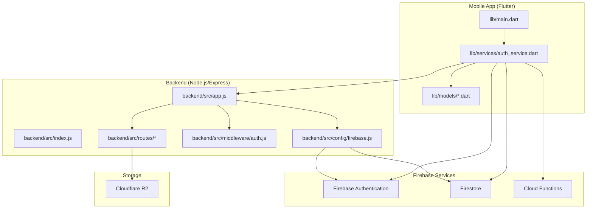
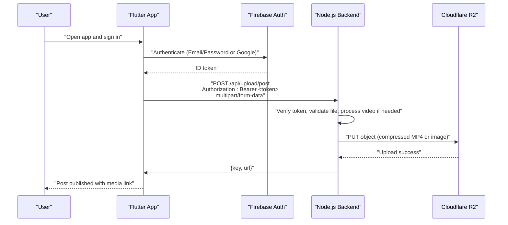
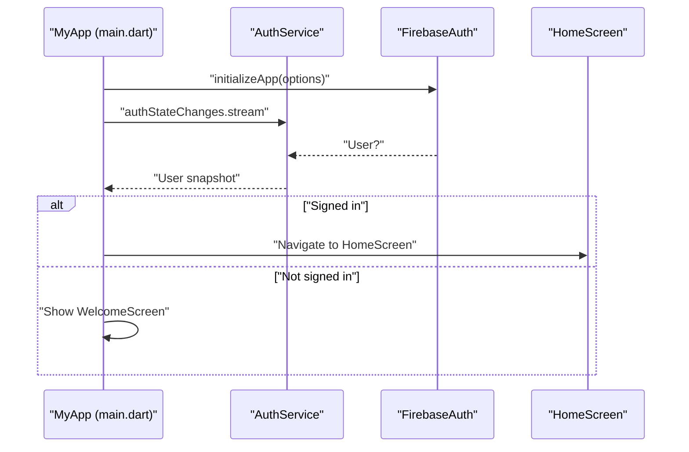
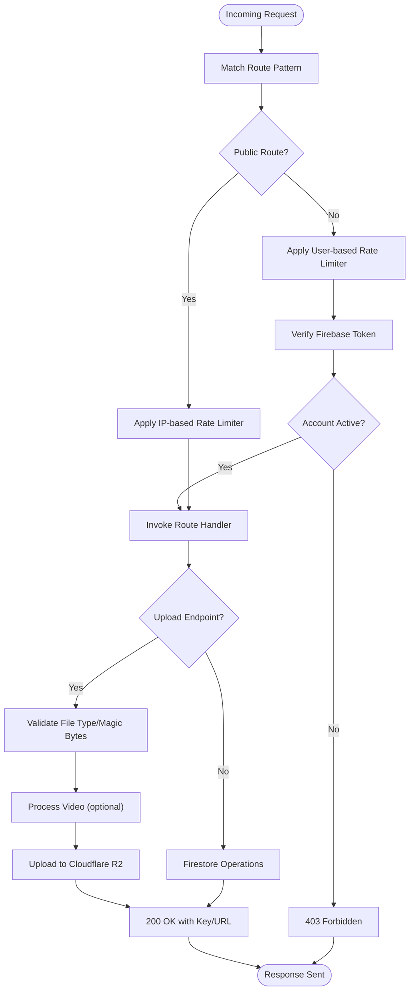
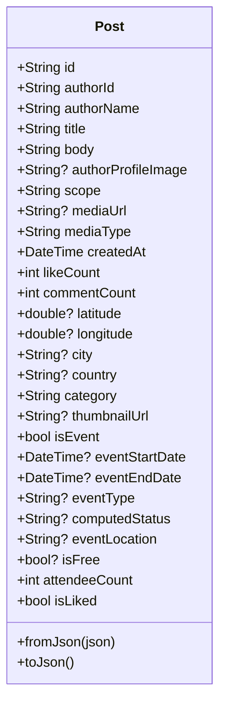
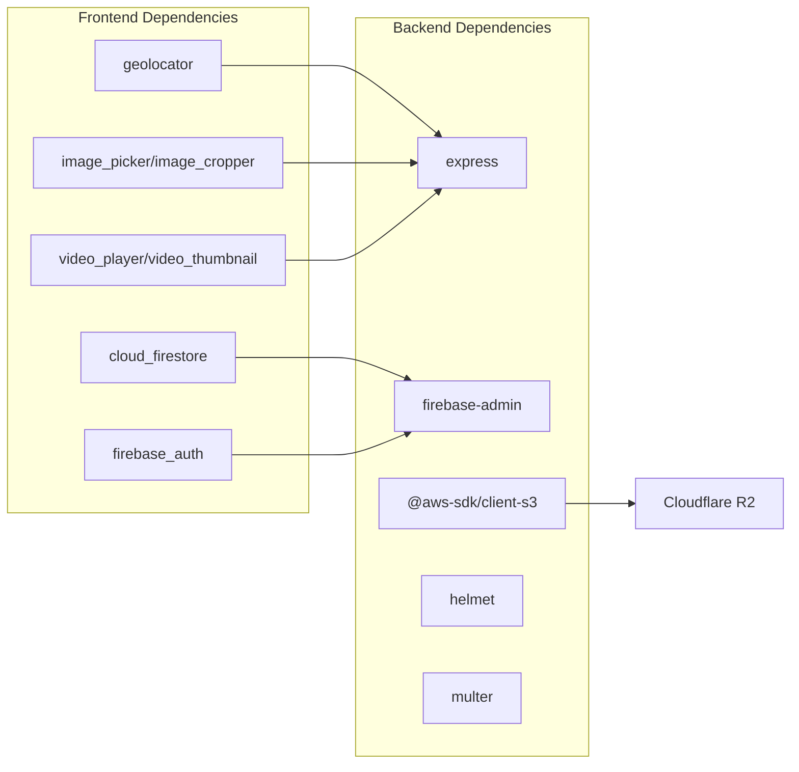

# Project Overview

<cite>
**Referenced Files in This Document**
- [README.md](file://testpro-main/README.md)
- [PRD.md](file://PRD.md)
- [backend/README.md](file://backend/README.md)
- [backend/package.json](file://backend/package.json)
- [backend/src/app.js](file://backend/src/app.js)
- [backend/src/index.js](file://backend/src/index.js)
- [backend/src/middleware/auth.js](file://backend/src/middleware/auth.js)
- [backend/src/routes/upload.js](file://backend/src/routes/upload.js)
- [backend/src/config/firebase.js](file://backend/src/config/firebase.js)
- [testpro-main/pubspec.yaml](file://testpro-main/pubspec.yaml)
- [testpro-main/lib/main.dart](file://testpro-main/lib/main.dart)
- [testpro-main/lib/services/auth_service.dart](file://testpro-main/lib/services/auth_service.dart)
- [testpro-main/lib/models/post.dart](file://testpro-main/lib/models/post.dart)
</cite>

## Table of Contents
1. [Introduction](#introduction)
2. [Project Structure](#project-structure)
3. [Core Components](#core-components)
4. [Architecture Overview](#architecture-overview)
5. [Detailed Component Analysis](#detailed-component-analysis)
6. [Dependency Analysis](#dependency-analysis)
7. [Performance Considerations](#performance-considerations)
8. [Troubleshooting Guide](#troubleshooting-guide)
9. [Conclusion](#conclusion)

## Introduction
LocalMe is a location-based social media platform designed to bring people together through shared moments, events, and experiences. Built around a community-first philosophy, it enables users to discover and engage with content near them while maintaining strong privacy controls and safety mechanisms. The platform emphasizes real-world relevance, with features like location-scoped feeds, event discovery, and media-rich posts powered by secure uploads to Cloudflare R2 storage.

At its core, LocalMe combines:
- A Flutter mobile application for iOS, Android, and web
- A Node.js/Express backend for secure media handling and API orchestration
- Firebase for authentication, real-time database, and cloud functions
- Cloudflare R2 for scalable, low-latency media storage

The platform implements advanced safety and moderation capabilities, including risk assessment, shadow banning, and geohashing for precise location scoping. These features help maintain a healthy community while preserving user privacy and control.

## Project Structure
LocalMe follows a clear separation of concerns:
- Frontend: Flutter application with modular packages for models, services, screens, and UI components
- Backend: Node.js/Express server with route handlers, middleware, and utilities
- Firebase: Authentication, Firestore, and Cloud Functions
- Storage: Cloudflare R2 for media assets with a CORS-compliant proxy

**Diagram sources**
- [testpro-main/lib/main.dart](file://testpro-main/lib/main.dart#L1-L63)
- [testpro-main/lib/services/auth_service.dart](file://testpro-main/lib/services/auth_service.dart#L1-L162)
- [testpro-main/lib/models/post.dart](file://testpro-main/lib/models/post.dart#L1-L143)
- [backend/src/app.js](file://backend/src/app.js#L1-L78)
- [backend/src/index.js](file://backend/src/index.js#L1-L37)
- [backend/src/middleware/auth.js](file://backend/src/middleware/auth.js#L1-L164)
- [backend/src/routes/upload.js](file://backend/src/routes/upload.js#L1-L225)
- [backend/src/config/firebase.js](file://backend/src/config/firebase.js#L1-L46)

**Section sources**
- [testpro-main/README.md](file://testpro-main/README.md#L1-L332)
- [PRD.md](file://PRD.md#L1-L84)
- [backend/README.md](file://backend/README.md#L1-L338)

## Core Components
- Flutter mobile application
  - Handles authentication, navigation, UI rendering, and offline-friendly caching
  - Integrates with Firebase for identity, real-time data, and push notifications
  - Implements location-aware post composition and feed rendering
- Node.js/Express backend
  - Provides secure upload endpoints for images and videos to Cloudflare R2
  - Enforces rate limiting, input validation, and token verification
  - Offers proxy endpoints for OTP, search, and notifications
- Firebase
  - Authentication (Email/Password, Google Sign-In)
  - Real-time document storage (Firestore)
  - Cloud Functions for serverless tasks
- Cloudflare R2
  - Stores media assets with public URLs and optimized caching headers
  - Integrated via an S3-compatible client with magic-byte validation

Practical examples of platform value:
- Posting a photo or video with location tagging: the app captures media, optionally compresses and trims videos, authenticates via Firebase, and uploads securely to R2 through the backend proxy
- Discovering nearby events: the app queries Firestore-backed feeds scoped by geohash-derived regions and displays event cards with attendee counts and live chat
- Privacy controls: users can adjust feed scope (local/global), manage followers, and rely on risk assessment and shadow banning to reduce unwanted interactions

**Section sources**
- [testpro-main/README.md](file://testpro-main/README.md#L1-L332)
- [PRD.md](file://PRD.md#L23-L56)
- [backend/README.md](file://backend/README.md#L82-L140)
- [backend/src/routes/upload.js](file://backend/src/routes/upload.js#L80-L222)

## Architecture Overview
LocalMe’s architecture centers on a mobile-first design with a thin backend focused on secure media handling and identity verification. The mobile app communicates with Firebase for authentication and Firestore for data, while relying on the Node.js backend for media uploads and specialized endpoints. Cloudflare R2 serves as the durable, globally distributed storage layer.

**Diagram sources**
- [testpro-main/lib/services/auth_service.dart](file://testpro-main/lib/services/auth_service.dart#L1-L162)
- [backend/src/middleware/auth.js](file://backend/src/middleware/auth.js#L20-L161)
- [backend/src/routes/upload.js](file://backend/src/routes/upload.js#L124-L222)

**Section sources**
- [PRD.md](file://PRD.md#L70-L77)
- [backend/README.md](file://backend/README.md#L5-L36)

## Detailed Component Analysis

### Technology Stack Summary
- Frontend: Flutter (Dart) with Firebase plugins for authentication, Firestore, messaging, and cloud functions
- Backend: Node.js/Express with TypeScript-style modules, Helmet for security headers, Multer for uploads, and AWS SDK for S3-compatible R2
- Database: Firestore for documents and real-time queries
- Authentication: Firebase Authentication (Email/Password, Google)
- Storage: Cloudflare R2 via S3-compatible client
- Additional libraries: geolocator, image picker/cropper, video player/thumbnail, cached network images

**Section sources**
- [testpro-main/pubspec.yaml](file://testpro-main/pubspec.yaml#L10-L36)
- [backend/package.json](file://backend/package.json#L24-L55)
- [PRD.md](file://PRD.md#L70-L77)

### Mobile App Initialization and Authentication Flow
The Flutter app initializes Firebase, sets up notifications, and renders either a welcome screen or the home feed based on the authentication state stream. Authentication is handled via Firebase Auth, supporting both email/password and Google Sign-In with web compatibility.

**Diagram sources**
- [testpro-main/lib/main.dart](file://testpro-main/lib/main.dart#L12-L62)
- [testpro-main/lib/services/auth_service.dart](file://testpro-main/lib/services/auth_service.dart#L1-L162)

**Section sources**
- [testpro-main/lib/main.dart](file://testpro-main/lib/main.dart#L12-L62)
- [testpro-main/lib/services/auth_service.dart](file://testpro-main/lib/services/auth_service.dart#L25-L103)

### Backend API Routing and Authentication
The backend composes routes for public and protected endpoints, applying progressive rate limiting and centralized error handling. Authentication middleware verifies Firebase tokens and enforces account status checks, while upload routes validate file types and sizes and process videos when necessary.

**Diagram sources**
- [backend/src/app.js](file://backend/src/app.js#L21-L75)
- [backend/src/middleware/auth.js](file://backend/src/middleware/auth.js#L20-L161)
- [backend/src/routes/upload.js](file://backend/src/routes/upload.js#L80-L222)

**Section sources**
- [backend/src/app.js](file://backend/src/app.js#L1-L78)
- [backend/src/middleware/auth.js](file://backend/src/middleware/auth.js#L1-L164)
- [backend/src/routes/upload.js](file://backend/src/routes/upload.js#L1-L225)

### Data Model: Post
The Post model encapsulates both standard posts and events, including optional media, location coordinates, category, and engagement metrics. It supports flexible JSON parsing and serialization, accommodating variations in backend field names.

**Diagram sources**
- [testpro-main/lib/models/post.dart](file://testpro-main/lib/models/post.dart#L1-L143)

**Section sources**
- [testpro-main/lib/models/post.dart](file://testpro-main/lib/models/post.dart#L1-L143)

### Safety and Moderation Concepts
- Shadow banning: Suspended or restricted accounts are prevented from publishing or interacting, ensuring harmful activity is contained without public disclosure
- Geohashing: Location-aware feeds leverage geohash-derived scopes to deliver accurate, localized content
- Risk assessment: Built-in guardrails and penalty systems evaluate user behavior to protect community health

These mechanisms are integrated into the backend’s authentication and upload flows, as well as the frontend’s feed and interaction components.

**Section sources**
- [backend/src/middleware/auth.js](file://backend/src/middleware/auth.js#L133-L139)
- [PRD.md](file://PRD.md#L30-L46)

## Dependency Analysis
The frontend depends on Flutter and Firebase ecosystem packages for authentication, real-time data, and media handling. The backend relies on Express, Firebase Admin, and the AWS SDK for S3-compatible storage. Both sides integrate with Cloudflare R2 for media delivery.

**Diagram sources**
- [testpro-main/pubspec.yaml](file://testpro-main/pubspec.yaml#L25-L36)
- [backend/package.json](file://backend/package.json#L24-L55)

**Section sources**
- [testpro-main/pubspec.yaml](file://testpro-main/pubspec.yaml#L10-L36)
- [backend/package.json](file://backend/package.json#L24-L55)

## Performance Considerations
- Optimistic UI updates for likes and event attendance reduce perceived latency
- Client-side compression and video trimming minimize upload sizes and improve throughput
- Progressive rate limiting adapts to traffic patterns while protecting resources
- In-memory user cache reduces Firestore reads for authenticated requests
- CDN-backed R2 storage ensures fast global delivery of media assets

[No sources needed since this section provides general guidance]

## Troubleshooting Guide
Common issues and resolutions:
- API_URL not set: Ensure the backend URL is passed via dart define flags during development and release builds
- Images not loading: Verify the backend is reachable, R2 credentials are correct, and the public base URL is properly configured
- Google Sign-In failing on web: Confirm the Google Client ID is set and matches the Firebase Console configuration
- Build errors after setup: Clean and re-fetch dependencies, then rebuild
- Backend upload failures: Confirm the Firebase token is valid, R2 credentials are correct, and review backend logs for detailed error messages

**Section sources**
- [testpro-main/README.md](file://testpro-main/README.md#L235-L263)
- [backend/README.md](file://backend/README.md#L311-L330)

## Conclusion
LocalMe delivers a modern, privacy-conscious, and community-driven social platform. Its architecture balances a responsive Flutter frontend with a secure, scalable Node.js backend and Firebase-powered identity/data services, backed by Cloudflare R2 for reliable media delivery. Advanced safety features like shadow banning, geohashing, and risk assessment help sustain a healthy community, while optimistic UI and efficient media pipelines ensure a smooth user experience.

[No sources needed since this section summarizes without analyzing specific files]