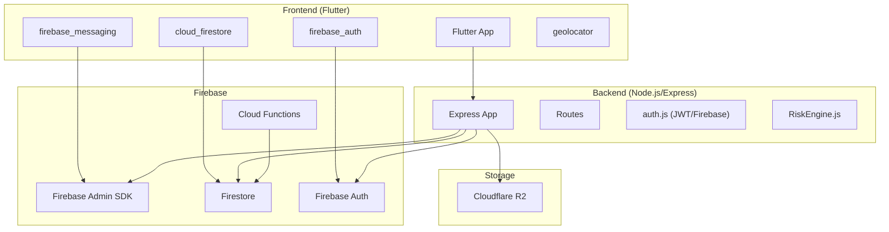
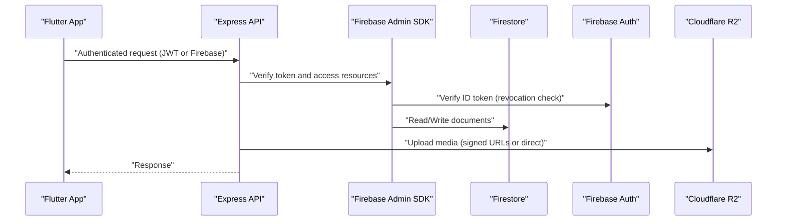
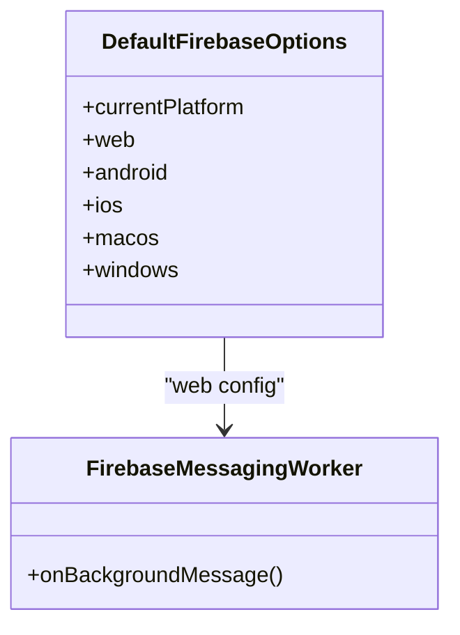
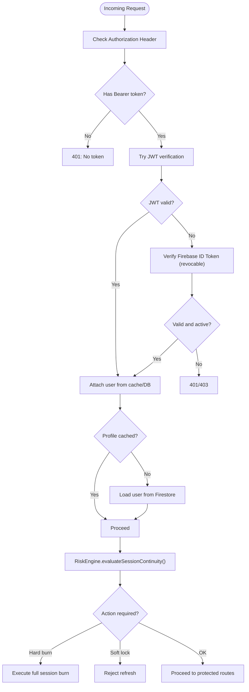
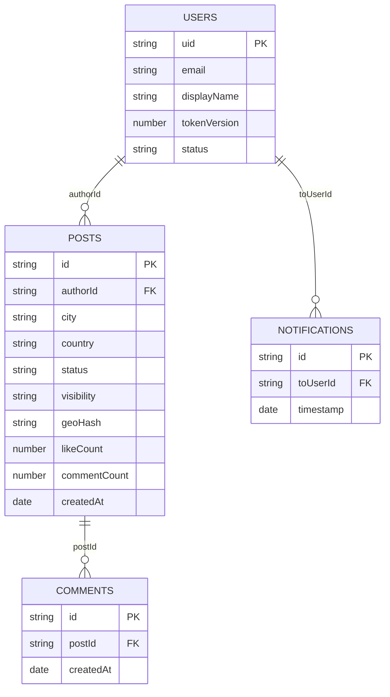
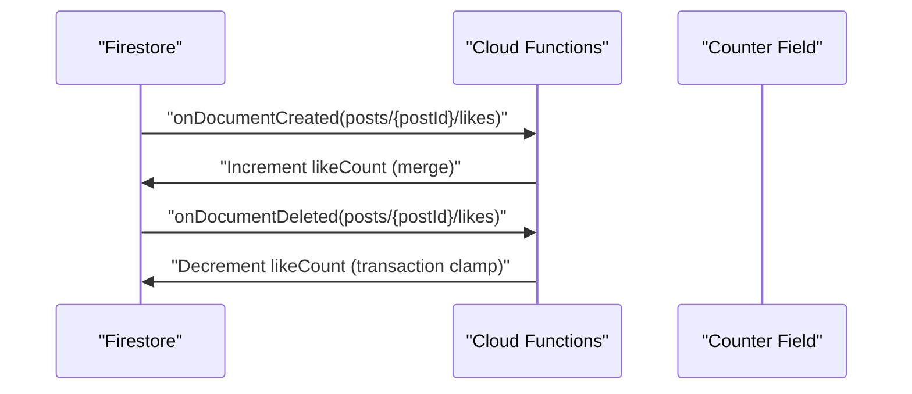
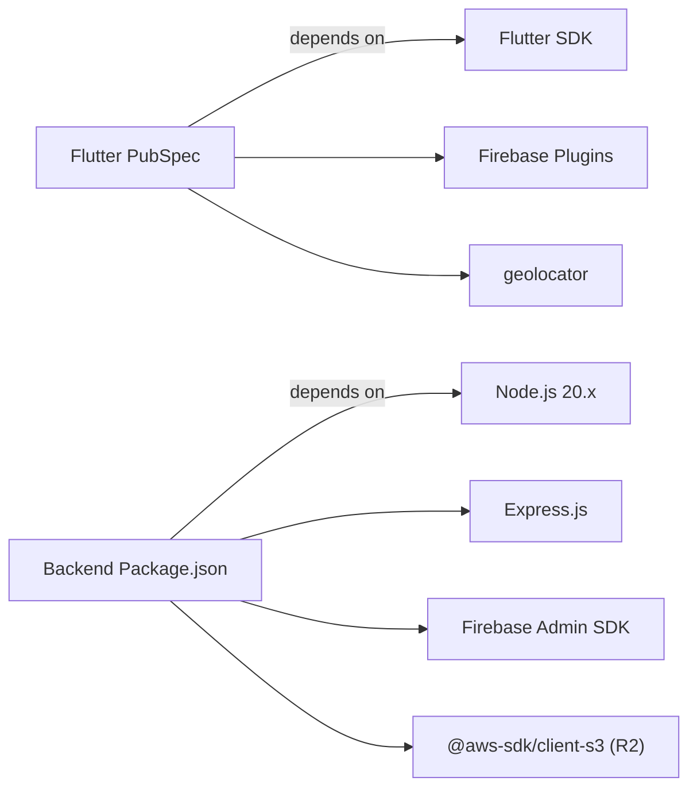

# Technology Stack

<cite>
**Referenced Files in This Document**
- [backend/package.json](file://backend/package.json)
- [backend/src/config/env.js](file://backend/src/config/env.js)
- [backend/src/config/firebase.js](file://backend/src/config/firebase.js)
- [backend/src/middleware/auth.js](file://backend/src/middleware/auth.js)
- [backend/src/app.js](file://backend/src/app.js)
- [backend/src/services/RiskEngine.js](file://backend/src/services/RiskEngine.js)
- [testpro-main/pubspec.yaml](file://testpro-main/pubspec.yaml)
- [testpro-main/lib/firebase_options.dart](file://testpro-main/lib/firebase_options.dart)
- [testpro-main/web/firebase-messaging-sw.js](file://testpro-main/web/firebase-messaging-sw.js)
- [testpro-main/functions/package.json](file://testpro-main/functions/package.json)
- [testpro-main/functions/index.js](file://testpro-main/functions/index.js)
- [testpro-main/firebase.json](file://testpro-main/firebase.json)
- [testpro-main/firestore.indexes.json](file://testpro-main/firestore.indexes.json)
- [testpro-main/firestore.rules](file://testpro-main/firestore.rules)
- [DEPLOYMENT_GUIDE.md](file://DEPLOYMENT_GUIDE.md)
</cite>

## Table of Contents
1. [Introduction](#introduction)
2. [Project Structure](#project-structure)
3. [Core Components](#core-components)
4. [Architecture Overview](#architecture-overview)
5. [Detailed Component Analysis](#detailed-component-analysis)
6. [Dependency Analysis](#dependency-analysis)
7. [Performance Considerations](#performance-considerations)
8. [Troubleshooting Guide](#troubleshooting-guide)
9. [Conclusion](#conclusion)
10. [Appendices](#appendices)

## Introduction
This document presents LocalMe’s full-stack technology stack with a focus on frontend, backend, databases/storage, real-time communication, and deployment infrastructure. It explains version compatibility, the rationale behind technology choices, and integration patterns between frontend and backend components. The goal is to provide a clear, actionable understanding for developers and operators deploying and maintaining the system.

## Project Structure
LocalMe comprises:
- A Flutter/Dart cross-platform frontend with Firebase client SDKs and geolocation support
- A Node.js/Express backend with Firebase Admin SDK, JWT-based authentication, and security middleware
- Firestore as the primary NoSQL database with strict server-side rules and optimized indexes
- Firebase Authentication and Cloud Functions for serverless integrations
- Cloudflare R2 for media storage and Firebase Cloud Messaging for notifications
- Firebase Hosting for web deployment and production environment setup guidance

**Diagram sources**
- [backend/src/app.js](file://backend/src/app.js#L1-L78)
- [backend/src/middleware/auth.js](file://backend/src/middleware/auth.js#L1-L164)
- [backend/src/config/firebase.js](file://backend/src/config/firebase.js#L1-L46)
- [backend/src/services/RiskEngine.js](file://backend/src/services/RiskEngine.js#L1-L170)
- [testpro-main/pubspec.yaml](file://testpro-main/pubspec.yaml#L10-L37)
- [testpro-main/lib/firebase_options.dart](file://testpro-main/lib/firebase_options.dart#L17-L89)
- [testpro-main/functions/index.js](file://testpro-main/functions/index.js#L1-L112)

**Section sources**
- [backend/src/app.js](file://backend/src/app.js#L1-L78)
- [testpro-main/pubspec.yaml](file://testpro-main/pubspec.yaml#L1-L61)

## Core Components

### Frontend Technology Stack
- Flutter SDK and Dart: Cross-platform UI and business logic with a modern SDK constraint.
- Firebase client SDKs: firebase_core, firebase_auth, cloud_firestore, cloud_functions, firebase_messaging, and flutter_local_notifications.
- Geolocation services: geolocator for location-aware features.
- Media and caching: image_picker, image_cropper, flutter_image_compress, cached_network_image.
- Web-specific messaging worker: firebase-messaging-sw.js for background notifications.

**Section sources**
- [testpro-main/pubspec.yaml](file://testpro-main/pubspec.yaml#L10-L37)
- [testpro-main/lib/firebase_options.dart](file://testpro-main/lib/firebase_options.dart#L17-L89)
- [testpro-main/web/firebase-messaging-sw.js](file://testpro-main/web/firebase-messaging-sw.js#L1-L25)

### Backend Technology Stack
- Runtime and framework: Node.js 20.x with Express.js for routing and middleware.
- Firebase Admin SDK: Secure server-side access to Firestore and Auth.
- Authentication: Dual-path JWT verification (short-lived access tokens) and Firebase ID Token verification with revocation checks.
- Security middleware: Helmet, CORS, XSS sanitization, rate limiting, slow-down, and request timeouts.
- Storage: Cloudflare R2 S3-compatible API for media uploads.
- Real-time counters: Firestore triggers via Firebase Cloud Functions.

**Section sources**
- [backend/package.json](file://backend/package.json#L7-L9)
- [backend/src/config/env.js](file://backend/src/config/env.js#L1-L31)
- [backend/src/config/firebase.js](file://backend/src/config/firebase.js#L1-L46)
- [backend/src/middleware/auth.js](file://backend/src/middleware/auth.js#L1-L164)
- [backend/src/app.js](file://backend/src/app.js#L1-L78)
- [testpro-main/functions/package.json](file://testpro-main/functions/package.json#L4-L6)

### Database and Storage Technologies
- Firestore: Primary NoSQL database with restrictive server-side rules and optimized composite indexes for queries.
- Firebase Authentication: Federated sign-in and user identity management.
- Cloudflare R2: S3-compatible object storage for media assets with configurable public base URL.
- Firebase Cloud Functions: Serverless triggers for counters and derived metrics.

**Section sources**
- [testpro-main/firestore.rules](file://testpro-main/firestore.rules#L1-L11)
- [testpro-main/firestore.indexes.json](file://testpro-main/firestore.indexes.json#L1-L181)
- [backend/src/config/env.js](file://backend/src/config/env.js#L15-L21)
- [testpro-main/functions/index.js](file://testpro-main/functions/index.js#L1-L112)

### Real-Time Communication Stack
- Firebase Cloud Messaging: Client-side messaging and background service worker for notifications.
- Firestore real-time listeners: Client-side reactive updates via cloud_firestore.
- WebSocket connections: Not used in the current codebase; real-time updates rely on Firestore and FCM.

**Section sources**
- [testpro-main/web/firebase-messaging-sw.js](file://testpro-main/web/firebase-messaging-sw.js#L1-L25)
- [testpro-main/pubspec.yaml](file://testpro-main/pubspec.yaml#L29-L35)

### Deployment Infrastructure
- Firebase Hosting: Web deployment for Flutter web builds.
- Firebase Cloud Functions: Serverless triggers and OTP functions.
- Production environment: Render.com or Railway.app for Node.js backend; Flutter app built with dart-defined API endpoints.

**Section sources**
- [DEPLOYMENT_GUIDE.md](file://DEPLOYMENT_GUIDE.md#L184-L238)
- [testpro-main/firebase.json](file://testpro-main/firebase.json#L1-L32)

## Architecture Overview
The system enforces a strict server-authoritative model:
- All client data operations are mediated by the backend API.
- Firebase Admin SDK secures server-side access to Firestore and Auth.
- Clients authenticate via JWT (short-lived access tokens) or Firebase ID Tokens, with revocation checks enabled.
- Real-time counters and derived metrics are computed serverlessly via Firestore triggers.

**Diagram sources**
- [backend/src/middleware/auth.js](file://backend/src/middleware/auth.js#L20-L161)
- [backend/src/config/firebase.js](file://backend/src/config/firebase.js#L27-L44)
- [backend/src/app.js](file://backend/src/app.js#L44-L60)
- [backend/src/config/env.js](file://backend/src/config/env.js#L15-L21)

## Detailed Component Analysis

### Frontend: Flutter/Dart Integration with Firebase
- Initialization: DefaultFirebaseOptions selects platform-specific Firebase configuration at runtime.
- Core SDKs: firebase_core, cloud_firestore, firebase_auth, cloud_functions, firebase_messaging, flutter_local_notifications.
- Geolocation: geolocator integrates with platform location services.
- Notifications: firebase-messaging-sw.js handles background messages for web builds.

**Diagram sources**
- [testpro-main/lib/firebase_options.dart](file://testpro-main/lib/firebase_options.dart#L17-L89)
- [testpro-main/web/firebase-messaging-sw.js](file://testpro-main/web/firebase-messaging-sw.js#L15-L24)

**Section sources**
- [testpro-main/lib/firebase_options.dart](file://testpro-main/lib/firebase_options.dart#L17-L89)
- [testpro-main/web/firebase-messaging-sw.js](file://testpro-main/web/firebase-messaging-sw.js#L1-L25)

### Backend: Authentication and Security Middleware
- Authentication middleware supports dual-path JWT and Firebase ID Token verification with revocation checks.
- In-memory user cache reduces Firestore reads and improves response latency.
- RiskEngine evaluates session continuity and refresh risks, enabling hard burns and soft locks.
- Security middleware applies strict headers, CORS, rate limiting, and request shaping.

**Diagram sources**
- [backend/src/middleware/auth.js](file://backend/src/middleware/auth.js#L20-L161)
- [backend/src/services/RiskEngine.js](file://backend/src/services/RiskEngine.js#L71-L130)

**Section sources**
- [backend/src/middleware/auth.js](file://backend/src/middleware/auth.js#L1-L164)
- [backend/src/services/RiskEngine.js](file://backend/src/services/RiskEngine.js#L1-L170)

### Database: Firestore, Rules, and Indexes
- Strict server-side rules prevent direct client writes; all access goes through the backend.
- Composite indexes optimize common queries for posts, comments, notifications, and user interests.
- Firestore triggers compute counters and derived metrics serverlessly.

**Diagram sources**
- [testpro-main/firestore.indexes.json](file://testpro-main/firestore.indexes.json#L1-L181)
- [testpro-main/firestore.rules](file://testpro-main/firestore.rules#L1-L11)
- [testpro-main/functions/index.js](file://testpro-main/functions/index.js#L13-L109)

**Section sources**
- [testpro-main/firestore.rules](file://testpro-main/firestore.rules#L1-L11)
- [testpro-main/firestore.indexes.json](file://testpro-main/firestore.indexes.json#L1-L181)
- [testpro-main/functions/index.js](file://testpro-main/functions/index.js#L1-L112)

### Real-Time Counters with Cloud Functions
- Firestore triggers increment/decrement counters for likes, comments, followers, and user content counts.
- Transactions ensure atomicity and clamp negative values.

**Diagram sources**
- [testpro-main/functions/index.js](file://testpro-main/functions/index.js#L13-L57)

**Section sources**
- [testpro-main/functions/index.js](file://testpro-main/functions/index.js#L1-L112)

### Deployment and Production Setup
- Backend deployment targets: Render.com or Railway.app with Node.js 20.x.
- Flutter web deployment via Firebase Hosting with dart-defined API endpoints.
- Production readiness checklist includes credential rotation, history cleanup, and environment variable configuration.

**Section sources**
- [DEPLOYMENT_GUIDE.md](file://DEPLOYMENT_GUIDE.md#L184-L238)
- [DEPLOYMENT_GUIDE.md](file://DEPLOYMENT_GUIDE.md#L90-L135)

## Dependency Analysis
- Frontend dependencies are declared in pubspec.yaml with explicit versions for Flutter SDK, Firebase plugins, geolocation, and media libraries.
- Backend dependencies include Express, Firebase Admin SDK, JWT, rate limiting, sanitization, and Cloudflare R2 client.
- Firebase configuration is centralized in firebase_options.dart and firebase.json, ensuring consistent initialization across platforms.

**Diagram sources**
- [testpro-main/pubspec.yaml](file://testpro-main/pubspec.yaml#L7-L37)
- [backend/package.json](file://backend/package.json#L24-L54)
- [testpro-main/firebase.json](file://testpro-main/firebase.json#L9-L31)

**Section sources**
- [testpro-main/pubspec.yaml](file://testpro-main/pubspec.yaml#L1-L61)
- [backend/package.json](file://backend/package.json#L1-L56)
- [testpro-main/firebase.json](file://testpro-main/firebase.json#L1-L32)

## Performance Considerations
- In-memory user cache in the auth middleware reduces Firestore reads and improves latency for repeated requests.
- Composite indexes in Firestore minimize query costs for common feeds and filters.
- Rate limiting and progressive throttling protect backend resources under load.
- Media compression and thumbnail generation reduce bandwidth and improve UX.

[No sources needed since this section provides general guidance]

## Troubleshooting Guide
- Authentication failures: Verify JWT secret, token expiration, and Firebase ID token revocation status.
- Firestore permission errors: Confirm server-side rules disallow client writes and backend routes handle all operations.
- Cloudflare R2 uploads: Validate account ID, keys, bucket name, and public base URL in environment variables.
- Background notifications: Ensure firebase-messaging-sw.js is present and properly registered for web builds.

**Section sources**
- [backend/src/middleware/auth.js](file://backend/src/middleware/auth.js#L142-L157)
- [testpro-main/firestore.rules](file://testpro-main/firestore.rules#L4-L10)
- [backend/src/config/env.js](file://backend/src/config/env.js#L15-L21)
- [testpro-main/web/firebase-messaging-sw.js](file://testpro-main/web/firebase-messaging-sw.js#L1-L25)

## Conclusion
LocalMe’s stack combines Flutter for rapid cross-platform development, Express for a secure and modular backend, and Firebase for identity, real-time data, and serverless integrations. Firestore’s server-side rules enforce strong security, while Cloudflare R2 provides scalable media storage. The deployment guide outlines production-grade setup and credential rotation to ensure operational resilience.

[No sources needed since this section summarizes without analyzing specific files]

## Appendices

### Version Compatibility and Rationale
- Flutter SDK: Constrained to a modern SDK version to leverage latest language features and plugin ecosystem stability.
- Node.js: 20.x ensures long-term support and performance improvements for the backend runtime.
- Firebase Admin SDK: Aligns with backend security needs and Firestore access patterns.
- JWT: Short-lived access tokens complement Firebase ID Tokens with revocation checks for robust session control.
- R2: S3-compatible APIs enable straightforward migration and cost-effective media storage.

**Section sources**
- [testpro-main/pubspec.yaml](file://testpro-main/pubspec.yaml#L7-L8)
- [backend/package.json](file://backend/package.json#L7-L9)
- [backend/src/config/firebase.js](file://backend/src/config/firebase.js#L27-L44)
- [backend/src/middleware/auth.js](file://backend/src/middleware/auth.js#L33-L95)
- [backend/src/config/env.js](file://backend/src/config/env.js#L15-L21)