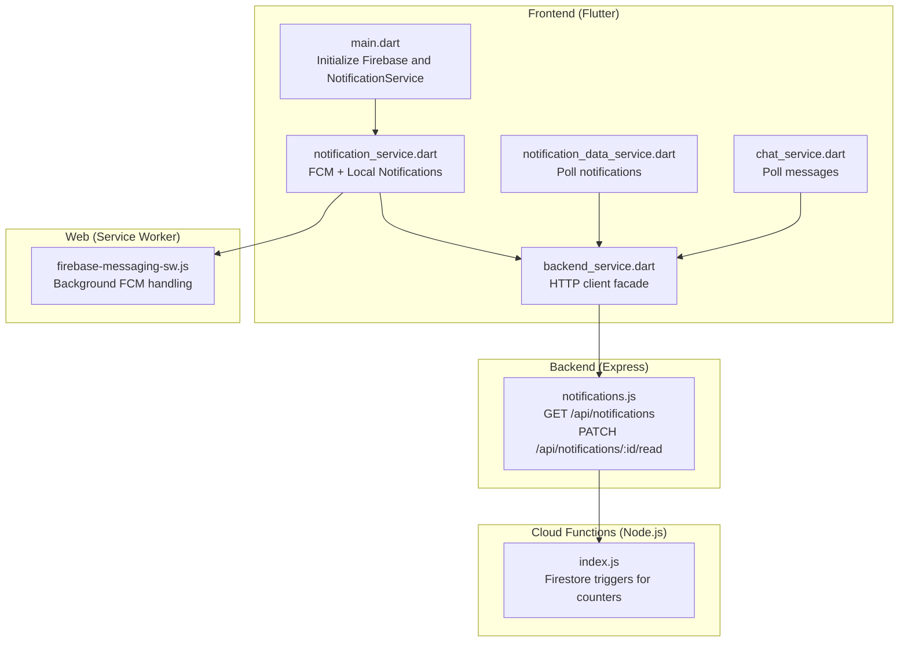
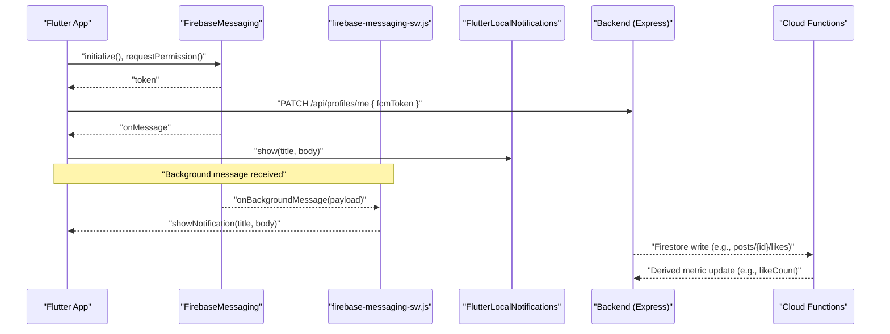
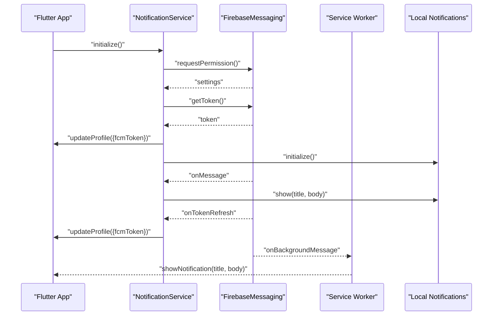
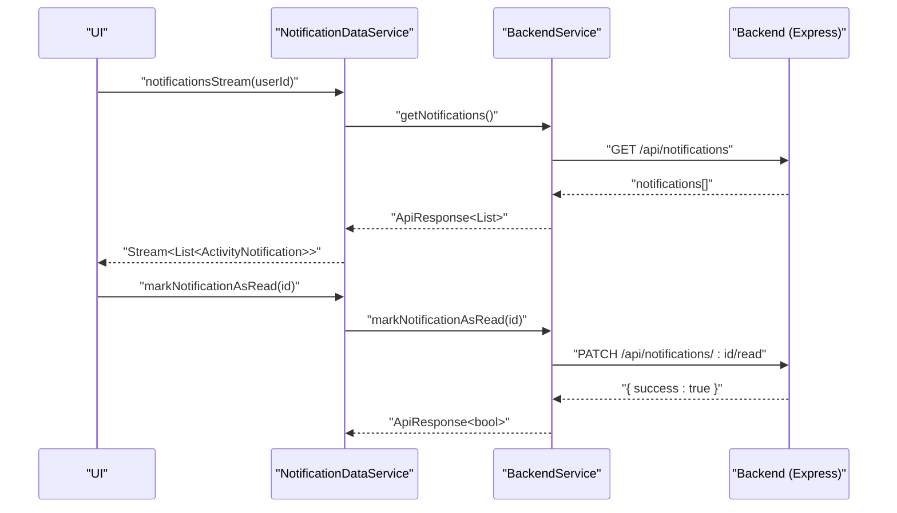
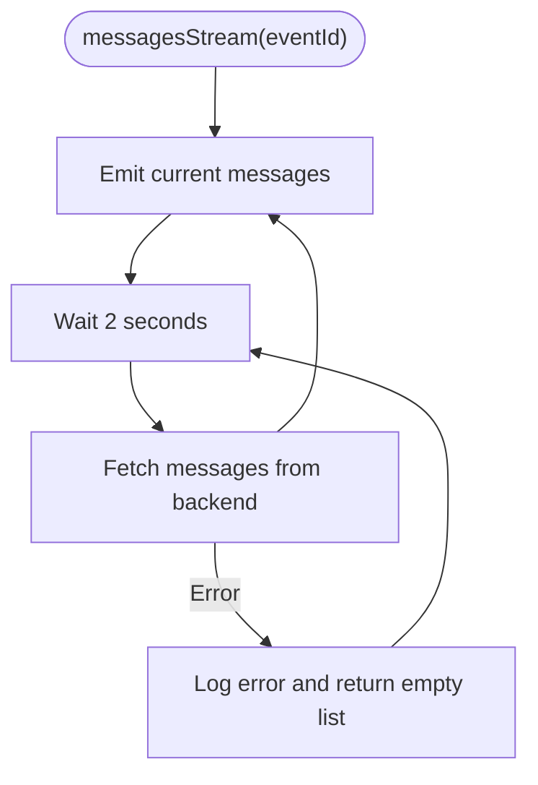
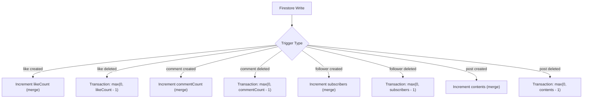
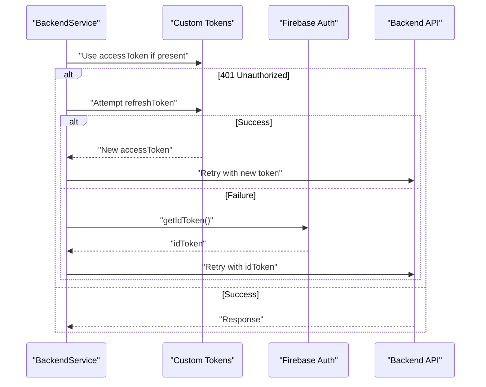
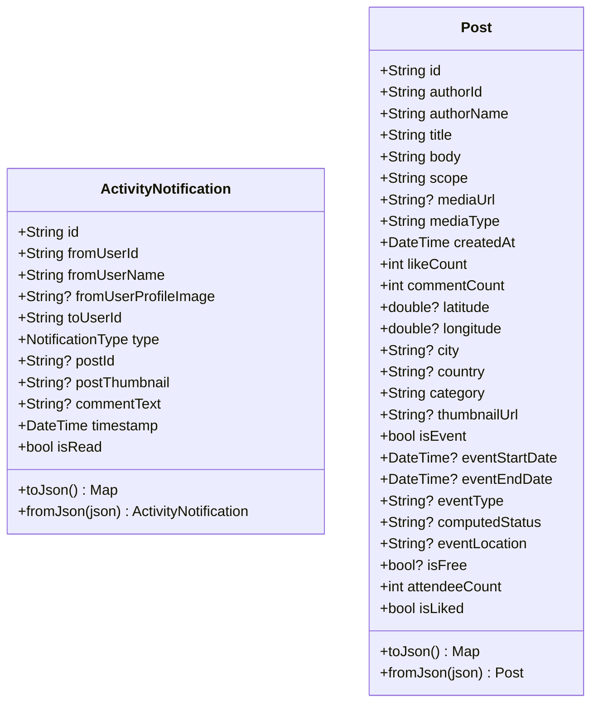
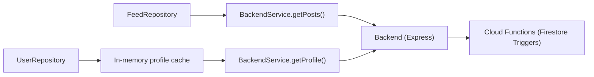
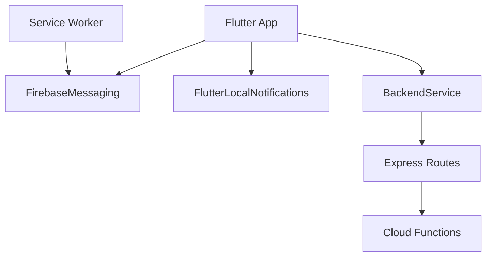

# Real-time Features

<cite>
**Referenced Files in This Document**
- [main.dart](file://testpro-main/lib/main.dart)
- [notification_service.dart](file://testpro-main/lib/services/notification_service.dart)
- [notification_data_service.dart](file://testpro-main/lib/services/notification_data_service.dart)
- [notification.dart](file://testpro-main/lib/models/notification.dart)
- [chat_service.dart](file://testpro-main/lib/services/chat_service.dart)
- [chat_message.dart](file://testpro-main/lib/models/chat_message.dart)
- [backend_service.dart](file://testpro-main/lib/services/backend_service.dart)
- [firebase-messaging-sw.js](file://testpro-main/web/firebase-messaging-sw.js)
- [google-services.json](file://testpro-main/android/app/google-services.json)
- [AppDelegate.swift](file://testpro-main/ios/Runner/AppDelegate.swift)
- [index.js](file://testpro-main/functions/index.js)
- [notifications.js](file://backend/src/routes/notifications.js)
- [feed_repository.dart](file://testpro-main/lib/repositories/feed_repository.dart)
- [user_repository.dart](file://testpro-main/lib/repositories/user_repository.dart)
- [post.dart](file://testpro-main/lib/models/post.dart)
</cite>

## Table of Contents
1. [Introduction](#introduction)
2. [Project Structure](#project-structure)
3. [Core Components](#core-components)
4. [Architecture Overview](#architecture-overview)
5. [Detailed Component Analysis](#detailed-component-analysis)
6. [Dependency Analysis](#dependency-analysis)
7. [Performance Considerations](#performance-considerations)
8. [Troubleshooting Guide](#troubleshooting-guide)
9. [Conclusion](#conclusion)

## Introduction
This document explains the real-time communication features implemented in the project. It covers:
- Firebase Cloud Messaging (FCM) integration for push notifications, including setup, foreground/background handling, and token lifecycle.
- Firestore-related triggers and counters managed by Cloud Functions for derived metrics.
- Local notification handling, channels, and user preference management.
- Near-real-time chat streams using periodic polling against backend APIs.
- Notification retrieval and state updates via backend endpoints.
- Offline capabilities, message queuing, and connection resilience strategies.

## Project Structure
The real-time features span three layers:
- Frontend (Flutter): Initializes Firebase, registers FCM handlers, displays local notifications, and manages periodic streams for chat and notifications.
- Backend (Express): Provides REST endpoints for notifications and interacts with Firestore.
- Cloud Functions (Node.js): Implements Firestore triggers to maintain counters and derive metrics.

**Diagram sources**
- [main.dart](file://testpro-main/lib/main.dart#L12-L22)
- [notification_service.dart](file://testpro-main/lib/services/notification_service.dart#L17-L57)
- [notification_data_service.dart](file://testpro-main/lib/services/notification_data_service.dart#L7-L12)
- [chat_service.dart](file://testpro-main/lib/services/chat_service.dart#L8-L16)
- [backend_service.dart](file://testpro-main/lib/services/backend_service.dart#L56-L57)
- [notifications.js](file://backend/src/routes/notifications.js#L11-L29)
- [index.js](file://testpro-main/functions/index.js#L13-L34)
- [firebase-messaging-sw.js](file://testpro-main/web/firebase-messaging-sw.js#L15-L24)

**Section sources**
- [main.dart](file://testpro-main/lib/main.dart#L12-L22)
- [notification_service.dart](file://testpro-main/lib/services/notification_service.dart#L17-L57)
- [notification_data_service.dart](file://testpro-main/lib/services/notification_data_service.dart#L7-L12)
- [chat_service.dart](file://testpro-main/lib/services/chat_service.dart#L8-L16)
- [backend_service.dart](file://testpro-main/lib/services/backend_service.dart#L56-L57)
- [notifications.js](file://backend/src/routes/notifications.js#L11-L29)
- [index.js](file://testpro-main/functions/index.js#L13-L34)
- [firebase-messaging-sw.js](file://testpro-main/web/firebase-messaging-sw.js#L15-L24)

## Core Components
- FCM initialization and token lifecycle: Permission request, token retrieval, token refresh callback, and background message handler registration.
- Local notification display: Foreground message handling and local notification rendering with a high-importance channel.
- Notification data service: Periodic polling of activity notifications from backend endpoints.
- Chat service: Immediate emission plus periodic polling for near-real-time chat.
- Backend service: Centralized HTTP client with token orchestration and endpoint proxies.
- Cloud Functions: Firestore triggers to increment/decrement counters and maintain derived metrics.

**Section sources**
- [notification_service.dart](file://testpro-main/lib/services/notification_service.dart#L17-L92)
- [notification_data_service.dart](file://testpro-main/lib/services/notification_data_service.dart#L7-L25)
- [chat_service.dart](file://testpro-main/lib/services/chat_service.dart#L8-L34)
- [backend_service.dart](file://testpro-main/lib/services/backend_service.dart#L70-L497)
- [index.js](file://testpro-main/functions/index.js#L13-L80)

## Architecture Overview
The system integrates Firebase for push notifications and Express endpoints for activity notifications. Firestore triggers keep counters consistent. The frontend initializes FCM, handles foreground/background messages, and polls for chat and notifications.

**Diagram sources**
- [notification_service.dart](file://testpro-main/lib/services/notification_service.dart#L17-L57)
- [firebase-messaging-sw.js](file://testpro-main/web/firebase-messaging-sw.js#L15-L24)
- [backend_service.dart](file://testpro-main/lib/services/backend_service.dart#L78-L84)
- [notifications.js](file://backend/src/routes/notifications.js#L11-L29)
- [index.js](file://testpro-main/functions/index.js#L13-L34)

## Detailed Component Analysis

### FCM Integration and Notification Service
- Initialization:
  - Requests notification permissions for Android/iOS.
  - Retrieves initial FCM token and syncs it to backend.
  - Initializes local notification plugin and sets up foreground message listener.
  - Registers a top-level background message handler for release builds.
- Token lifecycle:
  - Handles token refresh events and re-syncs with backend.
- Local notifications:
  - Foreground messages trigger local notification display on a high-importance channel.
- Web background handler:
  - Service worker receives background messages and shows notifications.

**Diagram sources**
- [notification_service.dart](file://testpro-main/lib/services/notification_service.dart#L17-L92)
- [firebase-messaging-sw.js](file://testpro-main/web/firebase-messaging-sw.js#L15-L24)

**Section sources**
- [notification_service.dart](file://testpro-main/lib/services/notification_service.dart#L17-L92)
- [firebase-messaging-sw.js](file://testpro-main/web/firebase-messaging-sw.js#L15-L24)
- [google-services.json](file://testpro-main/android/app/google-services.json#L1-L38)
- [AppDelegate.swift](file://testpro-main/ios/Runner/AppDelegate.swift#L1-L14)

### Notification Data Service and Backend Endpoints
- Notification retrieval:
  - Periodic polling every 5 minutes for activity notifications.
  - Converts JSON payloads to typed models.
- Backend endpoints:
  - GET /api/notifications: returns recent notifications for the current user.
  - PATCH /api/notifications/:id/read: marks a notification as read.
- Mark-as-read actions:
  - Client invokes backend to update read state.

**Diagram sources**
- [notification_data_service.dart](file://testpro-main/lib/services/notification_data_service.dart#L7-L25)
- [backend_service.dart](file://testpro-main/lib/services/backend_service.dart#L430-L448)
- [notifications.js](file://backend/src/routes/notifications.js#L11-L48)

**Section sources**
- [notification_data_service.dart](file://testpro-main/lib/services/notification_data_service.dart#L7-L25)
- [backend_service.dart](file://testpro-main/lib/services/backend_service.dart#L430-L448)
- [notifications.js](file://backend/src/routes/notifications.js#L11-L48)
- [notification.dart](file://testpro-main/lib/models/notification.dart#L1-L88)

### Chat Service and Streams
- Messages stream:
  - Emits current messages immediately upon subscription.
  - Polls every 2 seconds to approximate near-real-time updates.
- Message sending:
  - Sends via backend endpoint and throws on failure.
- Data model:
  - Strongly-typed chat message with sender info and timestamp.

**Diagram sources**
- [chat_service.dart](file://testpro-main/lib/services/chat_service.dart#L8-L16)
- [chat_message.dart](file://testpro-main/lib/models/chat_message.dart#L1-L53)

**Section sources**
- [chat_service.dart](file://testpro-main/lib/services/chat_service.dart#L8-L34)
- [chat_message.dart](file://testpro-main/lib/models/chat_message.dart#L1-L53)

### Firestore Triggers and Derived Metrics
- Triggers:
  - Increment/decrement counters for likes, comments, followers, and posts.
  - Transactions clamp negative counts to zero.
- Impact:
  - Keeps derived metrics consistent without client-side writes.

**Diagram sources**
- [index.js](file://testpro-main/functions/index.js#L13-L109)

**Section sources**
- [index.js](file://testpro-main/functions/index.js#L13-L109)

### Backend Service Orchestration and Token Handling
- Token flow:
  - Attempts custom access/refresh token exchange.
  - Falls back to Firebase ID tokens if custom tokens unavailable.
  - Handles 401/403 by clearing tokens and retrying with Firebase tokens.
- Endpoint proxies:
  - Centralized methods for notifications, posts, comments, likes, follows, events, and search.

**Diagram sources**
- [backend_service.dart](file://testpro-main/lib/services/backend_service.dart#L104-L212)

**Section sources**
- [backend_service.dart](file://testpro-main/lib/services/backend_service.dart#L104-L212)

### Data Models for Notifications and Posts
- ActivityNotification:
  - Enumerated type for notification categories.
  - Robust JSON parsing and serialization.
- Post:
  - Comprehensive post model including event fields and counters.
  - Fallback parsing for event dates and optional media.

**Diagram sources**
- [notification.dart](file://testpro-main/lib/models/notification.dart#L1-L88)
- [post.dart](file://testpro-main/lib/models/post.dart#L1-L143)

**Section sources**
- [notification.dart](file://testpro-main/lib/models/notification.dart#L1-L88)
- [post.dart](file://testpro-main/lib/models/post.dart#L1-L143)

### Conceptual Overview
- Real-time feed and recommendations:
  - Feed retrieval via backend posts endpoint; repository composes recommended feeds.
  - User profile caching with periodic refresh.
- Event-driven architecture:
  - Firestore triggers update counters and derived metrics.
  - Backend endpoints expose notifications and interactions.

**Diagram sources**
- [feed_repository.dart](file://testpro-main/lib/repositories/feed_repository.dart#L9-L25)
- [user_repository.dart](file://testpro-main/lib/repositories/user_repository.dart#L21-L29)
- [backend_service.dart](file://testpro-main/lib/services/backend_service.dart#L382-L406)
- [index.js](file://testpro-main/functions/index.js#L83-L109)

**Section sources**
- [feed_repository.dart](file://testpro-main/lib/repositories/feed_repository.dart#L9-L25)
- [user_repository.dart](file://testpro-main/lib/repositories/user_repository.dart#L21-L29)
- [backend_service.dart](file://testpro-main/lib/services/backend_service.dart#L382-L406)
- [index.js](file://testpro-main/functions/index.js#L83-L109)

## Dependency Analysis
- Frontend depends on:
  - Firebase Messaging and Local Notifications plugins.
  - BackendService for HTTP operations.
- Backend depends on:
  - Firestore for persistence and counters.
  - Cloud Functions for derived metrics.
- Web service worker depends on:
  - Firebase JS SDK for background message handling.

**Diagram sources**
- [notification_service.dart](file://testpro-main/lib/services/notification_service.dart#L17-L57)
- [backend_service.dart](file://testpro-main/lib/services/backend_service.dart#L56-L57)
- [notifications.js](file://backend/src/routes/notifications.js#L11-L29)
- [index.js](file://testpro-main/functions/index.js#L1-L10)
- [firebase-messaging-sw.js](file://testpro-main/web/firebase-messaging-sw.js#L1-L24)

**Section sources**
- [notification_service.dart](file://testpro-main/lib/services/notification_service.dart#L17-L57)
- [backend_service.dart](file://testpro-main/lib/services/backend_service.dart#L56-L57)
- [notifications.js](file://backend/src/routes/notifications.js#L11-L29)
- [index.js](file://testpro-main/functions/index.js#L1-L10)
- [firebase-messaging-sw.js](file://testpro-main/web/firebase-messaging-sw.js#L1-L24)

## Performance Considerations
- Polling cadence:
  - Chat: 2-second intervals to balance freshness and cost.
  - Notifications: 5-minute intervals to reduce request storms.
- Derived metrics:
  - Firestore triggers avoid client-side race conditions and ensure consistency.
- Token orchestration:
  - Deduplicated custom token sync prevents concurrent calls and reduces overhead.
- Caching:
  - User profile cache reduces redundant network calls.

[No sources needed since this section provides general guidance]

## Troubleshooting Guide
- FCM token not syncing:
  - Verify permission status and ensure token refresh handler is registered.
  - Confirm backend update endpoint is reachable and authenticated.
- Background notifications not showing:
  - Ensure service worker is deployed and registered.
  - Check notification channel configuration and app-level settings.
- Chat messages not updating:
  - Confirm periodic polling is active and backend endpoint returns data.
  - Inspect error logs for fetch failures.
- Notification read state not updating:
  - Verify PATCH endpoint is called with correct ID and user authorization.
- Derived counters incorrect:
  - Check Firestore triggers for errors and confirm transactions execute.

**Section sources**
- [notification_service.dart](file://testpro-main/lib/services/notification_service.dart#L17-L92)
- [firebase-messaging-sw.js](file://testpro-main/web/firebase-messaging-sw.js#L15-L24)
- [chat_service.dart](file://testpro-main/lib/services/chat_service.dart#L8-L34)
- [backend_service.dart](file://testpro-main/lib/services/backend_service.dart#L440-L448)
- [index.js](file://testpro-main/functions/index.js#L13-L34)

## Conclusion
The project implements a robust real-time communication stack:
- FCM handles push notifications with foreground/background processing and token lifecycle management.
- Cloud Functions maintain accurate derived metrics via Firestore triggers.
- Local notifications and periodic polling provide responsive UX for chat and notifications.
- Backend endpoints and token orchestration ensure secure and resilient data access.
- Caching and polling strategies balance performance and consistency across devices.

[No sources needed since this section summarizes without analyzing specific files]