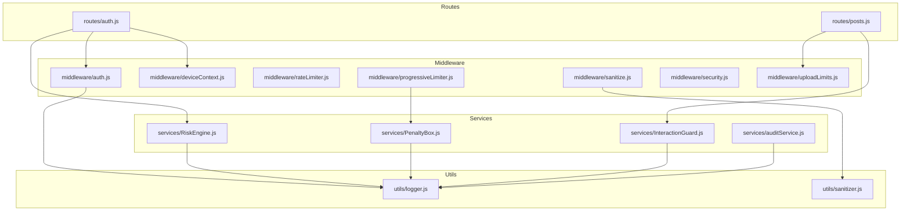
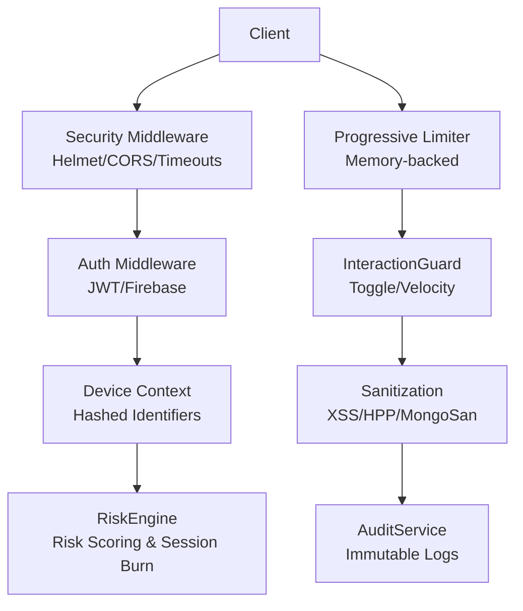
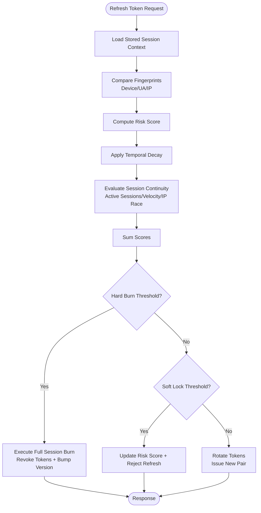
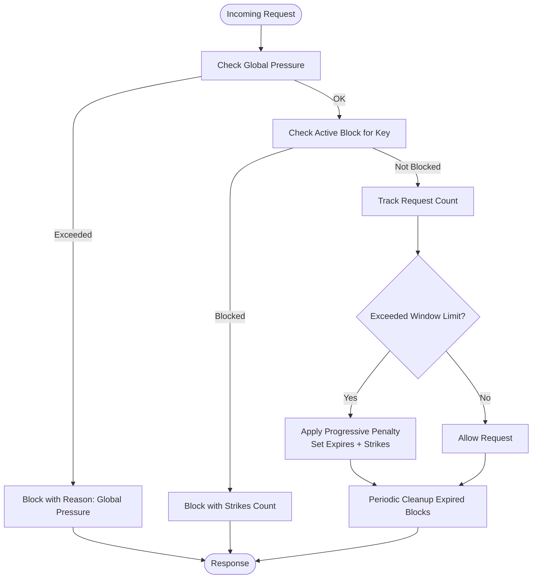
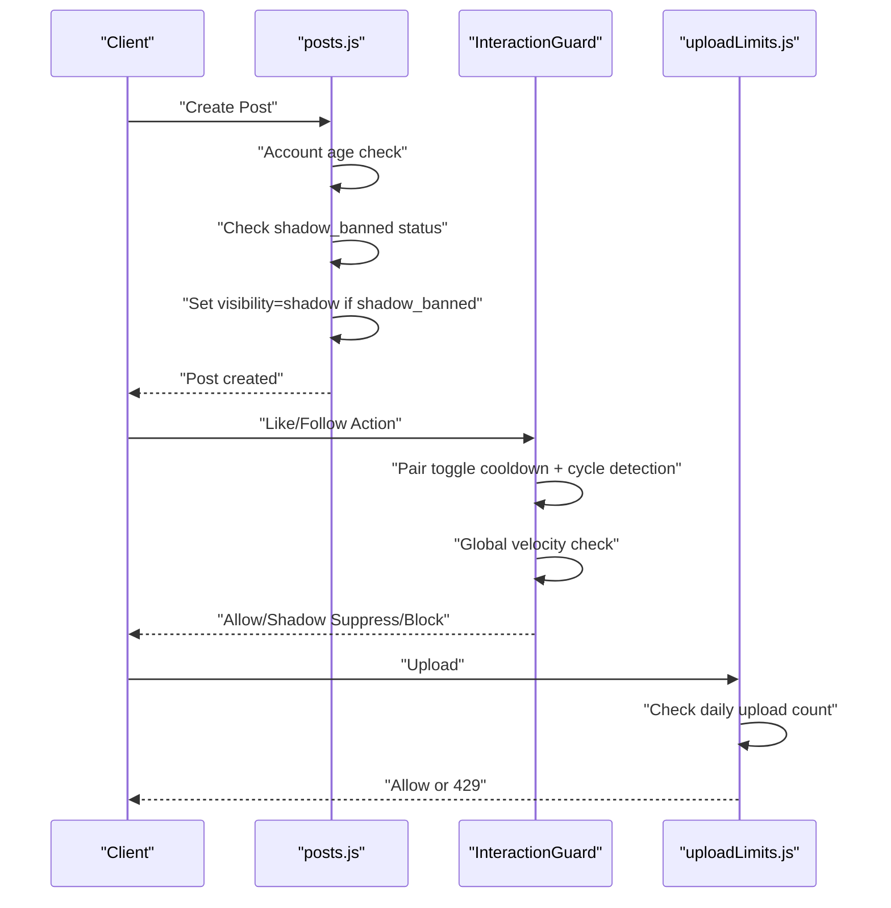
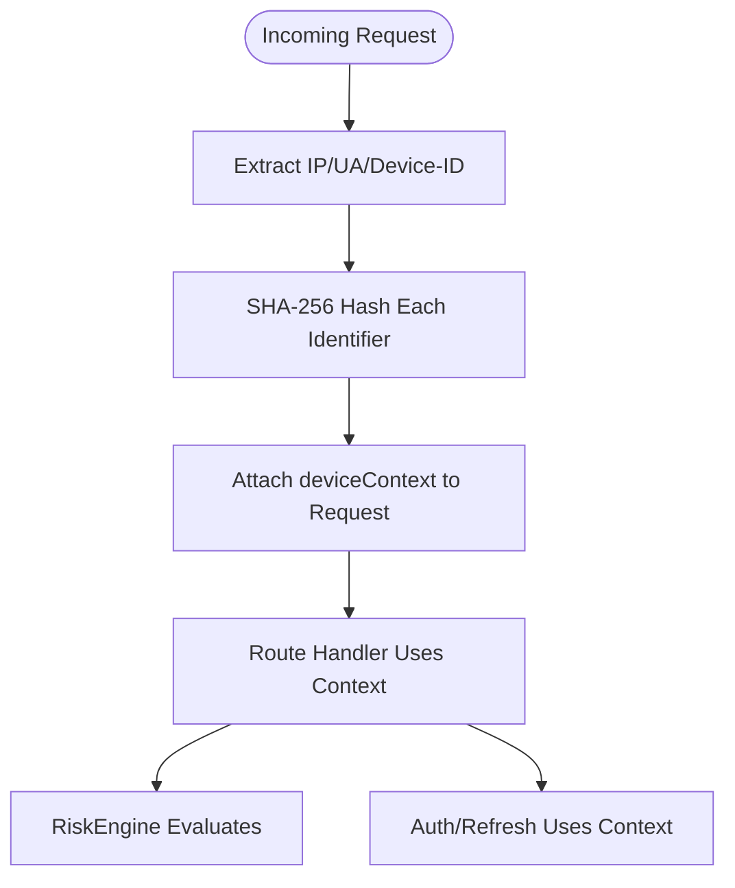
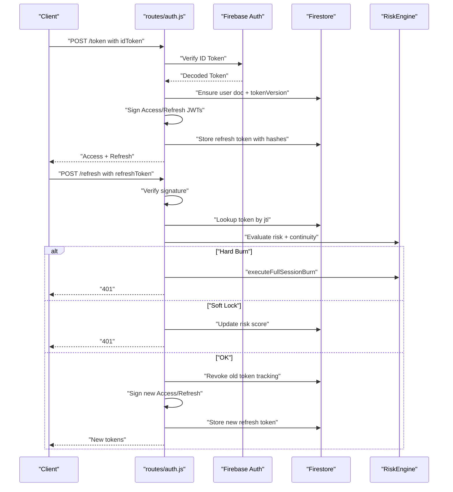
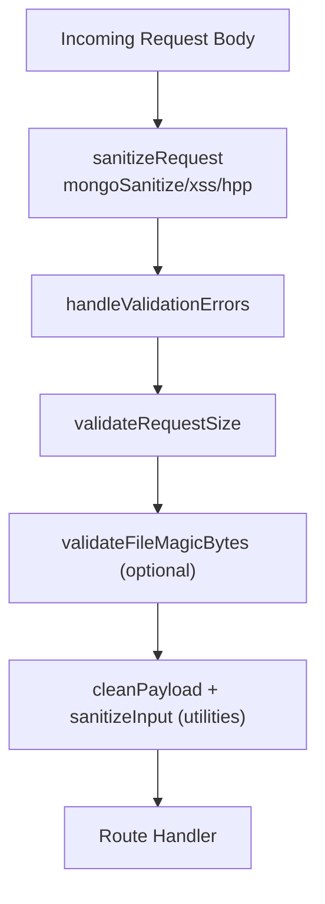
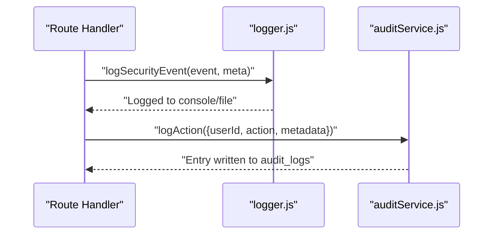
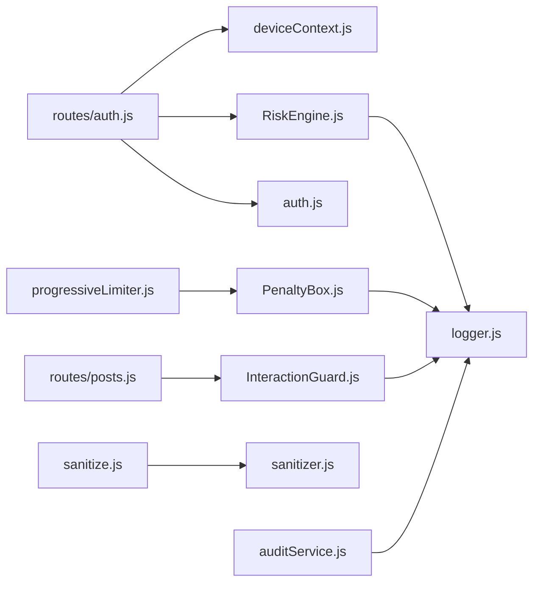

# Security Architecture

<cite>
**Referenced Files in This Document**
- [RiskEngine.js](file://backend/src/services/RiskEngine.js)
- [PenaltyBox.js](file://backend/src/services/PenaltyBox.js)
- [InteractionGuard.js](file://backend/src/services/InteractionGuard.js)
- [auditService.js](file://backend/src/services/auditService.js)
- [auth.js](file://backend/src/routes/auth.js)
- [authMiddleware.js](file://backend/src/middleware/auth.js)
- [deviceContext.js](file://backend/src/middleware/deviceContext.js)
- [rateLimiter.js](file://backend/src/middleware/rateLimiter.js)
- [progressiveLimiter.js](file://backend/src/middleware/progressiveLimiter.js)
- [sanitize.js](file://backend/src/middleware/sanitize.js)
- [sanitizer.js](file://backend/src/utils/sanitizer.js)
- [security.js](file://backend/src/middleware/security.js)
- [errorHandler.js](file://backend/src/middleware/errorHandler.js)
- [uploadLimits.js](file://backend/src/middleware/uploadLimits.js)
- [logger.js](file://backend/src/utils/logger.js)
- [posts.js](file://backend/src/routes/posts.js)
</cite>

## Table of Contents
1. [Introduction](#introduction)
2. [Project Structure](#project-structure)
3. [Core Components](#core-components)
4. [Architecture Overview](#architecture-overview)
5. [Detailed Component Analysis](#detailed-component-analysis)
6. [Dependency Analysis](#dependency-analysis)
7. [Performance Considerations](#performance-considerations)
8. [Troubleshooting Guide](#troubleshooting-guide)
9. [Conclusion](#conclusion)
10. [Appendices](#appendices)

## Introduction
This document describes LocalMe’s multi-layered security architecture. It covers the risk assessment engine for behavioral analysis and threat detection, the progressive rate limiting and penalty box system, shadow banning and abuse prevention, device fingerprinting and context tracking, JWT and refresh token lifecycle management, input sanitization and injection protections, audit logging and monitoring, incident response, and compliance and privacy controls.

## Project Structure
Security-related code is organized by responsibility:
- Services: RiskEngine, PenaltyBox, InteractionGuard, auditService
- Middleware: auth, deviceContext, rateLimiter, progressiveLimiter, sanitize, security, uploadLimits, interactionVelocity
- Routes: auth, posts, and others that integrate security policies
- Utilities: logger, sanitizer

**Diagram sources**
- [auth.js](file://backend/src/routes/auth.js#L1-L301)
- [posts.js](file://backend/src/routes/posts.js#L90-L157)
- [authMiddleware.js](file://backend/src/middleware/auth.js#L1-L164)
- [deviceContext.js](file://backend/src/middleware/deviceContext.js#L1-L24)
- [rateLimiter.js](file://backend/src/middleware/rateLimiter.js#L1-L76)
- [progressiveLimiter.js](file://backend/src/middleware/progressiveLimiter.js#L1-L61)
- [sanitize.js](file://backend/src/middleware/sanitize.js#L1-L154)
- [security.js](file://backend/src/middleware/security.js#L1-L75)
- [uploadLimits.js](file://backend/src/middleware/uploadLimits.js#L1-L55)
- [RiskEngine.js](file://backend/src/services/RiskEngine.js#L1-L170)
- [PenaltyBox.js](file://backend/src/services/PenaltyBox.js#L1-L108)
- [InteractionGuard.js](file://backend/src/services/InteractionGuard.js#L1-L124)
- [auditService.js](file://backend/src/services/auditService.js#L1-L33)
- [logger.js](file://backend/src/utils/logger.js#L1-L29)
- [sanitizer.js](file://backend/src/utils/sanitizer.js#L1-L64)

**Section sources**
- [auth.js](file://backend/src/routes/auth.js#L1-L301)
- [authMiddleware.js](file://backend/src/middleware/auth.js#L1-L164)
- [deviceContext.js](file://backend/src/middleware/deviceContext.js#L1-L24)
- [rateLimiter.js](file://backend/src/middleware/rateLimiter.js#L1-L76)
- [progressiveLimiter.js](file://backend/src/middleware/progressiveLimiter.js#L1-L61)
- [sanitize.js](file://backend/src/middleware/sanitize.js#L1-L154)
- [security.js](file://backend/src/middleware/security.js#L1-L75)
- [uploadLimits.js](file://backend/src/middleware/uploadLimits.js#L1-L55)
- [RiskEngine.js](file://backend/src/services/RiskEngine.js#L1-L170)
- [PenaltyBox.js](file://backend/src/services/PenaltyBox.js#L1-L108)
- [InteractionGuard.js](file://backend/src/services/InteractionGuard.js#L1-L124)
- [auditService.js](file://backend/src/services/auditService.js#L1-L33)
- [logger.js](file://backend/src/utils/logger.js#L1-L29)
- [sanitizer.js](file://backend/src/utils/sanitizer.js#L1-L64)
- [posts.js](file://backend/src/routes/posts.js#L90-L157)

## Core Components
- RiskEngine: Behavioral risk scoring for refresh tokens, session continuity checks, and global session burn automation.
- PenaltyBox: In-memory progressive rate limiting with escalating penalties and memory safeguards.
- InteractionGuard: Behavioral graph integrity enforcement for toggles (like/follow) and global velocity.
- AuditService: Immutable audit logging for sensitive actions.
- JWT and refresh token lifecycle: Secure issuance, rotation, revocation tracking, and versioning.
- Device fingerprinting and context: Hashed identifiers to protect privacy while enabling behavioral checks.
- Input sanitization and injection prevention: Express validators, XSS filtering, and request size guards.
- Abuse prevention: Shadow banning, daily upload caps, and interaction velocity gating.
- Security middleware: Helmet, CORS, timeouts, and centralized error handling.

**Section sources**
- [RiskEngine.js](file://backend/src/services/RiskEngine.js#L1-L170)
- [PenaltyBox.js](file://backend/src/services/PenaltyBox.js#L1-L108)
- [InteractionGuard.js](file://backend/src/services/InteractionGuard.js#L1-L124)
- [auditService.js](file://backend/src/services/auditService.js#L1-L33)
- [auth.js](file://backend/src/routes/auth.js#L16-L280)
- [authMiddleware.js](file://backend/src/middleware/auth.js#L1-L164)
- [deviceContext.js](file://backend/src/middleware/deviceContext.js#L1-L24)
- [sanitize.js](file://backend/src/middleware/sanitize.js#L1-L154)
- [security.js](file://backend/src/middleware/security.js#L1-L75)
- [uploadLimits.js](file://backend/src/middleware/uploadLimits.js#L1-L55)
- [posts.js](file://backend/src/routes/posts.js#L90-L157)

## Architecture Overview
The security architecture layers are:
- Transport and request hardening (Helmet, CORS, timeouts)
- Authentication and session integrity (Firebase/JWT, versioning, revocation)
- Behavioral risk and session continuity (risk scoring, session burn)
- Rate limiting and progressive penalties (memory-backed limiter)
- Graph integrity and abuse prevention (toggle cycling, velocity)
- Input sanitization and request validation
- Audit logging and monitoring
- Shadow banning and upload caps

**Diagram sources**
- [security.js](file://backend/src/middleware/security.js#L1-L75)
- [authMiddleware.js](file://backend/src/middleware/auth.js#L1-L164)
- [deviceContext.js](file://backend/src/middleware/deviceContext.js#L1-L24)
- [RiskEngine.js](file://backend/src/services/RiskEngine.js#L1-L170)
- [progressiveLimiter.js](file://backend/src/middleware/progressiveLimiter.js#L1-L61)
- [PenaltyBox.js](file://backend/src/services/PenaltyBox.js#L1-L108)
- [InteractionGuard.js](file://backend/src/services/InteractionGuard.js#L1-L124)
- [sanitize.js](file://backend/src/middleware/sanitize.js#L1-L154)
- [auditService.js](file://backend/src/services/auditService.js#L1-L33)

## Detailed Component Analysis

### Risk Assessment Engine
The RiskEngine evaluates refresh token requests using:
- Device, user agent, and IP hash comparisons to compute a risk score.
- Temporal decay of risk based on last seen.
- Session continuity checks for concurrent refresh races, velocity spikes, and excessive active sessions.
- Automated full session burn with revocation and token version bump.

**Diagram sources**
- [RiskEngine.js](file://backend/src/services/RiskEngine.js#L11-L130)
- [auth.js](file://backend/src/routes/auth.js#L166-L280)

**Section sources**
- [RiskEngine.js](file://backend/src/services/RiskEngine.js#L1-L170)
- [auth.js](file://backend/src/routes/auth.js#L166-L280)

### Penalty Box System (Progressive Rate Limiting)
The PenaltyBox enforces:
- Global pressure guard (request-per-second cap).
- Per-key counters within a sliding window.
- Progressive penalties: 5 min, 30 min, 24 h blocks with gradual strike decay.
- Memory safeguards to prevent leaks.

**Diagram sources**
- [PenaltyBox.js](file://backend/src/services/PenaltyBox.js#L22-L104)
- [progressiveLimiter.js](file://backend/src/middleware/progressiveLimiter.js#L22-L60)

**Section sources**
- [PenaltyBox.js](file://backend/src/services/PenaltyBox.js#L1-L108)
- [progressiveLimiter.js](file://backend/src/middleware/progressiveLimiter.js#L1-L61)

### Shadow Banning and Abuse Prevention
Abuse prevention includes:
- Shadow banning: Posts by shadow-banned users are marked private to others while still allowing the actor to post.
- Daily upload caps: Enforced via Firestore counters.
- Interaction velocity: Limits on toggles and global rates for likes and follows.

**Diagram sources**
- [posts.js](file://backend/src/routes/posts.js#L90-L157)
- [InteractionGuard.js](file://backend/src/services/InteractionGuard.js#L47-L122)
- [uploadLimits.js](file://backend/src/middleware/uploadLimits.js#L10-L36)

**Section sources**
- [posts.js](file://backend/src/routes/posts.js#L90-L157)
- [InteractionGuard.js](file://backend/src/services/InteractionGuard.js#L1-L124)
- [uploadLimits.js](file://backend/src/middleware/uploadLimits.js#L1-L55)

### Device Fingerprinting and Context Tracking
Device context middleware computes hashed identifiers for:
- IP address
- User-Agent
- Device ID (required for refresh)

These hashes are stored with refresh tokens and compared during refresh to detect anomalies.

**Diagram sources**
- [deviceContext.js](file://backend/src/middleware/deviceContext.js#L7-L23)
- [auth.js](file://backend/src/routes/auth.js#L166-L280)
- [RiskEngine.js](file://backend/src/services/RiskEngine.js#L11-L30)

**Section sources**
- [deviceContext.js](file://backend/src/middleware/deviceContext.js#L1-L24)
- [auth.js](file://backend/src/routes/auth.js#L16-L280)
- [RiskEngine.js](file://backend/src/services/RiskEngine.js#L1-L170)

### JWT Token Management and Session Security
Token lifecycle:
- Exchange Firebase ID token for a custom short-lived access token and a long-lived refresh token.
- Refresh tokens are signed with a separate secret and tracked in Firestore with hashes and risk metadata.
- Rotation invalidates the old token tracking and issues a new pair.
- Versioning enables global kill switches and instant logout on policy changes.

**Diagram sources**
- [auth.js](file://backend/src/routes/auth.js#L16-L280)
- [RiskEngine.js](file://backend/src/services/RiskEngine.js#L116-L168)

**Section sources**
- [auth.js](file://backend/src/routes/auth.js#L16-L280)
- [authMiddleware.js](file://backend/src/middleware/auth.js#L32-L89)
- [RiskEngine.js](file://backend/src/services/RiskEngine.js#L1-L170)

### Input Sanitization, SQL Injection Prevention, and XSS Protection
- Express validators and sanitizers are applied centrally to requests.
- MongoDB injection protection via express-mongo-sanitize.
- XSS protection via xss-clean and a strict whitelist configuration.
- HTTP Parameter Pollution (HPP) via hpp.
- Request size validation to prevent abuse.
- Structured input sanitization utilities for deep sanitization and mass assignment defense.

**Diagram sources**
- [sanitize.js](file://backend/src/middleware/sanitize.js#L8-L154)
- [sanitizer.js](file://backend/src/utils/sanitizer.js#L20-L64)

**Section sources**
- [sanitize.js](file://backend/src/middleware/sanitize.js#L1-L154)
- [sanitizer.js](file://backend/src/utils/sanitizer.js#L1-L64)

### Audit Logging, Monitoring, and Incident Response
- Security events are logged with a dedicated helper.
- AuditService writes immutable entries to Firestore with IP and UA.
- Centralized error handler ensures structured error responses and logging.
- Security middleware logs CORS rejections and timeouts.

**Diagram sources**
- [logger.js](file://backend/src/utils/logger.js#L20-L26)
- [auditService.js](file://backend/src/services/auditService.js#L9-L30)
- [errorHandler.js](file://backend/src/middleware/errorHandler.js#L3-L35)
- [security.js](file://backend/src/middleware/security.js#L48-L75)

**Section sources**
- [logger.js](file://backend/src/utils/logger.js#L1-L29)
- [auditService.js](file://backend/src/services/auditService.js#L1-L33)
- [errorHandler.js](file://backend/src/middleware/errorHandler.js#L1-L35)
- [security.js](file://backend/src/middleware/security.js#L1-L75)

## Dependency Analysis
Key dependencies and coupling:
- Routes depend on middleware for auth, device context, sanitization, and rate limiting.
- RiskEngine depends on Firestore for refresh token and user documents.
- PenaltyBox and InteractionGuard are standalone services used by progressiveLimiter and route-specific guards.
- AuditService and logger are used across services for observability.

**Diagram sources**
- [auth.js](file://backend/src/routes/auth.js#L1-L301)
- [posts.js](file://backend/src/routes/posts.js#L90-L157)
- [deviceContext.js](file://backend/src/middleware/deviceContext.js#L1-L24)
- [authMiddleware.js](file://backend/src/middleware/auth.js#L1-L164)
- [progressiveLimiter.js](file://backend/src/middleware/progressiveLimiter.js#L1-L61)
- [PenaltyBox.js](file://backend/src/services/PenaltyBox.js#L1-L108)
- [InteractionGuard.js](file://backend/src/services/InteractionGuard.js#L1-L124)
- [sanitize.js](file://backend/src/middleware/sanitize.js#L1-L154)
- [sanitizer.js](file://backend/src/utils/sanitizer.js#L1-L64)
- [RiskEngine.js](file://backend/src/services/RiskEngine.js#L1-L170)
- [auditService.js](file://backend/src/services/auditService.js#L1-L33)
- [logger.js](file://backend/src/utils/logger.js#L1-L29)

**Section sources**
- [auth.js](file://backend/src/routes/auth.js#L1-L301)
- [posts.js](file://backend/src/routes/posts.js#L90-L157)
- [deviceContext.js](file://backend/src/middleware/deviceContext.js#L1-L24)
- [authMiddleware.js](file://backend/src/middleware/auth.js#L1-L164)
- [progressiveLimiter.js](file://backend/src/middleware/progressiveLimiter.js#L1-L61)
- [PenaltyBox.js](file://backend/src/services/PenaltyBox.js#L1-L108)
- [InteractionGuard.js](file://backend/src/services/InteractionGuard.js#L1-L124)
- [sanitize.js](file://backend/src/middleware/sanitize.js#L1-L154)
- [sanitizer.js](file://backend/src/utils/sanitizer.js#L1-L64)
- [RiskEngine.js](file://backend/src/services/RiskEngine.js#L1-L170)
- [auditService.js](file://backend/src/services/auditService.js#L1-L33)
- [logger.js](file://backend/src/utils/logger.js#L1-L29)

## Performance Considerations
- In-memory stores (PenaltyBox, InteractionGuard) minimize DB calls for rate limiting and toggling logic.
- Sliding window computations are bounded by small limits (e.g., last N refresh tokens).
- Caching user profiles in auth middleware reduces Firestore reads.
- Timeouts are relaxed for known slow routes to avoid false positives.

[No sources needed since this section provides general guidance]

## Troubleshooting Guide
Common issues and diagnostics:
- Authentication failures: Check token expiry, version mismatch, and revocation.
- Rate limiting: Review progressive limiter logs and penalty box strikes.
- Abuse detection: Investigate shadow banning and interaction velocity blocks.
- Upload limits: Confirm daily upload counters and thresholds.
- Security events: Use security event logs and audit logs for timelines.

**Section sources**
- [authMiddleware.js](file://backend/src/middleware/auth.js#L68-L89)
- [progressiveLimiter.js](file://backend/src/middleware/progressiveLimiter.js#L32-L59)
- [PenaltyBox.js](file://backend/src/services/PenaltyBox.js#L70-L104)
- [uploadLimits.js](file://backend/src/middleware/uploadLimits.js#L19-L25)
- [logger.js](file://backend/src/utils/logger.js#L20-L26)
- [auditService.js](file://backend/src/services/auditService.js#L9-L30)

## Conclusion
LocalMe’s security architecture combines cryptographic session management, behavioral risk modeling, and pragmatic rate limiting with progressive penalties. Device fingerprinting, shadow banning, and strict input sanitization mitigate common attack vectors. Comprehensive audit logging and monitoring enable incident response and compliance readiness.

[No sources needed since this section summarizes without analyzing specific files]

## Appendices

### Compliance and Privacy Controls
- Device identifiers are hashed to protect privacy; raw identifiers are not persisted.
- Immutable audit logs support forensic readiness.
- Strict XSS and HPP protections reduce exposure to injection and policy pollution.
- CORS whitelisting and secure headers minimize cross-origin risks.

**Section sources**
- [deviceContext.js](file://backend/src/middleware/deviceContext.js#L1-L24)
- [auditService.js](file://backend/src/services/auditService.js#L9-L30)
- [sanitize.js](file://backend/src/middleware/sanitize.js#L8-L12)
- [security.js](file://backend/src/middleware/security.js#L10-L46)