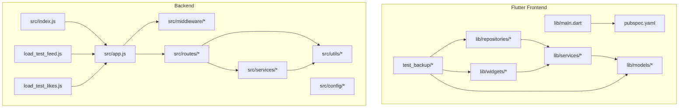
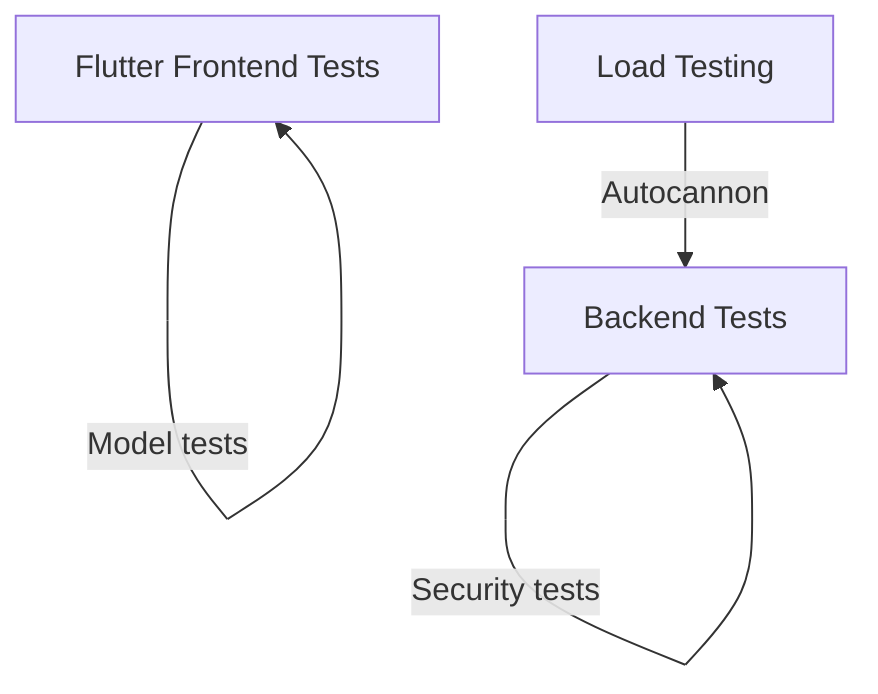
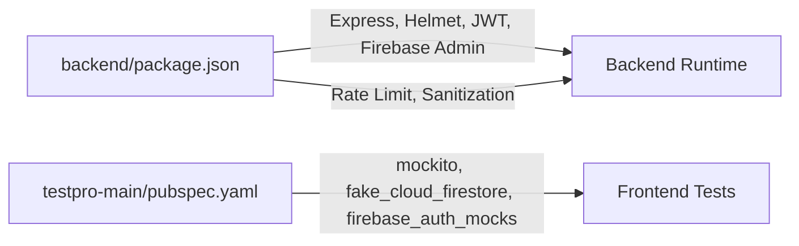

# Testing Strategy

<cite>
**Referenced Files in This Document**
- [TESTING_GUIDE.md](file://TESTING_GUIDE.md)
- [load_test_feed.js](file://backend/load_test_feed.js)
- [load_test_likes.js](file://backend/load_test_likes.js)
- [package.json](file://backend/package.json)
- [pubspec.yaml](file://testpro-main/pubspec.yaml)
- [main.dart](file://testpro-main/lib/main.dart)
- [auth.js](file://backend/src/middleware/auth.js)
- [rateLimiter.js](file://backend/src/middleware/rateLimiter.js)
- [security.js](file://backend/src/middleware/security.js)
- [uploadLimits.js](file://backend/src/middleware/uploadLimits.js)
- [posts.js](file://backend/src/routes/posts.js)
- [upload.js](file://backend/src/routes/upload.js)
- [auth_routes.js](file://backend/src/routes/auth.js)
- [otp_routes.js](file://backend/src/routes/otp.js)
- [interaction_guard.js](file://backend/src/services/InteractionGuard.js)
- [penalty_box.js](file://backend/src/services/PenaltyBox.js)
- [risk_engine.js](file://backend/src/services/RiskEngine.js)
- [audit_service.js](file://backend/src/services/auditService.js)
- [sanitizer.js](file://backend/src/utils/sanitizer.js)
- [logger.js](file://backend/src/utils/logger.js)
- [firebase.js](file://backend/src/config/firebase.js)
- [env.js](file://backend/src/config/env.js)
- [app.js](file://backend/src/app.js)
- [index.js](file://backend/src/index.js)
- [feed_repository_test.dart](file://testpro-main/test_backup/repositories/feed_repository_test.dart)
- [post_repository_test.dart](file://testpro-main/test_backup/repositories/post_repository_test.dart)
- [social_repository_test.dart](file://testpro-main/test_backup/repositories/social_repository_test.dart)
- [user_repository_test.dart](file://testpro-main/test_backup/repositories/user_repository_test.dart)
- [backend_service_test.dart](file://testpro-main/test_backup/services/backend_service_test.dart)
- [post_action_row_test.dart](file://testpro-main/test_backup/widgets/post/post_action_row_test.dart)
- [event_attendance_section_test.dart](file://testpro-main/test_backup/widgets/event_card/event_attendance_section_test.dart)
- [event_details_section_test.dart](file://testpro-main/test_backup/widgets/event_card/event_details_section_test.dart)
- [widget_test.dart](file://testpro-main/test_backup/widgets/widget_test.dart)
- [post_test.dart](file://testpro-main/test_backup/models/post_test.dart)
</cite>

## Table of Contents
1. [Introduction](#introduction)
2. [Project Structure](#project-structure)
3. [Core Components](#core-components)
4. [Architecture Overview](#architecture-overview)
5. [Detailed Component Analysis](#detailed-component-analysis)
6. [Dependency Analysis](#dependency-analysis)
7. [Performance Considerations](#performance-considerations)
8. [Troubleshooting Guide](#troubleshooting-guide)
9. [Conclusion](#conclusion)
10. [Appendices](#appendices)

## Introduction
This document defines a comprehensive testing strategy for both the Flutter frontend and the Node.js backend. It covers unit testing, service-level testing, widget testing, integration testing with Firebase, end-to-end workflows, security testing, load/performance/stress testing, CI/CD considerations, and QA processes. The goal is to ensure robustness, reliability, and security across all layers of the system.

## Project Structure
The repository is organized into two primary areas:
- Flutter frontend under testpro-main with models, services, repositories, widgets, and legacy test artifacts.
- Node.js backend under backend with configuration, middleware, routes, services, utilities, and load testing scripts.

Key testing-relevant locations:
- Backend: load testing scripts, middleware, routes, services, and configuration.
- Frontend: pubspec.yaml lists dev dependencies for mocking and testing; legacy test files exist under test_backup.

**Diagram sources**
- [pubspec.yaml](file://testpro-main/pubspec.yaml#L1-L61)
- [main.dart](file://testpro-main/lib/main.dart)
- [index.js](file://backend/src/index.js)
- [app.js](file://backend/src/app.js)
- [load_test_feed.js](file://backend/load_test_feed.js#L1-L19)
- [load_test_likes.js](file://backend/load_test_likes.js#L1-L22)

**Section sources**
- [pubspec.yaml](file://testpro-main/pubspec.yaml#L1-L61)
- [main.dart](file://testpro-main/lib/main.dart)
- [index.js](file://backend/src/index.js)
- [app.js](file://backend/src/app.js)

## Core Components
This section outlines the testing components and their roles:
- Backend middleware for authentication, rate limiting, security, and upload limits.
- Backend routes for posts, uploads, auth, OTP, and interactions.
- Backend services for risk detection, penalties, guards, and auditing.
- Frontend models, services, repositories, and widgets with legacy test coverage.
- Load testing scripts using autocannon.

Key backend components:
- Authentication middleware ensures protected endpoints require tokens.
- Rate limiter controls request throughput.
- Security middleware enforces safe request handling.
- Upload limits enforce file size/type policies.
- Routes expose endpoints for posts, uploads, auth, OTP, and interactions.
- Services encapsulate business logic for risk, penalties, guards, and audit.

Key frontend components:
- Models define data structures.
- Services handle network and business logic.
- Repositories abstract data access.
- Widgets encapsulate UI logic and state.
- Legacy tests cover repositories, services, and widgets.

**Section sources**
- [auth.js](file://backend/src/middleware/auth.js)
- [rateLimiter.js](file://backend/src/middleware/rateLimiter.js)
- [security.js](file://backend/src/middleware/security.js)
- [uploadLimits.js](file://backend/src/middleware/uploadLimits.js)
- [posts.js](file://backend/src/routes/posts.js)
- [upload.js](file://backend/src/routes/upload.js)
- [auth_routes.js](file://backend/src/routes/auth.js)
- [otp_routes.js](file://backend/src/routes/otp.js)
- [interaction_guard.js](file://backend/src/services/InteractionGuard.js)
- [penalty_box.js](file://backend/src/services/PenaltyBox.js)
- [risk_engine.js](file://backend/src/services/RiskEngine.js)
- [audit_service.js](file://backend/src/services/auditService.js)
- [sanitizer.js](file://backend/src/utils/sanitizer.js)
- [logger.js](file://backend/src/utils/logger.js)
- [firebase.js](file://backend/src/config/firebase.js)
- [env.js](file://backend/src/config/env.js)
- [feed_repository_test.dart](file://testpro-main/test_backup/repositories/feed_repository_test.dart)
- [post_repository_test.dart](file://testpro-main/test_backup/repositories/post_repository_test.dart)
- [social_repository_test.dart](file://testpro-main/test_backup/repositories/social_repository_test.dart)
- [user_repository_test.dart](file://testpro-main/test_backup/repositories/user_repository_test.dart)
- [backend_service_test.dart](file://testpro-main/test_backup/services/backend_service_test.dart)
- [post_action_row_test.dart](file://testpro-main/test_backup/widgets/post/post_action_row_test.dart)
- [event_attendance_section_test.dart](file://testpro-main/test_backup/widgets/event_card/event_attendance_section_test.dart)
- [event_details_section_test.dart](file://testpro-main/test_backup/widgets/event_card/event_details_section_test.dart)
- [widget_test.dart](file://testpro-main/test_backup/widgets/widget_test.dart)
- [post_test.dart](file://testpro-main/test_backup/models/post_test.dart)

## Architecture Overview
The testing architecture spans frontend and backend:
- Frontend tests validate UI behavior, service calls, repository interactions, and model correctness.
- Backend tests validate middleware, route handlers, services, and security enforcement.
- Load testing targets critical endpoints to measure throughput and latency.

[No sources needed since this diagram shows conceptual workflow, not actual code structure]

## Detailed Component Analysis

### Backend Middleware Testing
Focus areas:
- Authentication: verify token extraction, verification, and error responses.
- Rate limiting: verify thresholds and 429 responses.
- Security: verify sanitization, CSP, HSTS, XFO, XCTO headers.
- Upload limits: verify size/type restrictions and error responses.

Recommended tests:
- Unit tests for each middleware module asserting header injection, request blocking, and error payloads.
- Integration tests validating middleware chain order and behavior under load.

**Section sources**
- [auth.js](file://backend/src/middleware/auth.js)
- [rateLimiter.js](file://backend/src/middleware/rateLimiter.js)
- [security.js](file://backend/src/middleware/security.js)
- [uploadLimits.js](file://backend/src/middleware/uploadLimits.js)

### Backend Route Testing
Endpoints to test:
- Posts: GET /api/posts pagination and filtering.
- Upload: POST /api/upload/profile and media attachments.
- Auth: POST /api/auth/google and related flows.
- OTP: POST /api/otp/send and verify.
- Interactions: batch likes and other engagement endpoints.

Recommended tests:
- Unit tests for route handlers verifying status codes, response shapes, and error handling.
- Integration tests with mocked Firebase and storage to simulate real flows.

**Section sources**
- [posts.js](file://backend/src/routes/posts.js)
- [upload.js](file://backend/src/routes/upload.js)
- [auth_routes.js](file://backend/src/routes/auth.js)
- [otp_routes.js](file://backend/src/routes/otp.js)

### Backend Service Testing
Services to validate:
- InteractionGuard: protect against abuse patterns.
- PenaltyBox: apply and lift penalties.
- RiskEngine: compute risk scores and flags.
- auditService: record and query audit trails.

Recommended tests:
- Unit tests for service logic with deterministic inputs and assertions.
- Mock external dependencies (storage, Firebase) to isolate service behavior.

**Section sources**
- [interaction_guard.js](file://backend/src/services/InteractionGuard.js)
- [penalty_box.js](file://backend/src/services/PenaltyBox.js)
- [risk_engine.js](file://backend/src/services/RiskEngine.js)
- [audit_service.js](file://backend/src/services/auditService.js)

### Frontend Widget Testing Strategies
Legacy test coverage exists for:
- Post action row widget tests.
- Event card sections tests.
- General widget tests.

Recommended improvements:
- Expand widget tests to cover loading states, error states, and user interactions.
- Integrate mock providers for services and repositories to avoid live network calls.
- Use fake_cloud_firestore and firebase_auth_mocks for Firestore and Auth.

**Section sources**
- [post_action_row_test.dart](file://testpro-main/test_backup/widgets/post/post_action_row_test.dart)
- [event_attendance_section_test.dart](file://testpro-main/test_backup/widgets/event_card/event_attendance_section_test.dart)
- [event_details_section_test.dart](file://testpro-main/test_backup/widgets/event_card/event_details_section_test.dart)
- [widget_test.dart](file://testpro-main/test_backup/widgets/widget_test.dart)
- [pubspec.yaml](file://testpro-main/pubspec.yaml#L38-L46)

### Frontend Service Testing Patterns
Legacy service tests exist for backend communication.

Recommended patterns:
- Mock HTTP client to intercept requests and return controlled responses.
- Use fake_cloud_firestore for Firestore-dependent services.
- Parameterize tests for success, error, and timeout scenarios.

**Section sources**
- [backend_service_test.dart](file://testpro-main/test_backup/services/backend_service_test.dart)
- [pubspec.yaml](file://testpro-main/pubspec.yaml#L38-L46)

### Frontend Repository Testing
Legacy repository tests cover feed, post, social, and user repositories.

Recommended patterns:
- Wrap repository methods with mock clients and Firestore instances.
- Test pagination, filtering, and error propagation.
- Validate cache invalidation and refresh behavior.

**Section sources**
- [feed_repository_test.dart](file://testpro-main/test_backup/repositories/feed_repository_test.dart)
- [post_repository_test.dart](file://testpro-main/test_backup/repositories/post_repository_test.dart)
- [social_repository_test.dart](file://testpro-main/test_backup/repositories/social_repository_test.dart)
- [user_repository_test.dart](file://testpro-main/test_backup/repositories/user_repository_test.dart)

### Frontend Model Testing
Legacy model tests exist for post model.

Recommended patterns:
- Validate serialization/deserialization with various inputs.
- Test default values, required fields, and transformation logic.

**Section sources**
- [post_test.dart](file://testpro-main/test_backup/models/post_test.dart)

### Backend Integration Testing with Firebase
- Use Firebase emulator suite for local testing.
- Configure environment to point to emulator during tests.
- Validate auth token verification, Firestore reads/writes, and messaging hooks.

**Section sources**
- [firebase.js](file://backend/src/config/firebase.js)
- [env.js](file://backend/src/config/env.js)

### End-to-End Testing Workflows
Recommended E2E steps:
- Local backend + Flutter app connection.
- Google Sign-In flow.
- Profile image upload.
- Post creation with media.
- Monitoring backend logs for successful requests and security events.

**Section sources**
- [TESTING_GUIDE.md](file://TESTING_GUIDE.md#L77-L105)

### Security Testing Procedures
- Invalid file type rejection.
- Missing/expired token rejection.
- Large file rejection.
- Rate limit triggering and appropriate 429 responses.
- Security headers presence (CSP, HSTS, XFO, XCTO).

**Section sources**
- [TESTING_GUIDE.md](file://TESTING_GUIDE.md#L153-L187)
- [security.js](file://backend/src/middleware/security.js)
- [auth.js](file://backend/src/middleware/auth.js)
- [uploadLimits.js](file://backend/src/middleware/uploadLimits.js)
- [rateLimiter.js](file://backend/src/middleware/rateLimiter.js)

### Load Testing Strategies
Load testing scripts use autocannon:
- Feed load test targeting GET /api/posts with configurable connections and duration.
- Batch likes load test targeting POST /api/interactions/likes/batch with JSON payload.

Recommended practices:
- Run tests against a warmed-up server.
- Capture and analyze throughput, latency percentiles, and error rates.
- Use realistic Authorization tokens and payloads.

**Section sources**
- [load_test_feed.js](file://backend/load_test_feed.js#L1-L19)
- [load_test_likes.js](file://backend/load_test_likes.js#L1-L22)
- [package.json](file://backend/package.json#L27)

### Performance Benchmarking and Stress Testing
- Benchmark baseline performance under varying concurrency levels.
- Stress test near capacity to identify saturation points and failure modes.
- Monitor backend metrics and logs during tests.

[No sources needed since this section provides general guidance]

### Continuous Integration Setup
- Backend: configure Node.js 20.x, install dependencies, run lint and tests.
- Frontend: configure Flutter SDK, install dependencies, run tests and lints.
- Optional: integrate autocannon in CI for load tests with controlled environments.

[No sources needed since this section provides general guidance]

### Quality Assurance Processes
- Pre-deployment checklist covering health, headers, rate limiting, auth, validation, logging, and error handling.
- Post-deployment monitoring of logs and security events.
- Regression testing after critical fixes.

**Section sources**
- [TESTING_GUIDE.md](file://TESTING_GUIDE.md#L190-L218)

### Testing Best Practices
- Prefer deterministic mocks over real external systems.
- Isolate tests with proper setup/teardown.
- Validate error paths and edge cases.
- Keep test data minimal and reproducible.
- Use descriptive test names and clear assertions.

[No sources needed since this section provides general guidance]

### Test Data Management
- Use fake_cloud_firestore for deterministic Firestore tests.
- Generate synthetic payloads for uploads and interactions.
- Maintain separate test environments and credentials.

**Section sources**
- [pubspec.yaml](file://testpro-main/pubspec.yaml#L42-L43)

### Debugging Techniques
- Backend: inspect logs for request completion, security events, and validation failures.
- Frontend: enable verbose logging, mock network calls, and verify UI state transitions.
- Use browser/devtools for frontend debugging and backend logs for server-side diagnostics.

**Section sources**
- [TESTING_GUIDE.md](file://TESTING_GUIDE.md#L107-L150)

## Dependency Analysis
Backend dependencies include Express, Helmet, rate limiting, sanitization, JWT, and Firebase Admin. Frontend dev dependencies include mockito, fake_cloud_firestore, and firebase_auth_mocks.

**Diagram sources**
- [package.json](file://backend/package.json#L10-L55)
- [pubspec.yaml](file://testpro-main/pubspec.yaml#L38-L46)

**Section sources**
- [package.json](file://backend/package.json#L10-L55)
- [pubspec.yaml](file://testpro-main/pubspec.yaml#L38-L46)

## Performance Considerations
- Use autocannon for scalable load generation.
- Monitor response times and error rates; aim for sub-50ms average under normal load.
- Apply rate limiting and security headers to protect the system under load.

**Section sources**
- [TESTING_GUIDE.md](file://TESTING_GUIDE.md#L260-L281)
- [package.json](file://backend/package.json#L27)

## Troubleshooting Guide
Common issues and resolutions:
- Backend startup errors: missing environment variables or Firebase initialization failures.
- Port conflicts: change PORT or kill existing processes.
- Flutter connectivity: ensure backend is reachable and CORS is configured.
- Upload failures: verify authentication, file type, and size constraints.
- Security violations: confirm middleware is applied and headers are set.

**Section sources**
- [TESTING_GUIDE.md](file://TESTING_GUIDE.md#L221-L257)

## Conclusion
This testing strategy combines backend middleware and route validation, service-level logic tests, and frontend widget/service/repository/model tests. It leverages load testing scripts and emphasizes security, performance, and QA processes. By following these practices, teams can maintain a reliable, secure, and performant system.

## Appendices

### Backend Load Test Scripts
- Feed load test script runs autocannon against the posts endpoint.
- Batch likes load test script runs autocannon against the likes batch endpoint.

**Section sources**
- [load_test_feed.js](file://backend/load_test_feed.js#L1-L19)
- [load_test_likes.js](file://backend/load_test_likes.js#L1-L22)

### Frontend Dev Dependencies for Testing
- mockito, fake_cloud_firestore, firebase_auth_mocks support comprehensive frontend testing.

**Section sources**
- [pubspec.yaml](file://testpro-main/pubspec.yaml#L38-L46)