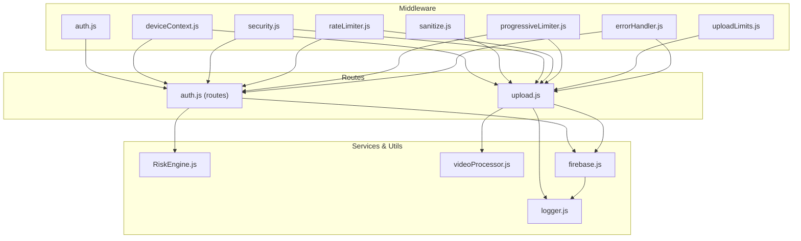
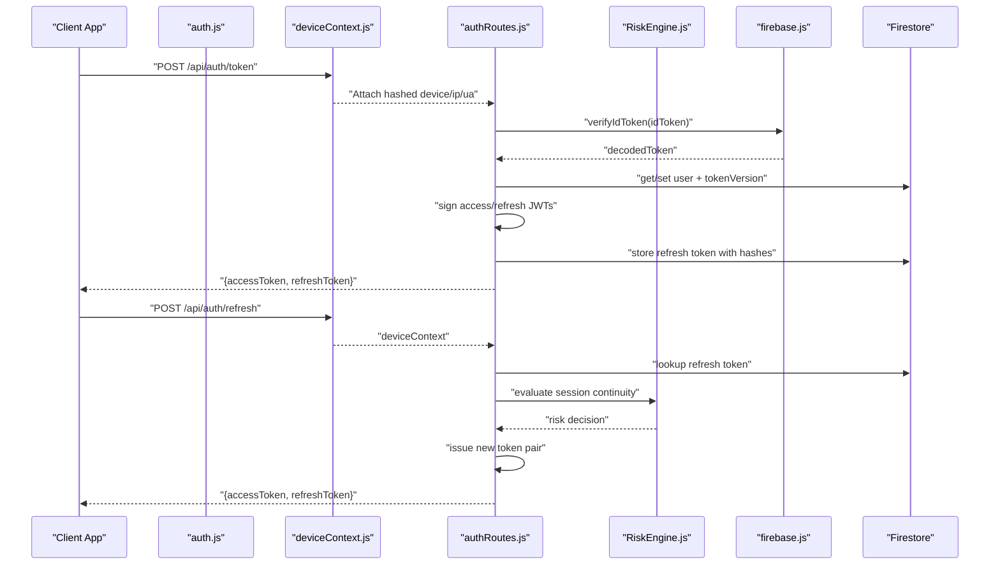
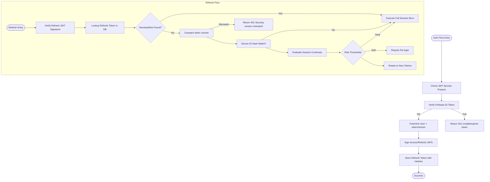
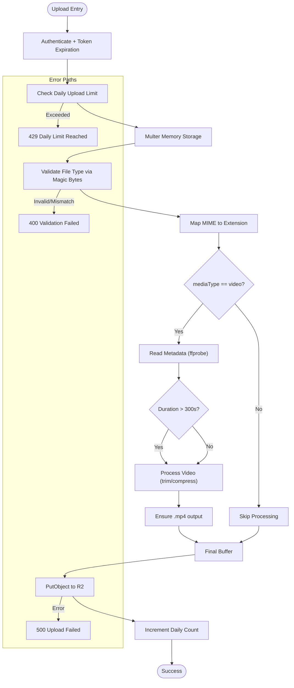
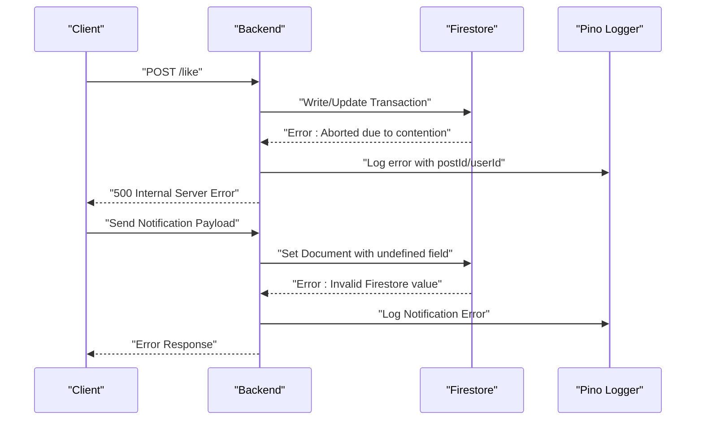
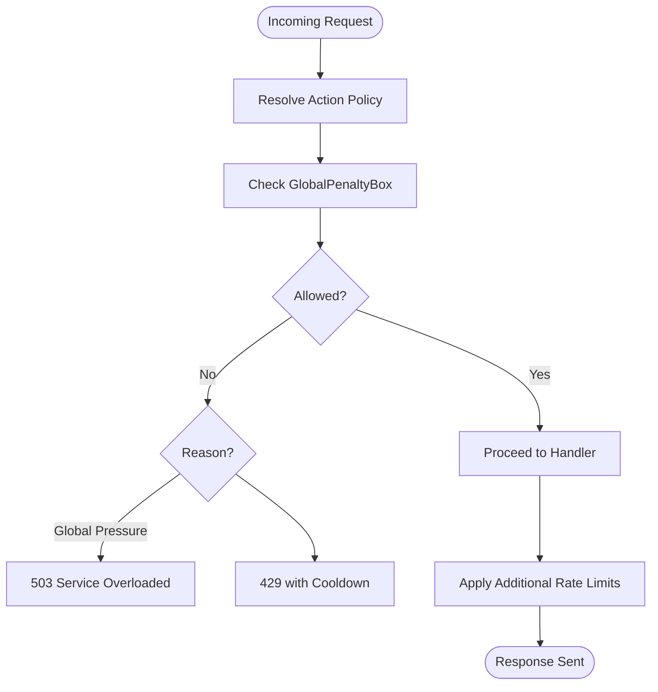
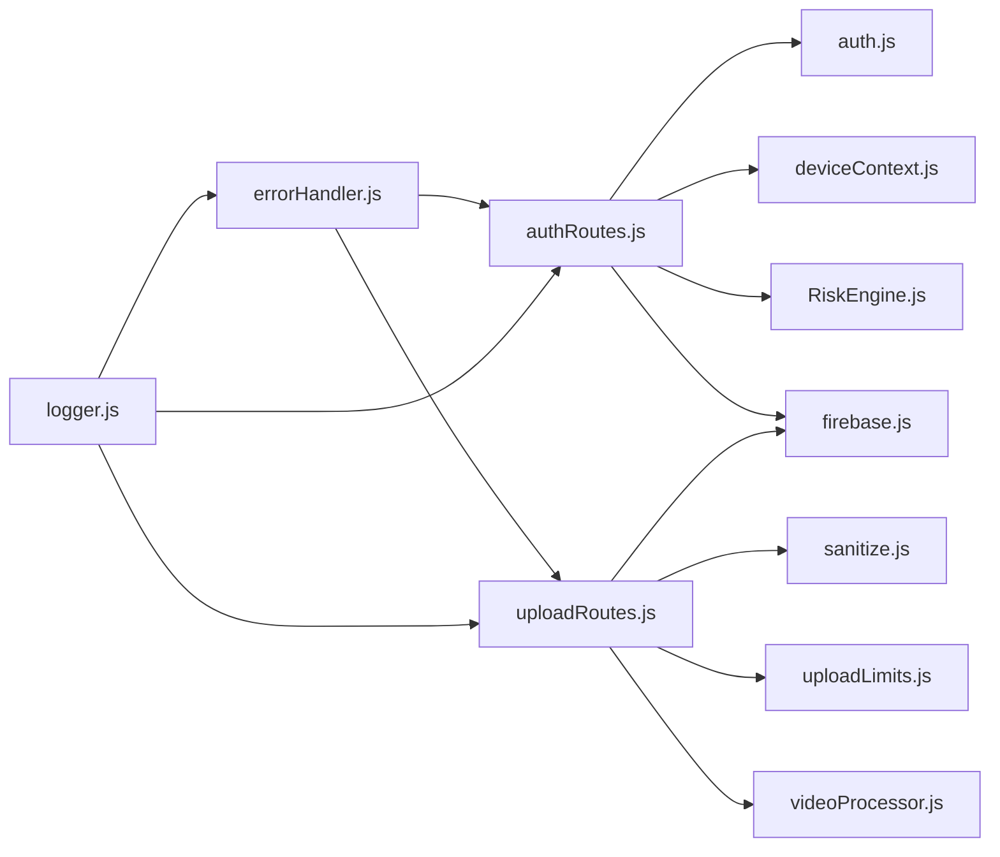

# Troubleshooting & FAQ

<cite>
**Referenced Files in This Document**
- [errorHandler.js](file://backend/src/middleware/errorHandler.js)
- [auth.js](file://backend/src/middleware/auth.js)
- [deviceContext.js](file://backend/src/middleware/deviceContext.js)
- [sanitize.js](file://backend/src/middleware/sanitize.js)
- [security.js](file://backend/src/middleware/security.js)
- [rateLimiter.js](file://backend/src/middleware/rateLimiter.js)
- [progressiveLimiter.js](file://backend/src/middleware/progressiveLimiter.js)
- [uploadLimits.js](file://backend/src/middleware/uploadLimits.js)
- [logger.js](file://backend/src/utils/logger.js)
- [videoProcessor.js](file://backend/src/utils/videoProcessor.js)
- [firebase.js](file://backend/src/config/firebase.js)
- [authRoutes.js](file://backend/src/routes/auth.js)
- [uploadRoutes.js](file://backend/src/routes/upload.js)
- [error.log](file://backend/logs/error.log)
- [combined.log](file://backend/logs/combined.log)
</cite>

## Table of Contents
1. [Introduction](#introduction)
2. [Project Structure](#project-structure)
3. [Core Components](#core-components)
4. [Architecture Overview](#architecture-overview)
5. [Detailed Component Analysis](#detailed-component-analysis)
6. [Dependency Analysis](#dependency-analysis)
7. [Performance Considerations](#performance-considerations)
8. [Troubleshooting Guide](#troubleshooting-guide)
9. [Conclusion](#conclusion)
10. [Appendices](#appendices)

## Introduction
This document provides comprehensive troubleshooting guidance and a curated FAQ for the platform. It focuses on diagnosing and resolving authentication issues (token expiration, device context mismatches, Firebase integration errors), media upload failures and video processing errors, storage connectivity issues, real-time connectivity and notification delivery failures, offline synchronization concerns, performance optimization, memory management, debugging techniques, and platform-specific pitfalls for iOS, Android, and web deployments. It also includes error analysis procedures, log interpretation, diagnostic tools, and practical solutions/workarounds.

## Project Structure
The backend is organized around modular middleware, routes, services, and utilities. Authentication and security middleware wrap routes to enforce policies, while upload and media processing utilities integrate with Cloudflare R2 and FFmpeg. Logging and error handling are centralized to support diagnostics.

**Diagram sources**
- [auth.js](file://backend/src/middleware/auth.js#L1-L164)
- [deviceContext.js](file://backend/src/middleware/deviceContext.js#L1-L24)
- [sanitize.js](file://backend/src/middleware/sanitize.js#L1-L154)
- [security.js](file://backend/src/middleware/security.js#L1-L75)
- [rateLimiter.js](file://backend/src/middleware/rateLimiter.js#L1-L76)
- [progressiveLimiter.js](file://backend/src/middleware/progressiveLimiter.js#L1-L61)
- [uploadLimits.js](file://backend/src/middleware/uploadLimits.js#L1-L55)
- [errorHandler.js](file://backend/src/middleware/errorHandler.js#L1-L35)
- [authRoutes.js](file://backend/src/routes/auth.js#L1-L301)
- [uploadRoutes.js](file://backend/src/routes/upload.js#L1-L225)
- [logger.js](file://backend/src/utils/logger.js#L1-L29)
- [videoProcessor.js](file://backend/src/utils/videoProcessor.js#L1-L61)
- [firebase.js](file://backend/src/config/firebase.js#L1-L46)

**Section sources**
- [auth.js](file://backend/src/middleware/auth.js#L1-L164)
- [uploadRoutes.js](file://backend/src/routes/upload.js#L1-L225)
- [firebase.js](file://backend/src/config/firebase.js#L1-L46)

## Core Components
- Authentication and Authorization
  - Custom JWT access/refresh tokens with versioning and revocation checks
  - Firebase ID token verification with revocation enforcement
  - Device context hashing for secure, privacy-preserving session continuity
- Upload Pipeline
  - Multer memory storage, file validation via magic bytes, optional video processing, and R2 upload
  - Daily upload limits and progressive rate limiting
- Security and Observability
  - Helmet headers, CORS configuration, timeouts, and robust error logging
  - Risk engine evaluating device/IP/UA consistency and session continuity

**Section sources**
- [auth.js](file://backend/src/middleware/auth.js#L1-L164)
- [deviceContext.js](file://backend/src/middleware/deviceContext.js#L1-L24)
- [uploadRoutes.js](file://backend/src/routes/upload.js#L1-L225)
- [uploadLimits.js](file://backend/src/middleware/uploadLimits.js#L1-L55)
- [progressiveLimiter.js](file://backend/src/middleware/progressiveLimiter.js#L1-L61)
- [security.js](file://backend/src/middleware/security.js#L1-L75)
- [logger.js](file://backend/src/utils/logger.js#L1-L29)

## Architecture Overview
The system integrates Firebase for identity, a custom JWT layer for short-lived access tokens, and a risk-aware refresh flow. Uploads leverage FFmpeg for video processing and Cloudflare R2 for storage. Logs are emitted via Pino and persisted for diagnostics.

**Diagram sources**
- [authRoutes.js](file://backend/src/routes/auth.js#L1-L301)
- [auth.js](file://backend/src/middleware/auth.js#L1-L164)
- [deviceContext.js](file://backend/src/middleware/deviceContext.js#L1-L24)
- [firebase.js](file://backend/src/config/firebase.js#L1-L46)

## Detailed Component Analysis

### Authentication and Token Management
Common issues:
- Token expiration and invalidation
- Device context mismatches causing session burns
- Firebase initialization and verification failures

**Diagram sources**
- [authRoutes.js](file://backend/src/routes/auth.js#L1-L301)
- [auth.js](file://backend/src/middleware/auth.js#L1-L164)
- [deviceContext.js](file://backend/src/middleware/deviceContext.js#L1-L24)

**Section sources**
- [auth.js](file://backend/src/middleware/auth.js#L1-L164)
- [authRoutes.js](file://backend/src/routes/auth.js#L1-L301)
- [deviceContext.js](file://backend/src/middleware/deviceContext.js#L1-L24)
- [sanitize.js](file://backend/src/middleware/sanitize.js#L101-L132)
- [firebase.js](file://backend/src/config/firebase.js#L1-L46)

### Media Uploads and Video Processing
Common issues:
- Unsupported or mismatched file types
- Video processing failures (FFmpeg)
- R2 upload errors
- Daily upload limit exceeded

**Diagram sources**
- [uploadRoutes.js](file://backend/src/routes/upload.js#L1-L225)
- [videoProcessor.js](file://backend/src/utils/videoProcessor.js#L1-L61)
- [uploadLimits.js](file://backend/src/middleware/uploadLimits.js#L1-L55)
- [sanitize.js](file://backend/src/middleware/sanitize.js#L31-L99)

**Section sources**
- [uploadRoutes.js](file://backend/src/routes/upload.js#L1-L225)
- [videoProcessor.js](file://backend/src/utils/videoProcessor.js#L1-L61)
- [uploadLimits.js](file://backend/src/middleware/uploadLimits.js#L1-L55)
- [sanitize.js](file://backend/src/middleware/sanitize.js#L31-L132)

### Real-Time Connectivity, Notifications, and Offline Sync
Observed logs indicate:
- Notification write errors due to undefined Firestore values
- Firestore transaction contention leading to aborted writes
- Extended durations for interaction endpoints

**Diagram sources**
- [combined.log](file://backend/logs/combined.log#L493-L502)
- [error.log](file://backend/logs/error.log#L281-L290)

**Section sources**
- [combined.log](file://backend/logs/combined.log#L493-L502)
- [error.log](file://backend/logs/error.log#L281-L290)

### Security and Rate Limiting
- Progressive rate limiter applies per-action policies with penalties and global pressure handling
- General and auth-specific rate limits with security event logging
- Request timeouts tailored for slow routes (uploads, proxy, interactions)

**Diagram sources**
- [progressiveLimiter.js](file://backend/src/middleware/progressiveLimiter.js#L1-L61)
- [rateLimiter.js](file://backend/src/middleware/rateLimiter.js#L1-L76)
- [security.js](file://backend/src/middleware/security.js#L48-L75)

**Section sources**
- [progressiveLimiter.js](file://backend/src/middleware/progressiveLimiter.js#L1-L61)
- [rateLimiter.js](file://backend/src/middleware/rateLimiter.js#L1-L76)
- [security.js](file://backend/src/middleware/security.js#L1-L75)

## Dependency Analysis
Authentication depends on Firebase Admin and Firestore, while uploads depend on FFmpeg and Cloudflare R2. Logging is centralized via Pino. Error handling wraps all routes to ensure consistent responses and logging.

**Diagram sources**
- [authRoutes.js](file://backend/src/routes/auth.js#L1-L301)
- [auth.js](file://backend/src/middleware/auth.js#L1-L164)
- [deviceContext.js](file://backend/src/middleware/deviceContext.js#L1-L24)
- [uploadRoutes.js](file://backend/src/routes/upload.js#L1-L225)
- [sanitize.js](file://backend/src/middleware/sanitize.js#L1-L154)
- [uploadLimits.js](file://backend/src/middleware/uploadLimits.js#L1-L55)
- [videoProcessor.js](file://backend/src/utils/videoProcessor.js#L1-L61)
- [firebase.js](file://backend/src/config/firebase.js#L1-L46)
- [errorHandler.js](file://backend/src/middleware/errorHandler.js#L1-L35)
- [logger.js](file://backend/src/utils/logger.js#L1-L29)

**Section sources**
- [authRoutes.js](file://backend/src/routes/auth.js#L1-L301)
- [uploadRoutes.js](file://backend/src/routes/upload.js#L1-L225)
- [firebase.js](file://backend/src/config/firebase.js#L1-L46)
- [errorHandler.js](file://backend/src/middleware/errorHandler.js#L1-L35)
- [logger.js](file://backend/src/utils/logger.js#L1-L29)

## Performance Considerations
- Prefer memory storage for uploads to reduce disk I/O; ensure adequate heap for large buffers
- Use video processing to normalize formats and reduce payload sizes
- Apply progressive rate limiting to prevent overload cascading
- Configure request timeouts for slow routes to avoid resource starvation
- Enable Firestore ignoreUndefinedProperties to avoid write-time errors

[No sources needed since this section provides general guidance]

## Troubleshooting Guide

### Authentication Problems
Symptoms:
- 401 Unauthorized with “token expired” or “session expired by security policy”
- “device_id_required” on refresh
- “Security version mismatch” or “Session compromised”

Resolutions:
- Re-authenticate to obtain a new Firebase ID token, then exchange for custom tokens
- Ensure clients pass a device ID header on refresh; otherwise, the request is rejected
- If encountering “Security version mismatch,” force logout and re-login to bump token version
- Validate JWT secrets are present and correctly configured

**Section sources**
- [auth.js](file://backend/src/middleware/auth.js#L68-L86)
- [authRoutes.js](file://backend/src/routes/auth.js#L166-L280)
- [deviceContext.js](file://backend/src/middleware/deviceContext.js#L12-L14)
- [sanitize.js](file://backend/src/middleware/sanitize.js#L101-L132)

### Firebase Integration Errors
Symptoms:
- Initialization failure due to missing environment variables
- Verification failures with “invalid/expired” messages
- Debug endpoint returns missing private key indicator

Resolutions:
- Confirm FIREBASE_PROJECT_ID, FIREBASE_PRIVATE_KEY, and FIREBASE_CLIENT_EMAIL are set
- Clean private key formatting (remove extra quotes and replace literal \n with actual newlines)
- Use the debug endpoint to verify configuration

**Section sources**
- [firebase.js](file://backend/src/config/firebase.js#L7-L17)
- [firebase.js](file://backend/src/config/firebase.js#L27-L39)
- [authRoutes.js](file://backend/src/routes/auth.js#L287-L298)

### Media Upload Failures
Symptoms:
- 400 “Unsupported media format” or “File type does not match declared media type”
- 500 “Upload failed” with error logged
- 429 “Daily upload limit reached”

Resolutions:
- Ensure mediaType is image or video and fileExtension is supported
- Verify magic bytes match declared media type
- Retry after daily limit resets or reduce upload frequency
- For videos, confirm FFmpeg availability and sufficient disk space for temp files

**Section sources**
- [uploadRoutes.js](file://backend/src/routes/upload.js#L90-L122)
- [uploadRoutes.js](file://backend/src/routes/upload.js#L140-L222)
- [sanitize.js](file://backend/src/middleware/sanitize.js#L31-L99)
- [uploadLimits.js](file://backend/src/middleware/uploadLimits.js#L10-L36)

### Video Processing Errors
Symptoms:
- FFmpeg probe or processing errors
- Long processing times or timeouts

Resolutions:
- Confirm FFmpeg binary path is correctly set
- Reduce input file duration or quality to meet constraints
- Monitor disk space in the OS temporary directory

**Section sources**
- [videoProcessor.js](file://backend/src/utils/videoProcessor.js#L12-L22)
- [videoProcessor.js](file://backend/src/utils/videoProcessor.js#L31-L60)

### Storage Connectivity Issues (R2)
Symptoms:
- Upload failures with 500 responses
- Errors when writing to R2 bucket

Resolutions:
- Verify R2_ACCOUNT_ID, R2_ACCESS_KEY_ID, R2_SECRET_ACCESS_KEY, and R2_BUCKET_NAME are set
- Confirm endpoint URL construction and public base URL are correct
- Check network reachability to Cloudflare R2

**Section sources**
- [uploadRoutes.js](file://backend/src/routes/upload.js#L36-L43)
- [uploadRoutes.js](file://backend/src/routes/upload.js#L61-L75)

### Real-Time Connectivity and Notification Delivery
Symptoms:
- Notification write errors due to undefined fields
- Firestore transaction aborted due to contention

Resolutions:
- Remove or define all fields before writing to Firestore
- Retry transactionally with exponential backoff
- Investigate concurrent writes to the same documents

**Section sources**
- [combined.log](file://backend/logs/combined.log#L493-L496)
- [error.log](file://backend/logs/error.log#L285-L289)

### Offline Sync Issues
Symptoms:
- Clients fail to refresh tokens when offline
- Device context mismatches after reconnection

Resolutions:
- Persist refresh tokens securely and rotate them on each refresh
- Ensure device ID is consistently provided across sessions
- Implement retry with jitter for transient failures

**Section sources**
- [authRoutes.js](file://backend/src/routes/auth.js#L166-L280)
- [deviceContext.js](file://backend/src/middleware/deviceContext.js#L1-L24)

### Performance Optimization and Memory Management
Guidance:
- Use progressive rate limiting to protect downstream systems
- Avoid excessive buffering; stream where possible
- Monitor and cap request sizes to prevent OOM conditions
- Tune timeouts for slow routes to balance responsiveness and throughput

**Section sources**
- [progressiveLimiter.js](file://backend/src/middleware/progressiveLimiter.js#L1-L61)
- [rateLimiter.js](file://backend/src/middleware/rateLimiter.js#L1-L76)
- [security.js](file://backend/src/middleware/security.js#L48-L75)

### Debugging Techniques and Diagnostic Tools
- Inspect combined and error logs for request traces, route not found warnings, and error payloads
- Use the auth debug endpoint to verify Firebase configuration
- Enable verbose logging locally and review security events

**Section sources**
- [combined.log](file://backend/logs/combined.log#L25-L30)
- [error.log](file://backend/logs/error.log#L1-L10)
- [authRoutes.js](file://backend/src/routes/auth.js#L287-L298)
- [logger.js](file://backend/src/utils/logger.js#L1-L29)

### Platform-Specific Issues

#### iOS
- Ensure device ID header is provided during refresh
- Validate Firebase configuration and APNs integration for push notifications
- Test video trimming and compression on device storage constraints

**Section sources**
- [deviceContext.js](file://backend/src/middleware/deviceContext.js#L12-L14)
- [firebase.js](file://backend/src/config/firebase.js#L1-L46)
- [videoProcessor.js](file://backend/src/utils/videoProcessor.js#L31-L60)

#### Android
- Handle token expiration gracefully with automatic refresh flows
- Manage storage permissions for temporary video processing files
- Respect daily upload limits to avoid throttling

**Section sources**
- [authRoutes.js](file://backend/src/routes/auth.js#L166-L280)
- [uploadLimits.js](file://backend/src/middleware/uploadLimits.js#L10-L36)

#### Web (Flutter Web)
- Configure CORS to allow the web origin
- Ensure CSP and COEP settings align with image/video loading
- Validate media proxy base URL and CDN accessibility

**Section sources**
- [security.js](file://backend/src/middleware/security.js#L16-L46)
- [combined.log](file://backend/logs/combined.log#L4-L4)

### Frequently Asked Questions

Q: How do I fix “auth/token-expired”?
A: Re-authenticate with Firebase to obtain a fresh ID token, then exchange it for custom tokens.

Q: Why am I getting “device_id_required” on refresh?
A: Provide a device ID header with the refresh request.

Q: What causes “Session expired by security policy”?
A: A newer token version is active; force logout and re-login to synchronize.

Q: How do I resolve “Unable to determine file type”?
A: Ensure the uploaded buffer is intact and MIME type matches declared media type.

Q: My video upload fails—what should I check?
A: Confirm FFmpeg availability, supported extensions, and daily upload limits.

Q: How do I fix Firestore “undefined” value errors?
A: Define all fields before writing or enable ignoreUndefinedProperties.

Q: Why do I see “Aborted due to cross-transaction contention”?
A: Retry with backoff and avoid simultaneous writes to the same documents.

Q: How can I improve upload performance?
A: Use video compression, reduce payload sizes, and apply progressive rate limiting.

Q: What should I verify for Firebase initialization?
A: Confirm FIREBASE_PROJECT_ID, FIREBASE_PRIVATE_KEY, and FIREBASE_CLIENT_EMAIL are set and properly formatted.

Q: How do I configure CORS for web clients?
A: Set CORS_ALLOWED_ORIGINS to permitted origins; in non-production, defaults allow all.

**Section sources**
- [auth.js](file://backend/src/middleware/auth.js#L68-L86)
- [deviceContext.js](file://backend/src/middleware/deviceContext.js#L12-L14)
- [authRoutes.js](file://backend/src/routes/auth.js#L166-L280)
- [sanitize.js](file://backend/src/middleware/sanitize.js#L42-L99)
- [uploadRoutes.js](file://backend/src/routes/upload.js#L140-L222)
- [combined.log](file://backend/logs/combined.log#L493-L496)
- [error.log](file://backend/logs/error.log#L285-L289)
- [videoProcessor.js](file://backend/src/utils/videoProcessor.js#L31-L60)
- [firebase.js](file://backend/src/config/firebase.js#L7-L17)
- [security.js](file://backend/src/middleware/security.js#L16-L46)

## Conclusion
This guide consolidates actionable steps to diagnose and resolve common issues across authentication, uploads, storage, real-time operations, and platform-specific environments. By leveraging structured logging, rate limiting, and security-aware flows, teams can maintain reliability and performance while providing a smooth user experience.

[No sources needed since this section summarizes without analyzing specific files]

## Appendices

### Error Codes and Meanings
- auth/no-token: Missing Authorization header
- auth/token-expired: JWT expired
- auth/token-revoked: Firebase token revoked
- auth/invalid-token: Invalid or malformed token
- auth/account-suspended: User account status inactive
- infra/timeout: Request exceeded timeout threshold
- RATE_LIMIT_EXCEEDED: Exceeded progressive or general rate limits
- UPLOAD_RATE_LIMIT_EXCEEDED: Exceeded upload-specific rate limit
- AUTH_RATE_LIMIT_EXCEEDED: Exceeded authentication attempts limit

**Section sources**
- [auth.js](file://backend/src/middleware/auth.js#L23-L28)
- [auth.js](file://backend/src/middleware/auth.js#L146-L154)
- [progressiveLimiter.js](file://backend/src/middleware/progressiveLimiter.js#L32-L56)
- [rateLimiter.js](file://backend/src/middleware/rateLimiter.js#L12-L41)